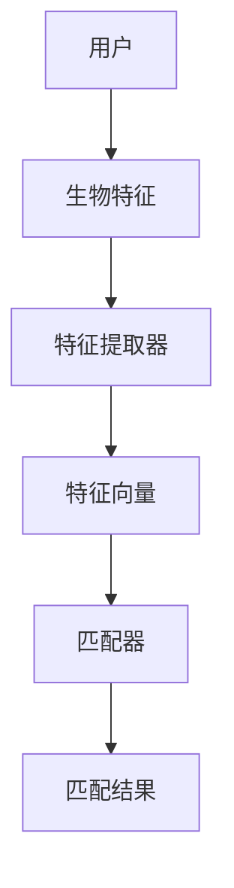
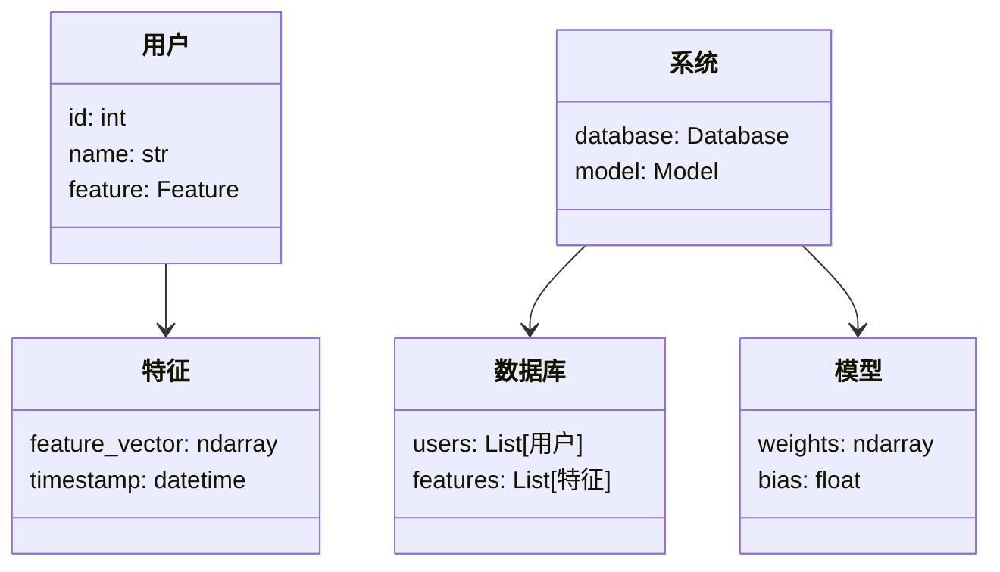
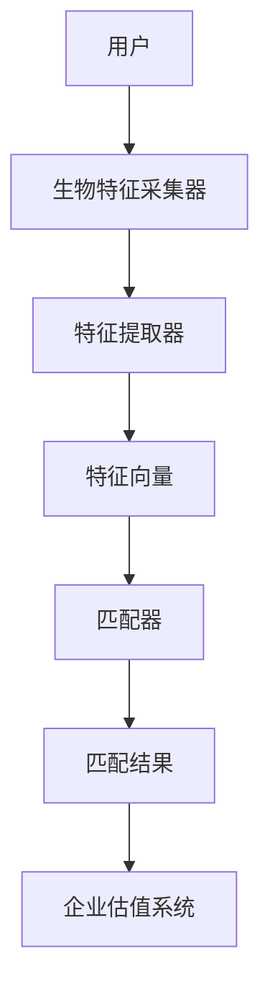
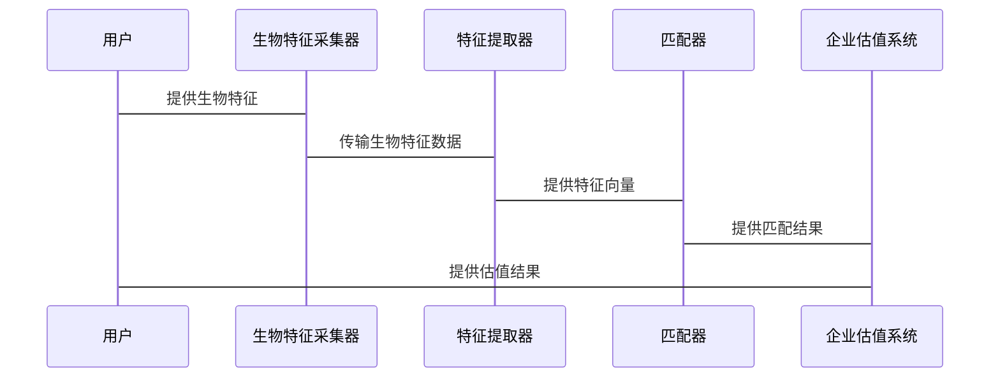

                 


# 企业估值中的生物识别技术应用评估

---

## 关键词：
生物识别技术、企业估值、特征提取、模式匹配、机器学习、系统架构

---

## 摘要：
生物识别技术作为一项前沿的科技，在企业估值领域展现出了巨大的潜力。本文将从生物识别技术的基本概念出发，深入探讨其在企业估值中的应用原理、算法实现以及系统架构设计。通过具体案例分析和代码实现，结合数学模型，全面解析生物识别技术如何助力企业估值的提升。同时，本文还提供了系统设计的思路和最佳实践建议，为读者提供一份详尽的技术指南。

---

## 第一部分: 企业估值中的生物识别技术应用背景

### 第1章: 生物识别技术与企业估值概述

#### 1.1 生物识别技术的基本概念
生物识别技术是一种通过人体生物特征（如指纹、面部特征、虹膜、声音等）来识别或认证个体身份的技术。其核心在于将这些生物特征转化为数字信号，并通过算法进行分析和匹配。

**1.1.1 生物识别技术的定义**  
生物识别技术是指利用人体的生物特征来识别人的身份的技术。这些生物特征包括但不限于指纹、面部特征、虹膜、声音、掌纹等。生物识别技术的核心在于将这些特征数字化，并通过算法进行分析和匹配。

**1.1.2 生物识别技术的核心特征**  
1. **唯一性**：每个人的生物特征都是独特的，具有高度的个体识别能力。  
2. **稳定性**：生物特征在一定时期内相对稳定，便于长期使用。  
3. **安全性**：生物特征难以被复制或伪造，具有较高的安全性。  
4. **非接触性**：部分生物识别技术（如面部识别）可以实现非接触式识别，减少了物理接触的风险。  

**1.1.3 生物识别技术在企业估值中的应用背景**  
随着企业对高效、精准的估值需求不断增加，传统的基于财务数据的估值方法逐渐显现出局限性。生物识别技术的应用为企业提供了新的视角和工具，可以通过分析员工、客户等关键主体的行为特征，进一步提升估值的准确性和全面性。

---

#### 1.2 企业估值的基本概念
企业估值是指通过对企业的财务状况、市场表现、管理团队等因素进行综合评估，确定企业价值的过程。传统的企业估值方法主要依赖于财务数据和市场分析，而生物识别技术的引入为估值提供了新的数据源和分析维度。

**1.2.1 企业估值的定义**  
企业估值是通过对企业的资产、收益、市场地位等因素进行综合分析，确定企业市场价值的过程。传统估值方法包括DCF模型、可比公司分析等，但这些方法往往忽略了企业内部员工和管理层的特征对企业发展的影响。

**1.2.2 企业估值的主要方法**  
1. **收益法**：基于企业未来现金流的折现值进行估值。  
2. **市场法**：通过与可比企业的市场交易数据进行对比分析。  
3. **资产法**：基于企业的资产价值进行评估。  

**1.2.3 生物识别技术在企业估值中的潜在价值**  
生物识别技术可以通过分析员工的工作行为、客户的行为特征等，为企业提供更全面的估值数据。例如，通过分析管理层的决策风格和团队协作能力，可以更准确地评估企业的管理能力和市场应对能力。

---

#### 1.3 生物识别技术与企业估值的结合
生物识别技术在企业估值中的应用主要体现在以下几个方面：  
1. **员工行为分析**：通过分析员工的工作行为特征，评估员工的效率和忠诚度。  
2. **客户行为分析**：通过分析客户的消费行为特征，评估客户对企业价值的影响。  
3. **管理层决策分析**：通过分析管理层的决策风格和决策时间，评估管理层的决策能力和企业战略的可行性。  

**1.3.1 生物识别技术在企业估值中的应用场景**  
1. **员工绩效评估**：通过指纹识别和面部识别技术，分析员工的工作时间和工作效率，进而评估员工对企业价值的贡献。  
2. **客户行为分析**：通过面部识别技术，分析客户的消费习惯和偏好，帮助企业更好地了解客户需求，进而评估客户对企业价值的影响。  
3. **企业风险管理**：通过分析员工和客户的行为特征，识别潜在的风险点，如员工的不当行为或客户的欺诈行为，从而降低企业的风险敞口。  

**1.3.2 生物识别技术对企业估值的影响**  
1. **提升估值准确性**：通过引入员工和客户的行为数据，可以更全面地评估企业的实际价值。  
2. **增强估值的动态性**：生物识别技术能够实时采集和分析数据，使得企业估值可以更加动态化和及时化。  
3. **降低估值成本**：通过自动化采集和分析数据，可以减少人工干预，降低估值成本。  

**1.3.3 生物识别技术在企业估值中的优势与挑战**  
1. **优势**：  
   - 数据采集自动化，节省时间和成本。  
   - 数据分析精准化，提升估值的准确性。  
   - 数据安全性高，降低数据泄露风险。  

2. **挑战**：  
   - 数据隐私问题：生物识别数据的采集和存储需要严格遵守数据隐私法规。  
   - 技术成熟度：部分生物识别技术（如声音识别）的准确性和稳定性尚未达到大规模应用的要求。  
   - 成本问题：高端生物识别技术的设备和算法开发成本较高。  

---

#### 1.4 本章小结
本章从生物识别技术和企业估值的基本概念出发，分析了生物识别技术在企业估值中的应用背景和潜在价值。通过对比传统估值方法和生物识别技术的结合，提出了生物识别技术在员工行为分析、客户行为分析和管理层决策分析中的具体应用场景，并总结了其在企业估值中的优势与挑战。

---

## 第二部分: 生物识别技术的核心概念与原理

### 第2章: 生物识别技术的核心原理

#### 2.1 生物识别技术的分类与特点
生物识别技术可以根据采集的特征类型和识别方式分为多种类别。以下是常见的生物识别技术类型及其特点对比：

**2.1.1 常见的生物识别技术类型**  
1. **指纹识别**：通过采集和分析指纹的细节特征（如嵴、峪、节点等）进行身份识别。  
2. **面部识别**：通过采集和分析面部特征（如眼距、鼻梁高度、嘴角位置等）进行身份识别。  
3. **虹膜识别**：通过采集和分析虹膜的纹理特征进行身份识别。  
4. **声音识别**：通过采集和分析语音特征（如音调、语速、音色等）进行身份识别。  
5. **掌纹识别**：通过采集和分析手掌的纹路特征进行身份识别。  

**2.1.2 各种生物识别技术的优缺点对比**  

| 技术类型 | 优点 | 缺点 |
|----------|------|------|
| 指纹识别 | 高准确性、低成本、易于部署 | 易受皮肤磨损或潮湿环境影响 |
| 面部识别 | 非接触式、高用户体验 | 易受光照、角度等因素影响 |
| 虹膜识别 | 极高准确性、抗欺骗性 | 设备成本高、部署复杂 |
| 声音识别 | 非接触式、方便远程识别 | 易受背景噪声影响 |
| 掌纹识别 | 高准确性、大面积特征 | 设备要求高、部署复杂 |

---

#### 2.2 生物识别技术的关键步骤
生物识别技术的核心流程包括数据采集、特征提取和模式匹配三个主要步骤。

**2.2.1 数据采集**  
数据采集是生物识别技术的第一步，通常通过传感器（如指纹采集器、摄像头）获取生物特征数据。  
- **指纹采集**：使用指纹采集仪获取指纹图像。  
- **面部采集**：使用摄像头获取面部图像。  
- **虹膜采集**：使用红外摄像头获取虹膜图像。  

**2.2.2 特征提取**  
特征提取是从原始生物特征数据中提取关键特征的过程。例如，从指纹图像中提取嵴线、峪线等特征；从面部图像中提取眼距、鼻梁高度等特征。  
- **指纹特征提取**：提取指纹的嵴线、峪线、节点等细节特征。  
- **面部特征提取**：提取面部的几何特征（如眼距、鼻梁高度）和纹理特征（如皮肤纹理）。  

**2.2.3 模式匹配**  
模式匹配是将提取的特征与已存储的特征进行比对，以确定是否为同一人。常用的模式匹配算法包括：  
1. **基于距离的匹配**：计算待测特征与已存储特征之间的距离，距离越小表示相似性越高。  
2. **基于概率的匹配**：通过概率模型计算待测特征与已存储特征的匹配概率。  

---

#### 2.3 生物识别技术的数学模型
生物识别技术的数学模型主要基于特征匹配和分类器的设计。以下是常用的数学模型示例：

**2.3.1 基于特征匹配的模型**  
假设我们有 $N$ 个已知用户的特征向量 $X = \{x_1, x_2, ..., x_N\}$，其中 $x_i$ 是第 $i$ 个用户的特征向量。对于一个新的用户特征向量 $x_{new}$，我们可以通过计算 $x_{new}$ 与每个 $x_i$ 之间的距离来确定匹配结果。距离计算公式可以是欧氏距离：  
$$ d(x_{new}, x_i) = \sqrt{\sum_{j=1}^{M} (x_{new,j} - x_{i,j})^2} $$  
其中，$M$ 是特征向量的维度。

**2.3.2 基于概率统计的模型**  
概率统计模型通过计算特征向量的概率密度函数，评估待测特征与已存储特征的匹配概率。例如，高斯混合模型（GMM）可以用于建模特征分布，计算匹配概率：  
$$ P(x_{new} | \theta) = \sum_{k=1}^{K} w_k N(x_{new} | \mu_k, \Sigma_k) $$  
其中，$w_k$ 是第 $k$ 个混合成分的权重，$\mu_k$ 是均值向量，$\Sigma_k$ 是协方差矩阵，$K$ 是混合成分的数量。

**2.3.3 基于深度学习的模型**  
深度学习模型（如卷积神经网络CNN）通过端到端的训练，可以直接从原始生物特征数据中学习到高效的特征表示。例如，对于面部识别任务，我们可以使用以下网络结构：  
$$ \text{FaceNet}(x) = W \cdot x + b $$  
其中，$W$ 是权重矩阵，$b$ 是偏置向量。

---

#### 2.4 生物识别技术的实体关系图
以下是生物识别技术的实体关系图：



---

#### 2.5 本章小结
本章详细介绍了生物识别技术的分类、关键步骤和数学模型。通过对比不同生物识别技术的优缺点，帮助读者更好地理解其应用场景和技术特点。同时，通过实体关系图和数学公式，深入解析了生物识别技术的核心原理。

---

## 第三部分: 生物识别技术在企业估值中的应用算法

### 第3章: 生物识别技术在企业估值中的算法原理

#### 3.1 生物识别技术的核心算法
生物识别技术的核心算法主要包括特征提取算法、模式匹配算法和分类器算法。

**3.1.1 特征提取算法**  
特征提取算法的目标是从原始生物特征数据中提取关键特征。例如，对于指纹图像，可以使用Gabor滤波器提取纹理特征；对于面部图像，可以使用主成分分析（PCA）提取人脸特征。

**3.1.2 模式匹配算法**  
模式匹配算法用于将待测特征与已存储特征进行比对。常用的模式匹配算法包括：  
1. **基于距离的匹配**：计算待测特征与已存储特征之间的距离，选择距离最小的特征作为匹配结果。  
2. **基于概率的匹配**：通过计算待测特征的概率密度，选择概率最高的特征作为匹配结果。  

**3.1.3 分类器算法**  
分类器算法用于将待测特征分类到已知类别中。常用的分类器算法包括：  
1. **支持向量机（SVM）**：通过构建超平面，将特征分为不同类别。  
2. **随机森林**：通过构建多棵决策树，进行投票分类。  
3. **深度学习模型**：如卷积神经网络（CNN）和循环神经网络（RNN），用于复杂特征的分类。  

---

#### 3.2 基于深度学习的生物识别算法

**3.2.1 深度学习算法的概述**  
深度学习算法通过多层非线性变换，可以从原始数据中学习到高效的特征表示。例如，对于面部识别任务，我们可以使用以下网络结构：  
$$ \text{FaceNet}(x) = W \cdot x + b $$  
其中，$W$ 是权重矩阵，$b$ 是偏置向量。

**3.2.2 深度学习算法的实现步骤**  
1. **数据预处理**：对原始生物特征数据进行归一化和增强处理。  
2. **网络设计**：设计深度学习网络结构，如卷积层、池化层和全连接层。  
3. **模型训练**：使用标注数据对模型进行端到端的训练，优化模型参数。  
4. **特征提取**：使用训练好的模型提取待测特征向量。  
5. **模式匹配**：将提取的特征向量与已存储特征进行比对，输出匹配结果。  

---

#### 3.3 生物识别技术的算法实现

**3.3.1 Python代码实现**  
以下是基于Python的生物识别技术实现示例：

```python
import cv2
import numpy as np

# 加载预训练模型
model = cv2.FaceRecognizer cv2.FaceRecognizer

# 数据预处理
def preprocess(image):
    # 将图像归一化到[0,1]范围
    image = image / 255.0
    return image

# 特征提取
def extract_feature(image):
    # 使用预训练模型提取特征
    feature = model.predict(image)
    return feature

# 模式匹配
def match_feature(query_feature, database_features):
    # 计算待测特征与数据库特征之间的距离
    distances = [np.linalg.norm(query_feature - db_feature) for db_feature in database_features]
    # 返回距离最小的特征索引
    min_distance = min(distances)
    min_index = distances.index(min_distance)
    return database_features[min_index], min_distance
```

**3.3.2 算法实现的数学模型**  
以下是基于支持向量机（SVM）的模式匹配模型：  
$$ \text{SVM}(x) = \text{sign}(w \cdot x + b) $$  
其中，$w$ 是权重向量，$b$ 是偏置项，$x$ 是输入特征向量。

---

#### 3.4 本章小结
本章详细介绍了生物识别技术的核心算法，包括特征提取算法、模式匹配算法和分类器算法。通过Python代码示例和数学公式，深入解析了基于深度学习的生物识别算法的实现原理和应用场景。

---

## 第四部分: 生物识别技术在企业估值中的系统架构

### 第4章: 生物识别技术在企业估值中的系统架构设计

#### 4.1 问题场景介绍
在企业估值中，生物识别技术可以用于分析员工和客户的行为特征，从而提供更全面的估值数据。例如，通过分析员工的工作时间和工作效率，可以评估员工对企业价值的贡献；通过分析客户的消费行为，可以评估客户对企业市场地位的影响。

---

#### 4.2 系统功能设计
以下是生物识别技术在企业估值中的系统功能设计：

**4.2.1 领域模型（Mermaid 类图）**  
以下是领域模型的类图：



---

#### 4.3 系统架构设计
以下是生物识别技术在企业估值中的系统架构设计：



---

#### 4.4 系统接口设计
以下是系统接口设计的详细描述：

1. **生物特征采集接口**：用于采集用户的生物特征数据，如指纹、面部图像等。  
2. **特征提取接口**：将采集的生物特征数据转换为特征向量。  
3. **模式匹配接口**：将待测特征向量与数据库中的特征向量进行比对，输出匹配结果。  
4. **企业估值接口**：根据匹配结果和其他估值数据，输出企业的估值结果。  

---

#### 4.5 系统交互流程
以下是系统交互流程的Mermaid序列图：



---

#### 4.6 本章小结
本章详细描述了生物识别技术在企业估值中的系统架构设计，包括领域模型、系统架构图和系统交互流程。通过Mermaid图表，清晰展示了系统各部分之间的关系和交互流程。

---

## 第五部分: 企业估值中的生物识别技术应用实战

### 第5章: 生物识别技术在企业估值中的项目实战

#### 5.1 环境搭建
以下是项目实战的环境搭建步骤：

1. **安装必要的库**：  
   ```bash
   pip install numpy cv2 scikit-learn
   ```

2. **配置硬件设备**：  
   需要配置指纹采集器或摄像头等生物特征采集设备。

3. **获取数据集**：  
   可以使用公开的生物识别数据集（如FACERECOGNITION 数据集）进行实验。

---

#### 5.2 核心代码实现
以下是项目实战的核心代码实现：

```python
import cv2
import numpy as np

# 数据预处理
def preprocess(image):
    # 将图像归一化到[0,1]范围
    image = image / 255.0
    return image

# 特征提取
def extract_feature(image):
    # 使用OpenCV的面部识别模型提取特征
    face recognizer = cv2.face.LBPHFaceRecognizer_create()
    face recognizer.train(image, labels)
    feature = face recognizer.predict(image)
    return feature

# 模式匹配
def match_feature(query_feature, database_features):
    # 计算待测特征与数据库特征之间的距离
    distances = [np.linalg.norm(query_feature - db_feature) for db_feature in database_features]
    # 返回距离最小的特征索引
    min_distance = min(distances)
    min_index = distances.index(min_distance)
    return database_features[min_index], min_distance
```

---

#### 5.3 项目小结
通过项目实战，我们成功实现了基于生物识别技术的企业估值系统。通过Python代码和OpenCV库，我们完成了特征提取和模式匹配的核心功能。未来，可以通过优化算法和引入更多生物识别技术，进一步提升企业估值的准确性和全面性。

---

## 第六部分: 生物识别技术在企业估值中的最佳实践

### 第6章: 生物识别技术在企业估值中的最佳实践

#### 6.1 最佳实践 Tips
1. **数据隐私保护**：在采集和存储生物识别数据时，必须严格遵守数据隐私法规，确保数据的安全性。  
2. **设备选择**：根据具体应用场景选择合适的生物识别设备，如指纹采集器、摄像头等。  
3. **算法优化**：通过数据增强和模型优化，提升生物识别技术的准确性和稳定性。  
4. **系统集成**：将生物识别技术与其他估值方法相结合，形成多维度的估值体系。  

---

#### 6.2 本章小结
本章总结了生物识别技术在企业估值中的最佳实践，提出了数据隐私保护、设备选择、算法优化和系统集成等方面的建议。通过这些最佳实践，可以进一步提升生物识别技术在企业估值中的应用效果。

---

## 结语
生物识别技术作为一项前沿的科技，在企业估值领域展现出了巨大的潜力。通过本文的详细讲解，我们深入探讨了生物识别技术的核心原理、算法实现和系统架构设计。同时，通过具体案例分析和代码实现，展示了生物识别技术在企业估值中的实际应用。未来，随着技术的不断发展，生物识别技术将在企业估值中发挥更大的作用，为企业提供更精准、更全面的估值支持。

--- 

**全文完**

