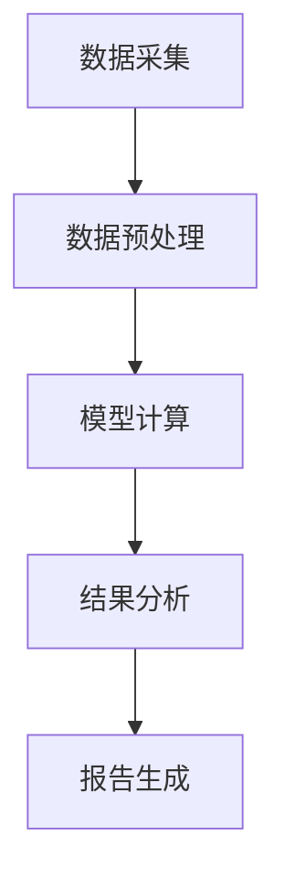

                 


# 企业估值中的监管合规成本分析

## 关键词：企业估值、监管合规、合规成本、数学模型、Python代码、系统架构

## 摘要：  
监管合规成本是企业在经营过程中必须遵守的各种法律法规所产生的费用，这些成本直接影响企业的财务状况和估值。本文从监管合规成本的定义、分类、分析方法入手，结合实际案例和系统架构设计，详细阐述如何将监管合规成本纳入企业估值模型中，并提供具体的数学模型和Python代码实现。通过本文的分析，读者能够全面理解监管合规成本对企业估值的影响，并掌握实际操作的方法。

---

## 目录大纲

---

### 第一部分：企业估值中的监管合规成本分析背景介绍

#### 第1章：监管合规成本的基本概念

##### 1.1 监管合规成本的定义与范围

- 1.1.1 什么是监管合规成本  
  监管合规成本是指企业为了满足政府、行业或其他监管机构的要求而产生的各种费用，包括人力成本、技术投入、法律咨询费用等。

- 1.1.2 监管合规成本的范围与边界  
  包括直接成本（如合规人员工资、合规技术采购）和间接成本（如时间成本、机会成本）。

- 1.1.3 监管合规成本与企业估值的关系  
  合规成本直接影响企业的盈利能力、现金流和风险水平，进而影响企业估值。

##### 1.2 监管合规成本的重要性

- 1.2.1 合规成本对企业财务状况的影响  
  合规成本增加企业的支出，可能影响净利润和自由现金流。

- 1.2.2 合规成本对投资决策的作用  
  投资者在估值时会考虑企业的合规成本，合规成本过高可能降低企业估值。

- 1.2.3 合规成本与企业风险管理  
  合规成本是企业风险管理的重要组成部分，合规不足可能导致罚款和声誉损失。

#### 第2章：企业估值中的监管合规成本分析框架

##### 2.1 监管合规成本的分类

- 2.1.1 直接合规成本  
  包括合规人员工资、技术采购费用、法律咨询费用等。

- 2.1.2 间接合规成本  
  包括时间成本、机会成本、管理成本等。

- 2.1.3 机会成本与隐性成本  
  包括因合规要求而放弃的商业机会成本。

##### 2.2 监管合规成本的评估维度

- 2.2.1 合规成本的货币化评估  
  将合规成本转化为具体的货币数值，便于财务分析。

- 2.2.2 合规成本的时间价值  
  考虑合规成本的时间分布和资金的时间价值。

- 2.2.3 合规成本的行业差异性  
  不同行业面临的监管要求不同，合规成本也不同。

##### 2.3 监管合规成本的分析方法

- 2.3.1 定性分析与定量分析  
  定性分析：评估合规成本对企业战略和风险的影响。定量分析：计算合规成本的具体数值。

- 2.3.2 成本-收益分析  
  分析合规成本与企业收益之间的关系，评估合规投资的回报。

- 2.3.3 情景分析与压力测试  
  假设不同监管环境和市场情况，评估合规成本对企业估值的影响。

---

### 第二部分：监管合规成本的分析模型与算法

#### 第3章：监管合规成本的数学模型

##### 3.1 合规成本的线性回归模型

- 3.1.1 模型的建立与假设  
  假设合规成本与企业规模、行业风险等因素呈线性关系。

- 3.1.2 模型的数学表达式  
  $$ y = \beta_0 + \beta_1x_1 + \beta_2x_2 + \cdots + \beta_nx_n + \epsilon $$  
  其中，$y$ 表示合规成本，$x_i$ 表示影响合规成本的因素，$\beta_i$ 是回归系数，$\epsilon$ 是误差项。

- 3.1.3 模型的变量定义  
  - $x_1$：企业收入  
  - $x_2$：行业风险指数  
  - $x_3$：企业规模  

- 3.1.4 模型的假设检验  
  使用统计方法验证模型的显著性和拟合度。

##### 3.2 合规成本的多元回归模型

- 3.2.1 模型扩展  
  在线性回归模型的基础上，引入更多变量，如区域监管强度、企业信用评级等。

- 3.2.2 模型的优化  
  使用逐步回归法筛选重要变量，提高模型的预测能力。

##### 3.3 合规成本的分类模型

- 3.3.1 逻辑回归模型  
  用于分类合规成本的高低，判断企业是否属于高合规成本行业。

- 3.3.2 支持向量机（SVM）  
  用于分类和回归分析，提高模型的分类精度。

#### 第4章：监管合规成本的系统分析与架构设计

##### 4.1 系统功能设计

- 4.1.1 数据采集模块  
  采集企业规模、收入、行业风险等数据。

- 4.1.2 模型计算模块  
  使用回归模型计算合规成本。

- 4.1.3 结果分析模块  
  对计算结果进行分析，生成报告。

##### 4.2 系统架构设计



##### 4.3 接口设计与交互流程

- 4.3.1 数据接口  
  定义数据输入格式和接口调用方式。

- 4.3.2 模型接口  
  提供API接口供其他系统调用。

- 4.3.3 用户界面  
  提供友好的用户界面，方便用户输入数据和查看结果。

---

### 第三部分：项目实战与案例分析

#### 第5章：项目实战

##### 5.1 环境安装与数据准备

- 5.1.1 安装Python和相关库  
  安装`pandas`、`numpy`、`scikit-learn`等库。

- 5.1.2 数据准备  
  收集企业的收入、规模、行业风险等数据。

##### 5.2 核心代码实现

```python
import pandas as pd
import numpy as np
from sklearn.linear_model import LinearRegression
from sklearn.metrics import mean_squared_error

# 数据准备
data = pd.DataFrame({
    '收入': [100, 200, 300, 400, 500],
    '规模': [10, 20, 30, 40, 50],
    '行业风险': [0.5, 0.6, 0.7, 0.8, 0.9],
    '合规成本': [10, 15, 20, 25, 30]
})

# 模型训练
X = data[['收入', '规模', '行业风险']]
y = data['合规成本']

model = LinearRegression()
model.fit(X, y)

# 模型预测
predictions = model.predict(X)
print("预测的合规成本：", predictions)
print("均方误差：", mean_squared_error(y, predictions))
```

##### 5.3 案例分析与结果解读

- 5.3.1 案例分析  
  以某行业为例，分析合规成本对企业估值的影响。

- 5.3.2 结果解读  
  解释模型的预测结果，分析哪些因素对合规成本影响最大。

##### 5.4 项目小结

- 总结项目实现的关键步骤和成果。
- 提出改进建议和未来研究方向。

#### 第6章：最佳实践与小结

##### 6.1 最佳实践

- 6.1.1 数据质量的重要性  
  数据准确性和完整性对模型准确性的影响。

- 6.1.2 模型选择的合理性  
  根据实际问题选择合适的模型和方法。

- 6.1.3 结果解释的清晰性  
  需要将复杂的模型结果转化为易于理解的结论。

##### 6.2 小结

- 回顾全文，总结监管合规成本分析的核心内容。
- 提出未来研究方向和实际应用建议。

##### 6.3 注意事项

- 提醒读者在实际应用中需要注意的问题，如数据隐私、模型适用性等。

##### 6.4 拓展阅读

- 推荐相关的书籍、论文和资源，供读者深入学习。

---

### 结语

通过本文的系统分析和实际案例，读者可以全面理解监管合规成本在企业估值中的重要性，并掌握如何将其纳入企业估值模型中。希望本文能为企业财务人员、投资者和合规管理人员提供有价值的参考和指导。

