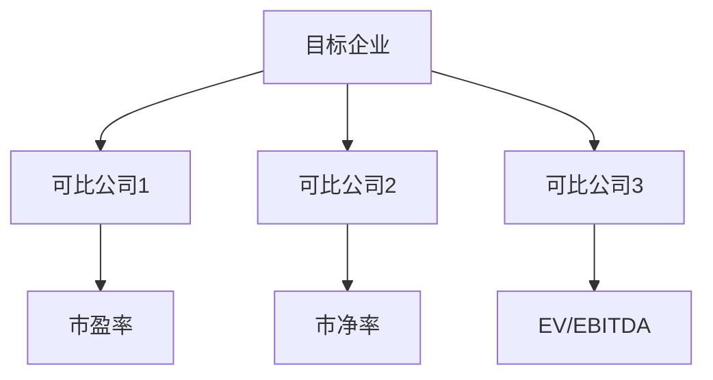
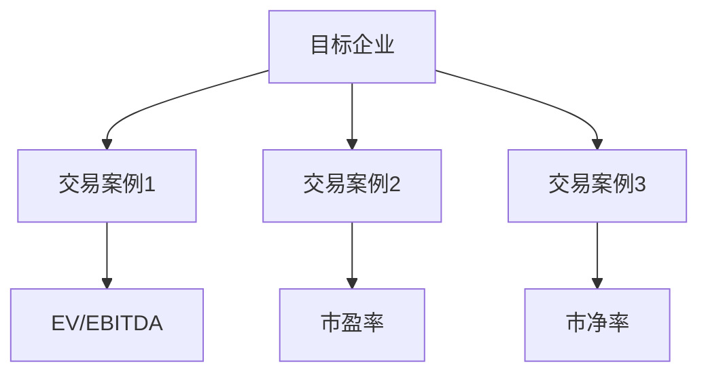
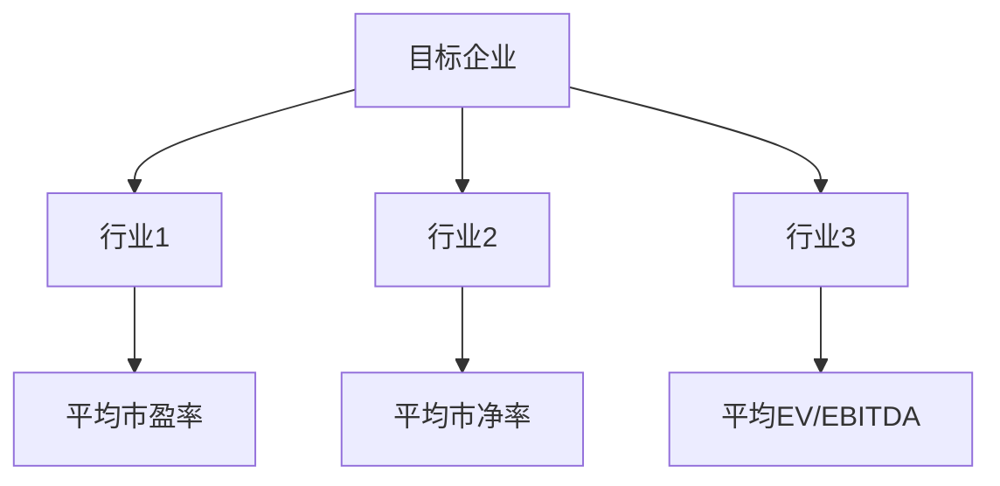
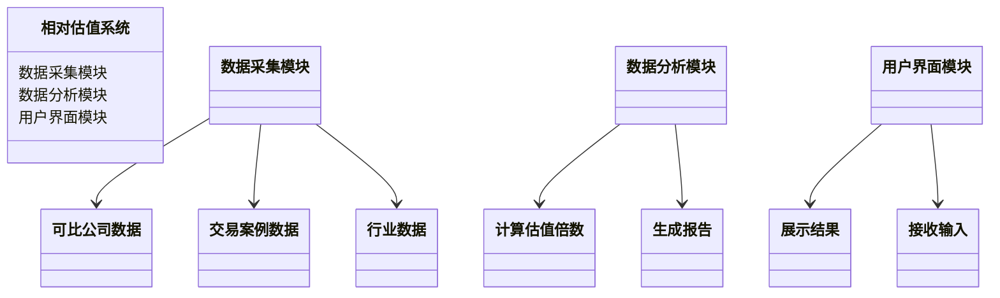

                 


# 企业估值中的相对估值法

## 关键词：相对估值法、企业估值、市盈率、市净率、可比公司分析、交易案例分析、EV/EBITDA

## 摘要：  
相对估值法是一种通过比较同类企业或交易案例的估值倍数来确定目标企业价值的方法。本文将详细探讨相对估值法的核心原理、数学模型、系统架构，并通过实际案例展示其在企业估值中的应用。文章还结合了可比公司分析、交易案例分析和行业估值倍数分析，帮助读者全面理解相对估值法的优势和局限性，以及如何在实际操作中应用这些方法。

---

# 第1章: 相对估值法概述

## 1.1 什么是相对估值法  
相对估值法是一种基于市场数据和可比公司或交易案例的估值倍数来估算目标企业价值的方法。与绝对估值法不同，相对估值法不依赖于企业自身的财务数据，而是通过横向比较来确定企业价值。

### 1.1.1 企业估值的基本概念  
企业估值是通过对企业资产、负债、收入、利润等财务数据的分析，结合市场环境和行业特点，估算企业整体价值的过程。企业估值是企业并购、股权投资和资本运作的重要基础。

### 1.1.2 相对估值法的定义  
相对估值法是通过比较同类企业的估值倍数（如市盈率、市净率、EV/EBITDA等）来估算目标企业价值的方法。其核心在于“相对性”，即通过可比公司或交易案例的倍数，推断目标企业的合理估值范围。

### 1.1.3 相对估值法的特点与优势  
- **简单易用**：相对估值法不需要复杂的财务模型，适合初步估值和快速分析。  
- **依赖市场数据**：通过市场交易数据，反映市场对企业的认可度。  
- **适用于中小型企业**：对于财务数据不完整或难以构建复杂模型的企业，相对估值法更为实用。  

## 1.2 相对估值法与其他估值方法的区别  
相对估值法与绝对估值法（如DCF模型）有显著区别：

### 1.2.1 绝对估值法的简介  
绝对估值法通过对企业未来现金流的折现，估算企业整体价值。这种方法需要对企业未来财务表现进行预测，并假设未来现金流的风险和时间价值。

### 1.2.2 相对估值法与绝对估值法的对比  
| 对比维度         | 绝对估值法                 | 相对估值法                 |
|------------------|--------------------------|--------------------------|
| 数据基础         | 企业自身财务数据           | 可比公司或交易案例数据     |
| 计算复杂度       | 高                       | 较低                      |
| 适用场景         | 适用于长期规划和内在价值分析 | 适用于市场数据丰富的场景   |

### 1.2.3 相对估值法的适用场景  
- 企业并购中的初步估值  
- 股权投资中的目标企业筛选  
- 行业分析中的企业价值对比  

## 1.3 相对估值法在企业估值中的应用  
### 1.3.1 企业并购中的应用  
在企业并购中，相对估值法常用于确定并购目标的合理价格范围。例如，通过分析可比公司的市盈率或EV/EBITDA倍数，推断目标企业的估值区间。

### 1.3.2 股权投资中的应用  
股权投资中，相对估值法用于评估目标企业的市场价值。例如，通过比较同类企业的市净率，判断目标企业的估值是否合理。

### 1.3.3 行业分析中的应用  
在行业分析中，相对估值法用于识别行业内的估值趋势。例如，通过分析行业平均市盈率，判断行业内的企业估值是否处于合理区间。

## 1.4 本章小结  
相对估值法是一种简单且高效的估值方法，尤其适用于市场数据丰富的场景。然而，它也存在一定的局限性，如依赖市场数据和可比公司的选择。接下来，我们将深入探讨相对估值法的核心原理。

---

# 第2章: 相对估值法的核心原理  

## 2.1 可比公司分析  
可比公司分析是相对估值法的核心方法之一。通过选择与目标企业相似的可比公司，计算其估值倍数，推断目标企业的合理估值。

### 2.1.1 可比公司的定义与选择标准  
- **可比公司定义**：与目标企业在行业、规模、业务模式等方面相似的公司。  
- **选择标准**：行业相同、业务模式相似、财务数据可比、市值相近。  

### 2.1.2 可比公司分析的步骤  
1. **筛选可比公司**：根据行业、规模等因素，选择3-5家可比公司。  
2. **计算可比公司的估值倍数**：如市盈率、市净率、EV/EBITDA等。  
3. **计算平均倍数**：对可比公司的估值倍数取平均值。  
4. **调整倍数**：根据目标企业的具体情况，对倍数进行调整。  

### 2.1.3 可比公司分析的优缺点  
- **优点**：数据易于获取，操作简单。  
- **缺点**：可比公司选择具有主观性，倍数调整需要经验判断。  

### 2.1.4 可比公司分析的mermaid图  


---

## 2.2 交易案例分析  
交易案例分析是另一种重要的相对估值方法。通过分析同类交易案例的成交价与估值倍数，推断目标企业的合理估值。

### 2.2.1 交易案例的定义与选择标准  
- **交易案例定义**：过去一定时间内，与目标企业相似的并购交易案例。  
- **选择标准**：交易时间相近、交易规模相似、交易性质相同。  

### 2.2.2 交易案例分析的步骤  
1. **筛选交易案例**：根据目标企业特点，选择3-5个交易案例。  
2. **计算交易案例的估值倍数**：如EV/EBITDA、市盈率等。  
3. **计算平均倍数**：对交易案例的倍数取平均值。  
4. **调整倍数**：根据目标企业的具体情况，对倍数进行调整。  

### 2.2.3 交易案例分析的优缺点  
- **优点**：交易案例的倍数更具市场参考价值。  
- **缺点**：交易案例的可比性较差，调整倍数的难度较大。  

### 2.2.4 交易案例分析的mermaid图  


---

## 2.3 行业估值倍数分析  
行业估值倍数分析是相对估值法的第三种方法。通过分析行业平均估值倍数，推断目标企业的合理估值。

### 2.3.1 行业估值倍数的定义与计算方法  
行业估值倍数是行业内所有企业的估值倍数的平均值。例如，行业平均市盈率=（可比公司市盈率总和）/可比公司数量。  

### 2.3.2 行业估值倍数分析的步骤  
1. **收集行业数据**：获取行业内企业的财务数据和估值倍数。  
2. **计算行业平均倍数**：对行业内企业的倍数取平均值。  
3. **调整倍数**：根据目标企业的具体情况，对倍数进行调整。  

### 2.3.3 行业估值倍数分析的优缺点  
- **优点**：行业数据全面，参考价值高。  
- **缺点**：行业平均倍数可能受市场波动影响较大。  

### 2.3.4 行业估值倍数分析的mermaid图  


---

## 2.4 本章小结  
相对估值法的核心在于通过可比公司分析、交易案例分析和行业估值倍数分析，推断目标企业的合理估值。每种方法都有其优缺点，实践中可以根据具体情况选择合适的方法。

---

# 第3章: 相对估值法的数学模型与公式  

## 3.1 相对估值法的核心公式  
相对估值法的核心公式包括市盈率（P/E）、市净率（P/B）和企业价值倍数（EV/EBITDA）。

### 3.1.1 市盈率（P/E）公式  
$$ P = E \times PE_{avg} $$  
其中，$P$为企业的估值，$E$为目标企业的净利润，$PE_{avg}$为可比公司的平均市盈率。  

### 3.1.2 市净率（P/B）公式  
$$ P = B \times PB_{avg} $$  
其中，$P$为企业的估值，$B$为目标企业的净资产，$PB_{avg}$为可比公司的平均市净率。  

### 3.1.3 企业价值倍数（EV/EBITDA）公式  
$$ EV = EBITDA \times EV/EBITDA_{avg} $$  
其中，$EV$为企业的企业价值，$EBITDA$为目标企业的息税折旧及摊销前利润，$EV/EBITDA_{avg}$为可比公司的平均企业价值倍数。  

## 3.2 相对估值法的计算步骤  
### 3.2.1 确定可比公司或交易案例  
目标企业需要选择3-5家可比公司或交易案例，确保其在行业、规模和业务模式上与目标企业相似。  

### 3.2.2 计算可比公司或交易案例的平均倍数  
例如，计算可比公司的平均市盈率：  
$$ PE_{avg} = \frac{\sum PE_i}{n} $$  
其中，$PE_i$为第$i$家可比公司的市盈率，$n$为可比公司数量。  

### 3.2.3 调整目标公司的估值倍数  
根据目标企业的具体情况，对倍数进行调整。例如，如果目标企业的净利润增长较快，可以适当提高市盈率倍数。  

### 3.2.4 计算目标公司的估值  
根据调整后的倍数，计算目标企业的估值。例如，使用市盈率公式：  
$$ P = E \times PE_{adj} $$  

## 3.3 相对估值法的数学模型  
### 3.3.1 市盈率模型  
$$ P = E \times PE_{avg} $$  

### 3.3.2 市净率模型  
$$ P = B \times PB_{avg} $$  

### 3.3.3 企业价值倍数模型  
$$ EV = EBITDA \times EV/EBITDA_{avg} $$  

---

## 3.4 本章小结  
相对估值法的数学模型简单易懂，但需要结合实际情况进行倍数调整。接下来，我们将探讨如何构建相对估值系统的系统架构。

---

# 第4章: 系统分析与架构设计  

## 4.1 问题场景介绍  
在企业估值中，相对估值法需要结合多种数据源和分析方法。为了提高效率和准确性，我们可以构建一个相对估值系统，实现数据收集、分析和估值输出的自动化。

## 4.2 系统功能设计  
相对估值系统的功能模块包括：  
1. 数据采集模块：收集可比公司、交易案例和行业数据。  
2. 数据分析模块：计算估值倍数和生成报告。  
3. 用户界面模块：展示分析结果和操作界面。  

### 4.2.1 领域模型mermaid类图  


## 4.3 系统架构设计  
相对估值系统的架构设计采用分层架构，包括数据层、业务逻辑层和表现层。

### 4.3.1 系统架构mermaid架构图  


## 4.4 系统接口设计  
系统需要与外部数据源（如金融数据库）对接，获取可比公司和交易案例数据。

### 4.4.1 系统接口设计  
```mermaid
sequenceDiagram
    用户 --> 数据采集模块
    数据采集模块 --> 数据源
    数据源 --> 返回数据
    数据采集模块 --> 数据分析模块
    数据分析模块 --> 生成报告
    数据分析模块 --> 用户界面模块
    用户界面模块 --> 用户
```

## 4.5 系统交互设计  
用户通过界面输入目标企业信息，系统自动完成数据采集、分析和报告生成。

### 4.5.1 系统交互mermaid序列图  
```mermaid
sequenceDiagram
    用户 --> 用户界面模块
    用户界面模块 --> 数据采集模块
    数据采集模块 --> 数据源
    数据源 --> 返回数据
    数据采集模块 --> 数据分析模块
    数据分析模块 --> 生成报告
    数据分析模块 --> 用户界面模块
    用户界面模块 --> 用户
```

---

## 4.6 本章小结  
相对估值系统的构建可以提高企业估值的效率和准确性。接下来，我们将通过实际案例展示相对估值法的实现与应用。

---

# 第5章: 项目实战——相对估值法的实现与应用  

## 5.1 环境安装  
相对估值系统的开发需要以下环境：  
- Python 3.8+  
- 数据分析库：Pandas、NumPy  
- 可视化库：Matplotlib、Seaborn  
- 数据源：金融数据库（如Wind、 Bloomberg）  

## 5.2 系统核心实现  
### 5.2.1 Python代码实现  
以下是相对估值系统的核心代码：

```python
import pandas as pd
import numpy as np

def relative_valuation(target, comparable):
    # 计算可比公司的平均市盈率
    avg_pe = comparable['PE'].mean()
    # 计算目标公司的估值
    target_valuation = target['E'] * avg_pe
    return target_valuation

# 示例数据
target = {'E': [100]}  # 目标企业的净利润
comparable = pd.DataFrame({'PE': [15, 20, 25, 18, 22]})  # 可比公司的市盈率

valuation = relative_valuation(target, comparable)
print(f"目标企业的估值为：{valuation}")
```

### 5.2.2 代码解读  
- `relative_valuation`函数：计算目标企业的估值，使用可比公司的平均市盈率乘以目标企业的净利润。  
- 示例数据：目标企业净利润为100，可比公司的市盈率分别为15、20、25、18、22，平均市盈率为20。  
- 输出结果：目标企业的估值为2000。

## 5.3 实际案例分析  
假设我们对一家科技公司进行估值，选择5家可比公司，计算其平均市盈率为25。目标企业的净利润为5000万元，则目标企业的估值为：  
$$ P = 5000 \times 25 = 125,000 \text{万元} $$  

---

## 5.4 本章小结  
通过实际案例，我们展示了相对估值法的实现与应用。接下来，我们将总结相对估值法的最佳实践和注意事项。

---

# 第6章: 最佳实践与小结  

## 6.1 最佳实践  
1. **选择合适的可比公司**：确保可比公司在行业、规模和业务模式上与目标企业相似。  
2. **调整倍数时考虑企业差异**：根据目标企业的具体情况，对倍数进行合理调整。  
3. **结合绝对估值法**：相对估值法可以与绝对估值法（如DCF模型）结合使用，提高估值的准确性。  

## 6.2 小结  
相对估值法是一种简单且高效的估值方法，尤其适用于市场数据丰富的场景。然而，它也存在一定的局限性，如可比公司选择的主观性和倍数调整的难度。未来，随着大数据和人工智能技术的发展，相对估值法将更加智能化和精准化。

