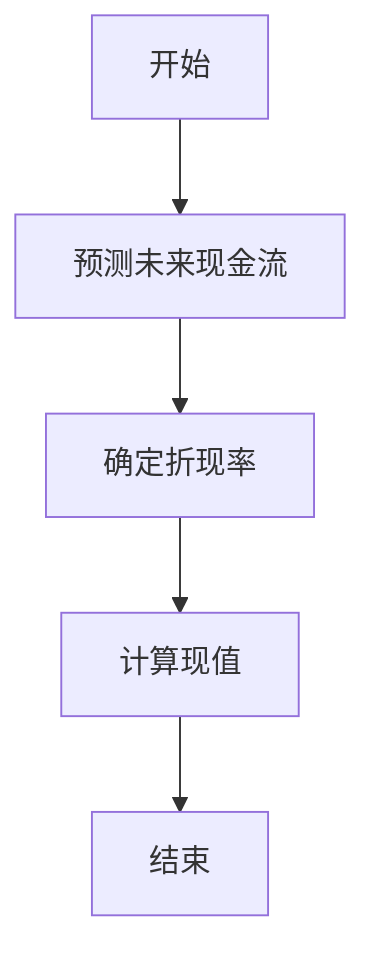
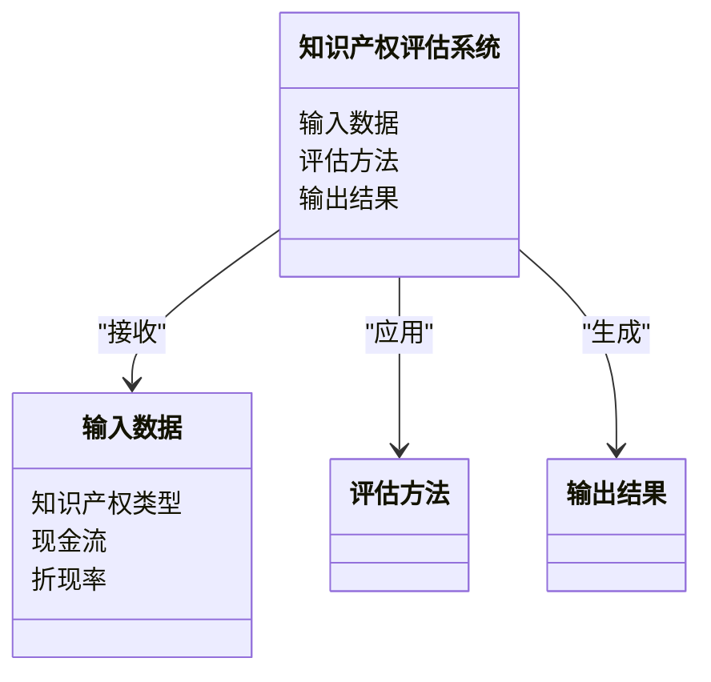
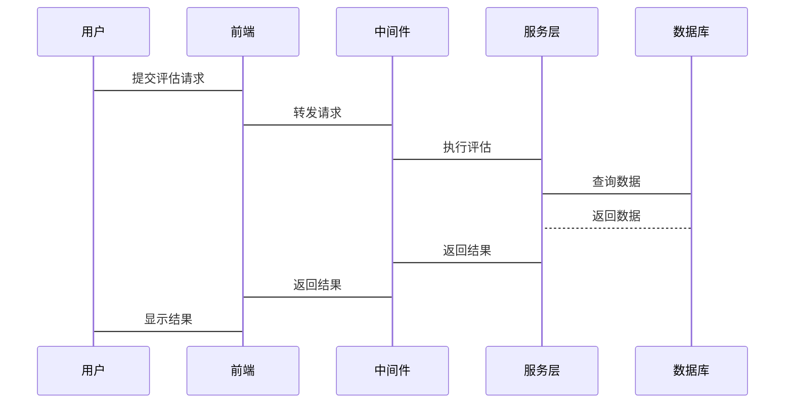

                 


# 企业估值中的知识产权价值法

## 关键词：知识产权，企业估值，价值评估，收益法，成本法，市场法，系统架构

## 摘要：知识产权是企业价值的重要组成部分，本文系统阐述了知识产权价值评估的方法，包括收益法、成本法和市场法的原理及应用，结合系统架构设计和项目实战，深入分析了知识产权评估的流程和关键点，提供了实际案例和工具应用，助力企业准确评估知识产权价值。

---

## 第一部分：知识产权与企业估值基础

### 第1章：知识产权与企业估值概述

#### 1.1 知识产权的基本概念

- **1.1.1 知识产权的定义与特征**
  - 知识产权是指依法保护的智力成果，包括专利、商标、版权等。
  - 特征：专有性、无形性、时间性和地域性。

- **1.1.2 知识产权的类型与分类**
  - 专利权：保护发明创造。
  - 商标权：保护商业标志。
  - 著作权：保护文学艺术作品。
  - 其他：如商业秘密。

- **1.1.3 知识产权在企业中的作用**
  - 提升核心竞争力。
  - 增加企业资产价值。
  - 保护创新成果。

#### 1.2 企业估值中的知识产权价值法

- **1.2.1 知识产权在企业估值中的重要性**
  - 知识产权是企业资产的重要组成部分。
  - 影响企业市场竞争力和未来收益。

- **1.2.2 知识产权价值法的基本原理**
  - 通过量化分析评估知识产权的经济价值。

- **1.2.3 知识产权价值法的应用范围**
  - 企业并购、融资、上市等场景。

---

## 第二部分：知识产权价值评估方法

### 第2章：知识产权价值评估的理论基础

#### 2.1 知识产权价值评估的核心概念

- **2.1.1 价值评估的定义与目标**
  - 价值评估是通过分析知识产权的经济贡献，确定其价值。

- **2.1.2 知识产权的经济价值构成**
  - 包括直接价值和间接价值。

- **2.1.3 知识产权价值评估的边界与外延**
  - 边界：仅考虑法律保护范围内的价值。
  - 外延：包括未来收益的潜在影响。

#### 2.2 核心概念与联系

- **2.2.1 知识产权价值评估的原理**
  - 综合考虑经济贡献、市场环境和法律因素。

- **2.2.2 核心概念属性特征对比表**

| 概念       | 特性       | 描述                         |
|------------|------------|------------------------------|
| 专利权     | 保护期限   | 通常20年                   |
| 商标权     | 有效期     | 可无限续展                   |
| 著作权     | 创作完成时 | 自然人或法人完成时           |

- **2.2.3 ER实体关系图的Mermaid流程图**

```mermaid
erDiagram
  class 知识产权 {
    ID
    类型
    创建时间
    权利人
  }
  class 企业 {
    企业ID
    名称
    估值
  }
  知识产权 --> 企业 : "属于"
```

### 第3章：知识产权价值评估的算法原理

#### 3.1 算法原理概述

- **3.1.1 收益法的数学模型**
  - 公式：$$ V = \sum_{t=1}^{n} \frac{CF_t}{(1 + r)^t} $$
  - 其中，$V$为价值，$CF_t$为第$t$年的现金流，$r$为折现率。

- **3.1.2 成本法的数学模型**
  - 公式：$$ V = C - D $$
  - 其中，$C$为重置成本，$D$为贬值。

- **3.1.3 市场法的数学模型**
  - 公式：$$ V = A \times \frac{P}{Q} $$
  - 其中，$A$为可比资产价值，$P$为可比售价，$Q$为调整系数。

#### 3.2 算法流程图

- **3.2.1 收益法的Mermaid流程图**



---

## 第三部分：系统分析与架构设计

### 第4章：知识产权价值评估的系统分析

#### 4.1 问题场景介绍

- 企业需要准确评估知识产权价值，以支持估值决策。

#### 4.2 系统功能设计

- **4.2.1 领域模型的Mermaid类图**



- **4.2.2 系统架构的Mermaid架构图**

```mermaid
archi
    前端 --> 中间件
    中间件 --> 数据库
    中间件 --> 服务层
    服务层 --> 后端
```

- **4.2.3 系统交互的Mermaid序列图**



---

## 第四部分：项目实战

### 第5章：知识产权价值评估的项目实战

#### 5.1 环境安装与工具准备

- **安装Python和必要的库**：
  ```bash
  pip install numpy pandas scikit-learn
  ```

#### 5.2 系统核心实现源代码

- **收益法实现代码**

```python
import numpy as np
import pandas as pd

def calculate_value(cash_flows, discount_rate):
    return np.npv(discount_rate, cash_flows)
```

#### 5.3 代码应用解读与分析

- **代码解读**：
  - 使用`numpy`计算净现值，`pandas`处理现金流数据。
  - 折现率影响评估价值，需根据实际情况调整。

#### 5.4 实际案例分析和详细讲解剖析

- **案例：评估一项专利的未来收益**
  - 现金流预测：年现金流100万，持续5年。
  - 折现率：10%。
  - 计算净现值：$$ V = \frac{100}{(1.1)^1} + \frac{100}{(1.1)^2} + \dots + \frac{100}{(1.1)^5} $$

#### 5.5 项目小结

- 通过代码实现收益法，展示了知识产权评估的实际应用。
- 强调数据准确性和模型选择的重要性。

---

## 第五部分：法律与政策

### 第6章：知识产权法律与政策框架

#### 6.1 知识产权法律框架

- **国内法律**：中国《专利法》《商标法》等。
- **国际条约**：《巴黎公约》《伯尔尼公约》。

#### 6.2 政策影响

- **政府补贴**：影响知识产权的经济价值。
- **税收优惠**：影响企业估值。

---

## 第六部分：工具与技术

### 第7章：工具与技术应用

#### 7.1 工具应用

- **Excel模型**：适用于简单的评估。
- **高级工具**：如Python的`scikit-learn`进行预测分析。

#### 7.2 数据来源

- **公开数据**：专利数据库、市场报告。
- **内部数据**：企业财务数据。

---

## 第七部分：未来趋势

### 第8章：未来趋势与挑战

#### 8.1 技术发展

- **人工智能**：提升评估的准确性和效率。
- **大数据分析**：利用更多数据点进行预测。

#### 8.2 全球化挑战

- **跨国评估**：需考虑不同国家的法律差异。

---

## 结语

知识产权价值评估是企业估值中的关键环节，通过本文的系统分析和实战案例，读者可以掌握多种评估方法，并在实际应用中灵活运用。未来，随着技术的进步和法律的完善，知识产权评估将更加精准和高效。

--- 

**（全文结束）**

