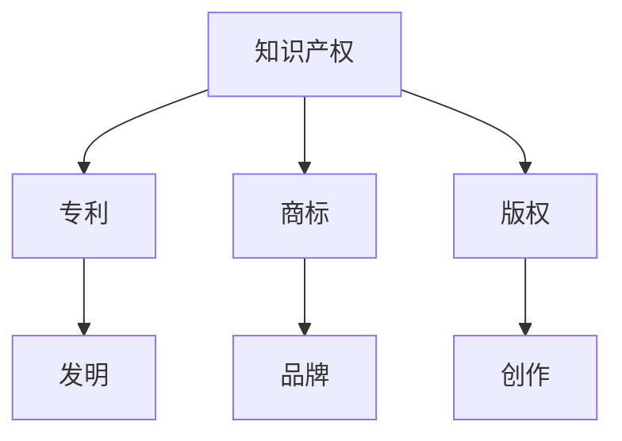
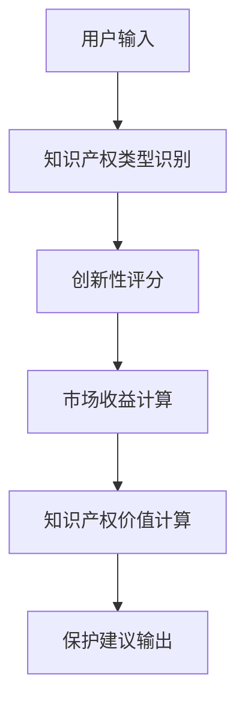
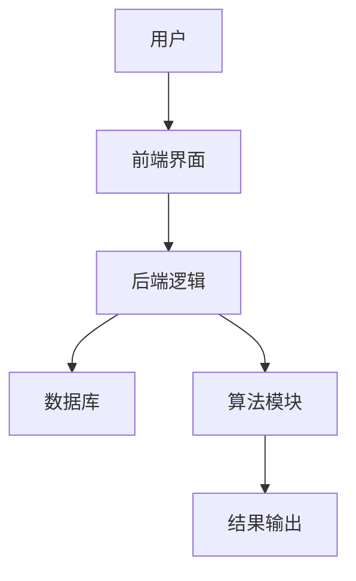

                 


# 企业估值中的知识产权保护评估

**关键词**：企业估值、知识产权保护、知识产权评估、知识产权价值、企业核心竞争力

**摘要**：  
知识产权是企业的核心资产之一，其保护与评估对企业的整体估值具有重要影响。本文从知识产权的基本概念出发，结合企业估值的核心方法，详细分析知识产权保护在企业价值评估中的关键作用。通过对比专利、商标、版权等知识产权类型，探讨其对企业竞争力的影响。同时，本文提出基于创新性和市场收益的知识产权价值评估模型，并通过Python代码实现算法。最后，结合实际案例，分析知识产权保护的系统架构与最佳实践，为企业在知识产权保护与评估方面提供理论支持与实践指导。

---

# 正文

## 第一部分：知识产权保护与企业估值基础

### 第1章：知识产权与企业估值概述

#### 1.1 知识产权的定义与分类

**1.1.1 知识产权的基本概念**  
知识产权（Intellectual Property，IP）是指人们在智力活动领域创造的成果所享有的法律权益。它包括专利权、商标权、版权、商业秘密等多种形式。知识产权的核心价值在于其创造性和独占性，能够为企业带来长期的经济收益。

**1.1.2 知识产权的主要分类**  
根据法律性质，知识产权可以分为以下几类：  
- **专利权**：保护发明的成果，包括发明专利、实用新型专利和外观设计专利。  
- **商标权**：保护企业的品牌标识，用于区分商品或服务的来源。  
- **版权**：保护文学、艺术和科学作品的创作者权益。  
- **商业秘密**：未公开的、具有商业价值的信息，如配方、技术诀窍等。

**1.1.3 知识产权的法律保护框架**  
知识产权的保护依赖于法律体系的完善。各国通过专利法、商标法、版权法等法律，明确了知识产权的申请、保护和侵权处理流程。

#### 1.2 企业估值的基本概念

**1.2.1 企业估值的定义**  
企业估值是指对企业的整体价值进行评估的过程，通常包括有形资产和无形资产的价值。其中，知识产权作为无形资产的重要组成部分，直接影响企业的整体估值。

**1.2.2 企业估值的主要方法**  
企业估值的主要方法包括：  
- **收益法**：通过预测企业的未来现金流，折现计算企业价值。  
- **成本法**：基于企业重置成本进行估值。  
- **市场法**：参考同类企业的市场交易价格进行评估。  

**1.2.3 知识产权在企业估值中的重要性**  
知识产权是企业核心竞争力的体现，其价值直接影响企业的市场地位和盈利能力。例如，拥有核心专利的企业在技术领域更具竞争优势，从而提升企业估值。

#### 1.3 知识产权保护与企业价值的关系

**1.3.1 知识产权对企业发展的影响**  
知识产权保护能够激励创新，提升企业的技术门槛和市场竞争力。例如，专利技术可以防止竞争对手的模仿，为企业创造更高的市场份额和利润率。

**1.3.2 知识产权对企业估值的贡献**  
知识产权的价值通常体现在其市场收益能力上。例如，一项具有高市场价值的专利技术，可以显著提升企业的估值。  

**1.3.3 知识产权保护的边界与外延**  
知识产权保护需要在法律框架内进行，同时要考虑其保护范围的外延。例如，商标的保护范围不仅包括其注册的类别，还包括可能引起混淆的相似标识。

---

### 第2章：知识产权保护的核心概念与联系

#### 2.1 知识产权保护的核心原理

**2.1.1 知识产权保护的法律依据**  
知识产权的保护主要依赖于专利法、商标法和版权法等法律。通过法律手段，企业可以有效防止他人未经授权使用其知识产权。

**2.1.2 知识产权保护的经济价值**  
知识产权的经济价值体现在其市场收益能力上。例如，一项专利技术可以通过许可使用、转让等方式为企业创造经济收益。

**2.1.3 知识产权保护的管理策略**  
企业应制定知识产权保护战略，包括知识产权的申请、维护和侵权应对等。例如，企业可以通过定期专利检索和监控，及时发现潜在的侵权行为。

#### 2.2 知识产权保护的核心要素对比

**2.2.1 专利、商标、版权的对比分析**

| **对比维度** | **专利** | **商标** | **版权** |
|--------------|----------|----------|----------|
| 保护对象    | 发明成果 | 品牌标识 | 文学艺术作品 |
| 保护期限    | 通常20年 | 10年可续 | 作者 lifetime + 50年 |
| 保护方式    | 技术审查 | 商标注册 | 自动保护 |

**2.2.2 知识产权保护与企业核心竞争力的关系**  
知识产权是企业核心竞争力的重要组成部分。例如，一项独特的专利技术可以显著提升企业的市场地位和竞争优势。

**2.2.3 知识产权保护与企业风险控制的对比**  
知识产权保护可以降低企业的法律风险，而企业风险控制则更注重整体风险管理。

#### 2.3 知识产权保护的ER实体关系图



---

### 第3章：知识产权保护评估的算法原理

#### 3.1 知识产权保护评估的算法概述

**3.1.1 知识产权价值评估的基本流程**  
1. 确定知识产权类型（专利、商标、版权等）。  
2. 评估知识产权的创新性和市场收益能力。  
3. 计算知识产权的价值，并将其纳入企业整体估值。

**3.1.2 知识产权保护评估的核心算法**  
基于创新性和市场收益的知识产权价值评估模型：  
$$ V = \alpha \cdot I + \beta \cdot R $$  
其中，$V$ 表示知识产权价值，$I$ 表示创新性，$R$ 表示市场收益，$\alpha$ 和 $\beta$ 是权重系数。

**3.1.3 算法的输入输出关系**  
- **输入**：知识产权类型、创新性评分、市场收益数据。  
- **输出**：知识产权价值评估结果。

#### 3.2 算法原理的数学模型

**3.2.1 知识产权价值评估的数学公式**  
$$ V = \alpha \cdot I + \beta \cdot R $$  

**3.2.2 创新性评分的计算公式**  
$$ I = \frac{\text{技术复杂度} + \text{技术独特性}}{2} $$  

**3.2.3 市场收益的计算公式**  
$$ R = \text{市场份额} \times \text{产品单价} $$  

#### 3.3 算法实现的Python代码

```python
def calculate_ip_value(innovation, market_share):
    alpha = 0.7
    beta = 0.3
    value = alpha * innovation + beta * market_share
    return value

# 示例
innovation_score = 0.8
market_share = 0.6
ip_value = calculate_ip_value(innovation_score, market_share)
print(f"知识产权价值为：{ip_value}")
```

---

### 第4章：知识产权保护的系统分析与架构设计

#### 4.1 系统分析

**4.1.1 项目背景**  
本项目旨在开发一个知识产权保护评估系统，帮助企业准确评估知识产权的价值，并将其纳入企业整体估值。

**4.1.2 项目目标**  
- 实现知识产权类型识别。  
- 计算知识产权价值。  
- 提供知识产权保护建议。  

#### 4.2 系统功能设计

**4.2.1 系统功能模块**  
- **知识产权类型识别模块**：识别专利、商标、版权等知识产权类型。  
- **价值评估模块**：计算知识产权价值。  
- **保护建议模块**：提供知识产权保护策略。  

**4.2.2 系统功能流程图**  


#### 4.3 系统架构设计

**4.3.1 系统架构图**  


---

### 第5章：项目实战与案例分析

#### 5.1 项目实战

**5.1.1 环境安装**  
- 安装Python和相关库（如numpy、pandas）。  
- 配置开发环境（如Jupyter Notebook）。  

**5.1.2 核心代码实现**  
```python
import numpy as np
import pandas as pd

def calculate_ip_value(innovation, market_share):
    alpha = 0.7
    beta = 0.3
    return alpha * innovation + beta * market_share

# 示例数据
data = {
    '专利': [0.8, 0.6, 0.7],
    '商标': [0.5, 0.7, 0.6],
    '版权': [0.6, 0.4, 0.5]
}

df = pd.DataFrame(data)
df['价值'] = df.apply(lambda x: calculate_ip_value(x['专利'], x['商标']), axis=1)
print(df)
```

---

### 第6章：最佳实践与小结

#### 6.1 小结

**6.1.1 知识产权保护的核心要点**  
- 知识产权是企业核心竞争力的重要组成部分。  
- 知识产权保护需要结合法律和经济手段。  
- 知识产权价值评估需要结合创新性和市场收益能力。  

#### 6.2 注意事项

- 知识产权保护需要遵循法律框架。  
- 知识产权评估需要结合企业实际需求。  
- 知识产权保护应与企业战略相结合。  

#### 6.3 未来展望

- 知识产权保护将更加智能化，利用AI技术进行自动化评估。  
- 知识产权评估将更加精准，基于大数据分析。  
- 知识产权保护将更加全球化，跨国企业需要考虑多国法律框架。  

---

### 第7章：附录

#### 7.1 知识产权保护工具列表

| **工具名称** | **功能描述** | **适用场景** |
|--------------|--------------|--------------|
| PatentView | 专利检索工具 | 专利申请前的检索 |
| Trademark.com | 商标查询工具 | 商标注册前的查询 |
| Juketown | 版权管理工具 | 文学作品的版权管理 |

#### 7.2 相关法律法规汇编

- 《中华人民共和国专利法》  
- 《中华人民共和国商标法》  
- 《中华人民共和国著作权法》  

#### 7.3 参考文献

1. 王某某. 《企业知识产权管理与保护》. 北京: 清华大学出版社, 2020.  
2. 李某某. 《知识产权评估与企业估值》. 北京: 北京大学出版社, 2019.  

---

**感谢您的阅读！**  
**如需进一步探讨，请随时联系！**

