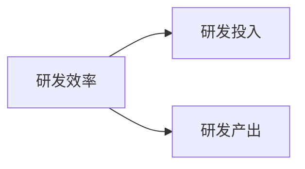
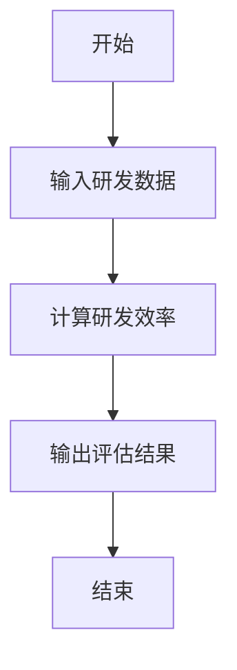
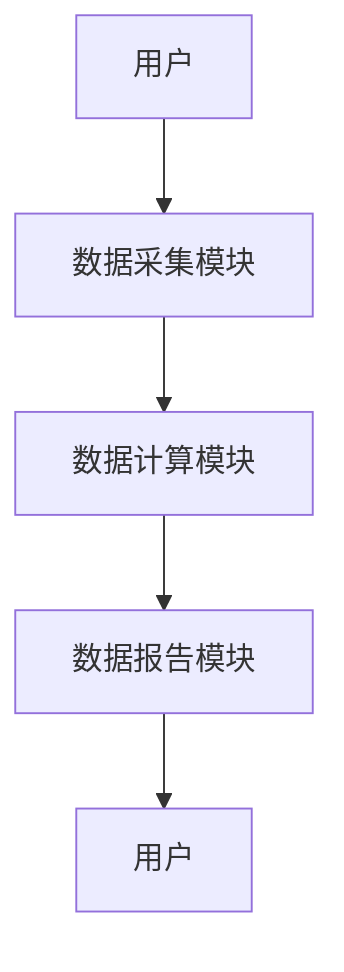

                 


# 企业估值中的研发效率评估

## 关键词：研发效率评估，企业估值，研发成本，研发产出，研发管理

## 摘要：  
研发效率评估是企业在技术研发和创新过程中至关重要的环节，它直接影响企业的研发成本、研发产出以及整体估值。本文从研发效率评估的基本概念出发，结合数学模型、算法原理、系统架构设计和实际案例，详细分析研发效率评估的核心要素及其与企业估值的关系。通过系统分析和项目实战，为读者提供一套完整的研发效率评估方法论，帮助企业优化研发流程、降低成本、提升创新效率，从而在企业估值中获得更大的竞争优势。

---

# 第1章：研发效率评估的背景与重要性

## 1.1 问题背景与问题描述  
企业在技术研发过程中，研发投入与研发产出之间的关系是企业估值的核心考量因素之一。研发效率是衡量企业技术创新能力的重要指标，它不仅影响企业的短期成本，还决定了企业长期的市场竞争力和盈利能力。  

然而，许多企业在研发效率评估中面临以下问题：  
- 研发投入与研发产出之间的关系不清晰。  
- 研发效率的定义和计算方式不统一。  
- 如何将研发效率与企业估值有效结合，缺乏系统性方法。  

## 1.2 研发效率评估的定义与边界  
研发效率评估是指通过量化方法，分析企业在技术研发过程中投入的资源（如人力、时间和资金）与产出（如专利数量、技术创新成果等）之间的关系，从而衡量研发活动的效率和效果。  

研发效率评估的边界包括：  
1. **时间范围**：通常以研发项目或企业的财务年度为单位。  
2. **范围**：仅限于技术研发活动，不包括其他业务领域。  
3. **目标**：以提升研发效率、降低研发成本、优化资源配置为核心目标。  

## 1.3 核心要素与概念结构  
研发效率评估的核心要素包括：  
- **研发投入**：包括人力、时间和资金等资源的投入。  
- **研发产出**：包括技术创新成果、专利数量、新产品数量等。  
- **研发效率计算公式**：  
  $$研发效率 = \frac{研发产出}{研发投入}$$  

研发效率评估的概念结构可以用以下类图表示：  


## 1.4 研发效率评估的重要性  
研发效率评估对企业发展和估值具有以下重要性：  
1. **降低成本**：通过优化研发流程，降低不必要的研发支出。  
2. **提升创新速度**：高效的研发效率能够更快地推出新产品和技术创新。  
3. **提高企业估值**：研发效率的提升能够增加企业的市场竞争力和盈利能力，从而提高企业估值。  

## 1.5 本章小结  
本章从背景和问题出发，定义了研发效率评估的核心概念，并分析了其对企业发展和估值的重要影响。下一章将深入探讨研发效率评估的核心原理和数学模型。

---

# 第2章：研发效率评估的核心概念原理

## 2.1 研发效率评估的原理分析  
研发效率评估的原理是通过量化方法，将研发活动的投入与产出进行对比，从而衡量研发效率的高低。其关键在于如何准确定义和计算研发效率。  

### 2.1.1 研发效率的计算公式  
$$研发效率 = \frac{研发产出}{研发投入}$$  
其中，研发产出可以是专利数量、新产品数量等，研发投入可以是资金、人力和时间等。  

### 2.1.2 研发效率的影响因素  
研发效率受到多种因素的影响，包括：  
- **技术复杂度**：技术难度越高的项目，研发效率可能越低。  
- **团队能力**：团队的专业能力和经验直接影响研发效率。  
- **资源配置**：资源的合理分配是提高研发效率的关键。  
- **管理方式**：高效的项目管理和沟通能够提升研发效率。  

## 2.2 研发效率评估的核心要素对比分析  
为了更好地理解研发效率，我们需要将它与相关概念进行对比分析。  

### 2.2.1 研发效率与研发成本的关系  
研发效率与研发成本呈负相关关系：  
- 研发效率越高，单位产出的研发成本越低。  
- 研发效率越低，单位产出的研发成本越高。  

### 2.2.2 研发效率与研发产出的关系  
研发效率与研发产出呈正相关关系：  
- 研发效率越高，单位投入的研发产出越高。  
- 研发效率越低，单位投入的研发产出越低。  

### 2.2.3 研发效率与企业估值的关系  
研发效率的提升能够显著提高企业估值，原因如下：  
- 高效的研发效率意味着企业能够在更短的时间内推出更多创新产品，从而增强市场竞争力。  
- 高效的研发效率能够降低研发成本，从而提高企业的利润率和净利润，吸引更多投资者。  

## 2.3 研发效率评估的ER实体关系图  
研发效率评估涉及多个实体，包括研发项目、研发团队、研发效率和企业估值。以下是一个简单的ER实体关系图：  


## 2.4 本章小结  
本章通过分析研发效率评估的原理和核心要素，明确了研发效率与研发成本、研发产出以及企业估值之间的关系。下一章将从算法原理和数学模型的角度，深入探讨研发效率评估的方法。

---

# 第3章：研发效率评估的算法原理与数学模型

## 3.1 研发效率评估的数学模型  
研发效率评估需要借助数学模型来量化和分析研发活动的投入与产出。以下是一些常用的数学模型：  

### 3.1.1 研发效率计算公式  
$$研发效率 = \frac{研发产出}{研发投入}$$  
其中，研发产出可以用专利数量、新产品数量等指标表示，研发投入可以用资金、人力和时间等指标表示。  

### 3.1.2 研发效率的动态评估模型  
研发效率是一个动态变化的过程，可以通过以下动态模型进行评估：  
$$研发效率_{t} = \alpha \cdot 研发效率_{t-1} + (1-\alpha) \cdot 新成果$$  
其中，$\alpha$ 是权重系数，新成果是当前时间点的新增产出。  

### 3.1.3 研发效率的多因素回归模型  
为了更全面地分析研发效率的影响因素，可以采用多因素回归模型：  
$$研发效率 = \beta_1 X_1 + \beta_2 X_2 + \cdots + \beta_n X_n + \epsilon$$  
其中，$X_i$ 是影响研发效率的因素，$\beta_i$ 是回归系数，$\epsilon$ 是误差项。  

## 3.2 研发效率评估的算法流程  
以下是研发效率评估的算法流程：  


## 3.3 研发效率评估的Python实现  
以下是一个简单的Python代码示例，用于计算研发效率：  

```python
def calculate_research_efficiency(research_costs, research_outputs):
    efficiency = research_outputs / research_costs
    return efficiency

# 示例数据
costs = 1000000
outputs = 500000
efficiency = calculate_research_efficiency(costs, outputs)
print(f"研发效率为：{efficiency}")
```

## 3.4 本章小结  
本章通过数学模型和算法流程，详细讲解了研发效率评估的方法。下一章将从系统架构设计的角度，探讨如何实现研发效率评估的系统化管理。

---

# 第4章：研发效率评估的系统分析与架构设计

## 4.1 系统功能设计  
研发效率评估系统需要具备以下功能：  
1. **数据采集**：采集研发项目的投入和产出数据。  
2. **数据计算**：根据公式计算研发效率。  
3. **数据分析**：对研发效率进行深度分析，找出影响效率的关键因素。  
4. **数据报告**：生成研发效率评估报告，提供改进建议。  

### 4.1.1 系统功能模块设计  
以下是系统功能模块的设计：  


## 4.2 系统架构设计  
研发效率评估系统的架构设计可以采用分层架构：  

### 4.2.1 分层架构设计  


## 4.3 系统接口设计  
研发效率评估系统需要与企业现有的研发管理系统对接，以下是接口设计：  

### 4.3.1 数据接口设计  
- 输入接口：接收研发项目的投入和产出数据。  
- 输出接口：输出研发效率评估结果和报告。  

### 4.3.2 数据交互流程图  


## 4.4 本章小结  
本章通过系统功能设计和架构设计，详细分析了如何实现研发效率评估的系统化管理。下一章将通过实际案例，展示研发效率评估的项目实战。

---

# 第5章：研发效率评估的项目实战

## 5.1 项目环境安装与配置  
为了实现研发效率评估，需要以下环境：  
1. **Python**：用于数据计算和建模。  
2. **Jupyter Notebook**：用于数据可视化和分析。  
3. **数据库**：用于存储研发数据。  

### 5.1.1 Python环境安装  
安装Python和必要的库：  
```bash
pip install numpy pandas matplotlib
```

## 5.2 系统核心代码实现  
以下是一个简单的研发效率评估代码示例：  

```python
import pandas as pd
import matplotlib.pyplot as plt

# 读取研发数据
data = pd.read_csv('research_data.csv')

# 计算研发效率
data['研发效率'] = data['研发产出'] / data['研发成本']

# 绘制研发效率分布图
data['研发效率'].hist(bins=10, alpha=0.5)
plt.title('研发效率分布图')
plt.xlabel('研发效率')
plt.ylabel('频数')
plt.show()
```

## 5.3 案例分析与详细解读  
以某科技公司为例，假设其研发数据如下：  

| 研发项目 | 研发成本（万元） | 研发产出（项） |
|----------|------------------|----------------|
| 项目A    | 100              | 5              |
| 项目B    | 150              | 7              |
| 项目C    | 200              | 10             |

计算研发效率：  
$$研发效率 = \frac{研发产出}{研发成本}$$  

结果如下：  
- 项目A：$5/100 = 0.05$  
- 项目B：$7/150 \approx 0.0467$  
- 项目C：$10/200 = 0.05$  

从结果可以看出，项目A和项目C的研发效率相同，但项目B的研发效率较低。这可能是因为项目B的技术复杂度较高，导致研发成本增加，而产出并没有相应提升。

## 5.4 本章小结  
本章通过项目实战，展示了研发效率评估的实现过程和应用案例。下一章将总结研发效率评估的核心内容，并提出未来的发展方向。

---

# 第6章：研发效率评估的总结与展望

## 6.1 总结  
研发效率评估是企业在技术研发和创新过程中不可或缺的一部分。通过量化方法，企业可以有效降低研发成本、提升研发效率、优化资源配置，从而提高企业估值。  

## 6.2 最佳实践与注意事项  
1. **数据准确性**：确保研发数据的准确性和完整性。  
2. **模型选择**：根据企业实际情况选择合适的研发效率评估模型。  
3. **持续优化**：定期评估和优化研发效率，以适应市场变化和技术进步。  

## 6.3 未来展望  
随着人工智能和大数据技术的发展，研发效率评估将更加智能化和精准化。未来，企业可以通过数据挖掘和机器学习技术，进一步提升研发效率评估的准确性和效率。

---

# 附录：参考文献与拓展阅读  
1. 王某某. 《企业研发管理与效率评估》. 北京：某某出版社, 2020.  
2. 张某某. 《研发效率提升的实践与方法》. 上海：某某出版社, 2021.  
3. [研发效率评估的数学模型](https://example.com)  
4. [企业估值与研发效率的关系](https://example.com)  

---

通过以上内容，我们全面探讨了企业估值中的研发效率评估，从理论到实践，从算法到系统设计，为企业提供了系统的研发效率评估方法论。

