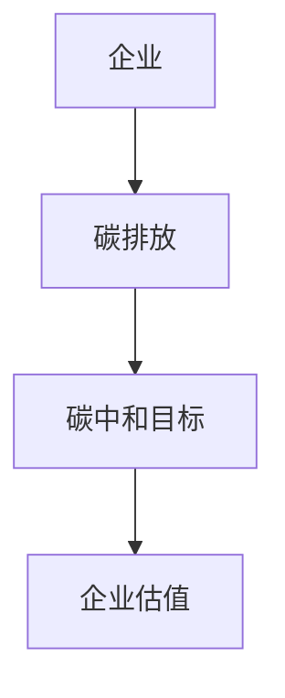
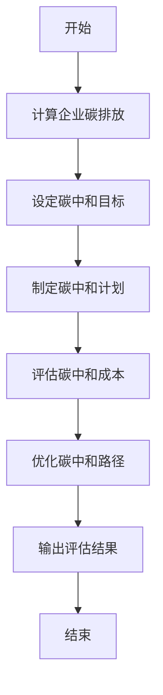
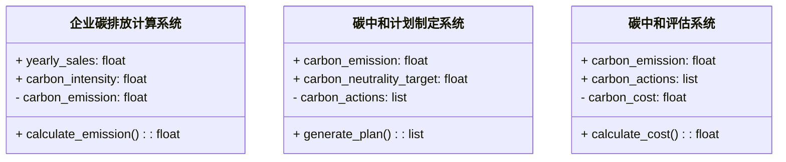
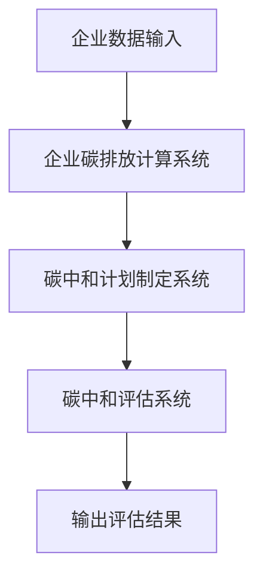
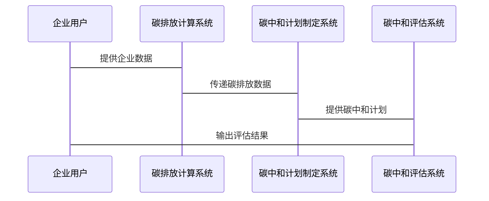

                 


# 企业估值中的碳中和战略评估

## 关键词：碳中和、企业估值、战略评估、气候变化、可持续发展

## 摘要：  
随着全球气候变化问题的加剧，碳中和已成为企业和社会可持续发展的重要目标。本文探讨了碳中和战略评估在企业估值中的关键作用，分析了碳中和战略对企业价值的影响机制，并提出了基于碳中和目标的企业估值方法。通过详细阐述碳中和战略评估的核心概念、算法原理、系统架构以及实际案例，本文为企业的可持续发展提供了理论支持和实践指导。

---

# 目录大纲：《企业估值中的碳中和战略评估》

## 第一部分：背景介绍

### 第1章：全球气候变化与碳中和目标
#### 1.1 全球气候变化的挑战
- 1.1.1 气候变化的现状与趋势
  - 全球气温上升的历史数据
  - 北极冰盖消融的速度
  - 全球极端天气事件的增加
- 1.1.2 国际社会对碳中和的共识
  - 《巴黎协定》的核心目标
  - 各国政府的政策承诺
  - 企业的社会责任
- 1.1.3 企业的责任与机遇
  - 企业碳排放对环境的影响
  - 碳中和对企业竞争力的潜在影响
  - 可持续发展带来的市场机会

#### 1.2 碳中和战略的提出与意义
- 1.2.1 碳中和战略的定义
  - 碳中和：企业在运营过程中产生的二氧化碳排放量通过减少和抵消达到零排放
- 1.2.2 碳中和对企业的战略意义
  - 提升企业形象和品牌价值
  - 降低环境风险
  - 捕捉绿色市场机遇
- 1.2.3 碳中和与企业估值的关系
  - 碳中和战略对企业未来盈利能力的影响
  - 碳风险对企业估值的潜在影响
  - 碳中和目标的实现对企业长期价值的提升

---

## 第二部分：核心概念与联系

### 第2章：碳中和战略评估的核心概念
#### 2.1 碳中和战略评估的定义
- 碳中和战略评估：通过量化企业的碳排放、分析碳中和路径，评估企业在实现碳中和目标过程中的可行性、经济性和可持续性
- 核心目标：优化企业碳管理，降低碳风险，提升企业价值

#### 2.2 碳中和战略评估的属性特征对比
| 属性 | 定义 | 碳中和战略评估 | 传统企业估值 |
|------|------|----------------|---------------|
| 评估目标 | 量化企业价值 | 优化碳中和路径，提升企业价值 | 评估企业整体价值 |
| 关键指标 | 碳排放量、碳中和成本、碳收益 | 净利润、现金流、增长率 | 财务指标、市场指标 |
| 评估周期 | 中长期 | 短期到中长期 | 短期到长期 |

#### 2.3 碳中和战略评估的ER实体关系图


---

## 第三部分：算法原理讲解

### 第3章：碳中和战略评估的算法原理
#### 3.1 碳排放计算模型
- 碳排放计算公式
  $$ \text{总碳排放} = \text{生产过程排放} + \text{运输排放} + \text{其他排放} $$
- 碳中和目标的实现路径
  - 减少直接排放（Scope 1）
  - 减少间接排放（Scope 2）
  - 抵消剩余排放（碳汇、碳信用）

#### 3.2 碳中和战略评估的算法流程


#### 3.3 碳中和战略评估的数学模型
- 碳中和成本计算公式
  $$ \text{碳中和成本} = \sum_{i=1}^{n} \text{减排措施成本}_i $$
- 碳中和收益计算公式
  $$ \text{碳中和收益} = \sum_{i=1}^{m} \text{碳收益}_i $$

#### 3.4 代码实现
```python
def calculate_carbon_emission(yearly_sales, carbon_intensity):
    return yearly_sales * carbon_intensity

def calculate_carbon_neutrality_cost(carbon_emission, cost_per_ton):
    return carbon_emission * cost_per_ton

# 示例计算
sales = 1000000  # 年销售额（吨）
carbon_intensity = 0.5  # 每吨销售额的碳排放（吨CO2/吨）
carbon_emission = calculate_carbon_emission(sales, carbon_intensity)
carbon_cost = calculate_carbon_neutrality_cost(carbon_emission, 50)  # 假设每吨碳排放成本为50元
print(f"总碳排放：{carbon_emission} 吨CO2")
print(f"碳中和成本：{carbon_cost} 元")
```

---

## 第四部分：系统分析与架构设计方案

### 第4章：碳中和战略评估系统架构设计
#### 4.1 问题场景介绍
- 企业如何量化碳排放？
- 如何制定碳中和计划？
- 如何评估碳中和对企业价值的影响？

#### 4.2 系统功能设计


#### 4.3 系统架构设计


#### 4.4 接口设计与交互流程


---

## 第五部分：项目实战

### 第5章：碳中和战略评估的项目实施
#### 5.1 环境安装与数据准备
- 数据准备：企业销售数据、碳排放强度、碳中和目标
- 工具安装：Python、Matplotlib、Pandas

#### 5.2 核心代码实现
```python
import pandas as pd
import matplotlib.pyplot as plt

def calculate_carbon_emission(data):
    return data['yearly_sales'] * data['carbon_intensity']

def visualize_carbon_emission(data, emission):
    plt.figure(figsize=(10,6))
    plt.plot(data['year'], emission, 'b-', marker='o')
    plt.title('Carbon Emission Over Time')
    plt.xlabel('Year')
    plt.ylabel('Carbon Emission (ton CO2)')
    plt.grid(True)
    plt.show()

# 示例数据
data = {
    'year': [2020, 2021, 2022],
    'yearly_sales': [1000000, 1200000, 1500000],
    'carbon_intensity': [0.5, 0.45, 0.4]
}
df = pd.DataFrame(data)
emission = [calculate_carbon_emission(df.iloc[i]) for i in range(len(df))]
visualize_carbon_emission(df, emission)
```

#### 5.3 案例分析与解读
- 案例：某制造企业碳中和战略评估
  - 数据输入：过去三年的销售数据和碳排放强度
  - 计算过程：碳排放量计算、碳中和成本估算
  - 结果分析：碳中和成本对企业利润的影响

---

## 第六部分：最佳实践与小结

### 第6章：碳中和战略评估的总结与展望
#### 6.1 总结
- 碳中和战略评估的核心要素
- 算法实现的关键步骤
- 系统架构设计的重要性

#### 6.2 注意事项
- 数据的准确性和完整性
- 碳中和目标的可行性
- 碳中和成本的经济性

#### 6.3 拓展阅读
- 研究文献：企业碳中和战略的最新研究
- 实践案例：国内外企业的碳中和实践
- 工具推荐：碳中和评估工具和平台

---

## 结语：
碳中和战略评估不仅是企业履行社会责任的重要手段，也是提升企业估值和竞争力的关键因素。通过本文的详细讲解，读者可以全面理解碳中和战略评估的核心概念、算法原理和系统架构，并通过实际案例掌握其在企业估值中的应用。未来，随着全球气候变化问题的加剧，碳中和战略评估将成为企业可持续发展的重要工具。

