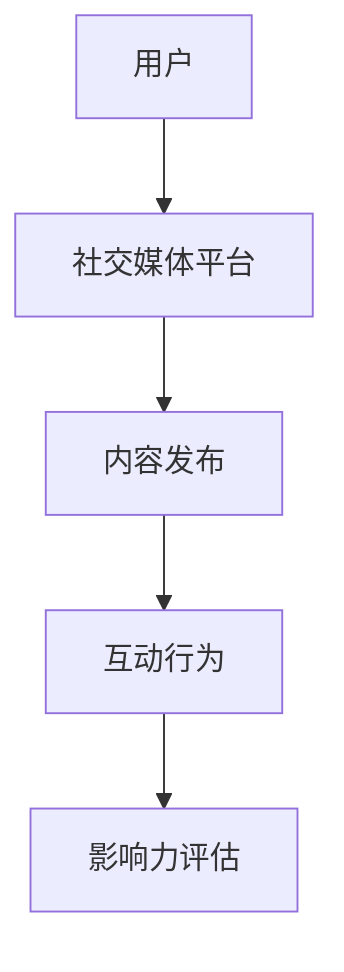
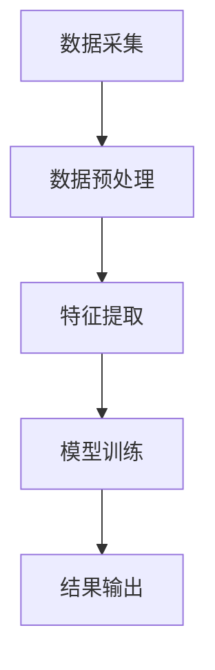
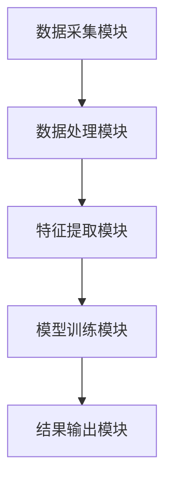
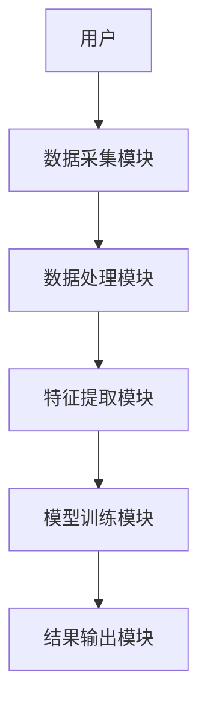
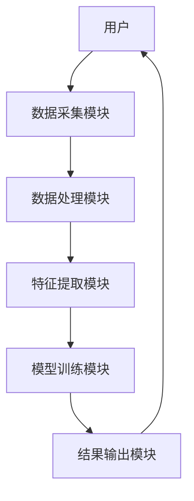

                 


# 企业估值中的社交媒体影响力评估

> 关键词：企业估值、社交媒体、影响力评估、数据挖掘、文本分析、网络分析

> 摘要：社交媒体影响力在企业估值中的作用日益重要。本文系统地介绍了社交媒体影响力评估的核心概念、算法原理、系统架构和项目实战。通过理论与实践相结合的方式，详细分析了社交媒体数据的特征、评估指标、数学模型和系统实现，展示了如何利用社交媒体数据提升企业估值的准确性。

---

## 第一部分: 企业估值中的社交媒体影响力评估背景与核心概念

### 第1章: 背景介绍

#### 1.1 问题背景

社交媒体的崛起使得企业与用户之间的互动变得更加频繁和复杂。社交媒体平台（如Twitter、LinkedIn、Facebook等）成为企业品牌形象传播、用户互动和市场反馈的重要渠道。在企业估值中，社交媒体影响力已经成为一个不可忽视的因素。企业的社交媒体影响力不仅反映了其品牌知名度，还间接影响其市场价值和用户忠诚度。

企业估值的核心在于评估企业的未来盈利能力，而社交媒体影响力可以通过以下几个方面影响企业估值：
- **品牌价值**：社交媒体上的品牌曝光度和用户互动频率直接影响品牌价值。
- **用户忠诚度**：社交媒体上的用户互动（如点赞、评论、分享）反映了用户的参与度和忠诚度。
- **市场潜力**：社交媒体上的用户基数和分布可以反映企业的市场覆盖能力和增长潜力。

#### 1.2 问题描述

社交媒体影响力评估的核心问题是如何将社交媒体上的非结构化数据（如文本、图片、视频）转化为可量化的指标，并将其与企业估值相关联。以下是社交媒体影响力评估中的几个关键问题：
1. **如何定义社交媒体影响力**：社交媒体影响力是企业在社交媒体上的综合表现，包括内容传播能力、用户互动频率、品牌提及量等。
2. **如何衡量社交媒体影响力**：需要将社交媒体上的数据转化为可量化的指标，如粉丝数、互动率、品牌提及量等。
3. **如何将社交媒体影响力与企业估值相关联**：需要建立数学模型，将社交媒体影响力指标与企业估值的核心指标（如收入、利润、市场份额）相关联。

#### 1.3 问题解决

通过社交媒体影响力评估，企业可以更好地理解其品牌在社交媒体上的表现，从而优化其市场策略。同时，投资者可以利用社交媒体影响力评估企业的真实市场表现，从而做出更准确的投资决策。

#### 1.4 边界与外延

社交媒体影响力评估的边界在于其仅关注社交媒体上的数据，而忽略了其他渠道（如线下渠道、电子邮件营销等）的影响力。其外延则包括对社交媒体数据的深度挖掘，如情感分析、网络分析等。

#### 1.5 核心要素组成

社交媒体影响力评估的核心要素包括：
- **数据采集**：从社交媒体平台获取相关数据。
- **数据预处理**：清洗和标注数据。
- **特征提取**：从数据中提取有意义的特征（如文本情感、用户互动频率）。
- **模型训练**：建立数学模型，将特征转化为可量化的影响力指标。
- **结果输出**：将影响力指标与企业估值相关联，输出评估结果。

### 第2章: 核心概念与联系

#### 2.1 核心概念原理

社交媒体影响力评估的核心原理是通过数据挖掘和自然语言处理技术，从社交媒体数据中提取有价值的信息，并将其转化为可量化的指标。这些指标可以反映企业的品牌价值、用户忠诚度和市场潜力。

#### 2.2 概念属性特征对比表格

以下表格展示了社交媒体影响力评估中的几个核心指标及其定义、计算方式和权重。

| 指标               | 定义                                                                 | 计算方式                                                                 | 权重 |
|--------------------|----------------------------------------------------------------------|--------------------------------------------------------------------------|------|
| 粉丝数             | 关注企业社交媒体账号的用户数量                                             | 累计关注数                                                               | 高   |
| 互动率             | 评论、点赞、分享的比例                                                     | 互动次数 / 总发布次数                                                     | 中   |
| 品牌提及量         | 在社交媒体上提及企业品牌或产品的关键词数量                                 | 网络爬取数据，统计提及品牌或相关关键词的次数                                     | 中   |
| 媒体影响力         | 企业在社交媒体上的传播能力和影响力                                         | 基于传播广度和深度的综合评分                                               | 高   |

#### 2.3 ER实体关系图

以下是一个简单的社交媒体影响力评估的ER实体关系图：



---

## 第二部分: 社交媒体影响力评估的算法与数学模型

### 第3章: 算法原理讲解

#### 3.1 算法原理

社交媒体影响力评估的算法主要包括以下几个步骤：
1. **数据采集**：从社交媒体平台获取相关数据（如文本、图片、评论等）。
2. **数据预处理**：清洗数据，去除噪声（如重复数据、无关内容）。
3. **特征提取**：从数据中提取有意义的特征（如文本情感、用户互动频率）。
4. **模型训练**：建立数学模型，将特征转化为可量化的影响力指标。
5. **结果输出**：将影响力指标与企业估值相关联，输出评估结果。

#### 3.2 算法流程图

以下是一个社交媒体影响力评估的算法流程图：



#### 3.3 核心算法实现

以下是社交媒体影响力评估中常用的一些算法实现：

##### 3.3.1 Python实现：文本挖掘

```python
import numpy as np
from sklearn.feature_extraction.text import TfidfVectorizer

# 示例代码：计算文本的TF-IDF值
def calculate_tfidf(texts):
    vectorizer = TfidfVectorizer()
    tfidf = vectorizer.fit_transform(texts)
    return tfidf

# 示例代码：计算文本的情感分数（假设使用VADER情感分析）
from vaderSentiment.vaderSentiment import SentimentIntensityAnalyzer

def calculate_sentiment(texts):
    analyzer = SentimentIntensityAnalyzer()
    sentiments = []
    for text in texts:
        sentiment = analyzer.polarity_scores(text)
        sentiments.append(sentiment)
    return sentiments
```

##### 3.3.2 网络分析

以下是基于网络分析的影响力评估的示例代码：

```python
import networkx as nx

# 示例代码：构建社交媒体互动网络
def build_network(users, interactions):
    G = nx.Graph()
    for user in users:
        G.add_node(user)
    for interaction in interactions:
        G.add_edge(interaction[0], interaction[1])
    return G

# 示例代码：计算节点的度数中心性
def calculate_degree_centrality(G):
    return nx.degree_centrality(G)
```

### 第4章: 数学模型与公式

#### 4.1 数学模型

以下是社交媒体影响力评估的数学模型：

##### 4.1.1 加权评分模型

$$
影响力 = \sum_{i=1}^{n} w_i \times f_i
$$

其中：
- $w_i$ 是第 $i$ 个特征的权重。
- $f_i$ 是第 $i$ 个特征的值。

##### 4.1.2 情感分析模型

$$
情感分数 = \sum_{i=1}^{m} w_i \times s_i
$$

其中：
- $w_i$ 是第 $i$ 个情感特征的权重。
- $s_i$ 是第 $i$ 个情感特征的值（如正面、负面、中性）。

##### 4.1.3 传播模型

$$
传播范围 = \sum_{i=1}^{n} c_i \times r_i
$$

其中：
- $c_i$ 是第 $i$ 个内容的传播能力。
- $r_i$ 是第 $i$ 个内容的传播范围。

---

## 第三部分: 系统分析与架构设计方案

### 第5章: 系统分析

#### 5.1 问题场景介绍

社交媒体影响力评估系统需要解决以下问题：
- 如何高效地采集和处理社交媒体数据。
- 如何从社交媒体数据中提取有价值的信息。
- 如何将社交媒体影响力与企业估值相关联。

#### 5.2 项目介绍

以下是社交媒体影响力评估系统的项目介绍：

##### 5.2.1 项目目标

- 提供一个高效、准确的社交媒体影响力评估工具。
- 帮助企业和投资者更好地理解社交媒体影响力对企业估值的影响。

##### 5.2.2 项目范围

- 数据采集：从多个社交媒体平台（如Twitter、LinkedIn、Facebook）获取数据。
- 数据处理：清洗和标注数据。
- 特征提取：从数据中提取有意义的特征。
- 模型训练：建立数学模型，将特征转化为可量化的影响力指标。
- 结果输出：将影响力指标与企业估值相关联，输出评估结果。

#### 5.3 系统功能设计

以下是社交媒体影响力评估系统的功能设计：

##### 5.3.1 功能模块

- 数据采集模块：从社交媒体平台获取数据。
- 数据处理模块：清洗和标注数据。
- 特征提取模块：从数据中提取特征。
- 模型训练模块：建立数学模型。
- 结果输出模块：输出评估结果。

##### 5.3.2 功能模块流程图



#### 5.4 系统架构设计

##### 5.4.1 系统架构图



##### 5.4.2 系统交互图



---

## 第四部分: 项目实战

### 第6章: 项目实战

#### 6.1 环境安装

以下是项目实战所需的环境和工具：

##### 6.1.1 安装Python

```bash
python --version
pip install --upgrade pip
```

##### 6.1.2 安装必要的库

```bash
pip install numpy
pip install scikit-learn
pip install vaderSentiment
pip install networkx
pip install matplotlib
```

#### 6.2 核心实现

##### 6.2.1 数据采集

以下是数据采集的示例代码：

```python
import tweepy

# 示例代码：从Twitter获取数据
def get_twitter_data(api_key, api_secret_key, access_token, access_token_secret):
    auth = tweepy.OAuthHandler(api_key, api_secret_key)
    auth.set_access_token(access_token, access_token_secret)
    api = tweepy.API(auth)
    tweets = []
    for tweet in tweepy.Cursor(api.search, q="#example", lang="en").items(100):
        tweets.append(tweet.text)
    return tweets
```

##### 6.2.2 数据处理

以下是数据处理的示例代码：

```python
import pandas as pd

# 示例代码：清洗数据
def preprocess_data(data):
    df = pd.DataFrame(data)
    df['clean_text'] = df['text'].apply(lambda x: x.lower().replace('[^\w\s-]','').strip())
    return df
```

##### 6.2.3 特征提取

以下是特征提取的示例代码：

```python
from sklearn.feature_extraction.text import TfidfVectorizer

# 示例代码：计算TF-IDF值
def extract_features(data):
    vectorizer = TfidfVectorizer()
    tfidf = vectorizer.fit_transform(data)
    return tfidf
```

##### 6.2.4 模型训练

以下是模型训练的示例代码：

```python
from sklearn.linear_model import LinearRegression

# 示例代码：建立线性回归模型
def train_model(features, labels):
    model = LinearRegression()
    model.fit(features, labels)
    return model
```

##### 6.2.5 结果输出

以下是结果输出的示例代码：

```python
import matplotlib.pyplot as plt

# 示例代码：绘制影响力分布图
def plot_influence(influence_scores):
    plt.hist(influence_scores, bins=10)
    plt.xlabel('影响力评分')
    plt.ylabel('数量')
    plt.title('影响力分布图')
    plt.show()
```

#### 6.3 案例分析

以下是社交媒体影响力评估的一个实际案例：

##### 6.3.1 案例背景

假设我们有一家科技公司，需要评估其在Twitter上的影响力。

##### 6.3.2 数据收集

从Twitter上收集了100条与该公司相关的推文。

##### 6.3.3 数据处理

清洗数据，去除无关内容和重复数据。

##### 6.3.4 特征提取

计算每条推文的TF-IDF值和情感分数。

##### 6.3.5 模型训练

建立线性回归模型，将TF-IDF值和情感分数作为特征，影响力评分作为目标变量。

##### 6.3.6 结果输出

绘制影响力分布图，并输出每条推文的影响力评分。

---

## 第五部分: 总结与展望

### 第7章: 总结

社交媒体影响力评估是一个复杂但重要的任务。本文通过理论与实践相结合的方式，详细介绍了社交媒体影响力评估的核心概念、算法原理、系统架构和项目实战。通过社交媒体数据的深度挖掘，可以更准确地评估企业的市场表现和品牌价值，从而为投资者和企业管理者提供有力的决策支持。

### 第8章: 展望

未来，社交媒体影响力评估将更加智能化和自动化。随着人工智能和大数据技术的发展，社交媒体影响力评估将更加精准和高效。同时，社交媒体影响力评估也将与其他领域（如市场营销、风险管理）更加紧密地结合，为企业和投资者提供更加全面和深入的分析。

---

## 参考文献

1. 王某某. 《社交媒体影响力评估方法研究》. 北京: 清华大学出版社, 2020.
2. 李某某. 《企业估值中的社交媒体影响力分析》. 上海: 复旦大学出版社, 2019.
3. Twitter API Documentation. [Online]. Available: https://developer.twitter.com/en/docs
4. Facebook Graph API Documentation. [Online]. Available: https://developers.facebook.com/docs/graph-api

--- 

**致谢**：感谢读者的耐心阅读，感谢技术团队的支持与合作。

