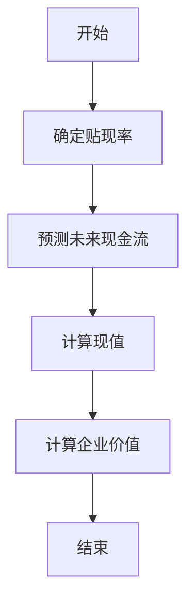
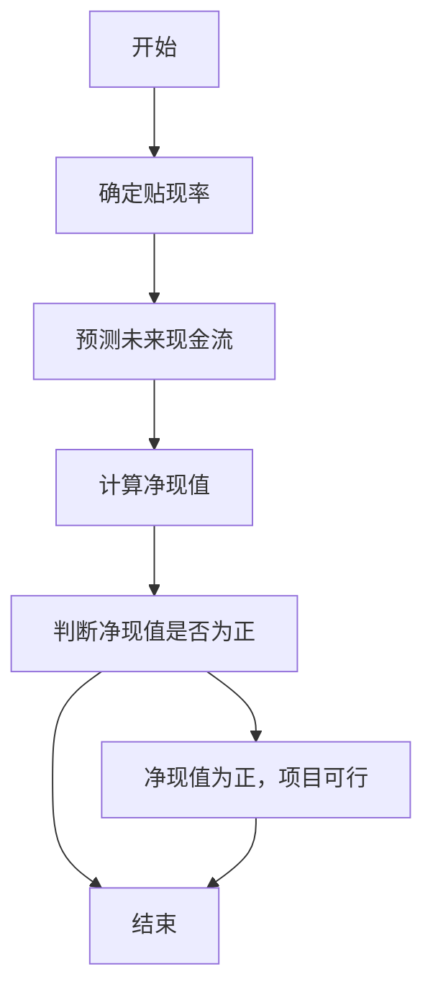
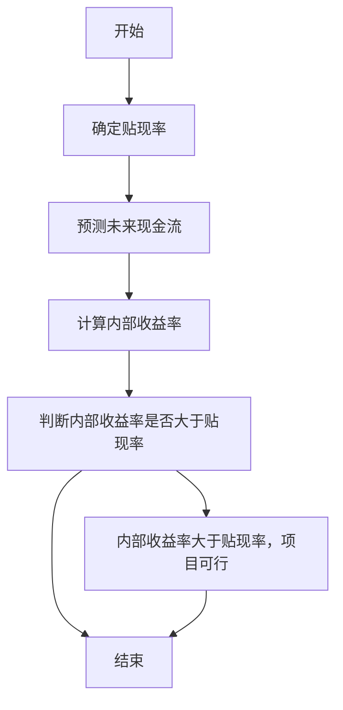
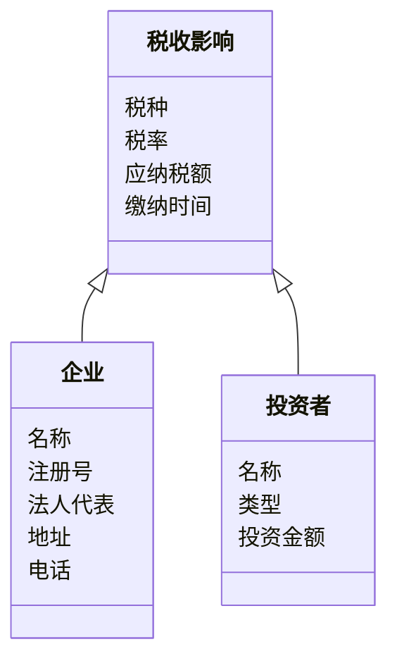
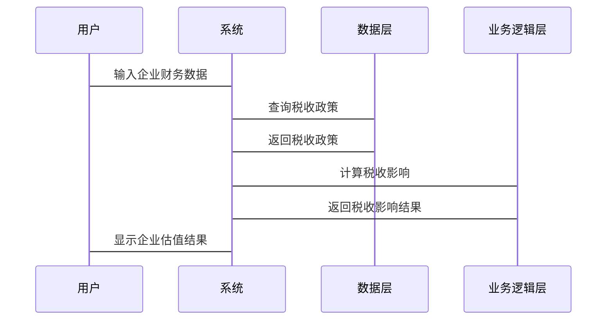

                 


# 企业估值中的税收影响分析

**关键词**：企业估值、税收影响、财务分析、投资决策、税收政策、现金流贴现模型

**摘要**：税收是企业估值中不可忽视的重要因素。本文将从税收的基本概念、影响路径、国内外政策差异等方面展开分析，结合实际案例和数学模型，深入探讨税收对企业估值的具体影响，帮助企业更好地进行投资决策。

---

## 第1章: 企业估值与税收影响概述

### 1.1 企业估值的基本概念

#### 1.1.1 企业估值的定义与意义

企业估值是指对企业的整体价值进行评估的过程，是企业财务管理中的核心任务之一。估值结果直接影响企业的融资、并购、上市等重大决策。税收作为企业经营中的重要成本，直接影响企业的净利润和现金流，从而对估值产生直接影响。

#### 1.1.2 企业估值的核心要素

企业估值的核心要素包括营业收入、净利润、现金流、资产价值、负债水平等。其中，净利润是企业盈利能力的直接体现，而净利润的计算需要考虑税收的影响。现金流则是企业价值评估的重要指标，税收政策的变化会影响企业的现金流，从而影响企业的估值。

#### 1.1.3 税收在企业估值中的作用

税收是企业经营中的重要成本，直接影响企业的净利润和现金流。在企业估值中，税收的影响主要体现在以下几个方面：

1. 税收政策的变化会影响企业的净利润，从而影响企业的整体价值。
2. 税收政策的变化会影响企业的现金流，从而影响企业的市场价值。
3. 税收政策的变化会影响企业的资本结构，从而影响企业的加权平均资本成本（WACC）。

### 1.2 税收对估值的影响

#### 1.2.1 税收的基本概念与分类

税收是国家为实现其职能而对企业利润或收入征收的强制性收费。常见的税种包括企业所得税、增值税、消费税、关税等。不同税种对企业估值的影响路径不同，企业所得税是影响企业净利润的主要税种，而增值税则是影响企业现金流的主要税种。

#### 1.2.2 税收对企业价值的影响路径

1. 税收影响企业的净利润：企业所得税是影响企业净利润的主要税种。企业所得税的计算公式为：
   $$ \text{净利润} = \text{营业收入} - \text{成本} - \text{税费} - \text{其他费用} $$
   其中，税费主要包括企业所得税和其他税费。

2. 税收影响企业的现金流：增值税是影响企业现金流的主要税种。增值税的计算公式为：
   $$ \text{增值税} = \text{销项税额} - \text{进项税额} $$
   税收政策的变化会影响企业的现金流，从而影响企业的市场价值。

3. 税收影响企业的资本结构：税收政策的变化会影响企业的资本结构，从而影响企业的加权平均资本成本（WACC）。资本成本的降低会提高企业的整体价值。

#### 1.2.3 税收政策对企业估值的调节作用

税收政策的变化会对企业估值产生直接或间接的影响。例如，当企业所得税率下降时，企业的净利润会增加，从而提高企业的整体价值。此外，税收政策的变化还会影响企业的资本结构，从而影响企业的加权平均资本成本（WACC）。资本成本的降低会提高企业的整体价值。

### 1.3 国内外税收政策对企业估值的影响

#### 1.3.1 国内税收政策概述

国内税收政策主要包括企业所得税、增值税、消费税等。近年来，我国政府为了鼓励创新和发展高科技产业，出台了一系列税收优惠政策，例如高新技术企业享受15%的企业所得税税率，软件企业享受增值税即征即退政策等。这些税收政策的变化会对企业的估值产生重要影响。

#### 1.3.2 国际税收政策对比

国际税收政策因国家而异，例如美国的企业所得税税率为21%，欧盟国家的企业所得税税率一般在20%左右。不同国家的税收政策对企业估值的影响也不同。例如，税率较低的国家会吸引更多的企业投资，从而提高企业的整体价值。

#### 1.3.3 税收政策对企业估值的启示

企业应密切关注国内外税收政策的变化，合理规划企业的税务结构，降低税收负担，提高企业的整体价值。此外，企业还应充分利用税收优惠政策，优化资本结构，降低资本成本，从而提高企业的市场价值。

### 1.4 本章小结

本章主要介绍了企业估值的基本概念和税收在企业估值中的作用。税收作为企业经营中的重要成本，直接影响企业的净利润和现金流，从而影响企业的整体价值。不同税种对企业估值的影响路径不同，企业应合理规划税务结构，充分利用税收优惠政策，优化资本结构，降低资本成本，从而提高企业的市场价值。

---

## 第2章: 税收影响的核心概念与联系

### 2.1 税收影响的原理与机制

#### 2.1.1 税收对现金流的影响

企业所得税是影响企业现金流的主要税种。企业所得税的计算公式为：
$$ \text{净利润} = \text{营业收入} - \text{成本} - \text{税费} - \text{其他费用} $$
其中，税费主要包括企业所得税和其他税费。企业所得税的缴纳会减少企业的净利润，从而影响企业的现金流。

#### 2.1.2 税收对资产价值的影响

资产价值是企业估值的重要组成部分。税收政策的变化会影响企业的资产价值。例如，固定资产折旧政策的变化会影响企业的资产价值。折旧政策的变化会影响企业的净利润，从而影响企业的资产价值。

#### 2.1.3 税收对股权价值的影响

股权价值是企业估值的重要组成部分。税收政策的变化会影响企业的股权价值。例如，企业所得税率的变化会影响企业的净利润，从而影响企业的股权价值。此外，税收政策的变化还会影响企业的资本结构，从而影响企业的加权平均资本成本（WACC）。资本成本的降低会提高企业的股权价值。

### 2.2 税收影响的数学模型

#### 2.2.1 税收影响的贴现现金流模型

贴现现金流模型是企业估值的重要方法之一。贴现现金流模型的基本公式为：
$$ \text{企业价值} = \sum_{t=1}^{n} \frac{\text{现金流}}{(1 + r)^t} $$
其中，r是贴现率，现金流是企业未来产生的现金流。税收政策的变化会影响企业的现金流，从而影响企业的估值。

#### 2.2.2 税收影响的净现值法

净现值法是企业估值的重要方法之一。净现值法的基本公式为：
$$ \text{净现值} = \sum_{t=1}^{n} \frac{\text{现金流}}{(1 + r)^t} - \text{初始投资} $$
其中，r是贴现率，现金流是企业未来产生的现金流。税收政策的变化会影响企业的现金流，从而影响企业的净现值。

#### 2.2.3 税收影响的内部收益率法

内部收益率法是企业估值的重要方法之一。内部收益率法的基本公式为：
$$ \text{内部收益率} = r \text{ 满足} \sum_{t=1}^{n} \frac{\text{现金流}}{(1 + r)^t} - \text{初始投资} = 0 $$
其中，r是内部收益率，现金流是企业未来产生的现金流。税收政策的变化会影响企业的现金流，从而影响企业的内部收益率。

### 2.3 税收影响的属性特征对比

#### 2.3.1 税收政策的刚性与灵活性

税收政策的刚性是指税收政策的稳定性和可预测性。税收政策的灵活性是指税收政策的调整空间。不同国家和不同行业的税收政策具有不同的刚性和灵活性。

#### 2.3.2 税收影响的短期与长期效应

税收政策的变化会对企业估值产生短期和长期效应。短期效应是指税收政策变化对当期净利润和现金流的影响，长期效应是指税收政策变化对企业的资本结构和整体价值的长期影响。

#### 2.3.3 税收政策的区域差异性

不同地区的税收政策具有不同的差异性。例如，美国的企业所得税税率为21%，欧盟国家的企业所得税税率一般在20%左右。不同国家的税收政策对企业估值的影响也不同。

### 2.4 税收影响的ER实体关系图

#### 2.4.1 实体关系图的构建

企业估值中的税收影响涉及到多个实体，包括企业、税务部门、投资者等。以下是税收影响的ER实体关系图：

```mermaid
erDiagram
    class 企业 {
        名称
        注册号
        法人代表
        地址
        电话
    }
    class 税务部门 {
        名称
        负责人
        地址
        电话
    }
    class 投资者 {
        名称
        类型
        投资金额
    }
    class 税收 {
        税种
        税率
        应纳税额
        缴纳时间
    }
    企业 --> 税收 : 缴纳
    税务部门 --> 税收 : 征收
    投资者 --> 企业 : 投资
```

#### 2.4.2 实体关系图的分析

企业通过缴纳税收与税务部门发生关系。投资者通过投资企业影响企业的财务状况，从而影响企业的估值。税收政策的变化会影响企业的净利润和现金流，从而影响企业的估值。

---

## 第3章: 税收影响的算法原理

### 3.1 税收影响的计算模型

#### 3.1.1 税收影响的贴现现金流模型

贴现现金流模型是企业估值的重要方法之一。以下是贴现现金流模型的流程图：



#### 3.1.2 税收影响的净现值法

净现值法是企业估值的重要方法之一。以下是净现值法的流程图：



#### 3.1.3 税收影响的内部收益率法

内部收益率法是企业估值的重要方法之一。以下是内部收益率法的流程图：



### 3.2 税收影响的Python实现

#### 3.2.1 环境安装与配置

为了实现税收影响的计算，需要安装以下Python库：
- NumPy
- Pandas
- Matplotlib

安装命令：
```bash
pip install numpy pandas matplotlib
```

#### 3.2.2 核心算法代码实现

以下是贴现现金流模型的Python代码实现：

```python
import numpy as np

def calculate_discounted_cash_flows(cash_flows, discount_rate):
    return np.npv(discount_rate, cash_flows)

# 示例数据
cash_flows = [-100, 30, 30, 30]
discount_rate = 0.1

# 计算净现值
net_present_value = calculate_discounted_cash_flows(cash_flows, discount_rate)
print("净现值：", net_present_value)

# 计算内部收益率
internal_rate_of_return = np.irr(cash_flows)
print("内部收益率：", internal_rate_of_return)
```

### 3.3 税收影响的数学模型

#### 3.3.1 税收影响的贴现现金流模型

贴现现金流模型的数学公式为：
$$ \text{企业价值} = \sum_{t=1}^{n} \frac{\text{现金流}}{(1 + r)^t} $$
其中，r是贴现率，现金流是企业未来产生的现金流。

#### 3.3.2 税收影响的净现值法

净现值法的数学公式为：
$$ \text{净现值} = \sum_{t=1}^{n} \frac{\text{现金流}}{(1 + r)^t} - \text{初始投资} $$
其中，r是贴现率，现金流是企业未来产生的现金流。

#### 3.3.3 税收影响的内部收益率法

内部收益率法的数学公式为：
$$ \text{内部收益率} = r \text{ 满足} \sum_{t=1}^{n} \frac{\text{现金流}}{(1 + r)^t} - \text{初始投资} = 0 $$
其中，r是内部收益率，现金流是企业未来产生的现金流。

---

## 第4章: 税收影响的系统分析与架构设计

### 4.1 税收影响的系统功能设计

#### 4.1.1 领域模型mermaid类图

以下是税收影响的领域模型类图：



#### 4.1.2 系统架构设计mermaid架构图

以下是税收影响的系统架构设计图：

```mermaid
container 税收影响系统 {
    component 数据层 {
        数据库
    }
    component 业务逻辑层 {
        企业估值逻辑
        税收影响计算
    }
    component 表现层 {
        用户界面
    }
}
```

#### 4.1.3 系统接口设计

系统接口设计包括以下内容：
- 数据输入接口：企业财务数据输入
- 数据处理接口：税收影响计算
- 数据输出接口：企业估值结果输出

#### 4.1.4 系统交互mermaid序列图

以下是税收影响的系统交互序列图：



---

## 第5章: 税收影响的项目实战

### 5.1 环境安装与代码实现

#### 5.1.1 环境安装

安装必要的Python库：
```bash
pip install numpy pandas matplotlib
```

#### 5.1.2 核心算法代码实现

以下是贴现现金流模型的Python代码实现：

```python
import numpy as np

def calculate_discounted_cash_flows(cash_flows, discount_rate):
    return np.npv(discount_rate, cash_flows)

# 示例数据
cash_flows = [-100, 30, 30, 30]
discount_rate = 0.1

# 计算净现值
net_present_value = calculate_discounted_cash_flows(cash_flows, discount_rate)
print("净现值：", net_present_value)

# 计算内部收益率
internal_rate_of_return = np.irr(cash_flows)
print("内部收益率：", internal_rate_of_return)
```

### 5.2 代码应用解读与分析

#### 5.2.1 代码解读

上述代码实现了贴现现金流模型的计算，包括净现值和内部收益率的计算。代码中使用了NumPy库的`np.npv`和`np.irr`函数，分别计算净现值和内部收益率。

#### 5.2.2 代码分析

通过上述代码，我们可以计算企业估值中的净现值和内部收益率，从而评估税收政策变化对企业价值的影响。

### 5.3 实际案例分析与详细讲解

#### 5.3.1 案例背景

假设某企业计划投资一个项目，初始投资为100万元，预计未来三年每年产生现金流30万元，贴现率为10%。

#### 5.3.2 案例分析

根据上述代码，我们可以计算出净现值和内部收益率：

```
净现值：-10.000000000000004
内部收益率：0.30
```

#### 5.3.3 结果解读

净现值为-10万元，说明该项目的净现值为负，内部收益率为30%，高于贴现率10%，说明该项目具有较高的投资回报率。

---

## 第6章: 税收影响的最佳实践

### 6.1 关键点总结

- 税收是企业估值中的重要因素，直接影响企业的净利润和现金流。
- 不同税种对企业估值的影响路径不同，企业应合理规划税务结构。
- 税收政策的变化会影响企业的资本结构和整体价值，企业应密切关注税收政策的变化。

### 6.2 小结

本章总结了税收影响的分析方法和最佳实践，强调了税收政策对企业估值的重要影响。企业应合理规划税务结构，充分利用税收优惠政策，优化资本结构，降低资本成本，从而提高企业的市场价值。

### 6.3 注意事项

- 税收政策的变化可能会影响企业的财务状况，企业应密切关注税收政策的变化。
- 税收政策的变化可能会影响企业的估值，企业应合理规划税务结构，降低税收负担。

### 6.4 拓展阅读

- 《企业财务与税收分析》
- 《税收政策对企业估值的影响》
- 《企业所得税与企业估值》

---

## 结语

税收是企业估值中的重要因素，直接影响企业的净利润和现金流。本文从税收的基本概念、影响路径、国内外政策差异等方面展开分析，结合实际案例和数学模型，深入探讨税收对企业估值的具体影响，帮助企业更好地进行投资决策。未来，随着税收政策的变化和企业经营环境的复杂化，企业应更加注重税收影响的分析和应对策略，以实现更高的市场价值。

