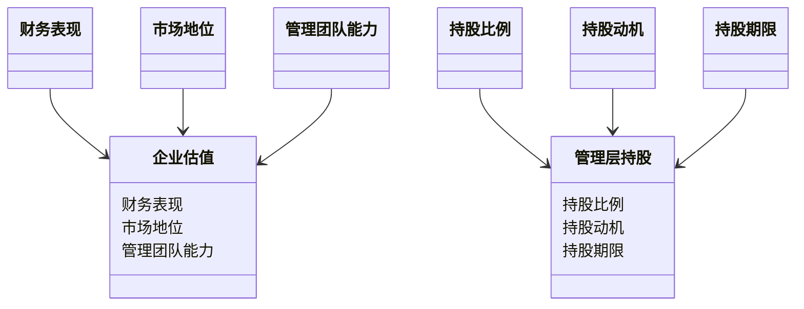

                 


# 企业估值中的管理层持股影响分析

> 关键词：企业估值，管理层持股，股权激励，回归分析，企业治理

> 摘要：本文系统分析了管理层持股对企业估值的影响，从核心概念、数学模型、系统架构到实际案例，详细阐述了管理层持股对估值的关键作用，并通过回归分析等方法量化了其影响。文章旨在为企业估值提供新的视角和方法。

---

## 第1章: 背景介绍

### 1.1 管理层持股的核心概念

#### 1.1.1 管理层持股的定义
管理层持股指公司高层管理人员（如CEO、 CFO等）持有公司一定比例的股权。这种持股不仅体现了管理层的经济利益，也反映了其对公司长期发展的承诺。

#### 1.1.2 管理层持股的类型
- **直接持股**：管理层直接持有公司股份。
- **间接持股**：通过信托、基金等间接持有。
- **期权与限制性股票**：公司给予管理层在未来以特定价格购买股票的权利。

#### 1.1.3 管理层持股与企业价值的关系
管理层持股通过激励机制和利益绑定，通常会提升企业价值。但持股比例和结构也会影响具体效果。

---

### 1.2 问题背景与描述

#### 1.2.1 企业估值的基本概念
企业估值是通过对企业财务状况、市场地位、管理能力等多方面分析，确定其市场价值的过程。

#### 1.2.2 管理层持股对估值的影响
管理层持股通过影响公司治理、激励机制和管理决策，间接影响企业价值。具体表现为：
- 提高管理层积极性。
- 减少代理成本。
- 提升公司稳定性。

#### 1.2.3 问题解决的思路与方法
本文通过回归分析，量化管理层持股对企业估值的影响，构建数学模型。

---

### 1.3 国内外研究现状

#### 1.3.1 国内研究现状
国内学者主要从公司治理角度研究管理层持股的影响，但缺乏系统性分析。

#### 1.3.2 国外研究现状
国外研究较早，从代理理论和激励理论出发，提出持股对估值的正面影响。

#### 1.3.3 研究差距与创新点
本文创新点在于：
- 构建了完整的数学模型。
- 结合实际案例进行验证。

---

### 1.4 研究意义与方法论

#### 1.4.1 研究意义
管理层持股对估值的影响是企业治理的核心问题，具有重要的理论和实践意义。

#### 1.4.2 研究方法
采用定量分析方法，包括：
- 回归分析。
- 数据挖掘。

#### 1.4.3 数据来源与分析框架
数据来源包括公司财报、股权激励计划等，构建了多维度分析框架。

---

## 第2章: 核心概念与联系

### 2.1 管理层持股的属性特征

#### 2.1.1 持股比例
管理层持股比例影响其对企业决策的影响力。

| 持股比例（%） | 影响分析 |
|----------------|----------|
| 10以下          | 影响较小 |
| 10-30           | 显著影响 |
| 30以上          | 控制权增强 |

#### 2.1.2 持股动机
管理层持股动机可分为：
- **激励动机**：通过持股激励管理层。
- **控制动机**：通过持股巩固控制权。

#### 2.1.3 持股期限
长期持股更有利于企业稳定发展。

---

### 2.2 企业估值的关键因素

#### 2.2.1 财务表现
包括收入、利润、ROE等指标。

#### 2.2.2 市场地位
包括市场份额、品牌价值等。

#### 2.2.3 管理团队能力
管理层能力直接影响企业价值。

---

### 2.3 持股与估值的关系模型

#### 2.3.1 模型构建
通过构建回归模型，量化持股对估值的影响。

$$ Y = \beta_0 + \beta_1 X + \epsilon $$
其中，Y为企业价值，X为管理层持股比例。

---

## 第3章: 管理层持股对估值的数学模型

### 3.1 持股比例与企业价值的关系

#### 3.1.1 回归分析模型
回归模型：
$$ Y = \beta_0 + \beta_1 X + \epsilon $$

其中，$\beta_1$为持股比例的回归系数，表示每增加1%的持股比例，企业价值的变化。

#### 3.1.2 数据来源与处理
数据来源包括公开财报和股权激励计划。

---

### 3.2 持股动机对企业价值的影响

#### 3.2.1 动机分类与影响路径
- 激励动机：通过持股激励管理层，提升企业绩效。
- 控制动机：通过持股巩固控制权，减少代理成本。

---

### 3.3 模型验证与优化

#### 3.3.1 数据拟合
通过回归分析拟合数据，验证模型的有效性。

#### 3.3.2 模型假设检验
检验模型的显著性，包括F检验和t检验。

#### 3.3.3 参数估计与调整
根据检验结果调整模型参数，优化回归模型。

---

## 第4章: 管理层持股对估值的系统分析

### 4.1 问题场景介绍

#### 4.1.1 持股对企业治理的影响
- 提高管理层积极性。
- 减少代理成本。

#### 4.1.2 持股对市场信心的影响
管理层持股可以增强投资者信心。

---

### 4.2 项目介绍

#### 4.2.1 项目目标
量化管理层持股对企业估值的影响。

---

### 4.3 系统功能设计

#### 4.3.1 领域模型（Mermaid 类图）


---

### 4.4 系统架构设计

#### 4.4.1 系统架构（Mermaid 架构图）
```mermaid
tidy
architecture
    数据采集模块 --> 数据处理模块
    数据处理模块 --> 数据分析模块
    数据分析模块 --> 数据可视化模块
```

---

## 第5章: 项目实战

### 5.1 环境安装

#### 5.1.1 Python 环境
安装必要的库：
- numpy
- pandas
- sklearn
- matplotlib

---

### 5.2 系统核心实现源代码

#### 5.2.1 回归模型实现
```python
import numpy as np
import pandas as pd
from sklearn.linear_model import LinearRegression
import matplotlib.pyplot as plt

# 读取数据
data = pd.read_csv('持股与估值.csv')

# 定义变量
X = data[['持股比例']]
Y = data['企业价值']

# 模型训练
model = LinearRegression()
model.fit(X, Y)

# 模型结果
print('回归系数:', model.coef_[0])
print('截距:', model.intercept_)

# 可视化
plt.scatter(X, Y, color='blue')
plt.plot(X, model.predict(X), color='red')
plt.xlabel('持股比例')
plt.ylabel('企业价值')
plt.show()
```

---

### 5.3 代码应用解读与分析

#### 5.3.1 代码功能
- 读取数据。
- 定义自变量和因变量。
- 训练回归模型。
- 输出回归系数和截距。
- 可视化结果。

#### 5.3.2 模型解释
回归系数表示每增加1%的持股比例，企业价值的变化量。

---

### 5.4 实际案例分析

#### 5.4.1 案例背景
以某公司为例，分析管理层持股对企业价值的影响。

#### 5.4.2 数据处理
处理数据中的缺失值和异常值。

#### 5.4.3 模型验证
验证回归模型的准确性。

#### 5.4.4 结果分析
分析回归系数的意义，并提出改进建议。

---

## 第6章: 最佳实践 tips、小结、注意事项、拓展阅读

### 6.1 小结
本文通过回归分析量化了管理层持股对企业估值的影响，为公司治理提供了新视角。

### 6.2 注意事项
- 数据质量会影响模型准确性。
- 模型需结合实际业务场景。

### 6.3 拓展阅读
推荐相关书籍和论文，进一步深入研究。

---

## 总结

本文系统分析了管理层持股对企业估值的影响，通过回归分析等方法，量化了其对估值的关键作用。未来研究可以进一步探索动态模型和混合研究方法。

