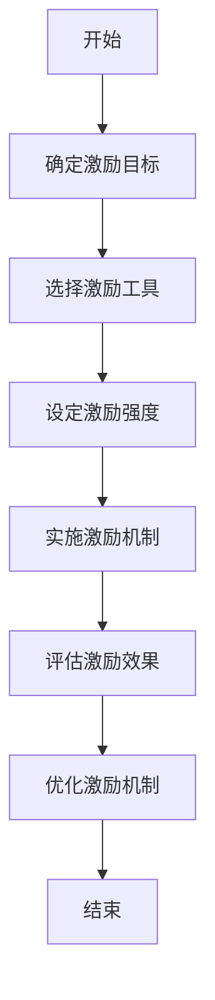
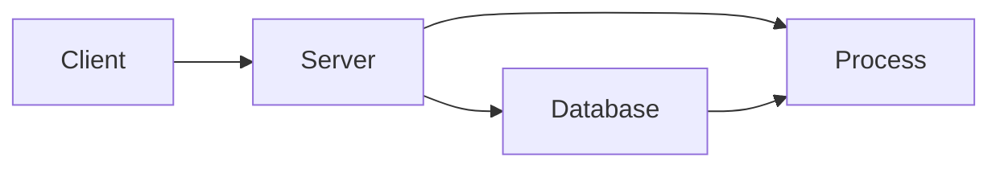

                 


# 企业估值中的管理层激励机制评估

> 关键词：企业估值，管理层激励机制，股票期权，绩效考核，公司治理

> 摘要：本文系统地探讨了管理层激励机制在企业估值中的关键作用，详细分析了激励机制的设计、实施和评估过程。通过结合实际案例和数学模型，本文为企业管理层和投资者提供了有效的评估方法和优化建议，帮助企业在复杂的市场环境中实现可持续发展。

---

## 第1章 企业估值与管理层激励机制概述

### 1.1 企业估值的基本概念

#### 1.1.1 企业估值的定义与意义

企业估值是通过对企业的财务状况、市场地位、盈利能力等多方面因素的综合评估，确定企业价值的过程。它不仅是企业融资、并购等重大决策的基础，也是衡量企业管理层绩效的重要指标。企业估值的意义在于为投资者提供决策依据，确保资源的合理配置和企业的可持续发展。

#### 1.1.2 企业估值的核心要素

企业估值的核心要素包括以下几个方面：

1. **财务状况**：包括收入、利润、资产负债情况等。
2. **市场地位**：包括市场份额、品牌影响力等。
3. **盈利能力**：包括净利润率、ROE（净资产收益率）等。
4. **管理能力**：包括管理层的战略规划和执行能力。
5. **未来增长潜力**：包括行业发展趋势、技术创新能力等。

#### 1.1.3 管理层在企业估值中的作用

管理层作为企业经营的核心，其决策和行为直接影响企业的价值。有效的激励机制可以激发管理层的积极性，提升企业的整体绩效，从而提高企业估值。相反，如果激励机制设计不合理，可能导致管理层短视行为，损害企业长期利益。

### 1.2 管理层激励机制的定义与特点

#### 1.2.1 管理层激励机制的定义

管理层激励机制是指通过一定的制度安排，将管理层的个人利益与企业整体利益相结合，激励管理层为实现企业目标而努力工作的机制。常见的激励方式包括股票期权、绩效奖金、限制性股票等。

#### 1.2.2 激励机制的核心要素

激励机制的核心要素包括：

1. **激励目标**：明确激励的目的，如提高业绩、创新等。
2. **激励对象**：通常是企业的高级管理人员。
3. **激励工具**：包括股票、奖金、期权等。
4. **激励强度**：激励力度的大小，直接影响激励效果。
5. **激励周期**：激励的实施时间和频率。

#### 1.2.3 激励机制与企业绩效的关系

激励机制与企业绩效之间存在密切的正相关关系。有效的激励机制能够提升管理层的积极性和创造性，从而提高企业的整体绩效，进而提升企业估值。然而，激励机制的设计需要科学合理，避免过度激励或激励不足的问题。

### 1.3 企业激励机制的背景与现状

#### 1.3.1 激励机制的起源与发展

激励机制的起源可以追溯到早期的企业管理实践，但真正的发展得益于现代公司治理理论的推动。随着股份制企业的普及，股票期权等激励工具逐渐成为企业管理层激励的主要方式。

#### 1.3.2 当前企业激励机制的主要形式

目前，企业激励机制的主要形式包括：

1. **股票期权**：常见的长期激励工具，使管理层与股东利益一致。
2. **绩效奖金**：短期激励工具，与当年的业绩挂钩。
3. **限制性股票**：将管理层的股票收益与企业绩效挂钩。
4. **员工持股计划（ESOP）**：通过员工持股提高员工的主人翁意识。

#### 1.3.3 激励机制在企业估值中的重要性

激励机制通过影响管理层的行为，进而影响企业的财务表现和市场地位，最终影响企业估值。科学的激励机制能够优化企业治理结构，提升企业价值，是企业估值的重要组成部分。

---

## 第2章 管理层激励机制的核心概念与联系

### 2.1 管理层激励机制的核心原理

#### 2.1.1 激励机制的基本原理

激励机制的核心原理在于通过将个人利益与企业利益相结合，激发管理层的积极性和创造力。这需要科学的设计，确保激励机制既能激励管理层，又不会导致短期行为或道德风险。

#### 2.1.2 激励机制与企业绩效的关系

激励机制通过影响管理层的行为，进而影响企业的绩效。短期激励可以提升当年的业绩，长期激励则有助于企业的可持续发展。

#### 2.1.3 激励机制的数学模型

激励机制的数学模型可以表示为：

$$ V = a \cdot P + b \cdot Q $$

其中：
- \( V \) 是激励价值
- \( P \) 是企业绩效
- \( Q \) 是激励强度
- \( a \) 和 \( b \) 是权重系数

### 2.2 核心概念的属性对比

以下是激励机制与企业绩效的对比表格：

| 属性      | 激励机制         | 企业绩效         |
|-----------|-----------------|-----------------|
| 目标      | 提升管理层积极性 | 提升企业整体绩效 |
| 主体      | 管理层           | 企业             |
| 工具      | 股票期权、奖金   | 财务指标         |
| 时间跨度  | 短期与长期       | 短期与长期       |

### 2.3 管理层激励机制的ER实体关系图

以下是激励机制的ER实体关系图：

```mermaid
erDiagram
    管理层激励机制 <|-- 管理层: 管理层信息
    管理层激励机制 <|-- 激励工具: 激励工具信息
    管理层激励机制 <|-- 激励目标: 激励目标信息
```

### 2.4 本章小结

本章详细介绍了管理层激励机制的核心概念与联系，包括激励机制的基本原理、核心要素及其与企业绩效的关系。通过对比分析和ER实体关系图，进一步明确了激励机制在企业估值中的重要性。

---

## 第3章 管理层激励机制的数学模型与算法原理

### 3.1 激励机制的数学模型

激励机制的数学模型可以表示为：

$$ V = \alpha \cdot P + \beta \cdot T $$

其中：
- \( V \) 是激励价值
- \( P \) 是企业绩效
- \( T \) 是时间因素
- \( \alpha \) 和 \( \beta \) 是权重系数

### 3.2 激励机制的算法原理

以下是激励机制的算法流程图：



### 3.3 激励机制的数学公式

激励机制的动态模型可以表示为：

$$ V(t) = \gamma \cdot V(t-1) + \delta \cdot P(t) $$

其中：
- \( V(t) \) 是第 \( t \) 期的激励价值
- \( V(t-1) \) 是第 \( t-1 \) 期的激励价值
- \( P(t) \) 是第 \( t \) 期的企业绩效
- \( \gamma \) 和 \( \delta \) 是调整系数

---

## 第4章 管理层激励机制的系统分析与架构设计

### 4.1 系统分析

#### 4.1.1 问题场景介绍

企业需要设计一个激励机制，以提升管理层的绩效，进而提高企业估值。常见的问题包括激励机制设计不合理、激励工具选择不当等。

#### 4.1.2 系统功能需求

系统需要实现以下功能：

1. **激励目标设定**：根据企业战略目标设定激励目标。
2. **激励工具选择**：根据管理层特点选择合适的激励工具。
3. **激励强度设定**：根据企业绩效和市场环境设定激励强度。

#### 4.1.3 系统性能需求

系统需要具备高效性、稳定性和可扩展性。

### 4.2 系统架构设计

以下是系统架构图：



---

## 第5章 管理层激励机制的项目实战

### 5.1 环境安装与配置

#### 5.1.1 开发环境的选择

建议使用Python和相关开发工具。

#### 5.1.2 开发工具的安装

安装Python、Jupyter Notebook等工具。

#### 5.1.3 系统环境的配置

配置虚拟环境和必要的库，如pandas、numpy等。

### 5.2 核心代码实现

#### 5.2.1 激励机制的核心代码

```python
def calculate_incentive(revenue, target):
    if revenue >= target:
        return 0.1 * (revenue - target)
    else:
        return 0
```

#### 5.2.2 激励机制的优化代码

```python
def optimize_incentive(revenue, target, alpha=0.1, beta=0.2):
    incentive = alpha * (revenue - target) if revenue >= target else 0
    return incentive * beta
```

### 5.3 代码应用与分析

通过上述代码，可以实现激励机制的基本功能和优化。

### 5.4 项目案例分析

以某公司为例，通过代码实现激励机制的设计和优化，分析其对企业估值的影响。

---

## 第6章 管理层激励机制的最佳实践与总结

### 6.1 最佳实践 tips

- 激励机制的设计需要科学合理，避免短期行为。
- 激励工具的选择要与管理层的特点和企业战略目标相结合。
- 激励机制的实施需要动态调整，根据企业绩效和市场环境进行优化。

### 6.2 项目总结与反思

通过本文的分析和实践，我们可以得出结论：科学合理的激励机制能够有效提升企业估值，优化公司治理结构。未来的研究可以进一步探讨激励机制与其他企业战略的结合。

---

## 总结

本文系统地探讨了企业估值中的管理层激励机制评估，通过理论分析和实际案例，为企业提供了有效的评估方法和优化建议。希望本文能为企业的可持续发展提供有价值的参考。

---

