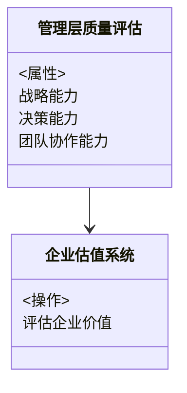

                 


# 企业估值中的管理层质量评估

**关键词**：企业估值、管理层质量评估、战略能力、决策能力、团队协作能力、企业价值分析、管理能力评估模型

**摘要**：  
在企业估值过程中，管理层的质量是影响企业价值的重要因素。本文从背景、核心概念、算法原理、系统分析、项目实战和最佳实践等多维度，详细探讨了如何评估管理层质量对企业的价值影响。通过分析管理层的战略能力、决策能力和团队协作能力，构建了一个综合的评估模型，并结合实际案例，提出了具体的实现方案和优化建议。

---

## 第一部分：企业估值与管理层质量评估的背景介绍

### 第1章：企业估值的现状与挑战

#### 1.1 企业估值的核心概念

##### 1.1.1 企业估值的定义与范围
企业估值是通过对企业的财务状况、市场地位、运营能力等多方面进行分析，确定企业价值的过程。企业价值通常包括资产价值、未来现金流的现值以及其他无形资产的价值。

##### 1.1.2 管理层质量评估的重要性
管理层的质量直接影响企业的战略制定、执行效率和风险控制能力。高质量的管理层能够更好地把握市场机会，优化资源配置，从而提升企业价值。

##### 1.1.3 管理层质量与企业价值的关系
管理层的质量是企业价值的核心驱动因素之一。高质量的管理层能够通过有效的战略规划和执行力，为企业创造更大的价值。

#### 1.2 当前企业估值中的问题

##### 1.2.1 传统估值方法的局限性
传统的估值方法（如DCF模型、市盈率法等）主要关注财务数据，忽略了管理层的质量对企业价值的影响。

##### 1.2.2 管理层质量评估的缺失
在企业估值中，管理层的质量通常被忽视或简化处理，导致估值结果不够准确。

##### 1.2.3 管理层质量对企业风险的影响
管理层的质量直接影响企业的风险控制能力，进而影响企业的稳定性和长期发展。

#### 1.3 管理层质量评估的必要性

##### 1.3.1 提高估值准确性
通过评估管理层的质量，可以更全面地分析企业的潜在价值。

##### 1.3.2 优化投资决策
管理层质量评估能够帮助投资者更好地识别优质企业，优化投资决策。

##### 1.3.3 促进企业治理
通过评估管理层的质量，可以发现企业治理中的问题，提出改进建议。

---

## 第2章：管理层质量评估的背景与意义

### 2.1 管理层质量评估的背景

#### 2.1.1 管理层质量评估的演进历程
从早期的财务驱动型评估到现在的综合评估，管理层质量评估逐渐成为企业估值的重要组成部分。

#### 2.1.2 管理层质量评估的理论基础
基于管理学、金融学和行为科学的理论，构建了管理层质量评估的框架。

### 2.2 管理层质量评估的核心要素

#### 2.2.1 管理层的战略能力
战略能力包括战略规划的清晰度、执行能力和应对变化的能力。

#### 2.2.2 管理层的决策能力
决策能力包括决策的科学性、速度和风险控制能力。

#### 2.2.3 管理层的团队协作能力
团队协作能力包括团队的凝聚力、沟通效率和问题解决能力。

---

## 第三部分：管理层质量评估的核心概念与联系

### 第3章：管理层质量评估的核心维度

#### 3.1 管理层的战略能力

##### 3.1.1 战略规划的定义与特点
战略规划是企业未来发展的重要蓝图，包括目标设定、路径选择和资源配置。

##### 3.1.2 战略能力的评估指标
包括战略清晰度、战略执行能力和战略调整能力。

#### 3.2 管理层的决策能力

##### 3.2.1 决策能力的定义与特点
决策能力是指管理层在复杂环境中做出正确决策的能力。

##### 3.2.2 决策能力的评估方法
包括决策的及时性、准确性和风险控制能力。

#### 3.3 管理层的团队协作能力

##### 3.3.1 团队协作的定义与特点
团队协作是指管理层内部成员之间的合作与协调能力。

##### 3.3.2 团队协作能力的评估指标
包括团队凝聚力、沟通效率和问题解决能力。

### 第4章：核心概念的对比分析与ER图架构

#### 4.1 核心概念的对比分析

##### 4.1.1 战略能力与决策能力的对比
| 属性 | 战略能力 | 决策能力 |
|------|----------|----------|
| 聚焦 | 长期目标 | 短期问题 |
| 主体 | 高层管理者 | 各级管理者 |

##### 4.1.2 决策能力与团队协作能力的对比
| 属性 | 决策能力 | 团队协作能力 |
|------|----------|--------------|
| 核心 | 个体决策 | 团队合作 |
| 影响 | 决策质量 | 决策效率 |

#### 4.2 ER图架构

```mermaid
erDiagram
    customer[管理层] {
        <属性>
        id : integer
        战略能力 : integer
        决策能力 : integer
        团队协作能力 : integer
    }
    管理层 --> 战略能力
    管理层 --> 决策能力
    管理层 --> 团队协作能力
```

---

## 第四部分：算法原理讲解

### 第5章：管理层质量评估模型的构建

#### 5.1 算法概述

##### 5.1.1 算法流程
1. 数据采集：收集企业的财务数据和管理层的相关信息。
2. 特征提取：提取影响企业价值的关键特征。
3. 模型训练：基于机器学习算法训练评估模型。

#### 5.2 算法实现

##### 5.2.1 数据预处理
```python
import pandas as pd

data = pd.read_csv('enterprise.csv')
data = data.dropna()
```

##### 5.2.2 特征提取
```python
from sklearn.preprocessing import StandardScaler

scaler = StandardScaler()
scaled_features = scaler.fit_transform(data[['revenue', 'net_profit', 'market_share']])
```

##### 5.2.3 模型训练
```python
from sklearn.linear_model import LinearRegression

model = LinearRegression()
model.fit(scaled_features, data['enterprise_value'])
```

#### 5.3 数学模型

##### 5.3.1 线性回归模型
$$ enterprise\_value = \beta_0 + \beta_1 \times revenue + \beta_2 \times net\_profit + \beta_3 \times market\_share $$

---

## 第五部分：系统分析与架构设计

### 第6章：系统架构设计

#### 6.1 项目介绍

##### 6.1.1 项目目标
构建一个基于管理层质量评估的企业估值系统。

#### 6.2 系统功能设计

##### 6.2.1 领域模型


#### 6.3 系统架构设计

##### 6.3.1 系统架构图


---

## 第六部分：项目实战

### 第7章：项目实战

#### 7.1 环境安装

##### 7.1.1 安装Python和相关库
```bash
pip install numpy pandas scikit-learn
```

#### 7.2 核心代码实现

##### 7.2.1 代码实现
```python
import numpy as np
import pandas as pd
from sklearn.linear_model import LinearRegression
from sklearn.metrics import mean_squared_error

data = pd.read_csv('enterprise.csv')
X = data[['revenue', 'net_profit', 'market_share']]
y = data['enterprise_value']

model = LinearRegression()
model.fit(X, y)

预测值 = model.predict(X)
mse = mean_squared_error(y, 预测值)
print(f"均方误差：{mse}")
```

#### 7.3 代码解读与分析

##### 7.3.1 代码解读
- 数据加载：读取企业数据。
- 特征提取：选择关键特征。
- 模型训练：训练线性回归模型。
- 预测与评估：计算均方误差。

#### 7.4 案例分析

##### 7.4.1 案例分析
通过具体案例，分析模型的预测结果，并与实际企业价值进行对比。

---

## 第七部分：最佳实践

### 第8章：最佳实践

#### 8.1 总结与反思

##### 8.1.1 项目总结
总结项目的主要成果和经验。

##### 8.1.2 可能的改进
提出模型优化的方向和建议。

#### 8.2 小结

##### 8.2.1 注意事项
- 数据质量的重要性。
- 模型选择的合理性。
- 结果解释的准确性。

#### 8.3 拓展阅读

##### 8.3.1 推荐书籍
- 《企业估值分析》
- 《管理层能力评估》

---

## 第八部分：附录

### 8.1 附录

#### 8.1.1 附录内容
- 数据集描述
- 代码实现细节
- 模型评估报告

---

**小结**：  
通过本文的详细分析，我们探讨了管理层质量评估在企业估值中的重要性，并通过理论分析、算法实现和项目实战，构建了一个完整的评估体系。未来的研究可以进一步优化模型，探索更多影响企业价值的因素。

