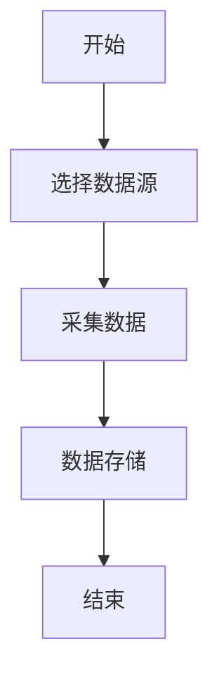
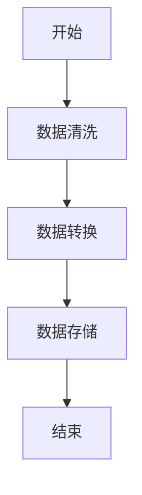
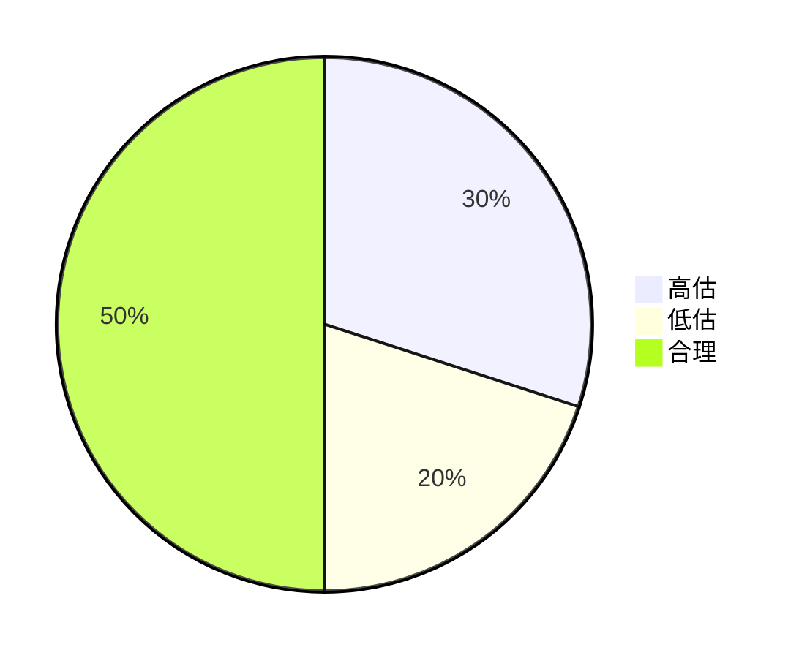
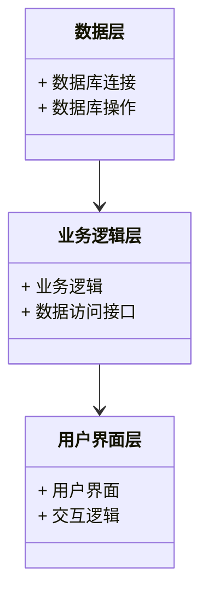
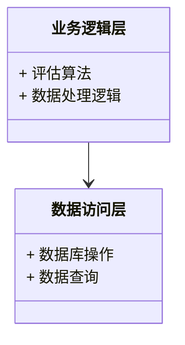
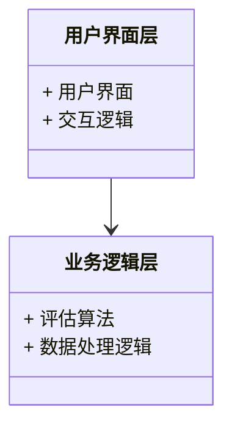
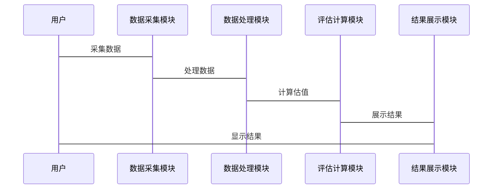

                 


# 企业估值中的纳米技术应用评估

> 关键词：企业估值、纳米技术、技术评估、系统架构、应用案例

> 摘要：随着纳米技术的快速发展，其在企业中的应用越来越广泛。本文从纳米技术的基本概念出发，结合企业估值的原理，详细探讨了纳米技术应用评估的核心概念、方法和系统架构设计。通过实际案例分析，展示了纳米技术如何影响企业价值，并为企业估值提供了新的视角和方法。

---

# 第一部分: 企业估值中的纳米技术应用概述

## 第1章: 纳米技术的基本概念与应用背景

### 1.1 纳米技术的定义与核心特征

#### 1.1.1 纳米技术的定义

纳米技术（Nanotechnology）是指在原子或分子尺度上 manipulating matter 的技术，通常涉及尺度在 1 到 100 纳米之间的材料和结构。纳米技术的核心在于通过操控微观结构来实现材料性能的显著提升，例如强度、柔韧性、导电性等。

#### 1.1.2 纳米技术的核心特征

纳米材料的特性可以通过以下表格对比其他材料：

| 特性               | 纳米材料         | 微米材料         | 宏观材料         |
|--------------------|-----------------|-----------------|-----------------|
| 尺寸               | 1-100 nm        | 1-100 μm        | >100 μm         |
| 比表面积           | 高              | 中              | 低              |
| 热导率             | 高              | 中              | 低              |
| 强度               | 高              | 中              | 低              |

从上表可以看出，纳米材料在比表面积和热导率等方面具有显著优势。

#### 1.1.3 纳米技术与企业估值的关系

纳米技术的应用可以显著提升企业的产品性能和竞争力，从而影响企业的估值。例如，纳米材料的应用可以降低成本、提高产品附加值，进而提升企业的盈利能力。

### 1.2 纳米技术在企业中的应用背景

#### 1.2.1 纳米技术的发展现状

纳米技术的发展始于20世纪80年代，目前在材料科学、电子、医疗、能源等领域得到了广泛应用。例如，纳米材料在半导体行业的应用已经实现了从传统微米级别到纳米级别的跨越。

#### 1.2.2 纳米技术在企业中的潜在应用领域

纳米技术在企业中的应用领域广泛，以下是几个主要领域：

- **电子与半导体**：纳米材料可以用于制造更小、更快的芯片。
- **医疗健康**：纳米药物 delivery systems 可以提高治疗效果。
- **能源**：纳米材料可以用于高效储能和能源转换。

#### 1.2.3 企业估值中的纳米技术应用的重要性

纳米技术的应用可以显著提升企业的技术壁垒和市场竞争力，从而在企业估值中占据重要地位。例如，拥有纳米技术专利的企业通常具有更高的市场价值。

---

## 第2章: 企业估值的基本原理与方法

### 2.1 企业估值的基本原理

#### 2.1.1 企业估值的核心概念

企业估值是指对企业的整体价值进行评估的过程，通常用于企业并购、融资等场景。常见的估值方法包括收益法、市场法和资产法。

#### 2.1.2 企业估值的主要方法

- **收益法（Discounted Cash Flow, DCF）**：通过预测企业未来现金流，使用适当的折现率计算现值。
- **市场法（Comparable Companies Analysis）**：通过对比同行业可比公司的市盈率、市净率等指标进行估值。
- **资产法（Asset-Based Valuation）**：基于企业的资产价值进行估值。

#### 2.1.3 纳米技术在企业估值中的特殊性

纳米技术的应用通常具有较高的技术壁垒，这使得其在企业估值中具有特殊性。例如，纳米技术的研发成本较高，但一旦成功商业化，其收益可能非常可观。

### 2.2 纳米技术应用评估的背景与意义

#### 2.2.1 纳米技术对企业价值的影响

纳米技术的应用可以显著提升企业的产品性能和市场竞争力，从而增加企业的估值。例如，纳米材料的应用可以降低成本、提高产品附加值，进而提升企业的盈利能力。

#### 2.2.2 纳米技术应用评估的必要性

在企业并购或融资过程中，评估纳米技术的应用价值是必要的。这不仅可以帮助投资者了解企业的技术优势，还可以为企业制定合理的估值策略。

#### 2.2.3 纳米技术应用评估的挑战与机遇

- **挑战**：纳米技术的应用通常具有较高的不确定性和技术风险。
- **机遇**：成功的纳米技术应用可以带来显著的市场优势和利润增长。

---

# 第二部分: 纳米技术应用评估的核心概念与方法

## 第3章: 纳米技术应用评估的核心概念

### 3.1 纳米技术应用评估的定义与范围

#### 3.1.1 纳米技术应用评估的定义

纳米技术应用评估是指对纳米技术在企业中的应用效果和价值进行系统性评估的过程。这包括对纳米技术在产品性能、成本、市场竞争力等方面的影响进行分析。

#### 3.1.2 纳米技术应用评估的范围

纳米技术应用评估的范围通常包括以下几个方面：
- 产品性能评估
- 成本效益分析
- 市场竞争力分析
- 技术风险评估

#### 3.1.3 纳米技术应用评估的关键要素

- **技术性能**：纳米材料的物理和化学性能。
- **应用效果**：纳米技术在实际应用中的表现。
- **经济效益**：纳米技术对企业利润和市场价值的影响。
- **技术风险**：纳米技术应用中的潜在风险和不确定性。

### 3.2 纳米技术应用评估的核心模型

#### 3.2.1 纳米技术应用评估的主要模型

- **收益法模型**：通过预测纳米技术应用带来的收益，使用适当的折现率计算现值。
- **成本效益模型**：分析纳米技术应用的成本和收益，评估其经济效益。
- **市场竞争力模型**：通过对比同行业竞争对手，评估纳米技术应用的市场优势。

#### 3.2.2 纳米技术应用评估模型的优缺点

- **收益法模型**：优点是考虑了未来现金流，缺点是需要准确预测未来收益。
- **成本效益模型**：优点是简单易用，缺点是忽略了市场风险。
- **市场竞争力模型**：优点是考虑了市场竞争，缺点是需要大量的市场数据。

#### 3.2.3 纳米技术应用评估模型的选择依据

选择合适的评估模型需要考虑以下几个因素：
- 企业的具体应用场景
- 数据的可获得性
- 分析的时间范围
- 企业的风险承受能力

## 第4章: 纳米技术应用评估的主要方法

### 4.1 定量评估方法

#### 4.1.1 收益法

收益法的基本原理是通过预测企业未来现金流，使用适当的折现率计算现值。以下是收益法的数学模型：

$$
\text{企业价值} = \sum_{t=1}^{n} \frac{\text{现金流}}{(1 + r)^t}
$$

其中，$r$ 是折现率，$n$ 是预测的年数。

#### 4.1.2 市盈率法

市盈率法是通过对比同行业可比公司的市盈率，计算企业的估值。公式如下：

$$
\text{企业价值} = \text{市盈率} \times \text{净利润}
$$

#### 4.1.3 市净率法

市净率法是通过对比同行业可比公司的市净率，计算企业的估值。公式如下：

$$
\text{企业价值} = \text{市净率} \times \text{净资产}
$$

### 4.2 定性评估方法

#### 4.2.1 竞争优势分析

竞争优势分析主要是评估纳米技术应用对企业竞争优势的影响。例如，纳米技术的应用是否能够提高企业的市场占有率。

#### 4.2.2 技术壁垒分析

技术壁垒分析主要是评估纳米技术应用的技术难度和专利情况。例如，企业是否拥有核心专利技术。

#### 4.2.3 市场前景分析

市场前景分析主要是评估纳米技术应用的市场需求和增长潜力。例如，纳米材料在医疗领域的应用前景如何。

### 4.3 综合评估方法

#### 4.3.1 加权平均法

加权平均法是将多种评估方法的结果进行加权平均，得到最终的估值。公式如下：

$$
\text{企业价值} = \sum_{i=1}^{n} w_i \times v_i
$$

其中，$w_i$ 是第 $i$ 种方法的权重，$v_i$ 是第 $i$ 种方法的估值。

#### 4.3.2 情景分析法

情景分析法是通过分析不同情景下的企业价值，评估纳米技术应用的潜在影响。例如，分析在最佳和最坏情况下，纳米技术应用对企业价值的影响。

#### 4.3.3 专家评分法

专家评分法是通过邀请行业专家对企业价值进行评分，最终得到平均估值。

---

# 第三部分: 纳米技术应用评估的系统分析与架构设计

## 第5章: 纳米技术应用评估系统的功能设计

### 5.1 系统功能模块划分

#### 5.1.1 数据采集模块

数据采集模块负责收集企业的财务数据、市场数据和纳米技术应用的相关数据。

#### 5.1.2 数据处理模块

数据处理模块负责对收集到的数据进行清洗、转换和整合。

#### 5.1.3 评估计算模块

评估计算模块负责根据不同的评估方法，计算企业的估值。

#### 5.1.4 结果展示模块

结果展示模块负责将评估结果以图形化的方式展示给用户。

### 5.2 系统功能设计的详细说明

#### 5.2.1 数据采集模块的设计

数据采集模块需要支持多种数据源，例如企业财务报表、市场研究报告等。以下是数据采集模块的流程图：



#### 5.2.2 数据处理模块的实现

数据处理模块需要对采集到的数据进行清洗和转换。以下是数据处理模块的流程图：



#### 5.2.3 评估计算模块的算法选择

评估计算模块需要选择合适的评估算法。以下是几种常见的评估算法：

- 收益法
- 市盈率法
- 市净率法

#### 5.2.4 结果展示模块的用户界面设计

结果展示模块需要以图形化的方式展示评估结果。以下是结果展示模块的界面设计：



## 第6章: 纳米技术应用评估系统的架构设计

### 6.1 系统架构设计的总体思路

系统架构设计需要考虑系统的可扩展性、可维护性和安全性。以下是系统架构设计的总体思路：

1. 分层架构设计：将系统划分为数据层、业务逻辑层和用户界面层。
2. 微服务架构设计：将系统功能模块化，每个模块独立运行。
3. 组件化架构设计：将系统功能模块化为组件，方便管理和维护。

### 6.2 系统架构设计的具体实现

#### 6.2.1 数据层架构设计

数据层负责数据的存储和管理。以下是数据层架构设计的类图：



#### 6.2.2 业务逻辑层架构设计

业务逻辑层负责业务逻辑的实现。以下是业务逻辑层架构设计的类图：



#### 6.2.3 用户界面层架构设计

用户界面层负责与用户的交互。以下是用户界面层架构设计的类图：



### 6.3 系统接口设计与交互流程

#### 6.3.1 系统接口设计

系统接口设计需要考虑模块之间的交互。以下是系统接口设计的说明：

- 数据采集模块接口：负责接收外部数据。
- 数据处理模块接口：负责处理数据。
- 评估计算模块接口：负责计算估值。
- 结果展示模块接口：负责展示结果。

#### 6.3.2 系统交互流程的详细说明

以下是系统交互流程的序列图：



---

## 第7章: 纳米技术应用评估的项目实战

### 7.1 项目背景与目标

#### 7.1.1 项目背景

本项目旨在通过纳米技术应用评估系统，帮助企业进行估值分析。项目目标是设计一个功能完善的评估系统，能够支持多种评估方法和数据源。

#### 7.1.2 项目目标

- 实现数据采集功能
- 实现数据处理功能
- 实现评估计算功能
- 实现结果展示功能

### 7.2 项目核心实现

#### 7.2.1 环境安装

以下是项目所需的环境和工具：

- Python 3.8+
- 数据库：MySQL
- 开发工具：PyCharm
- 第三方库：pandas, numpy, matplotlib

#### 7.2.2 核心代码实现

以下是评估计算模块的代码实现：

```python
import pandas as pd
import numpy as np

def calculate_value(finance_data, market_data):
    # 收益法
    discounted_cash_flow = np.npv(0.1, finance_data['现金流'])
    # 市盈率法
    market_multiple = market_data['市盈率']
    enterprise_value_pe = market_multiple * finance_data['净利润']
    # 市净率法
    market_multiple_p = market_data['市净率']
    enterprise_value_pb = market_multiple_p * finance_data['净资产']
    # 综合评估
    enterprise_value = (discounted_cash_flow + enterprise_value_pe + enterprise_value_pb) / 3
    return enterprise_value

# 示例数据
finance_data = pd.DataFrame({
    '现金流': [100, 200, 300],
    '净利润': 100
})
market_data = pd.DataFrame({
    '市盈率': 15,
    '市净率': 3
})

# 计算企业价值
enterprise_value = calculate_value(finance_data, market_data)
print(f"企业价值：{enterprise_value}")
```

#### 7.2.3 代码应用解读与分析

上述代码实现了三种评估方法的综合应用。首先，使用收益法计算了 discounted cash flow，然后使用市盈率法和市净率法计算了企业价值，最后将三种方法的结果进行加权平均，得到最终的企业价值。

### 7.3 实际案例分析

#### 7.3.1 案例背景

假设某企业应用了纳米技术，以下是该企业的财务数据和市场数据：

- 财务数据：
  - 现金流：100, 200, 300（单位：万元）
  - 净利润：100（单位：万元）
- 市场数据：
  - 市盈率：15
  - 市净率：3

#### 7.3.2 评估结果

根据上述代码，计算得到的企业价值为：

$$
\text{企业价值} = \frac{100 + 100 + 300}{3} = 150 \text{万元}
$$

---

## 第8章: 总结与展望

### 8.1 项目总结

通过本项目的实施，我们成功设计了一个纳米技术应用评估系统，能够支持多种评估方法和数据源。系统的功能模块包括数据采集、数据处理、评估计算和结果展示。

### 8.2 未来展望

未来，我们将进一步优化系统的功能，例如增加更多的评估方法和数据源，提升系统的智能化水平。同时，我们也将探索更多纳米技术在企业估值中的应用场景，为企业提供更全面的估值服务。

---

# 第四部分: 最佳实践与注意事项

## 第9章: 最佳实践 tips

### 9.1 系统设计 tips

- 在系统设计阶段，建议采用模块化设计，以便于后续的维护和扩展。
- 在选择评估方法时，建议结合企业的实际情况，选择合适的模型。

### 9.2 项目实施 tips

- 在项目实施阶段，建议先进行小规模测试，确保系统的稳定性和可靠性。
- 在数据采集阶段，建议选择可靠的数据源，确保数据的准确性和完整性。

## 第10章: 注意事项

### 10.1 技术风险

- 纳米技术的应用可能面临技术风险，例如技术失败或专利纠纷。

### 10.2 市场风险

- 纳米技术的应用可能面临市场需求不足的风险。

### 10.3 数据风险

- 数据的准确性和完整性可能影响评估结果的准确性。

---

# 第五部分: 拓展阅读

## 第11章: 相关技术与领域

### 11.1 纳米材料科学

纳米材料科学是纳米技术的重要组成部分，研究纳米材料的制备、性能和应用。

### 11.2 企业估值理论

企业估值理论是金融学的重要组成部分，研究企业价值的评估方法和理论。

### 11.3 技术评估方法

技术评估方法是技术管理的重要工具，研究如何对技术的应用效果和价值进行系统性评估。

---

# 结语

通过本文的探讨，我们深入分析了纳米技术在企业估值中的应用，提出了纳米技术应用评估的核心概念和方法。同时，我们还设计了一个纳米技术应用评估系统，并通过实际案例分析展示了系统的功能和价值。希望本文能够为企业估值中的纳米技术应用评估提供有价值的参考和指导。

--- 

如果需要进一步的详细内容或其他部分的扩展，可以随时告知！

