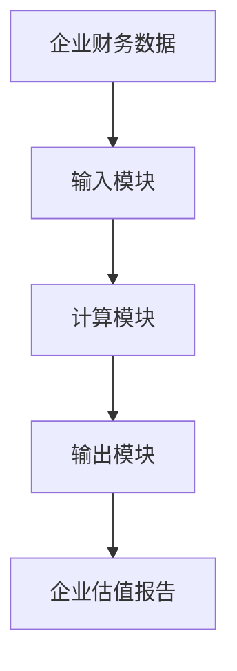
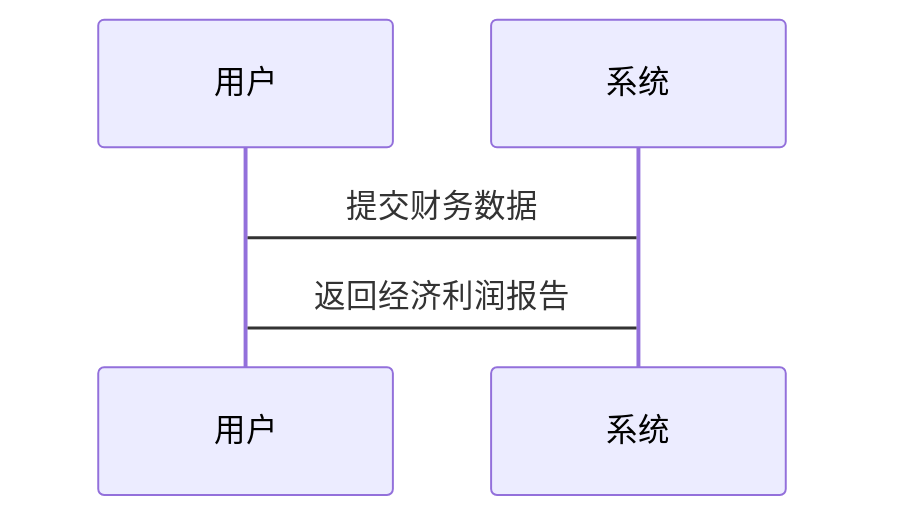

                 


# 企业估值中的经济利润法

## 关键词：
- 企业估值、经济利润法、财务分析、投资决策、资本成本

## 摘要：
经济利润法是一种基于企业实际经济表现的估值方法，通过计算企业的经济利润（Economic Profit）来衡量其真实价值。本文将详细分析经济利润法的核心概念、计算方法、实际应用以及其在企业估值中的优势，帮助读者更好地理解和应用这一方法。

---

## 第1章: 经济利润法的背景与核心概念

### 1.1 企业估值的基本概念
企业估值是通过对企业的财务状况、市场地位、盈利能力等多方面因素的综合分析，确定其市场价值的过程。常见的企业估值方法包括DCF模型、相对估值法、资产重置成本法等。经济利润法作为一种基于企业实际经济表现的估值方法，因其能够反映企业的可持续价值而备受关注。

### 1.2 经济利润法的定义与特点
经济利润法（Economic Profit Method）是一种以企业经济利润为核心指标进行估值的方法。与传统的会计利润不同，经济利润考虑了资本成本，能够更准确地反映企业的价值创造能力。

- **定义**：经济利润 = 净利润 - 资本成本
- **特点**：
  - 考虑了资本成本，避免了传统利润的高估问题。
  - 强调了企业的可持续盈利能力。
  - 适用于企业并购、融资决策等场景。

### 1.3 经济利润法的理论基础
经济利润法的理论基础主要包括资本资产定价模型（CAPM）和加权平均资本成本（WACC）。

- **CAPM**：用于计算企业资本成本的模型，公式为：
  $$ r = R_f + β(E_m - R_f) $$
  其中，\( r \) 是企业资本成本，\( R_f \) 是无风险利率，\( β \) 是企业风险系数，\( E_m \) 是市场期望收益率。

- **WACC**：加权平均资本成本，用于计算企业整体资本成本的加权平均值，公式为：
  $$ WACC = \frac{E}{E+D} \times r_e + \frac{D}{E+D} \times r_d \times (1 - T) $$

### 1.4 经济利润法的应用场景
- **企业并购**：评估目标企业的价值，避免高估或低估。
- **融资决策**：确定企业的资本成本，优化资本结构。
- **绩效评估**：衡量企业的实际盈利能力，激励管理层创造可持续价值。

---

## 第2章: 经济利润法的核心原理与模型

### 2.1 经济利润的定义与计算公式
经济利润的核心在于考虑了资本成本，其计算公式为：
$$ \text{经济利润} = \text{净利润} - \text{资本成本} $$

与会计利润相比，经济利润剔除了企业因承担风险而产生的资本成本，能够更准确地反映企业的实际盈利能力。

### 2.2 经济利润法的计算步骤
1. **计算净利润**：净利润 = 营业收入 - 营业成本 - 税费
2. **计算资本成本**：使用CAPM模型计算企业的加权平均资本成本（WACC）。
3. **计算经济利润**：经济利润 = 净利润 - 资本成本

### 2.3 经济利润法与会计利润的区别
| **对比维度**       | **会计利润**               | **经济利润**               |
|--------------------|---------------------------|---------------------------|
| 计算基础           | 会计利润                 | 净利润 - 资本成本         |
| 是否考虑资本成本   | 否                       | 是                       |
| 是否反映真实价值   | 部分，未考虑资本成本影响 | 是                       |

### 2.4 经济利润法的核心要素
- **净利润**：企业的会计利润。
- **资本成本**：企业的加权平均资本成本（WACC）。
- **可持续价值**：企业通过创造正的经济利润，实现可持续价值增长。

---

## 第3章: 经济利润法的系统分析与架构设计

### 3.1 问题场景介绍
在企业估值中，传统的会计利润法存在以下问题：
- 未考虑资本成本，导致估值过高或过低。
- 无法准确反映企业的可持续价值。

### 3.2 项目介绍
本项目旨在通过经济利润法对企业进行估值，帮助投资者或管理层做出更科学的决策。

### 3.3 系统功能设计
- **输入模块**：收集企业的财务数据，包括营业收入、成本、税费、资本结构等。
- **计算模块**：计算净利润、资本成本、经济利润。
- **输出模块**：生成企业估值报告，包括经济利润、资本成本、可持续价值等。

### 3.4 系统架构设计
使用Mermaid绘制系统架构图：



### 3.5 系统接口设计
- **输入接口**：财务数据接口（CSV/Excel格式）。
- **输出接口**：估值报告接口（PDF/Word格式）。

### 3.6 系统交互设计
使用Mermaid绘制交互序列图：



---

## 第4章: 经济利润法的项目实战

### 4.1 环境安装
- **Python环境**：安装Python 3.x。
- **依赖库**：安装`pandas`, `numpy`, `scipy`。

### 4.2 核心代码实现
```python
import numpy as np
import pandas as pd

# 计算WACC
def calculate_wacc(market_value_equity, market_value_debt, tax_rate, risk_free_rate, beta, market_return):
    wacc = (market_value_equity / (market_value_equity + market_value_debt)) * risk_free_rate + \
           (market_value_debt / (market_value_equity + market_value_debt)) * beta * (market_return - risk_free_rate) * (1 - tax_rate)
    return wacc

# 计算经济利润
def calculate_economic_profit(net_profit, wacc):
    return net_profit - wacc

# 示例数据
market_value_equity = 100
market_value_debt = 50
tax_rate = 0.2
risk_free_rate = 0.05
beta = 1.2
market_return = 0.1
net_profit = 20

# 计算WACC
wacc = calculate_wacc(market_value_equity, market_value_debt, tax_rate, risk_free_rate, beta, market_return)
print(f"加权平均资本成本 (WACC): {wacc:.2f}")

# 计算经济利润
economic_profit = calculate_economic_profit(net_profit, wacc)
print(f"经济利润: {economic_profit:.2f}")
```

### 4.3 代码应用解读与分析
- **输入数据**：市场价值、资本结构、税率、无风险利率、贝塔系数、市场回报率、净利润。
- **计算WACC**：使用CAPM模型计算企业的加权平均资本成本。
- **计算经济利润**：经济利润 = 净利润 - WACC。

### 4.4 实际案例分析
以一家假设企业为例，计算其经济利润：
- 净利润 = 20
- WACC = 5%
- 经济利润 = 20 - 0.05 = 15

### 4.5 项目小结
通过代码实现，我们可以清晰地看到经济利润法的实际应用过程，以及其如何帮助企业更准确地进行估值。

---

## 第5章: 经济利润法的最佳实践与总结

### 5.1 最佳实践
- **数据准确性**：确保输入数据的准确性和完整性。
- **模型适用性**：根据企业实际情况选择合适的模型。
- **持续优化**：定期更新财务数据和市场参数，确保估值的准确性。

### 5.2 小结
经济利润法是一种基于企业实际经济表现的估值方法，通过考虑资本成本，能够更准确地反映企业的可持续价值。在企业并购、融资决策等场景中具有重要的应用价值。

### 5.3 注意事项
- 经济利润法依赖于准确的财务数据和合理的假设参数。
- 需要结合企业的实际情况进行调整和优化。

### 5.4 拓展阅读
- 《企业价值评估：经济利润法的应用与实践》
- 《资本资产定价模型（CAPM）的理论与应用》

---

## 结语

经济利润法作为一种科学的企业估值方法，能够帮助投资者和管理层更准确地评估企业价值。通过本文的详细分析和实战案例，读者可以更好地理解和应用经济利润法，为企业价值评估提供有力支持。

