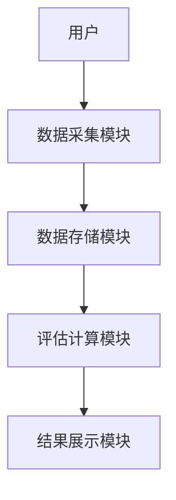

                 


```markdown
# 企业估值中的网络安全能力评估

> 关键词：企业估值、网络安全、能力评估、量化方法、系统架构、数学模型

> 摘要：本文探讨了如何将网络安全能力纳入企业估值体系，通过构建评估模型、量化方法、系统设计和实战案例，展示了如何利用网络安全能力提升企业价值。

---

## 第1章 网络安全能力评估概述

### 1.1 问题背景与定义
#### 1.1.1 问题背景
随着数字化转型的推进，网络安全威胁对企业价值的影响日益显著。传统的估值方法忽视了这一关键因素，导致企业面临潜在风险。

#### 1.1.2 核心概念
网络安全能力评估是指通过量化安全措施的有效性，评估其对企业整体价值的影响。这包括技术能力、管理能力和应对策略等方面。

#### 1.1.3 与其他概念的对比
通过表格对比安全能力评估与其他风险管理方法的异同，明确其独特价值。

### 1.2 网络安全能力评估的关键要素
- **技术能力**：包括防火墙、入侵检测系统等技术的部署情况。
- **管理能力**：如安全政策的制定与执行。
- **应对策略**：企业在安全事件中的响应速度和恢复能力。

---

## 第2章 网络安全能力评估模型

### 2.1 模型构建
#### 2.1.1 数据来源
- 内部日志数据
- 第三方安全评估报告
- 市场公开的安全事件数据

#### 2.1.2 数据预处理
- 清洗无效数据
- 标准化处理
- 特征提取

### 2.2 评估指标
#### 2.2.1 指标体系
- 技术投入
- 安全事件响应时间
- 历史损失数据

#### 2.2.2 权重确定
使用层次分析法确定各指标权重，构建评估模型。

### 2.3 模型验证
通过历史数据验证模型的准确性，并进行优化。

---

## 第3章 安全能力对企业价值的影响

### 3.1 影响因素分析
- 安全能力直接影响企业的声誉和市场信任度。
- 有效的安全措施可降低法律风险和财务损失。

### 3.2 量化方法
#### 3.2.1 数学模型
$$ 企业价值 = 基础价值 + 网络安全能力 \times 影响系数 $$

#### 3.2.2 实现步骤
1. 数据收集与清洗
2. 计算各指标得分
3. 综合评估企业价值

---

## 第4章 系统架构与实现

### 4.1 系统设计
#### 4.1.1 功能模块
- 数据采集模块
- 评估计算模块
- 结果展示模块

#### 4.1.2 架构图


### 4.2 接口设计
- 数据接口：与安全设备集成
- 用户接口：友好的可视化界面

---

## 第5章 项目实战

### 5.1 实战环境搭建
- 安装所需软件和库
- 数据采集工具配置

### 5.2 模型训练
```python
# 示例代码
import pandas as pd
from sklearn.metrics import accuracy_score

data = pd.read_csv('security.csv')
X = data.drop('value', axis=1)
y = data['value']

# 模型训练
model.fit(X, y)

# 预测
y_pred = model.predict(X)
print("准确率:", accuracy_score(y, y_pred))
```

### 5.3 结果分析
通过实际案例分析，验证模型的有效性，并提出改进建议。

---

## 第6章 总结与展望

### 6.1 总结
网络安全能力评估是企业估值的重要组成部分，其量化方法和系统实现为企业提供了新的视角。

### 6.2 展望
未来研究可关注动态评估模型和实时监控系统，进一步提升评估的准确性和及时性。

---

通过本文的系统分析和详细讲解，读者能够理解并应用网络安全能力评估的方法，为企业的估值提供有力支持。
```

