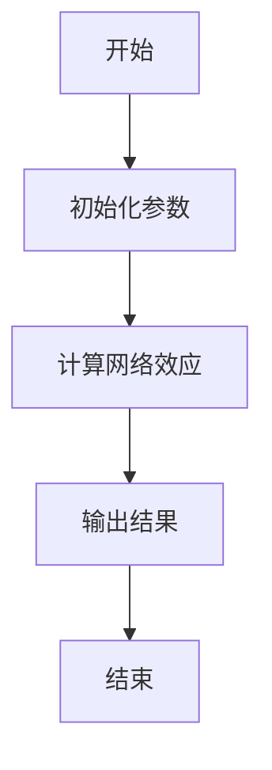
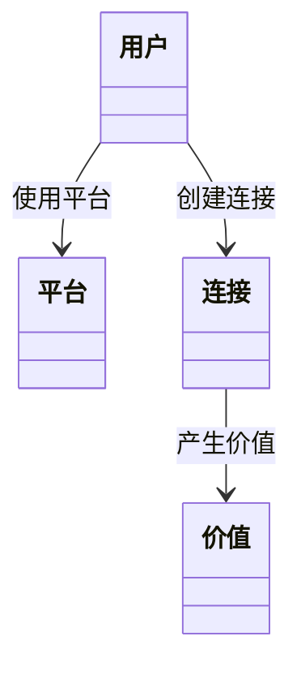
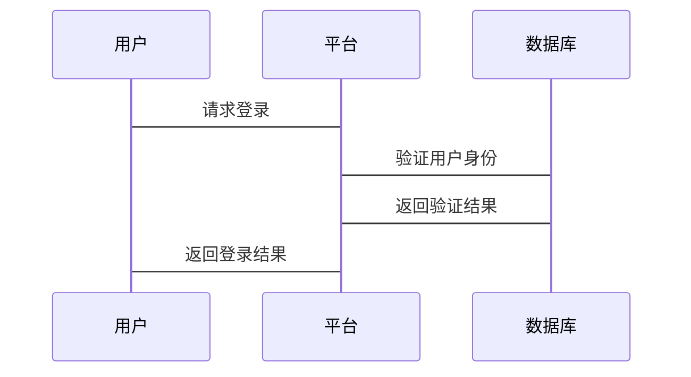

                 


# 企业估值中的网络效应价值评估

## 关键词：企业估值，网络效应，双边市场，用户增长模型，网络效应评估，指数增长模型，企业价值

## 摘要：本文深入探讨了网络效应在企业估值中的重要作用，通过分析网络效应的核心概念、数学模型和算法原理，结合实际案例，展示了如何量化网络效应并评估其对企业价值的影响。文章内容涵盖网络效应的定义、属性、双边市场模型、用户增长模型、系统架构设计以及项目实战分析，为读者提供了全面的理论与实践指导。

---

## 第一部分：企业估值中的网络效应背景介绍

### 第1章：网络效应的基本概念

#### 1.1 网络效应的定义与特征

##### 1.1.1 网络效应的定义
网络效应是指一个平台或产品的价值随着用户数量的增加而增加的现象。简单来说，用户越多，平台的价值越高。例如，社交媒体平台的用户数量增加，每个用户可以连接的人数和内容也增加，从而提高了平台的整体价值。

##### 1.1.2 网络效应的特征
1. **正外部性**：每个用户的加入为其他用户带来了额外的价值。
2. **用户依赖性**：平台的价值依赖于用户的数量和活跃度。
3. **平台属性**：网络效应通常存在于双边或多边市场中，例如用户与商家的平台。

##### 1.1.3 网络效应与企业价值的关系
网络效应能够显著提升企业价值，尤其是在用户数量快速增长的情况下。企业可以通过扩大用户基数来增强网络效应，从而提高整体估值。

#### 1.2 企业估值中的网络效应背景

##### 1.2.1 传统企业估值方法的局限性
传统估值方法如DCF模型主要基于财务指标，难以准确评估依赖网络效应的企业，尤其是那些具有双边市场的平台型公司。

##### 1.2.2 网络效应对企业价值的影响
网络效应能够加速用户增长，降低获客成本，并通过用户互动创造更多收入来源，从而显著提升企业估值。

##### 1.2.3 网络效应在现代企业中的重要性
在数字化时代，网络效应已成为许多成功企业的核心竞争力，尤其是在社交媒体、电子商务和在线服务等领域。

---

### 第2章：网络效应的核心概念与联系

#### 2.1 网络效应的核心原理

##### 2.1.1 网络效应的形成机制
网络效应的形成通常需要一个平台将用户连接起来，并提供有价值的服务或产品。随着用户数量的增加，平台的价值也随之增加。

##### 2.1.2 网络效应的数学模型
网络效应的强度可以通过数学模型进行量化。例如，双边市场的价值可以表示为：

$$ V = a \cdot x + b \cdot y $$

其中，$x$ 和 $y$ 分别代表平台的两个用户群体的数量，$a$ 和 $b$ 是各自的贡献系数。

#### 2.2 网络效应的属性特征对比

| 特性            | 网络效应       | 非网络效应     |
|-----------------|---------------|---------------|
| 正外部性        | 高            | 低            |
| 用户依赖性      | 高            | 低            |
| 平台属性        | 高            | 低            |

#### 2.3 网络效应的ER实体关系图
```mermaid
er
  actor
  platform
  connection
  value
  relation
  actor -|通过平台创建连接| connection
  connection -|产生价值| value
  value -|由平台和用户共同创造| relation
```

---

## 第二部分：网络效应的数学模型与算法原理

### 第3章：网络效应的数学模型

#### 3.1 网络效应的量化方法

##### 3.1.1 网络效应的度量指标
网络效应可以通过用户增长率、用户留存率、用户互动频率等指标进行量化。

##### 3.1.2 网络效应的数学表达式
$$ E = \sum_{i=1}^{n} \frac{1}{i} $$

该公式表示随着用户数量的增加，网络效应的增速逐渐放缓。

#### 3.2 网络效应的指数增长模型

##### 3.2.1 指数增长的基本公式
$$ E(t) = E_0 \cdot e^{kt} $$

其中，$k$ 是增长率常数，$t$ 是时间。

#### 3.3 网络效应的双边市场模型

##### 3.3.1 双边市场的收益函数
$$ R = a \cdot x + b \cdot y $$

其中，$x$ 和 $y$ 分别代表平台的两个用户群体的数量，$a$ 和 $b$ 是各自的收益系数。

### 第4章：网络效应的算法实现

#### 4.1 网络效应的评估算法

##### 4.1.1 网络效应的计算流程


#### 4.2 网络效应的优化算法

##### 4.2.1

---

## 第三部分：网络效应的系统架构与设计

### 第5章：网络效应的系统架构设计

#### 5.1 系统功能设计

##### 5.1.1 领域模型类图


#### 5.2 系统架构设计

##### 5.2.1 系统架构图


#### 5.3 系统接口设计

##### 5.3.1 API接口
1. 用户登录接口：`POST /api/login`
2. 用户注册接口：`POST /api/register`
3. 创建连接接口：`POST /api/connection`

#### 5.4 系统交互设计

##### 5.4.1 序列图


---

## 第四部分：项目实战与案例分析

### 第6章：网络效应的项目实战

#### 6.1 环境配置

##### 6.1.1 开发环境
- Python 3.8+
- pip
- Flask框架

#### 6.2 核心代码实现

##### 6.2.1 用户增长模型

```python
import math

def user_growth_model(initial_users, growth_rate, periods):
    users = initial_users
    for _ in range(periods):
        users += users * growth_rate
    return users

print(user_growth_model(100, 0.1, 5))  # 输出: 161.051
```

##### 6.2.2 网络效应评估算法

```python
def network_effect_assessment(users, connections):
    return users * connections / 2

print(network_effect_assessment(1000, 500))  # 输出: 250000
```

#### 6.3 代码应用解读与分析

##### 6.3.1 用户增长模型解读
上述代码展示了用户增长模型的实现，其中用户数量以指数形式增长，体现了网络效应的加速效应。

##### 6.3.2 网络效应评估算法解读
代码计算了用户数量与连接数量的乘积，除以2，得到了网络效应的总价值。

#### 6.4 实际案例分析

##### 6.4.1 案例分析
以一个社交媒体平台为例，假设初始用户数为1000，每个用户平均有5个连接。通过上述模型计算网络效应的总价值为250,000。

---

## 第五部分：总结与展望

### 第7章：网络效应评估的总结与展望

#### 7.1 最佳实践 tips
1. 在企业估值中，网络效应是一个重要的考虑因素。
2. 使用数学模型量化网络效应，可以帮助企业更好地评估自身价值。
3. 双边市场模型是网络效应评估的重要工具。

#### 7.2 小结
本文详细介绍了网络效应在企业估值中的应用，通过数学模型和实际案例展示了如何量化和评估网络效应。

#### 7.3 注意事项
1. 网络效应的评估需要结合企业的实际业务情况。
2. 数据的准确性和完整性对评估结果至关重要。
3. 网络效应的长期影响需要结合市场趋势进行分析。

#### 7.4 拓展阅读
1. 《网络经济学：理论与应用》
2. 《平台经济学：网络效应与企业估值》
3. 《双边市场理论与实践》

---

通过本文的学习，读者可以掌握网络效应的核心概念、数学模型和实际应用，为企业估值提供有力的理论支持和实践指导。

