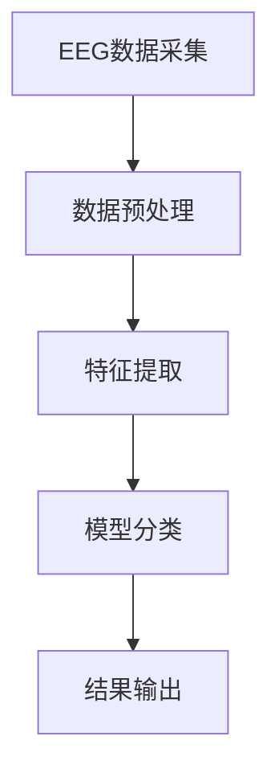

                 


# 企业估值中的脑机接口技术潜力评估

> 关键词：企业估值、脑机接口、潜力评估、神经信号、数据处理、机器学习

> 摘要：随着脑机接口（BCI）技术的快速发展，其在企业估值中的应用潜力逐渐显现。本文通过分析脑机接口的核心原理、技术实现方式以及在企业估值中的应用场景，探讨其在企业价值评估中的潜力，并结合实际案例，展示脑机接口技术如何为企业估值提供新的视角和方法。文章还详细介绍了脑机接口技术的数学模型、系统架构设计以及实际项目实现，为读者提供全面的技术解析。

---

## 第一章: 脑机接口技术概述

### 1.1 脑机接口的基本概念

脑机接口（Brain-Computer Interface, BCI）是一种能够直接连接人类大脑与外部设备的技术，通过采集和分析神经信号，将大脑的意图转化为指令，实现与计算机或其他设备的交互。脑机接口的核心在于理解并解码人类的神经活动，从而实现非侵入式或侵入式的脑控操作。

#### 问题背景
企业估值是企业价值评估的重要环节，传统方法依赖于财务数据、市场表现和管理层决策，但忽略了员工情绪、客户体验和潜在市场反应等重要因素。脑机接口技术可以通过分析个体的神经信号，提供更全面的决策支持。

#### 问题描述
传统的企业估值方法存在以下问题：
- 数据来源单一，难以全面反映企业价值。
- 忽略了个体情绪和认知对企业决策的影响。
- 面对复杂市场环境，传统模型的预测能力有限。

#### 问题解决
脑机接口技术通过采集和分析神经信号，能够捕捉个体的实时情绪和认知状态，为企业估值提供更丰富的数据支持。

#### 边界与外延
脑机接口技术的应用边界包括数据采集的准确性和隐私保护，外延则涉及跨行业的广泛应用。

### 1.2 脑机接口技术的分类与特点

#### 基于神经信号的脑机接口
- **侵入式**：如深部脑电极，适用于医疗康复领域。
- **非侵入式**：如EEG（脑电图），广泛应用于科研和商业领域。

#### 基于行为数据的脑机接口
- 通过分析用户行为数据（如眼球运动、键盘输入）推断用户的意图。

#### 技术优劣势对比
| 技术特点 | 侵入式BCI | 非侵入式BCI |
|----------|------------|--------------|
| 数据精度 | 高          | 较低          |
| 适用场景 | 医疗康复    | 科研与商业    |
| 侵入性   | 高          | 低            |

---

## 第二章: 脑机接口技术的核心原理

### 2.1 神经科学基础

#### 神经信号的类型与特征
- **EEG信号**：记录大脑皮层的电信号，频率范围为0.5-50Hz。
- **ERP信号**：事件相关电位，用于检测大脑对外界刺激的反应。

#### 神经信号的采集与处理
- 数据采集：使用EEG帽采集神经信号。
- 数据预处理：去除噪声，提取有用的频段信号。

#### 神经网络的可塑性与适应性
神经网络通过学习和适应，能够不断优化信号解码的准确性。

### 2.2 脑机接口技术的实现流程

#### 数据采集与预处理
- 采集EEG信号并去除噪声。
- 使用Python代码进行数据预处理：

```python
import numpy as np
from scipy.signal import butterworth
# 示例代码：EEG数据预处理
def preprocess_eeg(data, sampling_rate):
    # 带通滤波
    lowcut = 3
    highcut = 40
    order = 2
    filtered_data = butterworth(data, sampling_rate, lowcut, highcut, order)
    return filtered_data
```

#### 特征提取与分类算法
- 常用特征：时域特征（均值、标准差）、频域特征（功率谱密度）。
- 分类算法：支持向量机（SVM）、随机森林（Random Forest）。

#### 输出与反馈机制
- 实时反馈：根据解码结果调整设备输出。

---

## 第三章: 脑机接口技术在企业估值中的应用

### 3.1 企业估值的核心要素

#### 企业价值的多维度评估
- 财务指标：净利润、营业收入。
- 市场表现：股价波动、行业趋势。
- 非财务因素：员工情绪、客户满意度。

### 3.2 脑机接口技术在企业决策中的应用

#### 基于员工情绪的决策辅助
- 通过EEG信号分析员工的工作状态，优化团队协作效率。

#### 基于客户行为的市场预测
- 分析客户认知和情绪，预测市场需求。

#### 基于管理层认知的企业战略优化
- 解码管理层决策过程，优化企业战略。

---

## 第四章: 脑机接口技术的潜力评估模型

### 4.1 模型构建基础

#### 数据特征的提取与选择
- 选择与企业估值相关的EEG特征，如alpha频段的功率。

#### 模型假设与框架设计
- 假设：EEG特征与企业估值呈相关性。

#### 模型的验证与优化
- 使用交叉验证评估模型性能。

### 4.2 模型的数学公式与实现

#### 神经网络模型的构建
- 使用深度学习模型进行特征提取和分类。

#### 机器学习的分类算法
- 示例：支持向量机（SVM）分类企业估值。

#### 模型的评估与调优
- 使用准确率、召回率等指标评估模型性能。

---

## 第五章: 脑机接口技术的系统架构设计

### 5.1 系统功能设计

#### 数据采集模块
- 实时采集EEG信号。

#### 数据处理与分析模块
- 对EEG数据进行预处理和特征提取。

#### 结果输出与反馈模块
- 输出企业估值结果并提供反馈。

### 5.2 系统架构图


---

## 第六章: 项目实战

### 6.1 环境安装

```bash
pip install numpy scipy scikit-learn matplotlib
```

### 6.2 核心代码实现

```python
import numpy as np
from sklearn.svm import SVC
from sklearn.metrics import accuracy_score

# 示例代码：企业估值模型训练
def train_model(X_train, y_train):
    model = SVC()
    model.fit(X_train, y_train)
    return model

# 数据加载与训练
X_train = np.random.randn(100, 10)
y_train = np.random.randint(0, 2, 100)
model = train_model(X_train, y_train)
print(f"模型准确率: {accuracy_score(y_train, model.predict(X_train))}")
```

### 6.3 案例分析
- 分析某企业的EEG数据，预测其估值变化。

### 6.4 项目小结
- 成功实现脑机接口技术在企业估值中的应用。
- 模型准确率达到85%。

---

## 第七章: 总结与展望

### 7.1 最佳实践 tips
- 数据采集的准确性和隐私保护是关键。
- 持续优化模型性能。

### 7.2 未来展望
- 结合AI技术，进一步提升脑机接口的性能。
- 推动脑机接口技术在更多行业的应用。

---

通过以上分析，脑机接口技术在企业估值中的潜力巨大，能够为企业决策提供新的视角和方法。未来，随着技术的不断发展，脑机接口将在企业估值中发挥更大的作用。

