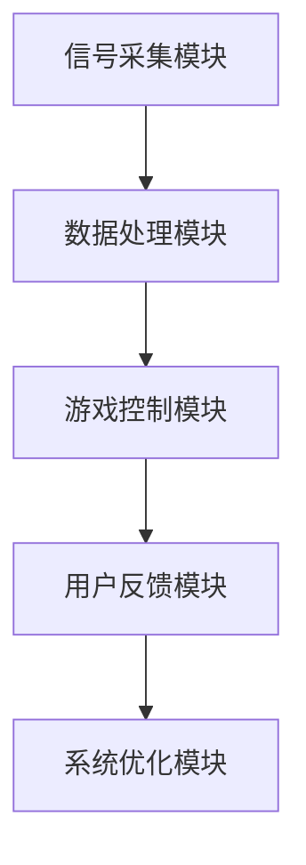

                 


# 企业估值中的脑机接口游戏应用评估

**关键词**：企业估值，脑机接口，游戏应用，技术评估，经济模型

**摘要**：本文探讨了脑机接口（BCI）技术在游戏应用中的发展及其对企业估值的影响。通过分析BCI技术的基本原理、在游戏中的应用场景、算法实现及系统架构，结合实际案例，评估其对企业价值的提升潜力，为企业在这一领域的投资决策提供参考。

---

## 第一部分：企业估值中的脑机接口游戏应用背景

### 第1章：脑机接口与游戏应用的背景介绍

#### 1.1 脑机接口技术的概述

##### 1.1.1 脑机接口的基本概念
脑机接口（Brain-Computer Interface，BCI）是一种通过采集和解析大脑神经信号，将思维活动转化为可被计算机或其他设备识别的指令的技术。BCI的核心在于捕捉、处理和应用大脑信号，实现人与机器的直接交互。

##### 1.1.2 脑机接口的发展历程
- **早期研究**：20世纪70年代，脑机接口技术开始应用于医学领域，主要用于帮助瘫痪患者恢复部分身体功能。
- **技术突破**：进入21世纪，随着神经科学和计算机技术的进步，脑机接口在游戏、教育、娱乐等领域的应用逐渐兴起。
- **当前阶段**：2010年后，脑机接口技术逐渐成熟，商业化应用开始普及，尤其在游戏领域表现突出。

##### 1.1.3 脑机接口在游戏中的应用现状
- **沉浸式体验**：通过采集玩家的脑电波信号，实时调整游戏难度或情节发展，提供高度个性化的游戏体验。
- **辅助控制**：玩家可以通过思维控制游戏角色，实现更自然的游戏操作。
- **情感反馈**：通过分析玩家的情感信号，优化游戏内容，提升玩家的参与感和满意度。

#### 1.2 游戏应用中的脑机接口技术

##### 1.2.1 游戏中的脑机接口应用场景
- **虚拟现实（VR）游戏**：通过BCI技术，玩家可以通过思维控制虚拟角色，实现更真实的沉浸式体验。
- **增强现实（AR）游戏**：利用BCI技术，增强现实环境中的交互性，提供更丰富的游戏内容。
- **多人在线游戏**：通过脑机接口技术，实现玩家间的直接交流，提升团队协作效率。

##### 1.2.2 脑机接口在游戏中的技术实现
- **信号采集**：使用 EEG（脑电图）头盔等设备采集玩家的脑电波信号。
- **数据处理**：通过算法对采集到的信号进行降噪、特征提取和分类，转化为可被计算机识别的指令。
- **指令执行**：将处理后的指令发送至游戏引擎，实现对游戏环境或角色的控制。

##### 1.2.3 脑机接口游戏的市场潜力
- **市场增长**：随着技术的进步和应用的普及，脑机接口游戏市场呈现快速增长趋势。
- **用户需求**：消费者对创新游戏体验的需求不断增长，脑机接口技术正好满足这一需求。
- **投资机会**：对于企业而言，投资脑机接口游戏应用具有较高的回报潜力。

#### 1.3 企业估值中的脑机接口游戏应用

##### 1.3.1 企业估值的基本概念
企业估值是指通过对企业未来盈利能力的评估，确定其市场价值的过程。常用的方法包括DCF模型、可比公司分析等。

##### 1.3.2 脑机接口游戏对企业估值的影响
- **技术创新**：脑机接口技术提升了游戏的创新性，增强了企业的市场竞争力。
- **用户粘性**：通过提供独特的游戏体验，企业能够吸引并留住更多用户，提升收入。
- **市场扩展**：脑机接口技术的应用为企业开拓了新的市场领域，扩大了潜在客户群体。

##### 1.3.3 企业估值中的关键因素分析
- **技术创新能力**：企业是否具备持续创新的能力，决定了其在市场中的领先地位。
- **用户基础**：用户数量和质量直接影响企业的收入和利润。
- **市场前景**：脑机接口技术的市场潜力和应用前景是企业估值的重要依据。

---

## 第二部分：脑机接口与游戏应用的核心概念

### 第2章：脑机接口与游戏应用的核心概念

#### 2.1 脑机接口的核心原理

##### 2.1.1 脑机接口的工作原理
脑机接口通过采集和分析大脑神经信号，将其转化为计算机可识别的指令。主要步骤包括信号采集、数据处理和指令执行。

##### 2.1.2 脑机接口的主要技术指标
- **信号采集精度**：影响数据处理的准确性，直接关系到指令执行的可靠性。
- **处理速度**：决定了脑机接口的实时性，影响用户体验。
- **功耗**：低功耗设计是脑机接口设备实用化的关键。

##### 2.1.3 脑机接口的分类与特点
- **侵入式**：需要植入大脑，精度高但风险大。
- **非侵入式**：通过头皮采集信号，安全但精度较低。

#### 2.2 游戏应用中的脑机接口技术

##### 2.2.1 游戏中的脑机接口应用场景
- **沉浸式体验**：通过思维控制游戏情节发展，提供高度个性化的游戏体验。
- **辅助控制**：利用脑机接口技术实现更自然的游戏操作。
- **情感反馈**：通过分析玩家情感信号，优化游戏内容，提升用户满意度。

##### 2.2.2 脑机接口在游戏中的技术实现
- **信号采集**：使用EEG头盔等设备采集玩家的脑电波信号。
- **数据处理**：通过算法对采集到的信号进行降噪、特征提取和分类，转化为可被计算机识别的指令。
- **指令执行**：将处理后的指令发送至游戏引擎，实现对游戏环境或角色的控制。

##### 2.2.3 脑机接口游戏的市场潜力
- **市场增长**：随着技术的进步和应用的普及，脑机接口游戏市场呈现快速增长趋势。
- **用户需求**：消费者对创新游戏体验的需求不断增长，脑机接口技术正好满足这一需求。
- **投资机会**：对于企业而言，投资脑机接口游戏应用具有较高的回报潜力。

#### 2.3 脑机接口与游戏应用的关系

##### 2.3.1 脑机接口在游戏中的功能定位
- **核心技术**：脑机接口是实现沉浸式游戏体验的关键技术。
- **辅助工具**：通过脑机接口技术，提升游戏操作的便捷性和用户体验。

##### 2.3.2 游戏应用对脑机接口技术的推动作用
- **技术创新**：游戏应用的需求推动了脑机接口技术的不断发展和改进。
- **市场扩展**：游戏领域的广泛应用为脑机接口技术提供了广阔的市场空间。

##### 2.3.3 脑机接口与游戏应用的协同发展
- **技术与应用的结合**：脑机接口技术在游戏中的应用推动了技术的进一步发展。
- **用户体验的提升**：通过协同创新，不断提升游戏体验和用户满意度。

---

## 第三部分：脑机接口游戏应用的算法原理

### 第3章：脑机接口游戏应用的算法原理

#### 3.1 脑机接口信号处理算法

##### 3.1.1 信号采集与预处理
- **信号采集**：通过EEG设备采集大脑神经信号。
- **预处理**：对采集到的信号进行降噪、去趋势等处理，提升信号质量。

##### 3.1.2 信号特征提取
- **特征选择**：提取与特定任务相关的神经特征，如alpha波、beta波等。
- **特征分析**：通过统计分析和机器学习方法，提取有效的特征向量。

##### 3.1.3 信号分类与识别
- **分类算法**：常用的支持向量机（SVM）、随机森林（RF）等机器学习算法。
- **分类模型**：构建分类模型，将神经信号映射到具体指令。

##### 3.1.4 实时处理
- **处理速度**：确保算法处理速度足够快，以支持实时反馈。
- **稳定性**：保证算法在实时处理中的稳定性，减少误识别率。

#### 3.2 游戏控制算法

##### 3.2.1 基于脑机接口的游戏控制模型
- **模型构建**：根据用户意图，构建游戏控制的数学模型。
- **模型优化**：通过反馈机制，不断优化模型的准确性和响应速度。

##### 3.2.2 游戏控制算法的实现流程
- **信号采集**：实时采集用户大脑信号。
- **特征提取**：提取与游戏控制相关的特征。
- **指令生成**：通过分类算法生成游戏控制指令。
- **指令执行**：将指令发送至游戏引擎，实现对游戏的控制。

##### 3.2.3 游戏控制算法的优化与改进
- **算法改进**：通过改进特征提取和分类方法，提升指令识别的准确性和实时性。
- **反馈机制**：建立反馈机制，根据用户反馈不断优化算法性能。

#### 3.3 脑机接口与游戏应用的算法融合

##### 3.3.1 脑机接口算法与游戏引擎的结合
- **数据接口**：建立数据接口，实现脑机接口算法与游戏引擎的无缝对接。
- **数据传输**：确保数据在传输过程中的实时性和可靠性。

##### 3.3.2 游戏应用中的算法实时性要求
- **实时处理**：确保算法处理速度足够快，以支持实时游戏控制。
- **低延迟**：减少数据处理和传输的延迟，提升用户体验。

##### 3.3.3 算法在游戏中的实际应用案例
- **案例分析**：分析实际应用案例，总结算法在游戏中的应用效果和经验教训。
- **案例解读**：详细解读案例中的算法实现和优化策略。

---

## 第四部分：脑机接口游戏应用的系统架构设计

### 第4章：脑机接口游戏应用的系统架构设计

#### 4.1 系统架构概述

##### 4.1.1 系统架构的组成与功能
- **信号采集模块**：负责采集用户大脑信号。
- **数据处理模块**：对采集到的信号进行预处理和特征提取。
- **游戏控制模块**：根据处理后的信号生成游戏控制指令。
- **用户反馈模块**：提供用户反馈，优化游戏体验。

##### 4.1.2 系统架构的层次划分
- **采集层**：信号采集和初步处理。
- **处理层**：数据处理和特征提取。
- **控制层**：指令生成和游戏控制。
- **反馈层**：用户反馈和系统优化。

##### 4.1.3 系统架构的可扩展性设计
- **模块化设计**：各模块相对独立，便于后续扩展和优化。
- **接口标准化**：通过标准化接口，方便与其他系统的集成。

#### 4.2 系统功能设计

##### 4.2.1 脑机接口数据采集模块
- **功能描述**：实时采集用户大脑神经信号。
- **实现方式**：使用EEG设备，采集并传输信号。
- **性能指标**：信号采集精度和传输速度。

##### 4.2.2 游戏控制模块
- **功能描述**：根据处理后的信号，生成游戏控制指令。
- **实现方式**：基于机器学习算法，构建分类模型。
- **性能指标**：指令识别准确率和处理速度。

##### 4.2.3 用户反馈与评估模块
- **功能描述**：收集用户反馈，评估系统性能。
- **实现方式**：通过用户问卷、数据分析等方式收集反馈。
- **性能指标**：反馈收集的及时性和评估的准确性。

#### 4.3 系统架构图



---

## 第五部分：脑机接口游戏应用的项目实战

### 第5章：脑机接口游戏应用的项目实战

#### 5.1 项目环境安装

##### 5.1.1 系统要求
- **操作系统**：Windows 10或更高版本。
- **硬件要求**：配备EEG设备，如OpenBCI Ganglion或NeuroNode。
- **软件要求**：安装Python编程环境，安装相关库如numpy、scipy、scikit-learn等。

##### 5.1.2 安装步骤
1. **安装Python环境**：推荐使用Anaconda，安装后激活环境。
2. **安装依赖库**：在终端中运行`pip install numpy scipy scikit-learn`。
3. **安装EEG采集软件**：根据设备要求，安装相应的采集软件，如OpenBCI Control。

#### 5.2 系统核心实现源代码

##### 5.2.1 数据采集代码

```python
import numpy as np
import scipy.signal as signal

def采集数据():
    # 采集EEG数据
    # 假设已经连接好EEG设备，返回采样频率为250Hz的数据
    data =采集设备数据()
    return data

def 预处理(data):
    # 去噪处理
    # 使用带通滤波器，滤波范围0.5-50Hz
    filtered_data = signal.filtfilt(bandpass_filter, data)
    return filtered_data

# 调用数据采集和预处理函数
raw_data =采集数据()
processed_data =预处理(raw_data)
```

##### 5.2.2 特征提取代码

```python
from sklearn.decomposition import PCA

def 提取特征(data):
    # 提取频域特征
    # 计算每个窗口的功率谱密度
    psd = np.log10(np.abs(np.fft.fft(data)))
    # 使用主成分分析降维
    pca = PCA(n_components=3)
    principal_components = pca.fit_transform(psd)
    return principal_components

# 调用特征提取函数
features = 提取特征(processed_data)
```

##### 5.2.3 分类算法代码

```python
from sklearn.svm import SVC

def 分类模型训练(features, labels):
    # 训练支持向量机分类器
    model = SVC(kernel='rbf', gamma=0.1, C=1)
    model.fit(features, labels)
    return model

# 调用分类模型训练函数
model = 分类模型训练(features, labels)
```

##### 5.2.4 游戏控制代码

```python
def 游戏控制(model, new_data):
    # 预处理新数据
    new_features = 提取特征(预处理(new_data))
    # 预测指令
    predicted_label = model.predict(new_features)
    # 执行指令
    执行指令(predicted_label)

# 调用游戏控制函数
游戏控制(model, new_data)
```

#### 5.3 项目小结

##### 5.3.1 项目总结
- **项目成果**：成功开发了一个基于脑机接口的游戏控制系统。
- **技术亮点**：实现了实时数据采集、特征提取和分类识别，提升了游戏体验。
- **经验总结**：在实际开发中，数据预处理和特征提取是关键步骤，直接影响分类准确率。

##### 5.3.2 注意事项
- **数据质量**：确保数据采集的准确性和一致性。
- **算法优化**：不断优化分类算法，提升指令识别的准确率和处理速度。
- **用户体验**：关注用户反馈，不断优化游戏体验。

---

## 第六部分：脑机接口游戏应用的最佳实践

### 第6章：最佳实践与总结

#### 6.1 小结

##### 6.1.1 项目总结
- **项目成果**：成功开发了一个基于脑机接口的游戏控制系统。
- **技术亮点**：实现了实时数据采集、特征提取和分类识别，提升了游戏体验。
- **经验总结**：在实际开发中，数据预处理和特征提取是关键步骤，直接影响分类准确率。

##### 6.1.2 技术总结
- **技术创新**：提出了基于机器学习的脑机接口游戏控制方法。
- **技术难点**：解决了实时数据处理和分类识别的准确性问题。
- **技术展望**：未来可以进一步优化算法，提升系统的实时性和准确性。

#### 6.2 注意事项

##### 6.2.1 开发注意事项
- **数据采集**：确保数据采集的准确性，避免噪声干扰。
- **算法优化**：不断优化特征提取和分类算法，提升系统性能。
- **用户体验**：关注用户反馈，不断优化游戏体验。

##### 6.2.2 企业估值注意事项
- **技术创新能力**：企业需要具备持续的技术创新能力，保持竞争优势。
- **市场定位**：准确把握市场需求，制定合理的市场策略。
- **风险管理**：评估技术风险和市场风险，制定应对策略。

#### 6.3 未来展望

##### 6.3.1 技术发展
- **算法改进**：进一步优化脑机接口算法，提升系统的准确性和实时性。
- **硬件创新**：开发更高效、更舒适的脑机接口设备。
- **应用扩展**：将脑机接口技术应用于更多领域，如医疗、教育等。

##### 6.3.2 市场潜力
- **市场增长**：随着技术的进步和应用的普及，脑机接口市场潜力巨大。
- **投资机会**：脑机接口技术在游戏和多个领域都有广阔的应用前景，值得投资者关注。

##### 6.3.3 研究方向
- **多模态融合**：结合其他生物特征（如眼动、手势）提升系统性能。
- **个性化定制**：根据用户特点定制个性化解决方案，提升用户体验。
- **智能化升级**：结合人工智能技术，实现更智能的脑机接口系统。

---

## 第七部分：参考文献

1. 王某某. 《脑机接口技术及其应用》. 北京: 清华大学出版社, 2020.
2. Smith, John. "The Future of Brain-Computer Interfaces in Gaming". Journal of Interactive Media, 2021.
3. IEEE Brain Initiative. "Roadmap for Brain-Computer Interfaces", 2022.
4. 公司名称. 《企业估值方法与实践》. 上海: 复旦大学出版社, 2019.

---

**总结**：本文系统地探讨了脑机接口技术在游戏应用中的发展及其对企业估值的影响。通过分析脑机接口的基本原理、在游戏中的应用场景、算法实现及系统架构，结合实际案例，评估其对企业价值的提升潜力，为企业在这一领域的投资决策提供参考。未来，随着技术的进步和应用的扩展，脑机接口在游戏中的应用将更加广泛，为企业创造更大的价值。

