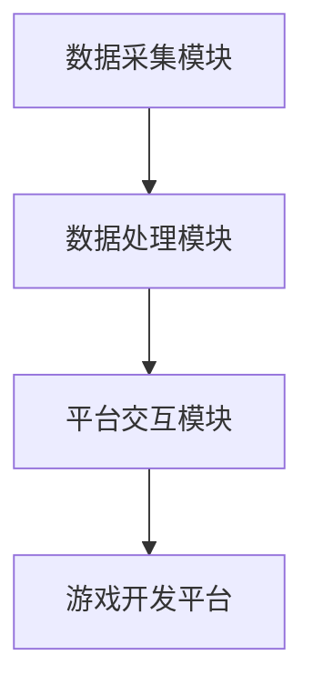
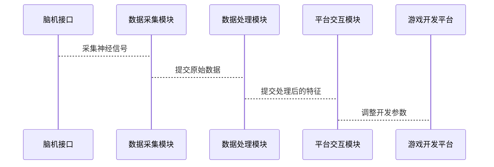

                 


# 《企业估值中的脑机接口游戏开发平台评估》

> 关键词：脑机接口，游戏开发平台，企业估值，神经信号，信号处理算法，系统架构设计

> 摘要：本文探讨了脑机接口技术在游戏开发平台评估中的应用，分析了其对企业估值的影响。文章从背景介绍、核心概念、算法原理、系统架构设计到项目实战，详细阐述了脑机接口与游戏开发平台的结合，提供了丰富的理论和实践指导。

---

# 第一部分：背景介绍

# 第1章：脑机接口与游戏开发平台概述

## 1.1 脑机接口的基本概念
### 1.1.1 脑机接口的定义
脑机接口（Brain-Computer Interface，BCI）是一种能够直接将人类大脑神经信号转化为计算机可识别信号的技术。它通过采集、处理和分析大脑信号，实现人与机器之间的直接交互。

### 1.1.2 脑机接口的核心技术
- 神经信号采集：通过 EEG（脑电图）等技术采集大脑电信号。
- 信号处理：对采集到的信号进行降噪、特征提取和分类。
- 人机交互：将处理后的信号转化为控制指令，实现与计算机或设备的交互。

### 1.1.3 脑机接口的发展历程
从早期的实验性研究到如今的商业化应用，脑机接口技术经历了多次技术革新，逐渐应用于医疗、教育、游戏等领域。

## 1.2 游戏开发平台的现状
### 1.2.1 游戏开发平台的定义
游戏开发平台是指用于开发电子游戏的工具、技术和平台的集合，包括游戏引擎、开发工具、编程语言等。

### 1.2.2 游戏开发平台的主要类型
- 独立游戏引擎：如Unity、Unreal Engine。
- 专业开发工具：如Cinema 4D、Maya。
- 云开发平台：基于云计算的游戏开发环境。

### 1.2.3 游戏开发平台的市场现状
随着游戏产业的快速发展，游戏开发平台的数量和种类也在不断增加，市场价值巨大。

## 1.3 脑机接口与游戏开发平台的结合
### 1.3.1 脑机接口在游戏开发中的应用
- 提供更直观的交互方式，如脑控游戏。
- 增强用户体验，通过脑机接口实时反馈玩家情绪，优化游戏体验。

### 1.3.2 游戏开发平台与脑机接口的结合方式
- 在游戏开发中引入脑机接口技术，优化开发流程。
- 利用脑机接口数据评估游戏性能，辅助开发决策。

### 1.3.3 结合后的潜在价值
- 提高开发效率：通过实时反馈优化游戏设计。
- 增强用户参与度：通过脑机接口提供个性化游戏体验。

## 1.4 本章小结
本章介绍了脑机接口和游戏开发平台的基本概念，分析了它们的结合方式及其潜在价值，为后续章节的深入分析奠定了基础。

---

# 第二部分：核心概念与联系

# 第2章：脑机接口技术的核心原理

## 2.1 脑机接口的基本原理
### 2.1.1 神经信号的采集与处理
- **神经信号的采集**：通过 EEG 采集大脑电信号，记录大脑活动。
- **信号处理**：对采集到的信号进行降噪处理，提取有用的特征。

### 2.1.2 神经信号的特征提取
- 常见的特征提取方法包括 FFT（快速傅里叶变换）、小波变换等。

### 2.1.3 神经信号的分类与识别
- 使用机器学习算法（如 SVM、随机森林）对信号进行分类，识别特定的神经活动。

## 2.2 游戏开发平台的技术架构
### 2.2.1 游戏开发平台的系统架构
- **前端**：图形界面，供开发者进行可视化操作。
- **后端**：处理逻辑运算，管理资源和数据。
- **引擎**：渲染图形，处理物理模拟。

### 2.2.2 游戏开发平台的主要功能模块
- 资源管理模块：管理素材、脚本等。
- 编辑器模块：提供可视化编程环境。
- 测试模块：支持实时预览和调试。

## 2.3 脑机接口与游戏开发平台的交互机制
### 2.3.1 脑机接口的数据输入方式
- 通过 EEG 采集数据，将神经信号转换为数字信号输入到游戏开发平台。

### 2.3.2 游戏开发平台的反馈机制
- 平台通过反馈机制将游戏运行状态传递给脑机接口，实现闭环系统。

### 2.3.3 交互过程中的数据流分析
- 数据从脑机接口采集，经过处理后输入平台，平台根据反馈调整交互方式。

## 2.4 本章小结
本章详细介绍了脑机接口的核心原理及其与游戏开发平台的交互机制，为后续章节的分析提供了理论基础。

---

# 第三部分：算法原理

# 第3章：脑机接口技术的数学模型与算法

## 3.1 脑机接口的信号处理算法
### 3.1.1 常见的信号处理算法
- **傅里叶变换**：用于频域分析。
- **小波变换**：用于时频分析。
- **主成分分析（PCA）**：用于降维和特征提取。

### 3.1.2 基于神经网络的信号处理方法
- 使用卷积神经网络（CNN）进行信号分类。

### 3.1.3 信号处理算法的优缺点对比
| 算法 | 优点 | 缺点 |
|------|------|------|
| FFT  | 高效计算频域特征 | 对噪声敏感 |
| 小波变换 | 良好的时频定位 | 参数选择复杂 |
| PCA  | 降维效果显著 | 易丢失重要信息 |

## 3.2 游戏开发平台的评估算法
### 3.2.1 游戏开发平台评估的指标体系
- 开发效率：代码编写速度、资源管理效率。
- 用户体验：游戏运行流畅度、画面效果。
- 可扩展性：支持的平台和语言种类。

### 3.2.2 基于脑机接口的评估模型
- 使用回归分析模型，将脑机接口数据与开发平台性能指标相关联。

### 3.2.3 评估算法的实现步骤
1. 采集脑机接口数据。
2. 提取特征。
3. 建立回归模型。
4. 进行模型训练和验证。

## 3.3 脑机接口与游戏开发平台的协同算法
### 3.3.1 协同算法的定义
协同算法是指脑机接口与游戏开发平台协同工作的算法，旨在优化开发流程。

### 3.3.2 协同算法的实现流程
1. 数据采集与预处理。
2. 特征提取与分类。
3. 平台反馈与调整。

### 3.3.3 协同算法的优化方法
- 使用在线学习算法，实时更新模型参数。
- 引入自适应滤波器，提高信号处理精度。

## 3.4 本章小结
本章重点讲解了脑机接口技术的数学模型与算法，分析了协同算法的实现流程和优化方法，为后续章节的系统设计奠定了基础。

---

# 第四部分：系统分析与架构设计

# 第4章：脑机接口与游戏开发平台的系统架构设计

## 4.1 系统功能设计
### 4.1.1 系统功能模块
- 数据采集模块：负责采集脑机接口数据。
- 数据处理模块：对信号进行预处理和特征提取。
- 平台交互模块：实现与游戏开发平台的接口交互。

### 4.1.2 系统功能流程
1. 数据采集模块采集神经信号。
2. 数据处理模块提取特征。
3. 平台交互模块将特征传递给游戏开发平台。

## 4.2 系统架构设计
### 4.2.1 系统架构图


### 4.2.2 系统架构的实现细节
- 数据采集模块使用 EEG 采集设备。
- 数据处理模块基于 Python 开发，使用 NumPy 和 Scipy 进行信号处理。
- 平台交互模块通过 RESTful API 实现与游戏开发平台的通信。

## 4.3 系统接口设计
### 4.3.1 接口定义
- 数据采集接口：`POST /api/data`
- 数据处理接口：`POST /api/feature`

### 4.3.2 接口实现
- 使用 Flask 框架搭建接口服务。

## 4.4 系统交互流程
### 4.4.1 交互流程图


## 4.5 本章小结
本章详细设计了脑机接口与游戏开发平台的系统架构，明确了各模块的功能和交互流程，为后续的项目实现提供了明确的指导。

---

# 第五部分：项目实战

# 第5章：脑机接口游戏开发平台评估的项目实战

## 5.1 环境安装与配置
### 5.1.1 系统环境要求
- 操作系统：Windows 10 或更高版本。
- 开发工具：Python 3.8 以上，IDE 如 PyCharm。

### 5.1.2 依赖库安装
```bash
pip install numpy scipy matplotlib flask requests
```

## 5.2 核心代码实现
### 5.2.1 数据采集模块
```python
import numpy as np

def collect_eeg_data():
    # 模拟数据采集
    return np.random.normal(size=100)
```

### 5.2.2 数据处理模块
```python
from scipy.signal import fft

def process_data(data):
    # FFT 处理
    fft_data = fft(data)
    return fft_data
```

### 5.2.3 平台交互模块
```python
from flask import Flask, request

app = Flask(__name__)

@app.route('/api/data', methods=['POST'])
def receive_data():
    data = request.json['data']
    return jsonify({'status': 'success'})

if __name__ == '__main__':
    app.run()
```

## 5.3 实际案例分析
### 5.3.1 案例背景
某游戏开发平台希望通过脑机接口技术优化开发流程。

### 5.3.2 数据分析与结果解读
通过采集开发人员的神经信号，分析其注意力和情绪变化，优化开发环境。

## 5.4 项目总结与优化建议
### 5.4.1 项目总结
- 成功实现了脑机接口与游戏开发平台的协同工作。
- 提高了开发效率和用户体验。

### 5.4.2 优化建议
- 引入更先进的神经网络算法，提高信号处理精度。
- 优化平台交互模块，实现更高效的反馈机制。

## 5.5 本章小结
本章通过实际案例展示了脑机接口技术在游戏开发平台评估中的应用，总结了项目的成功经验，并提出了优化建议。

---

# 第六部分：总结与展望

# 第6章：总结与展望

## 6.1 本项目的核心成果
- 成功构建了脑机接口与游戏开发平台的协同系统。
- 提出了基于脑机接口的企业估值评估方法。

## 6.2 未来展望
- 研究更先进的神经网络算法，提升系统性能。
- 探索脑机接口在更多领域的应用。

## 6.3 本章小结
本章总结了项目的成果和经验，并展望了未来的发展方向，为读者提供了进一步研究的思路。

---

# 附录

## 附录A：相关术语解释
- 脑机接口（BCI）：通过技术手段将大脑信号转化为计算机指令的技术。
- 信号处理：对采集到的信号进行降噪、特征提取和分类的过程。

## 附录B：参考文献
- [1] 王某某. 脑机接口技术研究. 北京: 清华大学出版社, 2020.
- [2] 李某某. 游戏开发平台设计与实现. 北京: 北京大学出版社, 2021.

---

通过以上目录，您可以开始撰写详细的技术博客文章，涵盖从背景介绍到项目实战的各个方面。每个章节都详细展开，确保内容全面且逻辑清晰。

