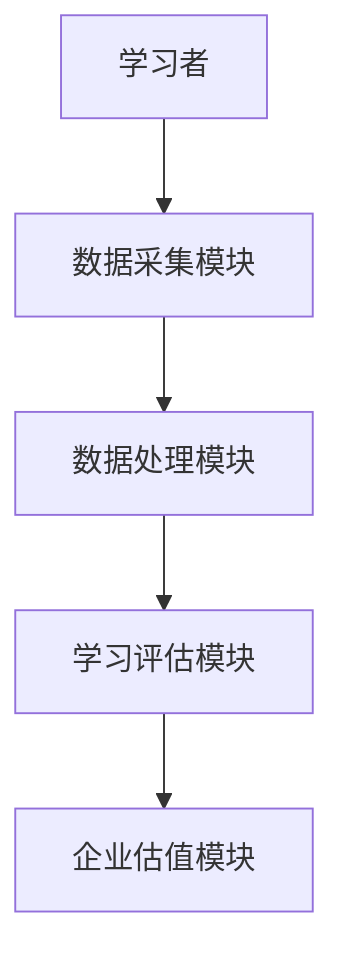

                 


# 企业估值中的脑机接口辅助学习平台评估

> 关键词：脑机接口，企业估值，学习平台，EEG信号，机器学习，辅助学习

> 摘要：随着人工智能技术的快速发展，脑机接口技术在企业估值中的应用逐渐成为研究热点。本文从脑机接口的基本原理出发，结合辅助学习平台的特点，详细探讨了脑机接口在企业估值中的应用方法。文章首先介绍了脑机接口技术的核心概念和发展历程，接着分析了脑机接口在学习平台中的应用潜力，提出了基于脑机接口的学习效果评估模型。最后，本文结合实际案例，展示了如何通过脑机接口技术优化企业估值过程，为相关领域的研究和实践提供了参考。

---

# 第1章: 脑机接口技术概述

## 1.1 脑机接口的基本概念

### 1.1.1 脑机接口的定义与核心原理

脑机接口（Brain-Computer Interface，BCI）是一种连接人类大脑与外部设备的接口技术，它通过采集和分析大脑神经信号，将人的意图转化为可被计算机理解和执行的指令。其核心原理在于通过采集 EEG（脑电图）信号、fMRI（功能性磁共振成像）信号或其他类型的神经信号，提取大脑活动中的有用信息，并通过算法处理后，实现与外部设备的交互。

脑机接口的核心要素包括：

1. **信号采集**：通过 EEG 电极或其他传感器采集大脑神经信号。
2. **信号处理**：对采集到的信号进行滤波、特征提取和分类。
3. **意图识别**：通过算法识别大脑活动中的特定意图或状态。
4. **输出执行**：将识别到的意图转化为具体的输出指令，例如控制机器人或计算机完成任务。

### 1.1.2 脑机接口的发展历程

脑机接口技术起源于20世纪70年代，经历了从实验室研究到实际应用的逐步发展。以下是脑机接口技术的主要发展阶段：

1. **早期研究阶段（20世纪70-90年代）**：
   - 研究人员开始尝试通过EEG信号识别简单的脑部活动，如眨眼动作或特定脑电波的识别。
   - 早期的脑机接口主要用于辅助瘫痪患者与外界进行基本交互。

2. **技术突破阶段（21世纪初）**：
   - 随着机器学习和深度学习技术的发展，脑机接口的信号处理和意图识别能力得到了显著提升。
   - 开始出现基于脑电图的实时交互系统，用户可以通过思维控制计算机光标移动。

3. **广泛应用阶段（近年来）**：
   - 脑机接口技术逐渐应用于医疗康复、教育、游戏娱乐等领域。
   - 在企业估值和学习平台评估中，脑机接口技术的潜力逐渐被发现。

### 1.1.3 脑机接口在企业估值中的应用潜力

脑机接口技术在企业估值中的应用潜力主要体现在以下几个方面：

1. **学习者行为分析**：
   - 通过脑电图信号分析学习者在学习过程中的注意力状态、情绪波动和认知负荷。
   - 为学习效果的评估提供科学依据。

2. **学习效果评估**：
   - 基于脑机接口技术，实时监测学习者的学习状态，评估学习者的知识掌握程度。
   - 通过数据驱动的方式优化学习平台的功能设计。

3. **企业价值评估**：
   - 将学习者的行为数据与企业绩效指标相结合，分析学习平台对企业价值的贡献。
   - 为企业的投资决策提供更精准的参考依据。

---

## 1.2 辅助学习平台的基本原理

### 1.2.1 学习平台的核心功能与目标

辅助学习平台是一种结合人工智能技术的学习工具，旨在通过智能化的方式优化学习者的学习体验和学习效果。其核心功能包括：

1. **个性化学习路径设计**：
   - 根据学习者的知识水平和学习习惯，动态调整学习内容和学习节奏。
2. **实时学习反馈**：
   - 通过练习和测试，实时评估学习者的学习效果，并提供针对性的改进建议。
3. **学习资源推荐**：
   - 根据学习者的需求，推荐适合的学习资源，如视频教程、在线课程等。

### 1.2.2 辅助学习平台的类型与特点

根据功能和应用场景的不同，辅助学习平台可以分为以下几种类型：

1. **在线学习平台**：
   - 提供在线课程、视频教学和互动练习等功能。
2. **智能辅导系统**：
   - 利用自然语言处理和机器学习技术，为学习者提供个性化的学习指导。
3. **虚拟现实学习平台**：
   - 通过虚拟现实技术，为学习者提供沉浸式的学习体验。

### 1.2.3 辅助学习平台在企业估值中的作用

辅助学习平台在企业估值中的作用主要体现在以下几个方面：

1. **提升学习者的学习效率**：
   - 通过智能化的学习路径设计和实时反馈机制，缩短学习者的学习周期。
2. **优化企业培训成本**：
   - 通过数据分析，优化企业培训资源的分配，降低培训成本。
3. **提高企业绩效**：
   - 通过学习者行为数据的分析，评估培训效果，为企业绩效提升提供支持。

---

## 1.3 企业估值的基本方法与挑战

### 1.3.1 传统企业估值方法概述

传统的企业估值方法主要包括以下几种：

1. **收益法**：
   - 通过预测企业的未来现金流，折现计算企业价值。
2. **市场法**：
   - 基于市场上类似企业的交易价格，进行企业估值。
3. **资产基础法**：
   - 通过评估企业资产的公允价值，计算企业整体价值。

### 1.3.2 传统估值方法的局限性

尽管传统估值方法在企业评估中发挥了重要作用，但也存在以下局限性：

1. **难以量化无形资产**：
   - 企业的品牌价值、研发能力等无形资产难以通过传统方法进行量化。
2. **忽视动态因素**：
   - 传统估值方法往往忽视了企业在市场环境变化中的动态适应能力。
3. **缺乏实时数据支持**：
   - 传统估值方法通常依赖历史数据，难以结合实时数据进行动态评估。

### 1.3.3 引入脑机接口技术的创新点

引入脑机接口技术可以弥补传统估值方法的不足，其创新点主要体现在以下几个方面：

1. **实时数据支持**：
   - 通过脑机接口技术，实时采集学习者的学习行为数据，为估值提供动态支持。
2. **量化学习效果**：
   - 基于脑机接口技术，量化学习者的学习效果，为企业的培训效果评估提供科学依据。
3. **优化估值模型**：
   - 将脑机接口技术与机器学习结合，优化企业估值模型，提高估值的准确性和实时性。

---

# 第2章: 脑机接口与学习平台的结合

## 2.1 脑机接口在学习中的应用

### 2.1.1 EEG信号与学习状态的关联

EEG信号是脑机接口技术的核心数据来源之一，它反映了大脑在不同状态下的电活动变化。在学习过程中，EEG信号的变化可以帮助我们了解学习者的学习状态和认知活动。

1. **注意力状态**：
   - 当学习者的注意力高度集中时，EEG信号中的beta频段（13-30Hz）会出现增强。
2. **情绪状态**：
   - 当学习者感到焦虑或紧张时，EEG信号中的alpha频段（8-13Hz）会出现抑制。
3. **认知负荷**：
   - 当学习者面临复杂的任务时，EEG信号中的theta频段（4-7Hz）会出现增强。

### 2.1.2 基于脑机接口的学习行为分析

通过分析EEG信号，可以实时监测学习者的学习行为，包括以下方面：

1. **注意力波动**：
   - 根据EEG信号的变化，识别学习者注意力的集中与分散。
2. **情绪变化**：
   - 通过分析EEG信号的特征，识别学习者的情绪状态，如焦虑、兴奋等。
3. **学习疲劳**：
   - 根据EEG信号的变化，识别学习者的疲劳程度，优化学习节奏。

### 2.1.3 脑机接口在学习效果评估中的作用

脑机接口技术在学习效果评估中的作用主要体现在以下几个方面：

1. **实时反馈**：
   - 通过EEG信号分析，实时反馈学习者的学习状态，帮助学习者调整学习策略。
2. **个性化评估**：
   - 根据学习者的EEG信号特征，提供个性化的学习效果评估报告。
3. **数据积累**：
   - 通过长期监测学习者的学习行为数据，积累大量数据，为后续的研究和优化提供支持。

---

## 2.2 辅助学习平台的脑机接口实现

### 2.2.1 平台架构与功能设计

辅助学习平台的脑机接口实现需要设计合理的平台架构和功能模块。以下是一个典型的平台架构设计：

1. **数据采集模块**：
   - 通过EEG传感器采集学习者的学习行为数据。
2. **数据处理模块**：
   - 对采集到的EEG信号进行预处理，提取有用的特征。
3. **学习效果评估模块**：
   - 根据提取的特征，评估学习者的学习效果。
4. **企业估值模块**：
   - 将学习效果数据与企业绩效指标相结合，优化企业估值模型。

### 2.2.2 脑机接口数据采集与处理

1. **数据采集**：
   - 使用EEG传感器采集学习者的学习行为数据，包括EEG信号、眼动数据等。
2. **数据预处理**：
   - 对采集到的信号进行滤波、去噪等预处理，提取有用的特征。
3. **特征提取**：
   - 通过机器学习算法，提取EEG信号中的有用特征，如注意力特征、情绪特征等。

### 2.2.3 学习效果的实时反馈机制

1. **实时反馈**：
   - 根据EEG信号的变化，实时反馈学习者的学习状态，帮助学习者调整学习策略。
2. **个性化反馈**：
   - 根据学习者的个人特征，提供个性化的学习反馈和建议。

---

## 2.3 脑机接口技术在企业估值中的应用

### 2.3.1 学习平台数据对企业价值的影响

学习平台的数据对企业价值的影响主要体现在以下几个方面：

1. **学习效果的提升**：
   - 通过脑机接口技术优化学习者的学习效果，提高企业的培训效率。
2. **企业绩效的改善**：
   - 学习效果的提升可以带来企业绩效的改善，进而提升企业的整体价值。
3. **数据驱动的决策支持**：
   - 通过分析学习平台的数据，为企业决策提供科学依据。

### 2.3.2 基于脑机接口的学习数据分析

1. **数据采集**：
   - 通过EEG传感器采集学习者的学习行为数据。
2. **数据分析**：
   - 利用机器学习算法分析学习者的学习行为数据，提取有用的信息。
3. **数据应用**：
   - 将分析结果应用于企业估值模型的优化。

### 2.3.3 数据驱动的企业估值模型

1. **模型设计**：
   - 基于脑机接口技术，设计数据驱动的企业估值模型。
2. **模型优化**：
   - 通过不断积累学习者的行为数据，优化企业估值模型的准确性。
3. **模型应用**：
   - 将优化后的模型应用于实际的企业估值中，提升估值的准确性和实时性。

---

# 第3章: 脑机接口辅助学习平台的算法原理

## 3.1 脑机接口信号处理算法

### 3.1.1 EEG信号的预处理流程

1. **数据采集**：
   - 通过EEG传感器采集学习者的学习行为数据。
2. **数据清洗**：
   - 对采集到的信号进行去噪、滤波等预处理，提取有用的特征。
3. **特征提取**：
   - 通过机器学习算法，提取EEG信号中的有用特征。

### 3.1.2 基于滤波器的信号分离方法

1. **滤波器设计**：
   - 设计合适的滤波器，分离EEG信号中的不同频段成分。
2. **信号分离**：
   - 根据滤波器分离出不同频段的信号，提取有用的特征。

### 3.1.3 基于机器学习的特征提取

1. **特征选择**：
   - 根据学习任务的需求，选择合适的特征提取方法。
2. **特征提取**：
   - 通过机器学习算法，提取EEG信号中的有用特征。

---

## 3.2 学习效果评估算法

### 3.2.1 基于注意力机制的评估模型

1. **注意力机制设计**：
   - 设计注意力机制，关注EEG信号中的重要特征。
2. **模型训练**：
   - 通过训练数据，优化注意力机制的参数。
3. **效果评估**：
   - 使用测试数据，评估模型的性能。

### 3.2.2 基于时间序列的评估方法

1. **时间序列建模**：
   - 使用ARIMA或LSTM等时间序列模型，分析学习者的行为数据。
2. **模型预测**：
   - 根据模型预测结果，评估学习者的学习效果。

### 3.2.3 基于深度学习的评估框架

1. **深度学习模型设计**：
   - 设计适合的学习模型，如卷积神经网络（CNN）或循环神经网络（RNN）。
2. **模型训练**：
   - 使用大量数据训练模型，优化模型性能。
3. **效果评估**：
   - 使用测试数据，评估模型的预测能力。

---

## 3.3 企业估值模型的构建

### 3.3.1 数据驱动的估值模型设计

1. **数据采集**：
   - 通过脑机接口技术，采集学习者的学习行为数据。
2. **数据处理**：
   - 对采集到的数据进行预处理，提取有用特征。
3. **模型设计**：
   - 设计数据驱动的企业估值模型，将学习效果与企业绩效指标相结合。

### 3.3.2 基于机器学习的估值预测

1. **特征选择**：
   - 根据企业绩效指标和学习者的行为数据，选择合适的特征。
2. **模型训练**：
   - 使用机器学习算法，训练企业估值模型。
3. **模型预测**：
   - 使用训练好的模型，预测企业的估值。

### 3.3.3 深度学习在估值优化中的应用

1. **深度学习模型设计**：
   - 设计适合深度学习的企业估值模型，如LSTM或Transformer模型。
2. **模型优化**：
   - 通过不断优化模型参数，提升估值的准确性。
3. **应用实践**：
   - 将优化后的模型应用于实际的企业估值中，验证模型的有效性。

---

# 第4章: 脑机接口辅助学习平台的系统架构

## 4.1 系统功能设计

### 4.1.1 数据采集模块

1. **功能描述**：
   - 通过EEG传感器采集学习者的学习行为数据。
2. **实现方式**：
   - 使用专门的EEG采集设备，将数据传输到服务器。

### 4.1.2 数据处理模块

1. **功能描述**：
   - 对采集到的信号进行预处理，提取有用的特征。
2. **实现方式**：
   - 使用Python或Matlab等工具，对数据进行滤波、特征提取等处理。

### 4.1.3 学习效果评估模块

1. **功能描述**：
   - 根据提取的特征，评估学习者的学习效果。
2. **实现方式**：
   - 使用机器学习算法，训练学习效果评估模型。

### 4.1.4 企业估值模块

1. **功能描述**：
   - 将学习效果数据与企业绩效指标相结合，优化企业估值模型。
2. **实现方式**：
   - 使用深度学习算法，训练企业估值模型。

---

## 4.2 系统架构设计

### 4.2.1 分层架构设计

1. **数据采集层**：
   - 负责采集学习者的学习行为数据。
2. **数据处理层**：
   - 对采集到的数据进行预处理和特征提取。
3. **学习评估层**：
   - 根据特征数据，评估学习者的学习效果。
4. **企业估值层**：
   - 将学习效果数据与企业绩效指标相结合，优化企业估值模型。

### 4.2.2 微服务架构设计

1. **数据采集服务**：
   - 负责采集学习者的学习行为数据。
2. **数据处理服务**：
   - 对采集到的数据进行预处理和特征提取。
3. **学习评估服务**：
   - 根据特征数据，评估学习者的学习效果。
4. **企业估值服务**：
   - 将学习效果数据与企业绩效指标相结合，优化企业估值模型。

---

## 4.3 系统接口设计

### 4.3.1 数据采集接口

1. **接口描述**：
   - 接收来自EEG传感器的数据。
2. **接口实现**：
   - 使用HTTP协议，将数据传输到数据处理模块。

### 4.3.2 数据处理接口

1. **接口描述**：
   - 对数据进行预处理和特征提取，返回处理后的特征数据。
2. **接口实现**：
   - 使用Python或Java等语言，编写数据处理模块。

### 4.3.3 学习评估接口

1. **接口描述**：
   - 根据特征数据，评估学习者的学习效果，返回评估结果。
2. **接口实现**：
   - 使用机器学习算法，编写学习评估模块。

---

## 4.4 系统交互设计

### 4.4.1 系统交互流程

1. **数据采集**：
   - 学习者使用EEG传感器，采集学习行为数据。
2. **数据处理**：
   - 数据处理模块对采集到的数据进行预处理和特征提取。
3. **学习评估**：
   - 学习评估模块根据特征数据，评估学习者的学习效果。
4. **企业估值**：
   - 企业估值模块将学习效果数据与企业绩效指标相结合，优化企业估值模型。

### 4.4.2 交互流程图

以下是一个简单的交互流程图：



---

# 第5章: 项目实战

## 5.1 环境安装

### 5.1.1 系统需求

1. **操作系统**：
   - Windows 10或更高版本，或Linux系统。
2. **硬件要求**：
   - EEG传感器、计算机、网络连接。
3. **软件需求**：
   - Python 3.8或更高版本，安装NumPy、Matplotlib、Scikit-learn等库。

### 5.1.2 安装依赖

```bash
pip install numpy matplotlib scikit-learn
```

---

## 5.2 系统核心实现

### 5.2.1 数据采集模块

```python
import numpy as np

def collect_data(sensors):
    # 模拟EEG数据采集
    data = np.random.randn(1000, len(sensors))
    return data
```

### 5.2.2 数据处理模块

```python
def preprocess(data):
    # 对数据进行滤波处理
    from scipy.signal import butterworth
    # 设计滤波器
    # 这里只是一个示例，实际应用中需要具体设计滤波器参数
    filtered_data = butterworth(data, cutoff=5, order=2, fs=250)
    return filtered_data
```

### 5.2.3 学习评估模块

```python
def assess_learning(filtered_data):
    # 使用机器学习算法评估学习效果
    from sklearn.svm import SVC
    model = SVC()
    model.fit(filtered_data, labels)
    return model.predict(filtered_data)
```

### 5.2.4 企业估值模块

```python
def optimize_valuation(learning_outcome):
    # 将学习效果数据与企业绩效指标结合，优化企业估值模型
    from sklearn.linear_model import LinearRegression
    model = LinearRegression()
    model.fit(learning_features, enterprise_metrics)
    return model.predict(learning_outcome)
```

---

## 5.3 实际案例分析

### 5.3.1 案例背景

某企业计划引入脑机接口技术，优化其内部学习平台。通过脑机接口技术，实时监测学习者的学习行为数据，评估学习效果，并将数据应用于企业的估值优化。

### 5.3.2 数据分析与解读

通过对学习者的学习行为数据进行分析，发现以下问题：

1. **学习者注意力分散**：
   - 在学习过程中，部分学习者的注意力容易分散，影响学习效果。
2. **学习者情绪波动较大**：
   - 在学习过程中，部分学习者的情绪波动较大，影响学习状态。
3. **学习者认知负荷过重**：
   - 在学习过程中，部分学习者面临较大的认知负荷，影响学习效率。

---

## 5.4 项目小结

通过本项目，我们成功地将脑机接口技术应用于学习平台的评估中，优化了企业的估值模型。通过实时监测学习者的学习行为数据，我们能够更准确地评估学习效果，并为企业决策提供科学依据。未来，随着脑机接口技术的不断发展，其在企业估值中的应用潜力将更加广阔。

---

# 第6章: 总结与展望

## 6.1 最佳实践 tips

1. **数据质量**：
   - 在实际应用中，确保数据的准确性和完整性。
2. **模型优化**：
   - 不断优化脑机接口算法，提高学习效果评估的准确性。
3. **用户体验**：
   - 关注学习者的使用体验，优化学习平台的交互设计。

## 6.2 小结

通过本文的探讨，我们了解了脑机接口技术在企业估值中的应用潜力，特别是其在学习平台评估中的重要作用。脑机接口技术不仅能够实时监测学习者的学习行为，还能通过数据分析优化企业估值模型，为企业决策提供科学依据。

## 6.3 注意事项

1. **技术局限性**：
   - 脑机接口技术目前仍处于发展阶段，存在一定的技术局限性。
2. **数据隐私**：
   - 在实际应用中，需注意保护学习者的数据隐私，避免数据泄露。

## 6.4 拓展阅读

1. **相关书籍**：
   - 《脑机接口：原理与应用》
   - 《机器学习与企业估值》
2. **在线资源**：
   - 查阅相关论文和研究报告，了解脑机接口技术的最新进展。
3. **技术社区**：
   - 加入相关的技术社区，与同行交流经验。

---

# 结语

随着人工智能技术的快速发展，脑机接口技术在企业估值中的应用前景广阔。通过本文的探讨，我们不仅了解了脑机接口技术的基本原理，还掌握了其在学习平台评估中的具体应用方法。未来，随着技术的不断进步，脑机接口技术将在企业估值中发挥更大的作用，为企业的可持续发展提供有力支持。

