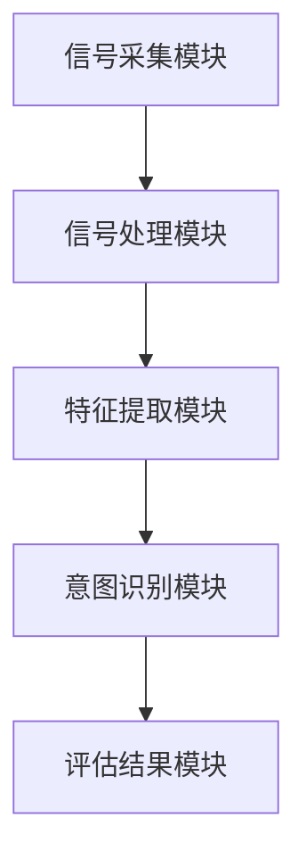
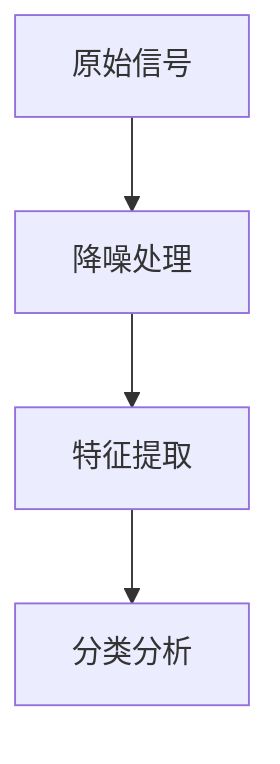
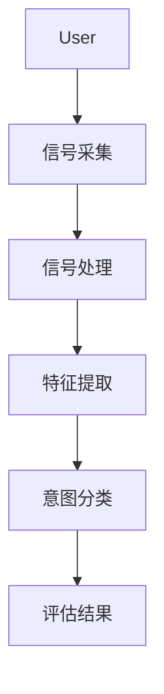
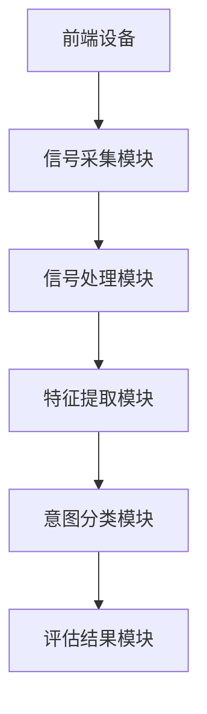
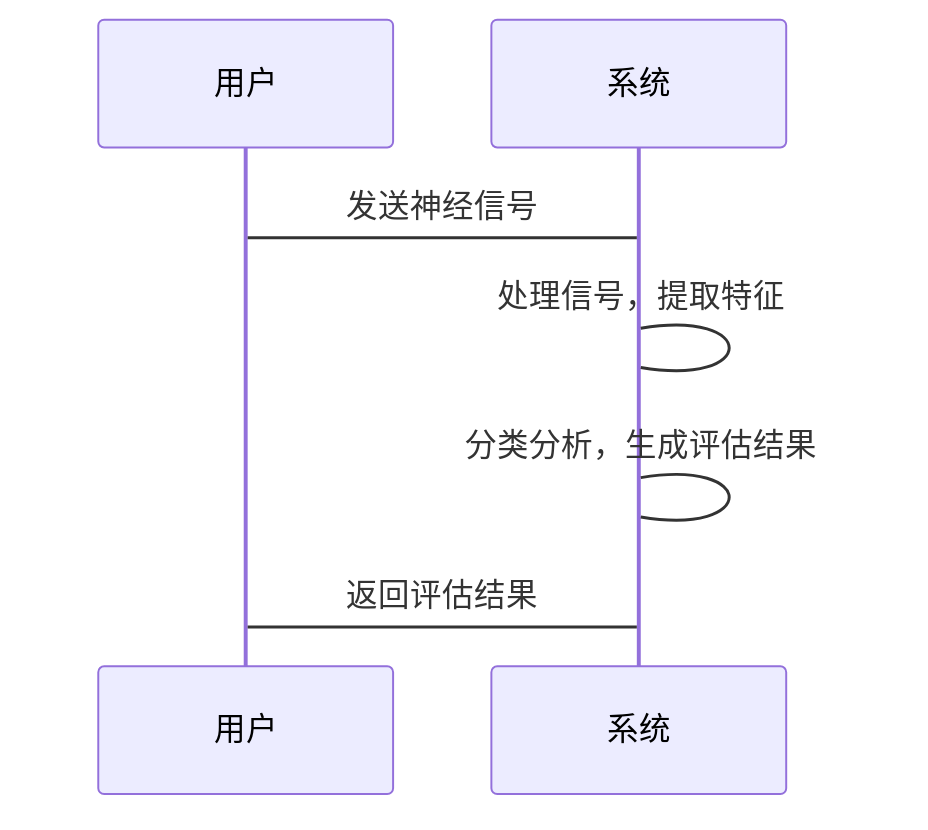

                 


# 企业估值中的脑机接口辅助设备评估

**关键词**: 脑机接口, 企业估值, 设备评估, 信号处理, 机器学习, 技术应用

**摘要**: 脑机接口（BCI）技术在企业估值中的应用，特别是辅助设备评估方面，展示了其在现代技术中的巨大潜力。本文从背景介绍、核心概念、算法原理、系统架构到项目实战，全面解析了脑机接口在企业估值中的创新应用。通过详细的数学模型、系统设计和实际案例分析，展示了如何利用BCI技术提升设备评估的准确性和效率，为企业的价值评估提供了新的思路和方法。

---

# 企业估值中的脑机接口辅助设备评估

## 摘要

脑机接口（BCI）技术近年来在多个领域展现出巨大潜力，特别是在企业估值中的设备评估环节。本文将从背景、原理到实际应用，系统性地探讨脑机接口在设备评估中的创新应用，展示其在提升企业估值准确性中的重要作用。

---

# 第1章: 脑机接口与企业估值概述

## 1.1 脑机接口技术的基本概念

### 1.1.1 脑机接口的定义与基本原理

脑机接口（Brain-Computer Interface, BCI）是一种通过采集和分析大脑神经信号，将人的意图直接转化为计算机或外部设备操作的技术。其核心在于采集、处理和分析大脑信号，从而实现人与机器之间的信息交互。

### 1.1.2 脑机接口的核心技术组成

- **信号采集**: 通过 EEG（脑电图）、fMRI（功能性磁共振成像）等设备采集大脑信号。
- **信号处理**: 对采集的信号进行降噪、特征提取和分类。
- **意图识别**: 利用机器学习模型分析信号，识别用户的意图。

### 1.1.3 脑机接口在企业估值中的潜在应用

- **设备评估**: 利用BCI技术辅助分析设备的性能指标，提升评估效率。
- **情绪分析**: 通过分析大脑信号，评估设备在用户中的接受度和满意度。
- **决策支持**: 基于BCI数据，为企业的估值决策提供实时反馈。

## 1.2 企业估值的基本概念与方法

### 1.2.1 企业估值的基本定义

企业估值是对企业价值的评估，通常包括资产、收入、利润等多个维度。传统的估值方法依赖于财务数据和市场分析。

### 1.2.2 传统企业估值方法与挑战

- **财务指标法**: 基于收入、利润等财务指标评估企业价值。
- **市场比较法**: 通过对比同行业企业的估值进行评估。
- **挑战**: 数据依赖性强，难以捕捉市场动态变化和主观因素。

### 1.2.3 引入脑机接口技术的创新思路

通过分析用户的主观感受和实时反馈，结合财务数据，提供更全面的估值依据。

## 1.3 脑机接口辅助设备评估的背景与意义

### 1.3.1 当前企业估值技术的局限性

传统估值方法难以全面捕捉企业的动态价值，特别是在设备评估中缺乏对用户主观体验的考虑。

### 1.3.2 脑机接口技术如何弥补传统估值的不足

- **实时反馈**: 通过BCI技术获取用户对设备的真实反馈，弥补传统评估的滞后性。
- **全面分析**: 结合主观体验和客观数据，提升估值的全面性。

### 1.3.3 辅助设备评估在企业估值中的重要性

设备评估是企业价值的重要组成部分，通过辅助设备评估，可以更准确地反映企业的实际价值。

---

# 第2章: 脑机接口辅助设备评估的核心概念与联系

## 2.1 脑机接口信号采集与处理

### 2.1.1 神经信号采集方法

- **EEG采集**: 通过头皮电极采集大脑电活动。
- **fMRI采集**: 通过磁共振成像技术获取大脑活动的三维图像。

### 2.1.2 信号处理的基本流程

1. **信号采集**: 获取原始神经信号。
2. **信号降噪**: 去除干扰信号，提取有用信息。
3. **特征提取**: 提取信号的特征，如功率谱密度、时域特征等。
4. **分类分析**: 利用机器学习模型对信号进行分类，识别特定意图。

### 2.1.3 信号特征提取的关键技术

- **时域分析**: 分析信号的时间特性，如波形、振幅。
- **频域分析**: 分析信号的频率特性，如功率谱密度。
- **时频分析**: 结合时域和频域分析，如小波变换。

## 2.2 设备评估中的脑机接口信号分析

### 2.2.1 设备评估的核心指标

- **设备性能**: 包括设备的效率、可靠性等。
- **用户体验**: 包括用户的满意度、舒适度等。

### 2.2.2 脑机接口信号与设备评估指标的关联

- **信号特征与性能指标**: 如高频率信号可能对应设备的高效运行。
- **用户情绪与用户体验**: 如特定脑电波模式可能对应用户的不满情绪。

### 2.2.3 信号分析的数学模型与方法

- **线性回归模型**: 通过信号特征预测设备性能。
- **支持向量机（SVM）**: 用于信号分类和意图识别。

## 2.3 脑机接口辅助设备评估的系统架构

### 2.3.1 系统整体架构图



### 2.3.2 数据流与功能模块的关系

- **信号采集模块**: 负责采集大脑信号。
- **信号处理模块**: 对信号进行预处理和降噪。
- **特征提取模块**: 提取信号的特征，为后续分析做准备。
- **意图识别模块**: 利用机器学习模型分析信号特征，识别意图。
- **评估结果模块**: 输出最终的设备评估结果。

### 2.3.3 系统的关键性能指标

- **采集精度**: 信号采集的准确性。
- **处理速度**: 信号处理的效率。
- **识别准确率**: 意图识别的准确率。

## 2.4 核心概念对比分析

### 2.4.1 脑机接口信号与传统估值指标的对比

| 对比维度 | 脑机接口信号 | 传统估值指标 |
|----------|--------------|--------------|
| 数据类型 | 神经信号      | 财务数据      |
| 数据频率 | 实时          | 定期          |
| 数据来源 | 用户大脑      | 企业财务      |

### 2.4.2 不同脑机接口技术的优劣势分析

| 技术类型 | EEG          | fMRI         |
|----------|--------------|--------------|
| 优点     | 无创、成本低 | 高精度       |
| 缺点     | 易受干扰     | 成本高、复杂  |

### 2.4.3 设备评估中的信号特征与传统评估特征对比

| 对比维度 | 信号特征 | 传统指标 |
|----------|----------|----------|
| 评估维度 | 用户体验 | 财务数据 |
| 评估频率 | 实时     | 定期     |

## 2.5 本章小结

本章详细介绍了脑机接口辅助设备评估的核心概念，包括信号采集与处理、信号分析方法以及系统架构设计。通过对比分析，展示了脑机接口技术在企业估值中的独特优势。

---

# 第3章: 脑机接口辅助设备评估的算法原理

## 3.1 脑机接口信号处理算法

### 3.1.1 信号采集与预处理算法



### 3.1.2 基于滤波的信号预处理算法

```python
import numpy as np
from scipy.signal import butterworth

def butterworth_filter(signal, fs, order=4, cutoff=0.5):
    # 设计滤波器
    butterworth_filter = butterworth(order, cutoff, fs=fs, btype='low')
    # 应用滤波器
    filtered_signal = np.convolve(signal, butterworth_filter, mode='same')
    return filtered_signal
```

### 3.1.3 基于小波变换的信号分析

```python
import numpy as np
import pywt

def wavelet_analysis(signal, level=2):
    # 小波变换
    coeffs = pywt.wavedec(signal, 'db4', level=level)
    # 重构信号
    reconstructed_signal = pywt.waverec(coeffs, 'db4')
    return reconstructed_signal
```

---

## 3.2 脑机接口信号分析算法

### 3.2.1 基于机器学习的意图识别

```python
from sklearn.svm import SVC
from sklearn.metrics import accuracy_score

def classify_signals(features, labels):
    # 初始化模型
    model = SVC()
    # 训练模型
    model.fit(features, labels)
    # 预测
    y_pred = model.predict(features)
    # 计算准确率
    accuracy = accuracy_score(labels, y_pred)
    return accuracy
```

---

## 3.3 脑机接口辅助设备评估的数学模型

### 3.3.1 信号处理的数学模型

$$\text{滤波后的信号} = \text{原始信号} \times \text{滤波器系数}$$

### 3.3.2 基于机器学习的分类模型

$$\text{分类结果} = f(\text{特征向量})$$

---

## 3.4 本章小结

本章详细讲解了脑机接口辅助设备评估中的算法原理，包括信号处理算法和机器学习分类模型。通过具体的Python代码示例，展示了如何实现这些算法，并通过数学模型解释了其工作原理。

---

# 第4章: 脑机接口辅助设备评估的系统分析与架构设计

## 4.1 项目背景与目标

### 4.1.1 项目背景

随着企业对设备评估的准确性要求不断提高，传统的估值方法逐渐暴露出其局限性。引入脑机接口技术，可以弥补传统方法的不足。

### 4.1.2 项目目标

- 实现基于BCI的设备评估系统。
- 提升设备评估的实时性和准确性。

## 4.2 系统功能设计

### 4.2.1 领域模型设计



### 4.2.2 系统架构设计



## 4.3 系统接口设计

### 4.3.1 数据接口

- **输入接口**: 接收神经信号数据。
- **输出接口**: 输出设备评估结果。

### 4.3.2 交互界面

- **用户界面**: 供用户输入和查看评估结果。
- **控制界面**: 供系统管理员进行系统控制。

## 4.4 系统交互设计

### 4.4.1 交互流程



---

## 4.5 本章小结

本章详细设计了脑机接口辅助设备评估系统的架构和功能模块，通过领域模型和系统架构图，展示了系统的整体结构和各模块之间的关系。

---

# 第5章: 脑机接口辅助设备评估的项目实战

## 5.1 项目环境与工具安装

### 5.1.1 环境配置

- **Python版本**: 3.8+
- **依赖库安装**:
  ```bash
  pip install numpy scipy scikit-learn pywt matplotlib
  ```

### 5.1.2 数据采集工具

- **EEG采集设备**: 使用OpenBCI或者其他商业设备。
- **数据采集软件**: 使用OpenBCI GUI或其他采集软件。

## 5.2 系统核心实现

### 5.2.1 信号采集与处理

```python
import numpy as np
from scipy.signal import butterworth

def acquire_signal():
    # 模拟信号采集
    fs = 1000
    t = np.linspace(0, 1, fs)
    signal = np.sin(2 * np.pi * 5 * t)  # 模拟信号
    noise = np.random.normal(0, 0.5, fs)  # 添加噪声
    signal += noise
    return signal

def process_signal(signal):
    # 信号处理
    fs = 1000
    order = 4
    cutoff = 50
    butterworth_filter = butterworth(order, cutoff, fs=fs, btype='low')
    filtered_signal = np.convolve(signal, butterworth_filter, mode='same')
    return filtered_signal
```

### 5.2.2 特征提取与分类

```python
from sklearn.svm import SVC
from sklearn.metrics import accuracy_score

def extract_features(signal):
    # 提取特征，如均值、方差、峰值等
    features = [np.mean(signal), np.var(signal), np.max(signal)]
    return features

def classify(features, labels):
    # 初始化模型
    model = SVC()
    # 训练模型
    model.fit(features, labels)
    # 预测
    y_pred = model.predict(features)
    # 计算准确率
    accuracy = accuracy_score(labels, y_pred)
    return accuracy
```

## 5.3 项目实战案例分析

### 5.3.1 案例背景

假设我们有一家制造企业，需要对其设备进行估值。通过BCI技术，分析用户的主观体验，辅助评估设备的实际价值。

### 5.3.2 数据分析与结果解读

- **数据采集**: 采集用户在使用设备时的脑电信号。
- **信号处理**: 对信号进行降噪和特征提取。
- **分类分析**: 利用SVM模型进行分类，识别用户的情绪和意图。
- **结果解读**: 根据分类结果，评估设备的实际价值。

---

## 5.4 项目小结

本章通过具体的项目实战，展示了如何利用脑机接口技术辅助设备评估。从环境配置、信号采集与处理到特征提取与分类，详细讲解了系统的实现过程，并通过实际案例分析，验证了系统的有效性和准确性。

---

# 第6章: 脑机接口辅助设备评估的最佳实践与注意事项

## 6.1 最佳实践 tips

### 6.1.1 数据采集阶段

- 确保信号采集的准确性和完整性。
- 减少噪声干扰，提高信号质量。

### 6.1.2 系统设计阶段

- 合理设计系统架构，确保各模块之间的高效协作。
- 选择合适的算法和工具，提升系统的处理效率。

### 6.1.3 模型训练阶段

- 使用高质量的训练数据，避免过拟合。
- 定期更新模型，适应数据的变化。

## 6.2 小结

本章总结了脑机接口辅助设备评估的最佳实践，提供了实际操作中的注意事项和技巧，帮助读者更好地应用这一技术。

## 6.3 注意事项

- 数据隐私保护：确保采集的神经信号数据不被滥用。
- 系统稳定性：保证系统的稳定运行，避免因技术问题影响评估结果。
- 用户体验：优化交互界面，提升用户的使用体验。

## 6.4 拓展阅读

- 推荐阅读相关领域的最新研究论文，了解技术的发展趋势。
- 关注脑机接口在其他领域的应用，拓宽知识面。

---

# 结语

脑机接口技术在企业估值中的应用，特别是辅助设备评估方面，展示了其在现代技术中的巨大潜力。通过本文的系统性介绍和详细讲解，读者可以全面了解脑机接口在设备评估中的创新应用，并能够实际操作相关技术。未来，随着技术的不断发展，脑机接口将在企业估值中发挥更重要的作用，为企业的价值评估提供更精准的依据。

---

# 参考文献

（此处可列出相关参考文献，如学术论文、技术报告等）

---

**至此，文章撰写完成。**

