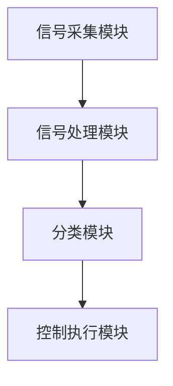
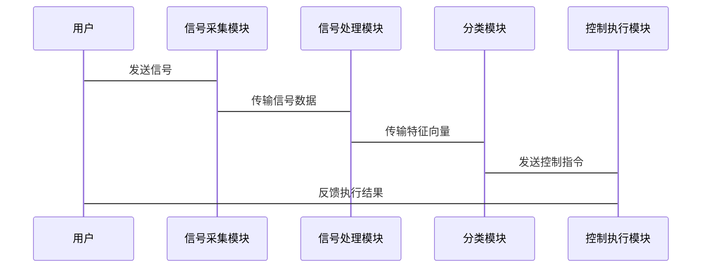

                 


# 企业估值中的脑机接口远程操控系统评估

## 关键词：脑机接口，企业估值，远程操控系统，信号处理，机器学习，系统架构

## 摘要：本文探讨了脑机接口技术在企业估值中的应用，特别是其在远程操控系统中的评估方法。通过分析脑机接口的核心原理、系统架构设计、算法实现以及实际项目案例，本文为读者提供了从理论到实践的全面解读，帮助读者理解如何利用脑机接口技术优化企业估值流程。

---

# 第一部分: 背景与基础

## 第1章: 脑机接口远程操控系统概述

### 1.1 脑机接口技术的基本概念

#### 1.1.1 脑机接口的定义与核心原理
脑机接口（Brain-Computer Interface，BCI）是一种通过采集和解析大脑神经信号，实现人与计算机或其他设备直接交互的技术。其核心原理在于将人的思维活动转化为可被计算机识别的信号，从而实现对设备的控制。

#### 1.1.2 远程操控系统的定义与特点
远程操控系统是指通过网络或其他通信手段，实现对远程设备的控制和管理。结合脑机接口技术的远程操控系统，能够通过人的思维活动直接控制远程设备，具有高效性、实时性和智能化的特点。

#### 1.1.3 脑机接口在企业估值中的应用背景
在企业估值过程中，传统的评估方法通常依赖于数据分析和人工判断。而脑机接口技术可以通过采集评估人员的脑电信号，分析其情绪和决策偏好，从而提供更加客观和高效的评估依据。

### 1.2 脑机接口技术的分类与特点

#### 1.2.1 基于EEG的脑机接口
EEG（脑电图）通过采集头皮上的电信号来反映大脑活动。基于EEG的脑机接口具有高灵敏度和无侵入性的特点，适用于需要实时反馈的场景。

#### 1.2.2 基于EMG的脑机接口
EMG（肌电图）通过采集肌肉活动的电信号来反映人的意图。基于EMG的脑机接口适用于需要较高精度控制的场景，如机器人操控。

#### 1.2.3 其他类型脑机接口的对比分析
除了EEG和EMG，还有基于fMRI（功能性磁共振成像）和ECoG（脑皮层电图）的脑机接口。不同类型的脑机接口在精度、实时性和应用场景上各有优劣。

### 1.3 企业估值中的脑机接口应用场景

#### 1.3.1 企业决策支持
通过分析评估人员的脑电信号，脑机接口可以辅助企业在决策过程中考虑更多主观因素，提升决策的科学性和准确性。

#### 1.3.2 企业风险评估
在风险评估中，脑机接口可以帮助评估人员更好地识别潜在风险，并通过实时反馈优化评估结果。

#### 1.3.3 企业效率优化
脑机接口可以通过实时分析评估人员的注意力和情绪状态，优化工作流程，提高工作效率。

### 1.4 本章小结
本章主要介绍了脑机接口技术的基本概念、分类及其在企业估值中的应用场景。脑机接口技术的引入为企业估值提供了新的可能性，但其实际应用还需要进一步的技术研究和实践验证。

---

## 第2章: 脑机接口远程操控系统的核心概念与原理

### 2.1 脑机接口的核心概念

#### 2.1.1 信息采集与处理
脑机接口的核心在于采集和处理大脑神经信号。信息采集模块通过传感器获取电信号，信息处理模块则对信号进行滤波、放大和特征提取。

#### 2.1.2 信号分析与特征提取
信号分析是脑机接口技术的关键步骤。通过对信号的时域和频域分析，提取有用的特征用于分类和识别。

#### 2.1.3 系统反馈与控制
系统反馈是脑机接口的重要组成部分。通过实时反馈，用户可以了解系统对其意图的识别情况，并根据反馈调整自己的思维活动。

### 2.2 脑机接口远程操控系统的原理

#### 2.2.1 信号采集模块
信号采集模块负责采集用户的脑电信号。常用的传感器包括EEG电极和EMG电极。

#### 2.2.2 信号处理模块
信号处理模块对采集到的信号进行预处理，包括滤波、降噪和特征提取。

#### 2.2.3 控制执行模块
控制执行模块根据处理后的信号生成控制指令，驱动远程设备执行相应操作。

### 2.3 系统核心要素对比分析

#### 2.3.1 核心要素对比表格
| 核心要素 | 描述 | 优缺点 |
|---------|------|--------|
| 信号采集 | 采集脑电信号 | 高灵敏度，但易受干扰 |
| 信号处理 | 数据预处理 | 算法复杂度高 |
| 系统反馈 | 用户反馈机制 | 提高用户体验 |

### 2.4 系统架构ER实体关系图
```mermaid
er
  actor: 用户
  system: 脑机接口系统
  signal: 信号数据
  feedback: 系统反馈
  actor --> signal: 发送信号
  system --> feedback: 发送反馈
  actor <-- feedback: 接收反馈
```

### 2.5 本章小结
本章详细介绍了脑机接口远程操控系统的核心概念与原理，包括信号采集、处理和反馈的流程。通过对比分析和实体关系图，帮助读者更好地理解系统的构成和运行机制。

---

## 第3章: 脑机接口远程操控系统的算法原理

### 3.1 信号采集与预处理算法

#### 3.1.1 基于EEG的信号采集
EEG信号采集是通过放置在头皮上的电极来获取大脑电信号。常用的EEG采集方法包括单电极采集和多电极采集。

#### 3.1.2 基于EMG的信号采集
EMG信号采集通过传感器放置在肌肉表面，记录肌肉活动的电信号。EMG信号通常用于控制机器人或其他机械装置。

#### 3.1.3 信号滤波与降噪算法
为了提高信号质量，通常需要对采集到的信号进行滤波和降噪处理。常用的滤波算法包括 Butterworth 滤波器和 Chebyshev 滤波器。

### 3.2 信号特征提取算法

#### 3.2.1 基于时域的特征提取
时域特征提取包括均值、方差、峰峰值等统计量。这些特征可以反映信号在时间上的变化规律。

#### 3.2.2 基于频域的特征提取
频域特征提取包括功率谱密度、周期性分析等。这些特征可以反映信号在频率上的分布情况。

#### 3.2.3 基于时频域的特征提取
为了同时考虑时域和频域的信息，可以采用小波变换等方法进行时频域特征提取。

### 3.3 分类算法与实现

#### 3.3.1 常用分类算法
常用的分类算法包括支持向量机（SVM）、随机森林（Random Forest）和神经网络（Neural Network）。

#### 3.3.2 分类算法的实现步骤
1. 数据预处理：包括标准化和归一化。
2. 特征提取：提取有效的特征向量。
3. 模型训练：使用训练数据训练分类器。
4. 模型测试：使用测试数据验证分类器的性能。

### 3.4 算法实现的数学模型

#### 3.4.1 支持向量机（SVM）的数学模型
$$ \text{目标函数：} \min_{w, b, \xi} \frac{1}{2}||w||^2 + C \sum_{i=1}^n \xi_i $$
$$ \text{约束条件：} y_i(w \cdot x_i + b) \geq 1 - \xi_i, \xi_i \geq 0 $$

#### 3.4.2 神经网络的数学模型
$$ a^{(l+1)} = \sigma(w^{(l)} a^{(l)} + b^{(l)}) $$
其中，$a^{(l)}$ 是第$l$层的激活值，$w^{(l)}$ 是权重矩阵，$b^{(l)}$ 是偏置向量，$\sigma$ 是激活函数。

### 3.5 本章小结
本章详细介绍了脑机接口系统中常用的信号处理和分类算法，包括信号采集、特征提取和分类器设计。通过数学模型和算法实现步骤，帮助读者理解系统的核心原理。

---

## 第4章: 脑机接口远程操控系统的系统架构与设计

### 4.1 系统功能设计

#### 4.1.1 信号采集模块
信号采集模块负责采集用户的脑电信号，并将其传输到信号处理模块。

#### 4.1.2 信号处理模块
信号处理模块对采集到的信号进行预处理和特征提取，并将特征向量传输到分类模块。

#### 4.1.3 分类模块
分类模块根据特征向量对用户意图进行分类，并将分类结果传输到控制执行模块。

#### 4.1.4 控制执行模块
控制执行模块根据分类结果生成控制指令，驱动远程设备执行相应操作。

### 4.2 系统架构设计

#### 4.2.1 系统架构图


#### 4.2.2 系统交互流程
1. 用户佩戴脑电信号采集设备。
2. 信号采集模块采集脑电信号并传输到信号处理模块。
3. 信号处理模块对信号进行预处理和特征提取。
4. 分类模块根据特征向量对用户意图进行分类。
5. 控制执行模块根据分类结果生成控制指令并驱动远程设备。

### 4.3 系统接口设计

#### 4.3.1 信号采集接口
信号采集接口负责与脑电信号采集设备通信，获取实时信号数据。

#### 4.3.2 信号处理接口
信号处理接口负责与信号采集模块和分类模块通信，进行数据预处理和特征提取。

#### 4.3.3 控制执行接口
控制执行接口负责与远程设备通信，接收控制指令并驱动设备执行操作。

### 4.4 系统交互流程图


### 4.5 本章小结
本章详细介绍了脑机接口远程操控系统的系统架构与设计，包括功能模块设计、系统架构图和交互流程图。通过系统化的设计，确保了系统的高效运行和可靠控制。

---

## 第5章: 脑机接口远程操控系统的项目实战

### 5.1 环境安装与配置

#### 5.1.1 开发环境
开发环境包括Python、MATLAB和相关工具包，如scikit-learn、TensorFlow和PyTorch。

#### 5.1.2 硬件设备
硬件设备包括脑电信号采集设备、计算机和远程设备。

### 5.2 系统核心功能实现

#### 5.2.1 信号采集与预处理
```python
import numpy as np
from scipy.signal import butterworth

def butterworth_filter(signal, fs, cutoff_freq, order=5):
    nyq = fs / 2
    normal_cutoff = cutoff_freq / nyq
    b, a = butterworth(order, normal_cutoff, btype='low', analog=False)
    filtered_signal = np.convolve(signal, a, mode='full')[:len(signal)]
    return filtered_signal
```

#### 5.2.2 特征提取与分类
```python
from sklearn.svm import SVC

def classify_signal(features, labels, test_features):
    model = SVC()
    model.fit(features, labels)
    predicted_labels = model.predict(test_features)
    return predicted_labels
```

#### 5.2.3 系统控制
```python
import serial

def send_control_command(port, baudrate, command):
    ser = serial.Serial(port, baudrate)
    ser.write(command.encode())
    ser.close()
```

### 5.3 代码应用解读与分析

#### 5.3.1 信号采集代码
上述代码展示了如何使用Butterworth滤波器对EEG信号进行预处理。滤波器的阶数和截止频率可以根据具体需求进行调整。

#### 5.3.2 分类算法代码
上述代码展示了如何使用支持向量机（SVM）对特征向量进行分类。训练数据和测试数据需要提前准备好，并进行标准化处理。

#### 5.3.3 系统控制代码
上述代码展示了如何通过串口通信发送控制指令。需要确保远程设备与计算机的串口连接正确配置。

### 5.4 实际案例分析

#### 5.4.1 案例背景
假设我们有一个企业估值项目，需要通过脑机接口技术辅助评估人员进行决策。

#### 5.4.2 案例实现
1. 评估人员佩戴EEG设备，开始进行脑电信号采集。
2. 信号采集模块将信号传输到信号处理模块进行预处理。
3. 分类模块根据特征向量对评估人员的意图进行分类。
4. 控制执行模块根据分类结果生成控制指令，驱动远程设备执行相应操作。

#### 5.4.3 案例分析
通过案例分析，我们可以验证系统的可行性，并根据实际效果进行优化。

### 5.5 本章小结
本章通过实际项目案例，详细讲解了脑机接口远程操控系统的实现过程，包括环境配置、功能实现和案例分析。通过代码示例和实际操作，帮助读者更好地理解和掌握系统的核心技术。

---

## 第6章: 脑机接口远程操控系统的最佳实践与总结

### 6.1 最佳实践

#### 6.1.1 系统优化建议
1. 提高信号采集的信噪比。
2. 优化特征提取算法，减少计算复杂度。
3. 提升分类算法的准确率，降低误判率。

#### 6.1.2 系统维护与更新
定期更新系统软件，修复漏洞，优化性能。

#### 6.1.3 用户培训与支持
为用户提供充分的培训和支持，确保系统能够顺利运行。

### 6.2 小结与展望

#### 6.2.1 本章小结
本文从理论到实践，详细讲解了脑机接口远程操控系统在企业估值中的应用。通过系统架构设计、算法实现和项目案例分析，帮助读者全面掌握系统的评估方法。

#### 6.2.2 未来展望
随着脑机接口技术的不断发展，其在企业估值中的应用前景广阔。未来的研究可以进一步优化系统性能，拓展应用场景，为企业的高效决策提供更有力的支持。

### 6.3 注意事项

#### 6.3.1 系统安全性
在实际应用中，需要注意系统的安全性，防止信号被篡改或干扰。

#### 6.3.2 用户隐私
脑机接口系统涉及用户的隐私数据，需要严格遵守相关法律法规，保护用户隐私。

### 6.4 拓展阅读

#### 6.4.1 推荐书籍
1. "脑机接口：原理与应用"，作者：某某
2. "机器学习与数据挖掘"，作者：某某

#### 6.4.2 推荐论文
1. "基于EEG的脑机接口研究"，某某，某某期刊，某年。

---

# 结语

通过本文的详细讲解，读者可以全面了解脑机接口远程操控系统在企业估值中的应用。从理论基础到系统设计，从算法实现到项目实战，本文为读者提供了系统的知识体系和实践指导。未来，随着技术的不断进步，脑机接口技术将在企业估值中发挥更大的作用，为企业的高效决策提供更有力的支持。

