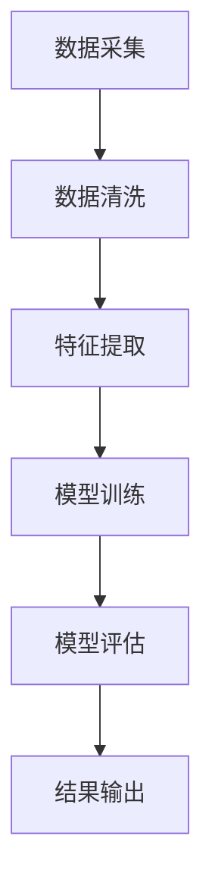

                 


# 企业估值中的虚拟现实培训应用评估

---

## 关键词

- 企业估值
- 虚拟现实
- 培训应用
- 评估模型
- 数据分析
- 算法原理
- 系统架构

---

## 摘要

企业估值是企业管理中的核心任务之一，而虚拟现实（VR）技术在培训应用中的潜力逐渐被挖掘出来。本文将深入探讨如何利用虚拟现实技术来提升企业培训效果，并结合具体的企业估值模型，分析虚拟现实培训应用评估的关键方法和实现步骤。通过理论分析、算法设计和实际案例，本文将为企业估值中的虚拟现实培训应用评估提供系统的解决方案。

---

# 第一部分：企业估值与虚拟现实培训应用的背景与概念

## 第1章：企业估值的基本概念与方法

### 1.1 企业估值的定义与重要性

#### 1.1.1 企业估值的基本概念
企业估值是指对企业整体价值的评估，通常用于企业并购、融资、上市等场景。企业估值的核心在于准确反映企业的财务状况、市场竞争力和未来盈利能力。

#### 1.1.2 企业估值的重要性与应用场景
企业估值是企业战略决策的重要依据，常见于企业并购、上市融资、投资决策等领域。准确的估值可以帮助企业制定合理的战略规划，优化资源配置。

#### 1.1.3 企业估值的核心要素与挑战
企业估值的核心要素包括财务数据、市场环境、管理团队、竞争优势等。然而，传统估值方法往往难以捕捉企业的动态变化和无形资产的价值。

---

### 1.2 虚拟现实技术的基本概念

#### 1.2.1 虚拟现实技术的定义与特点
虚拟现实（VR）是一种利用计算机技术模拟三维环境的技术，具有沉浸性、交互性和构想性的特点。VR技术能够为企业提供高度真实的模拟环境，用于培训、设计、仿真等领域。

#### 1.2.2 虚拟现实技术的核心应用领域
虚拟现实技术在教育、医疗、游戏、制造等领域有广泛应用，特别是在企业培训中，VR技术能够提供沉浸式的学习体验，提升员工技能。

#### 1.2.3 虚拟现实技术在企业培训中的潜力
通过VR技术，企业可以模拟复杂的实际场景，进行员工培训，从而降低培训成本，提升培训效果。

---

### 1.3 虚拟现实培训应用的定义与特点

#### 1.3.1 虚拟现实培训应用的定义
虚拟现实培训应用是指利用虚拟现实技术构建的虚拟环境，用于模拟真实场景，进行员工培训和能力提升。

#### 1.3.2 虚拟现实培训应用的核心特点
虚拟现实培训应用具有高度的沉浸性、交互性和个性化特点，能够根据员工需求提供定制化的培训方案。

#### 1.3.3 虚拟现实培训应用与传统培训方式的对比
与传统培训相比，虚拟现实培训应用能够提供更真实的场景模拟，员工可以在虚拟环境中反复练习，提升技能。

---

### 1.4 本章小结

---

## 第2章：虚拟现实培训应用评估的核心概念

### 2.1 虚拟现实培训应用评估的基本原理

#### 2.1.1 评估的基本流程与步骤
评估流程包括数据采集、数据分析、模型构建和结果输出等步骤。

#### 2.1.2 评估的核心指标与标准
评估指标包括员工表现、培训效果、成本效益等。

---

### 2.2 虚拟现实培训应用评估的属性特征对比

#### 2.2.1 不同评估方法的优缺点对比
传统评估方法与虚拟现实评估方法的优缺点对比。

#### 2.2.2 虚拟现实技术对评估结果的影响
虚拟现实技术能够提供更真实的数据，提升评估的准确性。

#### 2.2.3 评估结果的可量化性与可解释性分析
虚拟现实评估结果具有高度可量化性，但需要结合具体场景进行解释。

---

### 2.3 虚拟现实培训应用评估的ER实体关系图

```mermaid
erDiagram
    staff.staff_id o-|{m,n} assessment : staff_id
    assessment.assessment_id o-|{m,n} score : assessment_id
    staff.staff_id o-|{1,n} training_program : staff_id
    training_program.program_id o-|{1,n} assessment : program_id
```

---

## 第3章：虚拟现实培训应用评估的算法原理

### 3.1 数据采集与处理

#### 3.1.1 数据采集的基本方法
通过VR设备采集员工在虚拟环境中的行为数据，包括操作时间、错误率、完成度等。

#### 3.1.2 数据清洗与预处理
对采集的数据进行清洗，去除异常值，提取关键特征。

#### 3.1.3 数据特征提取与分析
通过数据分析，提取影响评估结果的关键特征，如员工反应时间、操作准确率等。

---

### 3.2 评估模型的构建与优化

#### 3.2.1 算法选择与模型构建
采用机器学习算法，如随机森林、支持向量机等，构建评估模型。

#### 3.2.2 模型训练与参数优化
通过交叉验证优化模型参数，提升评估精度。

#### 3.2.3 模型评估与验证
使用测试数据验证模型的准确性和可靠性。

---

### 3.3 算法流程图



---

## 第4章：虚拟现实培训应用评估的系统架构设计

### 4.1 系统功能设计

#### 4.1.1 系统功能模块
系统主要包括数据采集模块、评估模块、结果展示模块。

#### 4.1.2 功能模块的交互关系
各模块之间的交互关系可以通过类图和序列图展示。

---

### 4.2 系统架构设计

#### 4.2.1 系统架构图
```mermaid
graph TD
    Client --> Server: 请求评估
    Server --> Database: 查询数据
    Server --> Model: 调用模型
    Server --> Client: 返回结果
```

---

## 第5章：虚拟现实培训应用评估的项目实战

### 5.1 项目背景与目标

#### 5.1.1 项目背景
介绍项目背景和目标，例如某企业希望通过VR技术提升员工培训效果。

#### 5.1.2 项目目标
通过虚拟现实技术构建培训场景，评估员工表现。

---

### 5.2 环境配置与代码实现

#### 5.2.1 环境配置
安装必要的软件和库，如Python、TensorFlow等。

#### 5.2.2 核心代码实现
展示评估模型的核心代码。

```python
import numpy as np
from sklearn.ensemble import RandomForestClassifier

# 示例数据
X = np.array([[1, 2], [3, 4], [5, 6]])
y = np.array([0, 1, 0])

# 模型训练
model = RandomForestClassifier()
model.fit(X, y)

# 预测
new_data = np.array([[2, 3]])
print(model.predict(new_data))
```

---

### 5.3 代码应用解读与分析

#### 5.3.1 代码功能分析
解释代码的功能和作用，例如上述代码实现了一个随机森林分类器，用于分类任务。

#### 5.3.2 代码优化建议
根据实际需求优化代码，例如调整模型参数。

---

## 第6章：总结与优化建议

### 6.1 总结

#### 6.1.1 核心观点回顾
回顾本文的核心观点，例如虚拟现实技术在企业培训中的应用及其评估方法。

#### 6.1.2 研究成果的意义
总结研究成果对企业估值的重要意义。

---

### 6.2 优化建议

#### 6.2.1 算法优化建议
建议采用更先进的算法，如深度学习模型，提升评估精度。

#### 6.2.2 系统优化建议
优化系统架构，提升系统的稳定性和响应速度。

---

## 结语

虚拟现实技术为企业估值中的培训应用评估提供了新的思路和方法。通过本文的分析和实践，我们可以看到，虚拟现实技术在提升培训效果和企业估值中的潜力巨大。未来，随着技术的不断发展，虚拟现实培训应用评估将更加精准和高效。

