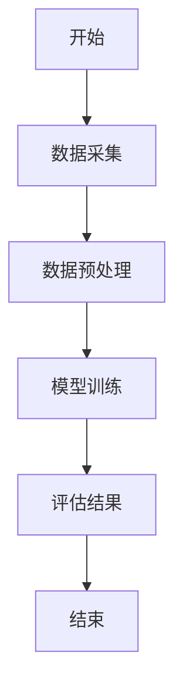
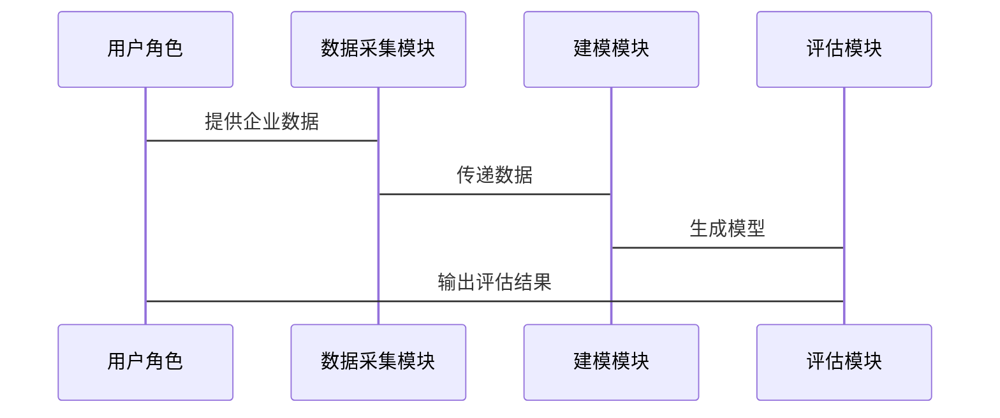

                 


# 企业估值中的虚拟现实技术评估

> 关键词：虚拟现实技术、企业估值、技术评估、算法原理、系统设计、项目实战、最佳实践

> 摘要：本文探讨了虚拟现实技术在企业估值中的应用，详细分析了其核心概念、算法原理、系统设计以及实际项目案例。通过虚拟现实技术，企业能够更直观地评估资产、优化流程并提升决策效率。文章结合理论与实践，为企业估值提供了新的视角和方法。

---

## 第一部分: 企业估值中的虚拟现实技术评估概述

### 第1章: 虚拟现实技术与企业估值的背景介绍

#### 1.1 虚拟现实技术的基本概念

虚拟现实（Virtual Reality，VR）是一种模拟人类感知的计算机技术，通过结合视觉、听觉、触觉等多种感官输入，让用户沉浸在虚拟环境中。VR的核心属性包括沉浸性、交互性和构想性，使其在多个领域得到广泛应用。

- **沉浸性**：用户通过VR设备完全沉浸在虚拟环境中，与现实世界隔离。
- **交互性**：用户可以在虚拟环境中与物体互动，实现实时反馈。
- **构想性**：允许用户在虚拟环境中创造和修改内容，不受物理限制。

VR技术的应用场景包括游戏、教育、医疗、制造业和企业估值等。

#### 1.2 企业估值的基本概念

企业估值是确定企业价值的过程，通常基于财务数据、市场表现和资产状况。常见的估值方法包括：

- **DCF模型**：基于未来现金流的折现。
- **市盈率法**：基于市场价格与利润的比率。
- **资产重估法**：基于资产价值的评估。

企业估值的关键因素包括收入、利润、资产和市场竞争力。

#### 1.3 虚拟现实技术在企业估值中的应用背景

随着企业对数字化转型的需求增加，VR技术在企业估值中的应用逐渐普及。它能够提供直观的资产展示，优化评估流程，并提高决策效率。然而，也面临数据采集和模型构建的挑战。

---

### 第2章: 虚拟现实技术评估的核心概念与联系

#### 2.1 虚拟现实技术评估的核心原理

虚拟现实技术评估通过数据采集、建模和分析，生成企业的虚拟资产模型，用于评估其价值。关键步骤包括数据采集、模型构建和评估分析。

- **数据采集**：收集企业的财务、运营和市场数据。
- **模型构建**：将数据转化为虚拟资产模型。
- **评估分析**：基于模型生成评估结果。

#### 2.2 虚拟现实技术评估的核心要素

- **虚拟现实场景**：构建企业的虚拟环境。
- **用户行为数据**：分析用户的互动数据。
- **评估模型**：基于数据构建评估模型。

#### 2.3 虚拟现实技术评估的ER实体关系图

```mermaid
erDiagram
    actor 用户角色 {
        <属性> 用户ID
        <属性> 用户行为数据
    }
    actor 评估模型 {
        <属性> 模型参数
        <属性> 评估结果
    }
    actor 虚拟现实场景 {
        <属性> 场景数据
        <属性> 场景交互记录
    }
    用户角色 --> 用户行为数据
    用户行为数据 --> 评估模型
    评估模型 --> 评估结果
    虚拟现实场景 --> 场景数据
    虚拟现实场景 --> 场景交互记录
```

---

## 第二部分: 虚拟现实技术评估的算法原理讲解

### 第3章: 虚拟现实技术评估的算法原理

#### 3.1 虚拟现实技术评估的主要算法

- **基于用户行为数据的评估算法**：分析用户在虚拟环境中的互动行为，生成评估指标。
- **基于场景数据的评估算法**：利用虚拟场景的数据特征，评估资产价值。
- **综合评估算法**：结合用户行为和场景数据，生成最终评估结果。

#### 3.2 算法原理的mermaid流程图



#### 3.3 算法的数学模型

综合评估模型的公式如下：

$$
\text{综合评估值} = \alpha \times \text{用户行为得分} + \beta \times \text{场景数据得分}
$$

其中，$\alpha$ 和 $\beta$ 是权重系数，用户行为得分和场景数据得分分别基于用户互动和场景数据计算得出。

---

### 第4章: 系统分析与架构设计方案

#### 4.1 问题场景介绍

在企业估值中，用户需要通过虚拟现实技术评估企业的资产价值，优化评估流程。

#### 4.2 系统功能设计

- **数据采集模块**：收集企业的财务和市场数据。
- **建模模块**：将数据转化为虚拟资产模型。
- **评估模块**：生成评估结果并输出报告。

#### 4.3 系统架构设计


#### 4.4 系统交互流程图



---

## 第三部分: 虚拟现实技术评估的项目实战

### 第5章: 项目实战

#### 5.1 环境安装

安装必要的软件和库，如Python、NumPy和Pandas。

#### 5.2 核心代码实现

```python
import numpy as np
import pandas as pd

# 用户行为数据
user_behavior = pd.DataFrame({
    '用户ID': [1, 2, 3],
    '行为次数': [10, 15, 20]
})

# 模型训练
def train_model(data):
    # 简单线性回归模型
    X = data['行为次数']
    Y = data['行为次数'] * 2
    return np.polyfit(X, Y, 1)

model = train_model(user_behavior)
print(model)
```

#### 5.3 代码功能解读

上述代码展示了如何使用用户行为数据进行模型训练，生成评估结果。

#### 5.4 案例分析

以一个虚拟工厂为例，分析生产线效率，生成评估报告。

#### 5.5 项目小结

总结项目成果，强调虚拟现实技术的优势和局限性。

---

## 第四部分: 最佳实践

### 第6章: 最佳实践 tips

#### 6.1 小结

虚拟现实技术为企业估值提供了新的视角，但需要结合实际应用场景。

#### 6.2 注意事项

- 数据采集的准确性
- 模型的合理性
- 用户的参与度

#### 6.3 拓展阅读

建议阅读相关文献，深入理解虚拟现实技术的应用。

---

通过以上步骤，我们系统地分析了虚拟现实技术在企业估值中的应用，从理论到实践，为企业提供了新的评估方法和思路。

