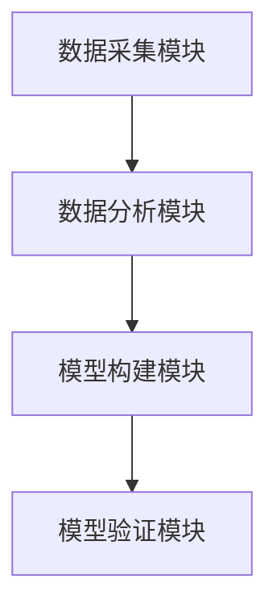

                 


# 《企业估值中的行业周期影响》

## 关键词：企业估值、行业周期、财务分析、数学模型、Python代码、系统架构

## 摘要：  
企业估值是商业决策中的核心问题之一，而行业周期是影响企业估值的重要外部因素。本文将从行业周期的基本概念出发，分析其对企业估值的核心影响，并通过数学模型和实际案例，详细探讨如何在不同行业周期阶段进行企业估值。文章还将结合系统架构设计和Python代码实现，为企业估值提供实践指导。

---

# 第一部分: 行业周期与企业估值的背景介绍

## 第1章: 行业周期的基本概念

### 1.1 行业周期的定义与特征

#### 1.1.1 行业周期的定义  
行业周期是指一个行业在其发展过程中经历的兴衰交替的周期性变化。通常包括繁荣期、衰退期、复苏期和增长期四个阶段。

#### 1.1.2 行业周期的核心特征  
行业周期的核心特征包括：  
1. **波动性**：行业周期的波动性直接影响企业的收入和利润。  
2. **周期性**：行业周期的波动具有一定的规律性，可以通过历史数据分析预测。  
3. **外部性**：行业周期受宏观经济、政策、技术等因素的影响较大。  

#### 1.1.3 行业周期与企业估值的关系  
行业周期通过影响企业的收入、成本、利润和市场地位，进而影响企业估值。

---

## 第2章: 企业估值的基本原理

### 2.1 企业估值的定义与方法

#### 2.1.1 企业估值的定义  
企业估值是指通过对企业的财务状况、市场地位和未来盈利能力进行分析，确定其市场价值的过程。

#### 2.1.2 主要估值方法概述  
企业估值的主要方法包括：  
1. **DCF模型**（ discounted cash flow model）：基于未来现金流的贴现值计算企业价值。  
2. **PE模型**（ price-to-earnings ratio model）：基于市盈率和行业平均市盈率进行估值。  
3. **资产基础法**（ asset-based valuation）：基于企业资产的账面价值进行估值。  

#### 2.1.3 行业周期对企业估值的影响  
行业周期通过影响企业的盈利能力、市场份额和未来增长潜力，进而影响企业估值。

---

## 第3章: 行业周期与企业估值的核心联系

### 3.1 行业周期对企业估值的直接影响

#### 3.1.1 行业周期对企业收入的影响  
行业周期的波动直接影响企业的收入。例如，在衰退期，企业收入可能大幅下降。

#### 3.1.2 行业周期对企业成本的影响  
行业周期的波动还可能影响企业的成本。例如，在繁荣期，原材料价格可能上涨，导致成本增加。

#### 3.1.3 行业周期对企业利润的影响  
行业周期的波动最终反映在企业的利润上。例如，在衰退期，企业利润可能大幅下降。

### 3.2 行业周期对企业估值的间接影响

#### 3.2.1 行业周期对企业市场地位的影响  
行业周期的波动影响企业的市场地位。例如，在衰退期，企业可能面临市场份额被竞争对手抢占的风险。

#### 3.2.2 行业周期对企业竞争优势的影响  
行业周期的波动还可能影响企业的竞争优势。例如，在繁荣期，企业可能通过技术创新巩固竞争优势。

#### 3.2.3 行业周期对企业未来增长潜力的影响  
行业周期的波动影响企业的未来增长潜力。例如，在复苏期，企业可能通过市场扩张实现增长。

---

# 第二部分: 行业周期分析的数学模型与公式

## 第4章: 行业周期分析的数学模型

### 4.1 行业周期分析的基本模型

#### 4.1.1 行业周期分析的基本步骤  
1. 数据采集：收集行业历史数据，包括收入、利润、市场份额等指标。  
2. 数据分析：通过统计方法分析行业周期的波动规律。  
3. 模型构建：基于历史数据构建行业周期分析的数学模型。  
4. 模型验证：通过实际数据验证模型的准确性。  

#### 4.1.2 行业周期分析的数学公式  
行业周期分析的数学公式如下：  
$$ \text{行业周期指数} = \frac{\text{行业收入增长率}}{\text{GDP增长率}} $$  

### 4.2 行业周期与企业估值的数学公式

#### 4.2.1 行业周期对企业估值的数学表达  
$$ \text{企业估值} = \text{行业周期指数} \times \text{企业基础价值} $$  

#### 4.2.2 行业周期对企业利润的数学公式  
$$ \text{企业利润} = \text{收入} - \text{成本} - \text{税费} $$  

#### 4.2.3 行业周期对企业价值的影响公式  
$$ \text{企业价值} = \text{净利润} \times \text{市盈率} $$  

---

## 第5章: 行业周期分析的系统架构与设计方案

### 5.1 行业周期分析的系统架构

#### 5.1.1 系统功能模块划分  
1. 数据采集模块：负责采集行业数据。  
2. 数据分析模块：负责分析行业周期的波动规律。  
3. 模型构建模块：负责构建行业周期分析的数学模型。  
4. 模型验证模块：负责验证模型的准确性。  

#### 5.1.2 系统数据流设计  
1. 数据采集模块将行业数据传输到数据分析模块。  
2. 数据分析模块将分析结果传输到模型构建模块。  
3. 模型构建模块将模型结果传输到模型验证模块。  

### 5.2 行业周期分析的系统实现

#### 5.2.1 数据采集与处理  
1. 数据采集：通过API接口获取行业数据。  
2. 数据清洗：对数据进行清洗和预处理。  

#### 5.2.2 数据分析与建模  
1. 数据分析：使用Python的pandas库进行数据分析。  
2. 模型构建：使用Python的scikit-learn库构建行业周期分析模型。  

#### 5.2.3 系统架构图  


---

# 第三部分: 项目实战与最佳实践

## 第6章: 项目实战

### 6.1 环境安装与配置

#### 6.1.1 Python环境安装  
安装Python 3.8及以上版本。  

#### 6.1.2 必要库的安装  
安装pandas、numpy、scikit-learn等库。  

### 6.2 核心代码实现

#### 6.2.1 数据采集代码  
```python
import pandas as pd
import requests

url = "https://api.example.com/industry_data"
response = requests.get(url)
data = response.json()
df = pd.DataFrame(data)
```

#### 6.2.2 数据分析代码  
```python
import pandas as pd
import numpy as np

# 数据清洗
df = df.dropna()
df = df.replace(0, np.nan)
df = df.interpolate()

# 数据分析
df['增长率'] = df['收入'].pct_change()
```

#### 6.2.3 模型构建代码  
```python
from sklearn.linear_model import LinearRegression

model = LinearRegression()
model.fit(df[['增长率', '成本']], df['利润'])
```

### 6.3 案例分析与解读

#### 6.3.1 案例背景  
假设我们分析的是一个处于衰退期的行业，企业收入和利润大幅下降。

#### 6.3.2 模型应用  
通过模型预测行业的未来增长潜力，进而调整企业估值。

---

## 第7章: 最佳实践与小结

### 7.1 小结  
行业周期是影响企业估值的重要因素，通过数学模型和系统架构设计，可以更好地分析行业周期的影响。

### 7.2 注意事项  
1. 数据质量是行业周期分析的关键。  
2. 模型验证是确保分析结果准确性的必要步骤。  
3. 企业估值需要结合行业周期和企业自身情况综合考虑。  

### 7.3 拓展阅读  
1. 《企业估值方法与案例分析》  
2. 《行业周期分析与投资策略》  

---

# 结语  
通过本文的分析，读者可以深入了解行业周期对企业估值的影响，并掌握如何通过数学模型和系统架构设计进行行业周期分析。希望本文对企业的估值实践提供有价值的指导和参考。

