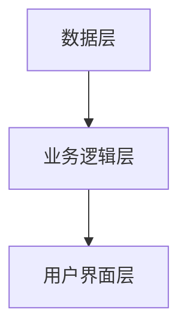
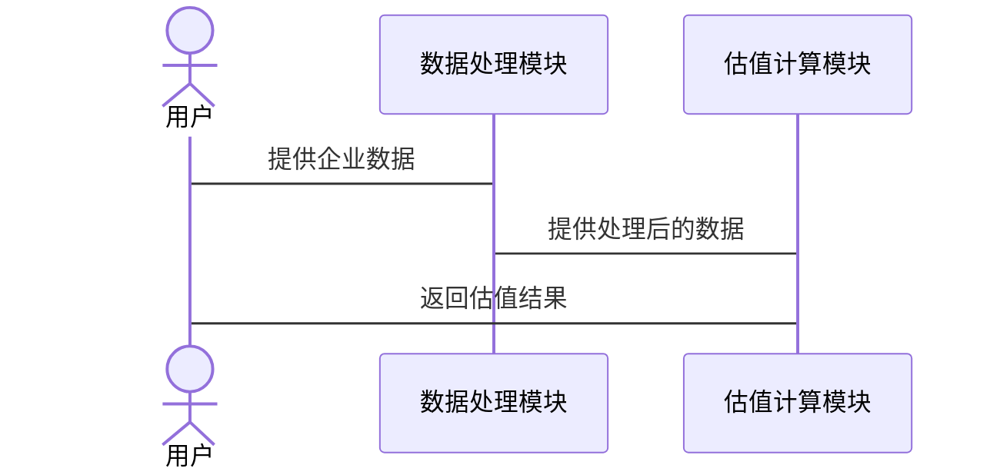

                 


# 企业估值中的规模经济效应分析

> 关键词：企业估值，规模经济，成本曲线，边际成本，平均成本，经济模型

> 摘要：规模经济效应是企业在生产或运营过程中，随着规模扩大而单位成本下降的现象。本文从规模经济的基本概念出发，深入分析其在企业估值中的作用，结合数学模型和系统架构设计，探讨如何量化规模经济效应，并通过实际案例展示其应用。最后，总结规模经济效应对企业估值的重要意义，并提供进一步阅读的建议。

---

# 正文

## 第一章：规模经济效应的基本概念

### 1.1 规模经济的定义与类型

#### 1.1.1 规模经济的定义

规模经济是指随着企业生产规模的扩大，单位产品或服务的平均成本逐渐下降的现象。这种现象源于固定成本的分摊、生产效率的提升以及技术 economies of scale 的应用。规模经济可以分为 **内部规模经济** 和 **外部规模经济**，其中内部规模经济是企业内部生产规模扩大带来的成本降低，而外部规模经济则来源于企业外部供应链、市场范围等因素的影响。

#### 1.1.2 规模经济的类型

- **生产规模经济**：指企业通过扩大生产规模，降低单位产品的生产成本。
- **组织规模经济**：指企业通过扩大组织规模，优化资源配置，降低管理成本。
- **市场规模经济**：指企业通过扩大市场覆盖范围，提高销售效率，降低单位产品的营销成本。

#### 1.1.3 规模经济的核心特征

- **边际成本递减**：随着产量增加，单位产品的边际成本逐渐下降。
- **平均成本下降**：总成本与产量的比值逐渐降低。
- **生产效率提升**：规模扩大带来技术应用和管理优化，进一步降低成本。

### 1.2 规模经济在企业估值中的作用

#### 1.2.1 规模经济与企业成本的关系

规模经济直接影响企业的成本结构，尤其是固定成本和变动成本的比例。通过扩大规模，企业可以将固定成本分摊到更多的产品或服务上，从而降低单位成本。

#### 1.2.2 规模经济对利润的影响

规模经济通过降低成本，提高企业的利润率。当企业达到一定规模后，边际成本的降低使得利润空间进一步扩大。

#### 1.2.3 规模经济与企业市场竞争力

规模经济增强了企业的市场竞争力，使其能够在价格竞争中占据优势。同时，规模经济也为企业提供了更多的资源和能力，进一步巩固其市场地位。

---

## 第二章：规模经济效应的数学模型与公式

### 2.1 规模经济的成本曲线分析

#### 2.1.1 边际成本与平均成本的关系

边际成本（MC）是指每增加一单位产量所增加的总成本。平均成本（AC）是指单位产品的平均总成本。边际成本和平均成本的关系可以通过成本曲线图来表示。

#### 2.1.2 成本曲线的数学表达式

总成本函数可以表示为：
$$C(q) = a + bq + cq^2$$

其中：
- $C(q)$ 是总成本
- $q$ 是产量
- $a$ 是固定成本
- $b$ 是单位变动成本
- $c$ 是二次项系数

边际成本的计算公式为：
$$MC = \frac{dC(q)}{dq} = b + 2cq$$

平均成本的计算公式为：
$$AC = \frac{C(q)}{q} = \frac{a}{q} + b + cq$$

### 2.2 边际成本与平均成本的计算

#### 2.2.1 边际成本的计算公式

$$MC = \frac{dC(q)}{dq}$$

#### 2.2.2 平均成本的计算公式

$$AC = \frac{C(q)}{q}$$

### 2.3 规模经济效应的量化指标

#### 2.3.1 边际成本递减率的计算

边际成本递减率可以通过以下公式计算：
$$\text{边际成本递减率} = \frac{MC_{q+1} - MC_q}{MC_q}$$

#### 2.3.2 规模经济指数的计算

规模经济指数（SEI）可以通过以下公式计算：
$$SEI = \frac{C(q)}{q} - \frac{C(q+1)}{q+1}$$

---

## 第三章：规模经济效应的系统分析与架构设计

### 3.1 系统分析

#### 3.1.1 问题场景介绍

在企业估值过程中，规模经济效应的分析需要结合企业的生产规模、成本结构和市场环境。通过系统分析，可以量化规模经济效应对企业价值的影响。

#### 3.1.2 项目介绍

本项目旨在通过系统分析和架构设计，量化规模经济效应，并将其应用于企业估值模型中。

#### 3.1.3 系统功能设计（领域模型）

系统功能包括：
- 数据采集与处理
- 成本曲线分析
- 规模经济效应量化
- 企业估值计算

### 3.2 系统架构设计

系统架构采用分层设计，包括数据层、业务逻辑层和用户界面层。以下是系统架构图（Mermaid）：



### 3.3 系统接口设计

#### 3.3.1 数据输入接口

数据输入接口包括企业生产规模、成本数据和市场数据。

#### 3.3.2 数据输出接口

数据输出接口包括规模经济效应指数和企业估值结果。

### 3.4 系统交互设计

系统交互设计包括数据输入、数据处理和结果输出三个阶段。以下是系统交互流程图（Mermaid）：



---

## 第四章：规模经济效应的项目实战

### 4.1 项目环境安装

#### 4.1.1 数据处理工具安装

安装Python和相关数据处理库，如Pandas和NumPy。

#### 4.1.2 系统开发框架安装

安装Django或Flask框架，用于开发企业估值系统。

### 4.2 系统核心实现

#### 4.2.1 数据处理代码实现

```python
import pandas as pd

def process_data(data):
    # 数据处理逻辑
    processed_data = data.dropna().astype(float)
    return processed_data
```

#### 4.2.2 模型计算代码实现

```python
def calculate_scale_economy(data):
    # 规模经济效应计算逻辑
    mc = data['C(q)'].diff() / data['q'].diff()
    ac = data['C(q)'] / data['q']
    return mc, ac
```

### 4.3 代码应用解读与分析

#### 4.3.1 代

---

## 总结

本文通过系统分析和数学建模，深入探讨了规模经济效应在企业估值中的应用。通过成本曲线分析和数学模型，量化了规模经济效应，并结合实际案例，展示了其在企业估值中的重要性。未来的研究可以进一步探索规模经济与其他经济因素的交互作用，以更全面地评估企业价值。

