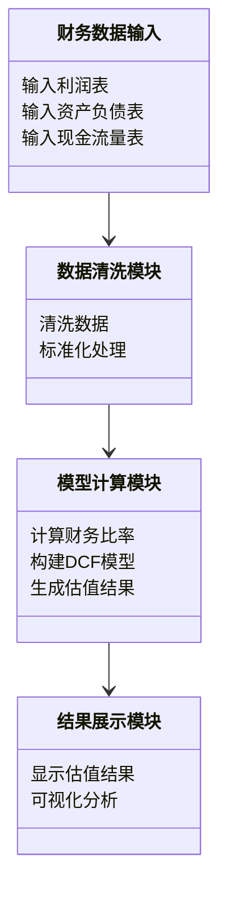
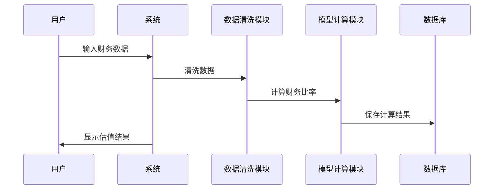

                 


# 企业估值中的财务报表分析方法

> 关键词：企业估值、财务报表分析、DCF模型、财务指标、系统架构

> 摘要：本文详细探讨了企业估值中的财务报表分析方法，从基本概念到高级模型，结合实际案例和系统设计，系统性地介绍了如何利用财务报表进行企业估值。文章内容涵盖了财务报表的核心内容、分析方法、系统架构设计以及项目实战，帮助读者全面掌握企业估值的技术要点。

---

# 第一部分: 企业估值中的财务报表分析基础

# 第1章: 财务报表分析的基本概念

## 1.1 企业估值与财务报表分析的背景

### 1.1.1 企业估值的基本概念
企业估值是通过对企业的财务状况、市场地位、盈利能力等多方面因素进行综合分析，确定其市场价值的过程。财务报表分析是其中最关键的部分，因为它直接反映了企业的经营状况和财务健康。

### 1.1.2 财务报表分析在企业估值中的作用
财务报表分析是企业估值的核心工具，通过对利润表、资产负债表和现金流量表的分析，可以评估企业的盈利能力、偿债能力、运营效率和成长潜力。

### 1.1.3 财务报表分析的必要性与重要性
企业估值需要依赖财务数据，而财务报表分析能够揭示数据背后的真实情况，帮助投资者做出更明智的决策。

### 1.1.4 本节小结
通过本节学习，读者将了解企业估值的基本概念、财务报表分析的重要性以及其在估值中的核心作用。

---

## 1.2 财务报表分析的核心概念

### 1.2.1 财务报表的基本结构
财务报表包括利润表、资产负债表和现金流量表三大部分，分别反映了企业的盈利能力、资产状况和现金流情况。

### 1.2.2 财务报表分析的主要方法
常见的分析方法包括比较分析法、趋势分析法、比率分析法和行业比较法。

### 1.2.3 企业估值的核心要素
企业估值的核心要素包括收入、利润、资产、负债、现金流和行业地位等。

### 1.2.4 本节小结
通过本节学习，读者将掌握财务报表的基本结构和企业估值的核心要素。

---

## 1.3 财务报表分析的基本流程

### 1.3.1 数据收集与整理
首先需要收集企业的财务报表数据，并进行清洗和标准化处理。

### 1.3.2 数据清洗与标准化
对数据进行清洗，剔除错误和异常值，并将其标准化，以便后续分析。

### 1.3.3 数据分析与建模
通过数据分析工具对数据进行建模，选择合适的估值模型进行计算。

### 1.3.4 本节小结
通过本节学习，读者将了解财务报表分析的基本流程和关键步骤。

---

# 第2章: 财务报表的核心内容与指标

## 2.1 利润表分析

### 2.1.1 利润表的基本结构
利润表包括收入、成本、利润等部分，反映了企业的盈利能力。

### 2.1.2 收入与成本的分析
分析收入和成本的变化趋势，评估企业的盈利能力和成本控制能力。

### 2.1.3 净利润的计算与影响因素
净利润是利润表的核心，其计算公式为：净利润 = 收入 - 成本 - 费用。

---

## 2.2 资产负债表分析

### 2.2.1 资产、负债与所有者权益的构成
资产负债表反映了企业在某一特定时期的资产、负债和所有者权益状况。

### 2.2.2 资产结构与负债结构的分析
分析资产和负债的构成比例，评估企业的财务健康状况。

### 2.2.3 资产负债率与偿债能力
资产负债率 = 负债总额 / 资产总额，反映企业的偿债能力。

---

## 2.3 现金流量表分析

### 2.3.1 现金流量表的基本结构
现金流量表分为经营活动、投资活动和筹资活动三部分。

### 2.3.2 经营活动、投资活动与筹资活动的现金流分析
分析各项活动的现金流情况，评估企业的流动性管理能力。

### 2.3.3 现金流量与企业流动性管理
充足的现金流是企业运营的基础，分析现金流量表有助于评估企业的流动性风险。

---

## 2.4 财务指标体系

### 2.4.1 常见财务指标分类
财务指标可以分为盈利能力指标、偿债能力指标、运营能力指标和成长能力指标。

### 2.4.2 主要财务指标的计算公式
- 净利率 = 净利润 / 收入
- 速动比率 = (流动资产 - 存货) / 流动负债
- 资产周转率 = 营业收入 / 平均资产总额

### 2.4.3 财务指标之间的相互关系
各项指标相互关联，共同反映企业的综合财务状况。

---

## 2.5 本章小结

### 2.5.1 核心指标总结
通过本章学习，读者将掌握利润表、资产负债表和现金流量表的核心内容，以及各项财务指标的计算方法。

### 2.5.2 指标之间的相互作用
各项指标相互关联，共同反映企业的综合财务状况。

### 2.5.3 下一章的展望
下一章将详细介绍财务报表分析的方法与模型。

---

# 第3章: 财务报表分析方法与模型

## 3.1 财务报表分析的基本方法

### 3.1.1 比较分析法
将企业的财务数据与行业平均水平或竞争对手进行比较，找出差异和优势。

### 3.1.2 趋势分析法
分析财务数据的变化趋势，预测未来的财务状况。

### 3.1.3 假设分析法
通过假设不同的情景，评估企业财务状况的敏感性。

---

## 3.2 财务报表分析的高级方法

### 3.2.1 财务比率分析
通过计算各项财务比率，评估企业的财务健康状况。

### 3.2.2 资产负债表分析模型
构建资产负债表分析模型，评估企业的资产结构和负债结构。

### 3.2.3 现金流量表分析模型
通过现金流分析模型，评估企业的流动性管理能力。

---

## 3.3 企业估值的核心模型

### 3.3.1 现金流折现模型（DCF）
DCF模型是企业估值的核心方法之一，通过预测未来现金流并折现，计算企业价值。

### 3.3.2 市盈率与市净率模型
通过比较企业的市盈率和市净率，评估其相对于市场的估值水平。

### 3.3.3 重置成本法与清算价值法
重置成本法和清算价值法是其他常用的估值方法，适用于不同场景。

---

## 3.4 本章小结

### 3.4.1 分析方法总结
通过本章学习，读者将掌握比较分析法、趋势分析法、财务比率分析等基本方法，以及DCF模型等高级估值模型。

### 3.4.2 核心模型回顾
DCF模型是企业估值的核心工具，市盈率和市净率模型是常用的相对估值方法。

### 3.4.3 下一章的展望
下一章将详细介绍系统分析与架构设计，帮助读者更好地应用这些方法。

---

# 第4章: 系统分析与架构设计

## 4.1 问题场景介绍

### 4.1.1 企业估值的典型问题
企业在实际估值过程中可能面临数据不完整、模型复杂、计算效率低下等问题。

### 4.1.2 财务报表分析的系统需求
需要一个高效的系统来处理大量的财务数据，构建复杂的估值模型。

### 4.1.3 系统目标与范围
系统的目标是提供一个完整的财务报表分析与估值平台，支持多种估值模型和数据可视化。

---

## 4.2 系统功能设计

### 4.2.1 领域模型设计
使用Mermaid类图描述系统的核心功能模块，包括数据输入、数据清洗、模型计算和结果展示。



---

## 4.3 系统架构设计

### 4.3.1 系统架构图
使用Mermaid架构图描述系统的整体架构，包括前端、后端和数据库部分。


---

## 4.4 系统接口设计

### 4.4.1 接口设计
系统需要提供API接口，方便与其他系统对接，获取实时财务数据。

### 4.4.2 接口实现
使用RESTful API，支持GET、POST等请求方式。

---

## 4.5 系统交互设计

### 4.5.1 交互流程
用户通过Web界面输入数据，系统进行清洗和计算，最终展示估值结果。

### 4.5.2 交互序列图
使用Mermaid序列图描述用户与系统的交互流程。



---

## 4.6 本章小结

### 4.6.1 系统需求总结
通过本章学习，读者将了解企业估值系统的核心需求和功能模块。

### 4.6.2 系统架构设计
系统的架构设计确保了数据处理和模型计算的高效性。

### 4.6.3 下一章的展望
下一章将详细介绍项目实战，包括代码实现和案例分析。

---

# 第5章: 项目实战与高级技巧

## 5.1 环境安装与配置

### 5.1.1 Python环境安装
安装Python和必要的库，如Pandas、NumPy、Matplotlib等。

### 5.1.2 数据库配置
配置MySQL或其他数据库，存储财务数据和计算结果。

---

## 5.2 系统核心实现源代码

### 5.2.1 数据清洗与处理代码
```python
import pandas as pd

# 读取财务数据
df = pd.read_csv('financial_data.csv')

# 清洗数据
df.dropna(inplace=True)
df[' revenue'] = df['revenue'].astype(float)
```

### 5.2.2 模型计算代码
```python
def calculate_dcf(revenue, cost_of_goods_sold, operating_expenses, tax_rate, discount_rate):
    # 计算现金流
    fcf = revenue - cost_of_goods_sold - operating_expenses * (1 - tax_rate)
    # 折现
    present_value = fcf / (1 + discount_rate)
    return present_value
```

---

## 5.3 代码应用解读与分析

### 5.3.1 数据清洗与处理
通过对数据进行清洗和标准化处理，确保数据的准确性和一致性。

### 5.3.2 模型计算与结果展示
使用DCF模型计算企业价值，并通过可视化工具展示结果。

---

## 5.4 实际案例分析

### 5.4.1 案例背景介绍
以某企业为例，分析其财务报表，计算其估值。

### 5.4.2 数据分析与建模
通过Python代码实现数据清洗和模型计算，生成估值结果。

### 5.4.3 案例总结
总结分析过程和结果，提出改进建议。

---

## 5.5 本章小结

### 5.5.1 项目实战总结
通过本章学习，读者将掌握如何使用Python进行财务数据处理和模型计算。

### 5.5.2 高级技巧分享
分享一些实用的高级技巧，如数据可视化、模型优化等。

### 5.5.3 下一章的展望
下一章将总结全文，并展望未来的发展方向。

---

# 第6章: 总结与展望

## 6.1 本章总结

### 6.1.1 核心知识点回顾
回顾全文的核心知识点，包括财务报表分析的基本概念、主要方法和系统设计。

### 6.1.2 学习成果总结
总结读者通过本篇文章所掌握的知识和技能。

---

## 6.2 未来展望

### 6.2.1 技术发展
随着人工智能和大数据技术的发展，财务报表分析将更加智能化和自动化。

### 6.2.2 应用场景扩展
未来，财务报表分析将应用于更多领域，如风险管理、投资决策等。

### 6.2.3 学习建议
建议读者继续学习相关技术，关注行业动态，提升自己的专业能力。

---

## 6.3 最佳实践与注意事项

### 6.3.1 最佳实践
在实际应用中，建议结合多种分析方法和模型，进行全面评估。

### 6.3.2 注意事项
注意数据的准确性和模型的适用性，避免盲目应用。

### 6.3.3 本章小结
通过本章学习，读者将了解财务报表分析的未来发展和最佳实践。

---

# 附录: 参考文献与拓展阅读

## 1. 参考文献
- 《财务报表分析》（作者：XXX）
- 《企业估值方法与模型》（作者：XXX）

## 2. 拓展阅读
- 推荐书籍和在线资源，供读者进一步学习。

---

# 结束语

感谢您的阅读！希望通过本文，您能够全面掌握企业估值中的财务报表分析方法，并在实际工作中灵活运用这些知识。

