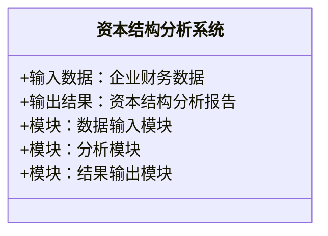
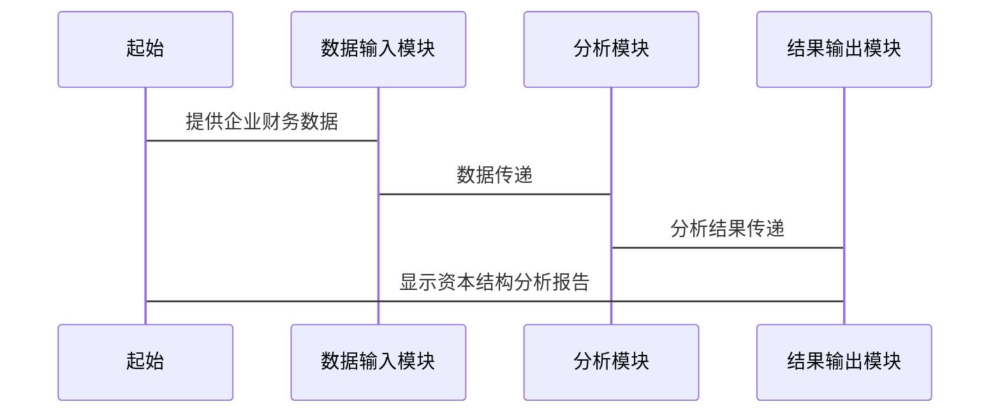

                 


# 企业估值中的资本结构分析

> 关键词：资本结构分析，企业估值，资本成本，WACC，财务风险管理，Modigliani-Miller模型

> 摘要：资本结构分析是企业估值中的核心环节，通过对资本结构的深入分析，可以有效降低资本成本，优化资本配置，提升企业价值。本文从资本结构的基本概念出发，结合数学模型和实际案例，系统阐述资本结构分析的理论基础、优化方法和系统架构，为企业估值提供理论支持和实践指导。

---

## 第1章: 资本结构的基本概念

### 1.1 资本结构的定义与重要性

资本结构是指企业各种长期资本的构成及其比例关系，包括股权资本和债务资本的组合。资本结构的合理性直接影响企业的资本成本和财务风险，进而影响企业价值。

#### 1.1.1 资本结构的定义

资本结构是企业在负债和所有者权益方面的构成比例，通常用负债占总资本的比例（$D/V$）来衡量。资本结构的优化目标是找到使加权平均资本成本（WACC）最小化的资本构成比例。

#### 1.1.2 资本结构在企业估值中的重要性

资本结构直接影响企业的资本成本和财务风险。合理的资本结构能够降低资本成本，优化资本配置，从而提升企业价值。在企业估值中，资本结构分析是计算加权平均资本成本（WACC）的重要基础，也是评估企业融资策略的重要依据。

#### 1.1.3 资本结构与企业价值的关系

资本结构与企业价值密切相关。通过优化资本结构，企业可以在保持财务稳定性的同时，降低资本成本，从而提升整体价值。资本结构的不合理可能导致企业资本成本过高，进而影响企业估值。

### 1.2 资本结构的核心要素

资本结构的核心要素包括股权资本、债务资本和混合资本。

#### 1.2.1 股权资本

股权资本是企业所有者投入的资金，包括普通股和优先股。股权资本的风险较低，但资本成本较高，因为股东要求的回报率通常较高。

#### 1.2.2 债务资本

债务资本是企业通过发行债券或银行贷款等方式筹集的资金。债务资本的风险较高，但资本成本较低，因为债权人通常要求的回报率较低。

#### 1.2.3 混合资本

混合资本是一种结合债务和股权特性的融资工具，如可转换债券。混合资本的风险和资本成本介于债务和股权之间。

---

## 第2章: 资本结构的理论基础

### 2.1 Modigliani-Miller模型

Modigliani-Miller模型是资本结构分析的重要理论基础，提出了资本结构与企业价值之间的关系。

#### 2.1.1 MM定理的基本假设

MM定理假设企业税率为零，且不存在财务困境成本。在这些假设下，企业通过增加债务可以降低加权平均资本成本（WACC），从而提升企业价值。

#### 2.1.2 MM定理的结论与启示

MM定理指出，资本结构与企业价值密切相关。在税率为零的情况下，企业可以通过增加债务来降低资本成本，从而提升企业价值。然而，在实际中，税率和财务困境成本需要考虑，因此资本结构的优化需要综合这些因素。

### 2.2 资本结构的影响因素

资本结构的优化受到多种因素的影响，包括行业特性、财务状况和市场环境。

#### 2.2.1 行业特性

不同行业的资本结构差异显著。例如，资本密集型行业（如制造业）通常依赖债务融资，而高科技行业则更倾向于股权融资。

#### 2.2.2 财务状况

企业的财务状况，如资产负债率、盈利能力等，直接影响资本结构的选择。财务状况稳健的企业可以承担较高的债务比例。

#### 2.2.3 市场环境

市场环境包括利率水平、经济周期和监管政策等，这些因素也会影响资本结构的优化。

---

## 第3章: 资本结构与企业价值的内在联系

### 3.1 资本结构对企业价值的影响

资本结构的优化直接影响企业的资本成本和财务风险，从而影响企业价值。

#### 3.1.1 资本成本的降低对企业价值的影响

通过优化资本结构，企业可以降低加权平均资本成本（WACC），从而提高企业的整体价值。例如，如果WACC降低1个百分点，企业价值可能显著提升。

#### 3.1.2 资本结构的优化对企业价值的提升

资本结构的优化需要在降低资本成本和控制财务风险之间找到平衡点。例如，适度增加债务比例可以降低资本成本，但过高的债务比例可能导致财务风险上升。

### 3.2 资本结构与企业风险的关系

资本结构与企业风险密切相关，主要体现在财务风险和经营风险两个方面。

#### 3.2.1 财务风险的定义

财务风险是指企业无法按时偿还债务或支付利息的风险。资本结构中债务比例越高，财务风险越大。

#### 3.2.2 资本结构与财务风险的相互作用

资本结构与财务风险是相互影响的。适度的债务比例可以提升企业价值，但过高的债务比例可能导致财务风险上升，进而影响企业价值。

---

## 第4章: 资本结构分析的数学模型与公式

### 4.1 资本成本的计算

资本成本是企业筹集资金的成本，包括债务资本成本和股权资本成本。

#### 4.1.1 债务资本成本的计算公式

债务资本成本（$r_d$）通常以债券的票面利率或市场利率为基础计算。公式为：

$$r_d = \frac{I}{D}$$

其中，$I$为债务的利息支出，$D$为债务的面值。

#### 4.1.2 股权资本成本的计算公式

股权资本成本（$r_e$）通常使用资本资产定价模型（CAPM）计算。公式为：

$$r_e = r_f + \beta (r_m - r_f)$$

其中，$r_f$为无风险利率，$\beta$为股票的贝塔系数，$r_m$为市场平均收益率。

#### 4.1.3 加权平均资本成本（WACC）的计算公式

加权平均资本成本公式为：

$$WACC = \frac{D}{V} \times r_d \times (1 - t) + \frac{E}{V} \times r_e$$

其中，$t$为所得税率，$D$为债务，$E$为股权，$V$为企业的总价值。

### 4.2 资本结构优化的数学模型

资本结构优化可以通过线性规划模型实现。

#### 4.2.1 MM定理的数学表达式

MM定理的数学表达式为：

$$V = \frac{E}{1 - t}$$

其中，$E$为企业的税后价值，$t$为所得税率。

#### 4.2.2 资本结构优化的线性规划模型

线性规划模型用于优化资本结构，目标是最小化加权平均资本成本。模型如下：

$$\min \quad WACC = \frac{D}{V} \times r_d \times (1 - t) + \frac{E}{V} \times r_e$$

$$s.t. \quad D + E = V$$

---

## 第5章: 资本结构分析的系统架构

### 5.1 系统分析与设计

资本结构分析系统需要收集数据、计算资本成本和优化资本结构。

#### 5.1.1 问题场景介绍

系统需要解决企业资本结构分析的问题，包括数据输入、分析模块和结果输出。

#### 5.1.2 系统功能设计（领域模型Mermaid类图）



#### 5.1.3 系统架构设计（Mermaid架构图）

```mermaid
archi
    title 资本结构分析系统架构
    模块1: 数据输入模块
    模块2: 分析模块
    模块3: 结果输出模块
    数据输入模块 --> 分析模块
    分析模块 --> 结果输出模块
```

### 5.2 系统接口与交互设计

#### 5.2.1 系统接口设计

系统接口包括数据输入接口和结果输出接口。

#### 5.2.2 系统交互流程（Mermaid序列图）



---

## 第6章: 项目实战——资本结构分析案例

### 6.1 环境安装与数据准备

#### 6.1.1 数据收集与清洗

收集某上市公司的财务数据，包括债务和股权数据。

#### 6.1.2 分析工具的安装与配置

安装Python和相关库（如Pandas、NumPy）。

### 6.2 核心算法实现

#### 6.2.1 资本成本计算的Python代码实现

```python
def calculate_wacc(D, E, r_d, r_e, t):
    V = D + E
    wacc = (D / V) * r_d * (1 - t) + (E / V) * r_e
    return wacc

D = 500  # 债务
E = 1000  # 股权
r_d = 0.05  # 债务资本成本
r_e = 0.10  # 股权资本成本
t = 0.20  # 税率

wacc = calculate_wacc(D, E, r_d, r_e, t)
print(f"加权平均资本成本为：{wacc}")
```

#### 6.2.2 资本结构优化的Python代码实现

```python
def optimize_capital_structure(D, E, r_d, r_e, t):
    V = D + E
    wacc = (D / V) * r_d * (1 - t) + (E / V) * r_e
    return wacc

# 示例数据
D_initial = 500
E_initial = 1000
r_d = 0.05
r_e = 0.10
t = 0.20

# 优化过程
D_optimal = D_initial * (1 - t) / (1 - t + r_d * (1 - t) / r_e)
E_optimal = E_initial * (1 - t) / (1 - t + r_d * (1 - t) / r_e)
wacc_optimal = optimize_capital_structure(D_optimal, E_optimal, r_d, r_e, t)
print(f"优化后的加权平均资本成本为：{wacc_optimal}")
```

### 6.3 实际案例分析

以某上市公司为例，分析其资本结构，并计算优化后的资本成本。

#### 6.3.1 数据收集与分析

收集该公司的债务、股权、利息和税率等数据。

#### 6.3.2 资本结构优化与结果解读

使用上述Python代码优化资本结构，并解读结果。

---

## 第7章: 总结与展望

### 7.1 最佳实践 tips

1. 在优化资本结构时，需要综合考虑资本成本、财务风险和市场环境。
2. 使用Modigliani-Miller模型时，需考虑税率和财务困境成本。
3. 结合实际案例，使用Python代码进行资本结构分析。

### 7.2 小结

资本结构分析是企业估值中的重要环节，通过优化资本结构，企业可以降低资本成本，提升整体价值。

### 7.3 注意事项

1. 资本结构的优化需要结合企业的实际情况。
2. 在实际应用中，需考虑多种因素的影响，如市场环境和监管政策。
3. 资本结构的优化是一个动态过程，需要定期评估和调整。

### 7.4 拓展阅读

1. 《企业财务风险管理》
2. 《资本结构优化的数学模型与应用》
3. 《Modigliani-Miller模型的扩展与应用》

---

通过以上步骤，我们系统地分析了资本结构在企业估值中的重要性，详细讲解了资本结构分析的数学模型和系统架构，并通过实际案例展示了资本结构分析的应用。希望本文能够为读者在企业估值和资本结构优化方面提供有价值的参考。

