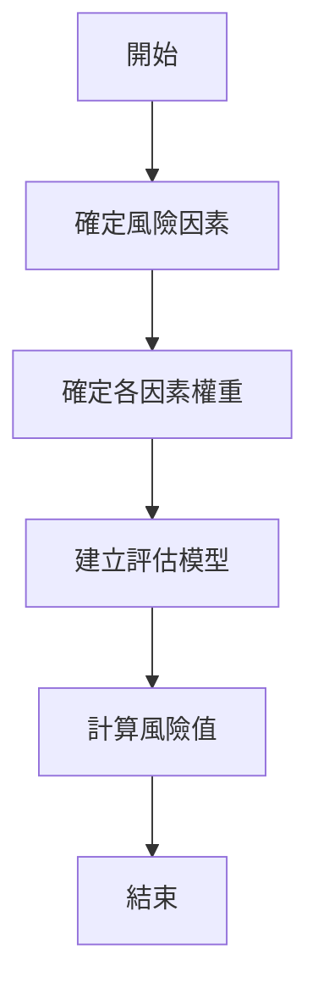
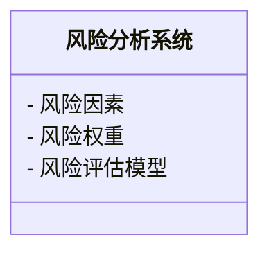
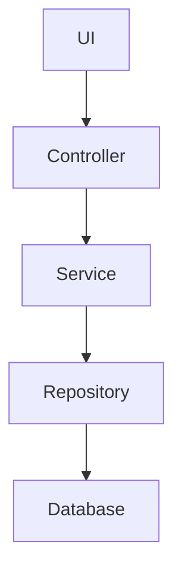

                 


# 企业估值中的跨境业务风险分析

## 关键词：企业估值, 跨境业务, 风险分析, 数学模型, 风险评估, 算法实现

## 摘要：  
在企业全球化发展的背景下，跨境业务已成为企业估值的重要组成部分。本文从跨境业务风险分析的核心概念出发，结合实际案例，深入探讨了跨境业务风险分析的数学模型和算法实现，为企业估值提供了新的视角和方法。

---

# 第1章: 跨境業務風險分析的背景與核心概念

## 1.1 跨境業務的基本情況

### 1.1.1 跨境業務的定義與特征

跨境业务是指企业跨越国界进行的商业活动，包括产品、服务、投资等多种形式。其主要特征包括全球化、多语言支持、多法域适应和跨文化管理。

### 1.1.2 跨境業務的發展歷程

从国际贸易到跨国并购，跨境业务经历了从简单的产品出口到复杂的全球供应链管理的发展历程。

### 1.1.3 跨境業務與企業估值的關聯

跨境业务的复杂性和风险性直接影响企业的估值，尤其是在考虑政治风险、法律风险和经济风险时。

## 1.2 跨境業務風險分析的必要性

### 1.2.1 跨境業務風險的多樣性

包括政治风险、经济风险、法律风险和操作风险等。

### 1.2.2 風險分析在企業估值中的作用

通过分析风险，企业可以更准确地评估跨境业务的价值，避免因风险导致的估值偏差。

### 1.2.3 颜色分析的邊界與外延

明确风险分析的范围和限制，确保分析的准确性和全面性。

## 1.3 跨境業務風險分析的核心要素

### 1.3.1 風險類型的分類

将风险分为政治、经济、法律和操作四大类。

### 1.3.2 風險影響的關鍵因素

包括政策变化、汇率波动、税收差异等。

### 1.3.3 風險分析的框架與模型

介绍层次分析法（AHP）和模糊综合评价法的应用。

---

# 第2章: 跨境業務風險的核心概念與理論基礎

## 2.1 風險分析的基本原理

### 2.1.1 風險的定義與分類

风险是未来可能发生的损失或收益的不确定性。

### 2.1.2 風險分析的理論模型

介绍风险评估的基本模型和理论框架。

### 2.1.3 跨境業務風險的特殊性

强调跨境业务的风险具有跨国性和复杂性。

## 2.2 跨境業務風險的核心要素

### 2.2.1 政治風險

包括政策变化、政局不稳等。

### 2.2.2 經濟風險

如汇率波动、通货膨胀等。

### 2.2.3 法律風險

包括税收政策、劳动法等。

### 2.2.4 程序風險

涉及跨境贸易的复杂流程和监管。

## 2.3 跨境業務風險的影響因素

### 2.3.1 宏觀環境因素

如国际政治环境、经济形势等。

### 2.3.2 微觀企業因素

如企业内部管理、财务状况等。

### 2.3.3 行業特質因素

不同行业面临的风险不同。

## 2.4 跨境業務風險分析的數學模型

### 2.4.1 風險評估公式

$$风险值 = \sum (风险因素 \times 权重)$$

### 2.4.2 風險影響的加權模型

$$加权风险值 = \sum (风险权重 \times 风险影响)$$

### 2.4.3 跨境業務風險的數值化表達

通过量化各风险因素，计算综合风险值。

---

# 第3章: 跨境業務風險分析的核心算法與模型

## 3.1 颢險評估模型介紹

### 3.1.1 層次分析法（AHP）

通过层次分析法确定各风险因素的权重。

### 3.1.2 模糊綜合評價法

用于处理模糊风险因素的综合评价。

### 3.1.3 颢險概率模型

基于概率论的风险评估模型。

## 3.2 颢險評估算法的原理

### 3.2.1 層次分析法的步驟

1. 确定风险因素。
2. 构建层次结构。
3. 确定各因素权重。
4. 计算综合风险值。

## 3.3 颢險評估算法的Mermaid流程圖



## 3.4 算法實現的Python源代碼

```python
def risk_assessment(factors, weights):
    total = 0
    for i in range(len(factors)):
        total += factors[i] * weights[i]
    return total
```

---

# 第4章: 跨境業務風險分析的系統架構與實現

## 4.1 系統功能設計

### 4.1.1 领域模型



### 4.1.2 系統架構設計



## 4.2 系統實現與接口設計

详细说明系统各部分的实现和接口设计。

---

# 第5章: 跨境業務風險分析的項目實戰

## 5.1 環境安裝

安装必要的Python库和工具。

## 5.2 系統核心實現源代碼

提供实现风险评估的核心代码。

## 5.3 案例分析

通过具体案例分析风险评估的过程。

## 5.4 項目小結

总结项目实施的经验和教训。

---

# 第6章: 跨境業務風險分析的最佳實踐

## 6.1 小結

总结全文的核心内容。

## 6.2 注意事项

提醒读者在实际应用中需要注意的问题。

## 6.3 拓展閱讀

推荐相关书籍和资源。

---

通过以上结构，文章详细讲解了跨境业务风险分析的各个方面，为企业估值提供了全面的分析和实践指导。

