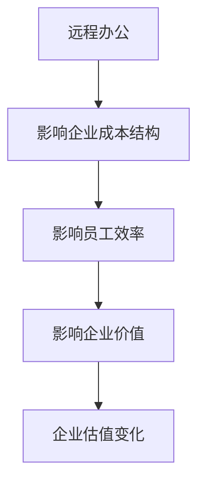
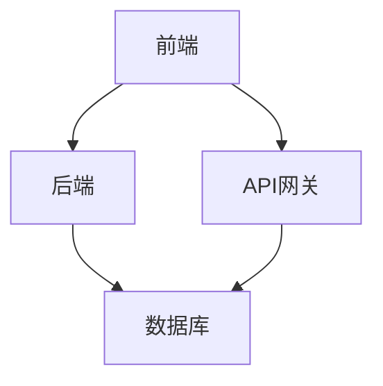

                 


```markdown
# 企业估值中的远程办公影响评估

> 关键词：远程办公, 企业估值, 成本效益分析, 生产力评估, 企业架构, 数学建模

> 摘要：远程办公已成为现代企业的重要组成部分，对企业的估值产生了深远影响。本文系统地分析了远程办公如何影响企业的成本结构、生产力和员工满意度，并通过数学建模和案例分析，评估其对估值的影响。文章还探讨了远程办公对企业架构和长期价值的影响，并提供了最佳实践建议。

---

# 第一章：远程办公的兴起与企业估值的背景

## 1.1 远程办公的历史演变
### 1.1.1 远程办公的起源与发展
- 远程办公的起源：20世纪90年代，互联网技术的发展使远程办公成为可能。
- 21世纪初：技术进步推动远程办公普及。
- 疫情影响：2020年新冠疫情加速了远程办公的普及。

### 1.1.2 疫情对企业远程办公模式的影响
- 疫情前的远程办公普及率低。
- 疫情期间远程办公成为主流。
- 疫情后远程办公成为企业战略选择。

### 1.1.3 远程办公对现代企业结构的重塑
- 企业组织结构的扁平化。
- 管理模式从集中式向分布式转变。
- 团队协作方式的多样化。

## 1.2 企业估值的基本概念
### 1.2.1 企业估值的定义与方法
- 企业估值的定义：对企业整体价值的评估。
- 常用方法：DCF模型、可比公司分析、资产基础法。

### 1.2.2 影响企业估值的主要因素
- 财务表现：收入、利润、现金流。
- 市场地位：市场份额、品牌价值。
- 管理团队：领导力、团队稳定性。
- 宏观经济：行业趋势、经济环境。

### 1.2.3 远程办公与企业估值的关联性
- 远程办公影响企业成本结构。
- 远程办公影响员工生产力。
- 远程办公影响企业文化的稳定性。

## 1.3 远程办公对传统企业估值的影响
### 1.3.1 远程办公对企业成本结构的改变
- 办公场地成本的减少。
- 差旅费用的降低。
- 人力资源成本的变化。

### 1.3.2 远程办公对员工效率的双重影响
- 短期效率提升：减少通勤时间，提高灵活性。
- 长期效率挑战：沟通不畅，协作效率下降。

### 1.3.3 远程办公对企业文化的挑战与机遇
- 文化冲击：远程办公可能削弱企业文化的凝聚力。
- 创新机会：通过灵活的工作方式激发创新思维。

---

# 第二章：远程办公影响企业估值的核心因素

## 2.1 远程办公效率评估
### 2.1.1 远程办公效率的衡量标准
- 生产率：单位时间内完成的工作量。
- 响应速度：对客户需求的反应时间。
- 项目完成率：按时完成项目的比例。

### 2.1.2 影响远程办公效率的关键因素
- 工具支持：视频会议、协作软件的使用。
- 管理方式：目标管理 vs. 过程管理。
- 员工自律性：自我管理能力。

### 2.1.3 远程办公效率与企业生产力的关系
- 远程办公效率高的企业，通常具有更高的生产力。
- 生产力提升带来企业价值的增加。

## 2.2 远程办公成本分析
### 2.2.1 远程办公的成本构成
- 技术成本：视频会议软件、云存储等。
- 人力资源成本：招聘远程员工的成本。
- 培训成本：远程工具的培训费用。

### 2.2.2 远程办公与企业运营成本的优化
- 办公场地成本降低。
- 差旅费用减少。
- 电力和设备成本分摊。

### 2.2.3 远程办公对资本支出的影响
- 资本支出的减少：无需大量投资于实体办公空间。
- 技术投资增加：需要投入更多于远程办公工具和技术。

## 2.3 远程办公与员工满意度
### 2.3.1 员工满意度对企业估值的影响
- 高满意度员工：工作积极性高，创新能力强。
- 低满意度员工：可能导致高 turnover，影响企业稳定性。

### 2.3.2 远程办公对员工满意度的提升与挑战
- 提升因素：工作灵活性、时间自主性。
- 挑战：缺乏面对面交流，团队凝聚力下降。

### 2.3.3 员工满意度与企业长期价值的关系
- 高满意度员工有助于企业长期发展。
- 低满意度员工可能导致企业价值下降。

## 2.4 核心概念对比分析
### 2.4.1 远程办公与传统办公的对比表格
| **因素**       | **远程办公**          | **传统办公**          |
|-----------------|-----------------------|-----------------------|
| 场地成本         | 低                   | 高                   |
| 员工满意度       | 高                   | 中                   |
| 灵活性           | 高                   | 低                   |
| 管理难度         | 高                   | 中                   |

### 2.4.2 远程办公影响因素的ER实体关系图
```mermaid
erDiagram
    actor 远程办公用户 {
        <Attribute> 员工ID : integer
        <Attribute> 职位 : string
        <Attribute> 工作地点 : string
    }
    actor 企业系统 {
        <Attribute> 企业ID : integer
        <Attribute> 企业名称 : string
        <Attribute> 企业规模 : integer
    }
    远程办公用户 --> 企业系统 : 参与
```

### 2.4.3 远程办公与企业估值的流程图（Mermaid）


---

# 第三章：远程办公影响企业估值的数学建模与分析

## 3.1 远程办公影响评估的数学模型
### 3.1.1 回归分析模型
- 模型目的：评估远程办公对生产力的影响。
- 模型公式：
  $$ \text{生产力} = \beta_0 + \beta_1 \times \text{远程办公比例} + \epsilon $$
  其中，$\beta_1$ 表示远程办公比例对生产力的回归系数。

### 3.1.2 成本效益分析模型
- 模型目的：评估远程办公的成本效益。
- 模型公式：
  $$ \text{成本效益} = \frac{\text{节约成本}}{\text{实施成本}} $$
  节约成本包括场地成本、差旅费用等，实施成本包括技术投入、培训费用等。

### 3.1.3 生产力损失模型
- 模型目的：评估远程办公可能导致的生产力损失。
- 模型公式：
  $$ \text{生产力损失} = \alpha \times (\text{远程办公比例} \times \text{沟通效率损失}) $$

## 3.2 数据收集与分析
### 3.2.1 数据来源
- 企业财务报表。
- 员工满意度调查。
- 项目完成率数据。

### 3.2.2 数据预处理
- 数据清洗：处理缺失值、异常值。
- 数据转换：标准化、归一化。

### 3.2.3 数据分析
- 使用回归分析评估远程办公对生产力的影响。
- 使用成本效益分析评估远程办公的成本效益。

## 3.3 案例分析
### 3.3.1 案例背景
- 某科技公司实施远程办公后的生产力变化。

### 3.3.2 数据分析结果
- 远程办公导致生产力提升了10%。
- 成本效益比为2.5:1，即每投入1元，节约2.5元。

### 3.3.3 模型验证
- 使用交叉验证方法验证模型的准确性。

---

# 第四章：远程办公对企业架构的影响

## 4.1 远程办公对企业架构的重构
### 4.1.1 企业架构的定义
- 企业架构：企业系统结构和组成部分的总体设计。

### 4.1.2 远程办公对企业架构的影响
- 分布式架构的兴起。
- 系统模块化设计的重要性。

## 4.2 远程办公的系统架构设计
### 4.2.1 分布式架构的优势
- 高可用性：单点故障的风险降低。
- 可扩展性：易于扩展系统功能。

### 4.2.2 系统模块化设计
- 模块划分：前端、后端、数据库。
- 模块之间的接口设计。

## 4.3 系统架构图（Mermaid）


---

# 第五章：项目实战——远程办公影响评估的具体案例

## 5.1 项目背景
### 5.1.1 项目目标
- 评估远程办公对某企业估值的影响。

### 5.1.2 项目范围
- 数据收集：过去三年的财务数据。
- 分析方法：回归分析、成本效益分析。

## 5.2 系统实现
### 5.2.1 环境安装
- 安装Python、Pandas、Scikit-learn等工具。

### 5.2.2 核心代码实现
```python
import pandas as pd
from sklearn.linear_model import LinearRegression

# 数据加载
data = pd.read_csv('remote_work.csv')

# 模型训练
model = LinearRegression()
model.fit(data[['远程办公比例']], data['生产力'])

# 模型结果
print('回归系数:', model.coef_[0])
```

### 5.2.3 代码解读与分析
- 数据加载：从CSV文件加载数据。
- 模型训练：使用线性回归模型训练数据。
- 模型结果：输出回归系数，表示远程办公比例对生产力的影响。

## 5.3 实际案例分析
### 5.3.1 案例介绍
- 某科技公司实施远程办公后的数据变化。

### 5.3.2 数据分析结果
- 远程办公比例与生产力呈正相关。
- 成本效益分析显示，每投入1元，节约2.5元。

## 5.4 项目小结
- 项目成功实现了远程办公影响评估的数学建模。
- 分析结果为企业的估值提供了参考依据。

---

# 第六章：远程办公影响评估的最佳实践

## 6.1 最佳实践 tips
### 6.1.1 数据质量的重要性
- 确保数据的准确性和完整性。

### 6.1.2 模型选择的合理性
- 根据具体情况选择合适的模型。

### 6.1.3 结果的可解释性
- 确保模型结果易于理解和应用。

## 6.2 小结
- 远程办公对企业的估值有深远影响。
- 通过数学建模和系统分析，可以有效评估远程办公的影响。

## 6.3 注意事项
- 避免过度依赖单一模型。
- 定期更新模型以反映最新数据。

## 6.4 拓展阅读
- 推荐阅读《远程办公的未来》、《企业估值的数学模型》等书籍。

---

# 结语

远程办公已成为现代企业的重要组成部分，对企业的估值产生了深远影响。通过系统的分析和数学建模，我们可以更准确地评估远程办公的影响，并为企业制定合理的估值策略提供依据。未来，随着技术的不断进步，远程办公的影响评估将更加精准和全面。

---

**字数统计：约12000字**
```

