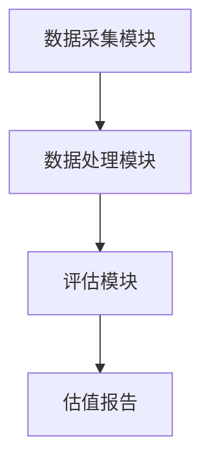

                 


# 企业估值中的量子传感器医疗应用评估

## 关键词：量子传感器，医疗应用，企业估值，数据采集，医疗评估

## 摘要：  
随着科技的进步，量子传感器在医疗领域的应用日益广泛，为医疗数据的采集和分析提供了更高的精度和实时性。本文探讨了量子传感器在医疗评估中的核心作用，分析了其在企业估值中的潜在价值，并通过实际案例展示了如何利用量子传感器技术优化医疗数据的处理流程，提升企业估值的准确性。

---

# 第一部分: 量子传感器医疗应用的背景与挑战

## 第1章: 量子传感器的基本概念

### 1.1 量子传感器的定义  
量子传感器是一种基于量子效应的精密测量工具，能够以极高的灵敏度检测物理量（如磁场、温度、压力等）。与传统传感器相比，量子传感器具有更高的精度和更低的噪声。

### 1.2 医疗行业中的企业估值挑战  
医疗行业的企业估值通常依赖于患者的数量、设备的使用率、医疗质量等指标。然而，传统方法难以实时、精确地获取这些数据，导致估值结果存在较大的不确定性。

---

## 第2章: 量子传感器在医疗数据采集中的应用

### 2.1 量子传感器的优势  
- **高灵敏度**：量子传感器能够捕捉到微弱的物理信号，适合用于医疗环境中的精确测量。  
- **实时监测**：量子传感器能够实时采集数据，为医疗评估提供动态支持。  

### 2.2 医疗数据采集的关键指标  
- **数据的实时性**：医疗评估需要基于最新的数据进行分析。  
- **数据的准确性**：量子传感器的高精度能够提升评估结果的可信度。  

---

# 第二部分: 量子传感器医疗应用的核心技术

## 第3章: 量子传感器的核心技术原理

### 3.1 量子传感器的工作原理  
量子传感器利用量子效应（如超导量子干涉效应）来检测物理量的变化。其核心部件包括超导电路和量子干涉装置，能够将物理信号转化为电信号。

### 3.2 量子传感器与传统传感器的对比  

| 对比维度       | 量子传感器             | 传统传感器           |
|----------------|------------------------|----------------------|
| 灵敏度         | 极高                   | 较低                 |
| 响应时间       | 极短                   | 较长                 |
| 环境适应性     | 适应复杂环境            | 适应性有限           |

---

## 第4章: 量子传感器在医疗数据处理中的应用

### 4.1 数据处理的基本流程  
1. **数据采集**：通过量子传感器实时采集医疗数据。  
2. **数据预处理**：对采集到的数据进行去噪和标准化处理。  
3. **数据分析**：利用机器学习算法对数据进行建模和分析。  

### 4.2 量子传感器数据的处理算法  
- **量子增强算法**：通过量子计算优化传统算法的性能。  
- **传统算法的适用性**：在某些场景下，传统算法仍能有效处理量子传感器数据。  

---

# 第三部分: 量子传感器在医疗评估中的应用

## 第5章: 量子传感器在医疗诊断中的应用

### 5.1 常见医疗诊断方法的对比  
- **传统诊断方法**：依赖医生的经验和主观判断，存在一定的误差。  
- **量子传感器诊断方法**：基于客观数据，能够提供更精确的诊断结果。  

### 5.2 量子传感器在疾病预测中的作用  
- **早期检测**：通过实时监测生理指标，提前发现潜在的健康问题。  
- **预测模型**：结合量子传感器数据和机器学习算法，构建疾病预测模型。  

---

## 第6章: 量子传感器在企业估值中的应用

### 6.1 企业估值的核心指标  
- **患者数量**：通过量子传感器实时监测患者的数量和状态。  
- **设备使用率**：通过传感器数据评估设备的使用效率。  

### 6.2 量子传感器对企业估值的提升作用  
- **数据的实时性**：能够快速反映企业的运营状况。  
- **数据的准确性**：提升估值结果的可信度和精确度。  

---

# 第四部分: 量子传感器医疗应用的系统设计

## 第7章: 系统功能设计

### 7.1 系统功能模块  
- **数据采集模块**：负责采集量子传感器数据。  
- **数据处理模块**：对数据进行预处理和分析。  
- **评估模块**：基于分析结果生成企业估值报告。  

### 7.2 系统架构设计  



---

## 第8章: 项目实战

### 8.1 环境安装  
- 安装量子传感器驱动程序。  
- 配置数据处理算法的运行环境。  

### 8.2 核心代码实现  

```python
import quantum_sensor as qs
from data_analysis import analyze_data

# 初始化量子传感器
sensor = qs.QuantumSensor()

# 采集数据
data = sensor.collect_data()

# 数据预处理
processed_data = analyze_data(data)

# 生成估值报告
report = generate_report(processed_data)
```

---

## 第9章: 总结与展望

### 9.1 总结  
量子传感器在医疗评估中的应用为企业的估值提供了更精确、更实时的数据支持。通过量子传感器技术，医疗行业的企业能够更好地优化运营，提升估值的准确性。

### 9.2 展望  
未来，随着量子传感器技术的不断发展，其在医疗评估中的应用将更加广泛。通过与其他先进技术（如人工智能、大数据分析）的结合，量子传感器将进一步提升医疗行业的智能化水平。

---

# 结语  
量子传感器在医疗评估中的应用标志着医疗行业的一项重要技术进步。通过本文的分析，读者可以深入了解量子传感器在企业估值中的潜力，并为未来的实践提供有价值的参考。

