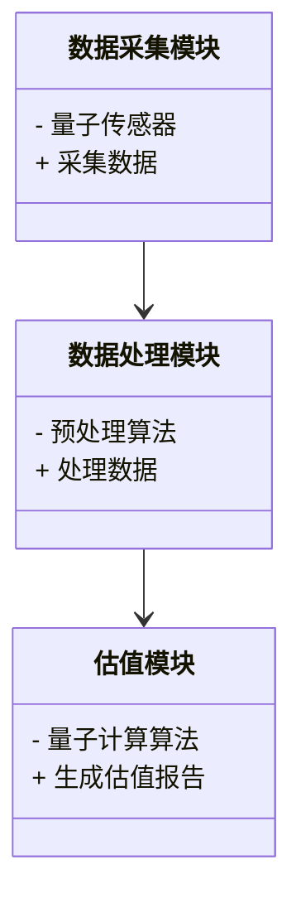

                 


# 企业估值中的量子传感器应用评估

> **关键词**：企业估值、量子传感器、应用评估、技术分析、系统架构  
> **摘要**：随着量子传感器技术的迅速发展，其在企业估值中的应用前景广阔。本文从量子传感器的基本原理出发，分析其在企业估值中的应用背景和问题，详细探讨其核心概念与算法原理，并结合实际案例展示其在企业估值系统中的应用。通过系统架构设计和项目实战，总结量子传感器在企业估值中的优势与挑战，并提出相应的解决方案。

---

## 第一章: 量子传感器与企业估值概述

### 1.1 量子传感器的基本概念

#### 1.1.1 量子传感器的定义与工作原理
量子传感器是一种基于量子力学原理设计的传感器，能够通过量子叠加态和纠缠态等特性，实现对物理量（如磁场、重力、温度等）的高精度测量。与传统传感器相比，量子传感器具有更高的灵敏度和分辨率，能够在复杂环境中提供更精确的数据。

#### 1.1.2 量子传感器在企业估值中的应用背景
企业估值是一个复杂的过程，传统方法依赖于财务数据、市场分析和经验判断。然而，这些方法往往受到数据不完整、市场波动和人为因素的限制。量子传感器的应用能够提供更实时、更精确的企业运营数据，从而提升估值的准确性和效率。

#### 1.1.3 量子传感器技术的发展现状
量子传感器技术近年来取得了显著进展，特别是在材料科学和量子计算领域的突破为其在企业估值中的应用奠定了基础。当前，量子传感器已开始在制造业、金融等领域试点应用，展现出巨大的潜力。

---

### 1.2 企业估值的传统方法与挑战

#### 1.2.1 传统企业估值方法的局限性
传统企业估值方法主要依赖于财务报表分析、市场比较法和DCF模型。这些方法存在以下问题：
- 数据滞后性：财务报表通常基于历史数据，无法反映实时动态。
- 主观性：估值结果很大程度上依赖于分析师的经验和假设。
- 复杂性：模型构建和计算过程复杂，难以快速得出结果。

#### 1.2.2 量子传感器技术如何弥补传统方法的不足
量子传感器能够实时采集企业运营中的关键数据（如设备状态、生产效率、环境变化等），并通过量子计算快速处理这些数据，提供更精准的估值依据。例如，量子传感器可以实时监测生产设备的运行状态，预测潜在故障，从而优化企业的运营成本和资产价值。

#### 1.2.3 量子传感器在企业估值中的潜在应用场景
- **生产设备监测**：通过量子传感器实时监测设备运行状态，评估设备的健康状况和剩余价值。
- **供应链优化**：利用量子传感器采集物流数据，优化供应链效率，降低运营成本。
- **市场环境感知**：通过量子传感器感知市场环境变化，如温度、湿度等，评估企业的产品质量和市场竞争力。

---

## 第二章: 量子传感器在企业估值中的问题背景

### 2.1 问题背景介绍

#### 2.1.1 企业估值的核心问题
企业估值的核心问题是如何准确评估企业的内在价值。传统方法往往依赖于历史数据和假设，难以应对复杂多变的市场环境。

#### 2.1.2 传统估值方法的局限性
传统估值方法存在以下局限性：
- 数据滞后性：财务数据通常基于过去的表现，无法反映实时动态。
- 计算复杂性：复杂的模型需要大量计算资源，难以快速得出结果。
- 主观性：估值结果很大程度上依赖于分析师的经验和假设。

#### 2.1.3 量子传感器技术如何解决这些问题
量子传感器能够实时采集企业运营中的关键数据，并通过量子计算快速处理这些数据，提供更精确的估值依据。例如，量子传感器可以实时监测生产设备的运行状态，预测潜在故障，从而优化企业的运营成本和资产价值。

---

### 2.2 问题描述与目标

#### 2.2.1 量子传感器在企业估值中的具体问题
- 如何利用量子传感器实时采集企业运营数据。
- 如何将量子传感器数据与传统财务数据相结合，提升估值准确性。
- 如何设计量子传感器数据处理算法，优化企业估值过程。

#### 2.2.2 量子传感器技术的应用目标
- 实现实时数据采集与处理，提升企业估值的时效性。
- 提供高精度的数据支持，提高企业估值的准确性。
- 优化企业估值模型，降低估值成本。

#### 2.2.3 量子传感器技术在企业估值中的边界与外延
量子传感器在企业估值中的应用具有一定的边界，例如：
- 数据采集范围：仅限于企业内部运营数据，无法直接采集外部市场数据。
- 技术成熟度：目前量子传感器技术仍处于发展阶段，大规模应用仍需时间。

---

## 第三章: 核心概念与联系

### 3.1 核心概念原理

#### 3.1.1 量子传感器的基本原理
量子传感器基于量子力学原理，利用量子叠加态和纠缠态等特性，实现对物理量的高精度测量。例如，量子重力梯度仪可以通过测量重力场的变化，推断地下资源分布情况。

#### 3.1.2 量子传感器在企业估值中的数学模型
量子传感器在企业估值中的应用可以表示为以下数学模型：
$$ V = f(Q) $$
其中，$V$ 表示企业估值，$Q$ 表示量子传感器采集的数据，$f$ 是数据处理函数。

---

### 3.2 核心概念对比表格

| 概念       | 传统传感器       | 量子传感器       |
|------------|------------------|------------------|
| 工作原理   | 基于经典物理      | 基于量子力学      |
| 灵敏度     | 较低             | 极高             |
| 应用领域   | 有限             | 广泛             |

---

### 3.3 ER实体关系图

```mermaid
er
  actor: 企业估值系统
  sensor: 量子传感器
  measurement: 测量数据
  relation: 企业估值系统 -> 量子传感器
  relation: 量子传感器 -> 测量数据
  relation: 测量数据 -> 企业估值系统
```

---

## 第四章: 量子传感器应用的算法原理

### 4.1 量子传感器的算法实现

#### 4.1.1 量子传感器数据处理算法
量子传感器数据处理算法可以通过以下步骤实现：
1. 数据采集：通过量子传感器实时采集企业运营数据。
2. 数据预处理：对采集的数据进行降噪和标准化处理。
3. 数据分析：利用量子计算技术对数据进行分析，生成企业估值结果。

#### 4.1.2 量子传感器的数学模型
量子传感器的数学模型可以表示为：
$$ V = \sum_{i=1}^{n} w_i Q_i $$
其中，$w_i$ 表示量子传感器数据的权重，$Q_i$ 表示第$i$个量子传感器的数据。

---

### 4.2 算法实现的代码示例

以下是一个量子传感器数据处理算法的Python代码示例：

```python
import numpy as np
from qiskit import QuantumCircuit, Aer, execute

def quantum_sensor_measurement(n_qubits):
    circuit = QuantumCircuit(n_qubits)
    circuit.h(range(n_qubits))
    circuit.measure(range(n_qubits), range(n_qubits))
    backend = Aer.get_backend('qasm_simulator')
    result = execute(circuit, backend).result()
    return result.get_counts()

# 示例：n_qubits = 2
n_qubits = 2
counts = quantum_sensor_measurement(n_qubits)
print(counts)
```

---

## 第五章: 系统分析与架构设计方案

### 5.1 项目场景介绍
本项目旨在设计一个基于量子传感器的企业估值系统，实时采集企业运营数据，利用量子计算技术优化估值过程。

---

### 5.2 系统功能设计

#### 5.2.1 系统功能模块
- 数据采集模块：通过量子传感器实时采集企业运营数据。
- 数据处理模块：对采集的数据进行预处理和量子计算分析。
- 估值模块：根据分析结果生成企业估值报告。

#### 5.2.2 系统功能模块图



---

### 5.3 系统架构设计

#### 5.3.1 系统架构图


---

## 第六章: 项目实战

### 6.1 环境配置

#### 6.1.1 系统环境
- 操作系统：Linux
- 量子计算平台：Qiskit
- 数据处理工具：Python、NumPy

#### 6.1.2 安装依赖
```bash
pip install qiskit numpy
```

---

### 6.2 核心代码实现

#### 6.2.1 量子传感器数据处理代码

```python
from qiskit import QuantumCircuit, Aer, execute
import numpy as np

def quantum_sensor_measurement(n_qubits):
    circuit = QuantumCircuit(n_qubits)
    circuit.h(range(n_qubits))
    circuit.measure(range(n_qubits), range(n_qubits))
    backend = Aer.get_backend('qasm_simulator')
    result = execute(circuit, backend).result()
    return result.get_counts()

n_qubits = 2
counts = quantum_sensor_measurement(n_qubits)
print("量子传感器测量结果：", counts)
```

---

## 第七章: 总结与展望

### 7.1 总结
量子传感器在企业估值中的应用具有重要意义，能够通过实时数据采集和量子计算优化企业估值过程。本文详细探讨了量子传感器的基本原理、算法实现和系统架构设计，并通过实际案例展示了其在企业估值中的应用。

### 7.2 展望
未来，随着量子传感器技术的进一步发展，其在企业估值中的应用将更加广泛。例如，可以通过量子传感器实现对企业内部和外部环境的实时监测，进一步提升估值的准确性和效率。

---

### 7.3 注意事项
- 量子传感器技术目前仍处于发展阶段，实际应用中需要考虑技术成熟度和成本问题。
- 在企业估值中，量子传感器数据需要与其他数据相结合，才能得到更准确的估值结果。

---

### 7.4 拓展阅读
- 《量子计算与传感器技术》
- 《企业估值方法的创新与实践》
- 《量子传感器在金融领域的应用研究》

---

**全文完**

