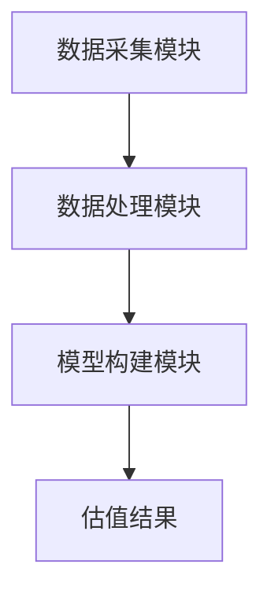
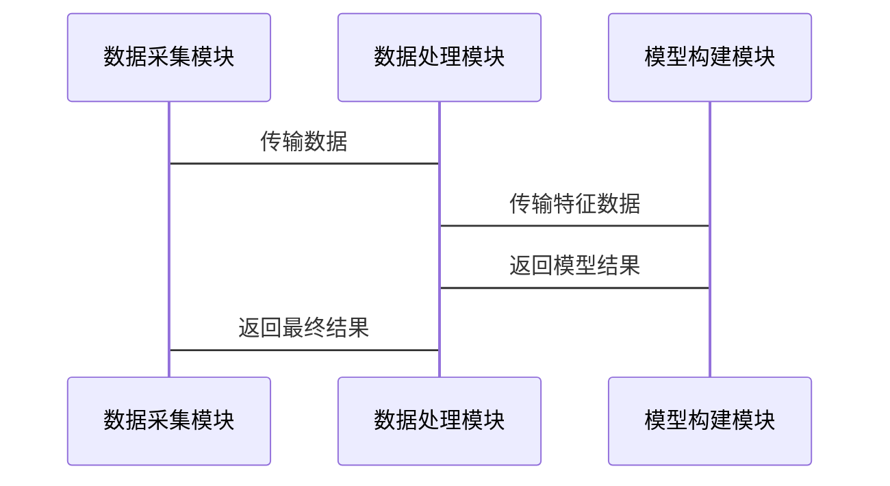

                 


# 企业估值中的量子传感器应用评估

> 关键词：量子传感器, 企业估值, 数据分析, 传感器技术, 估值模型

> 摘要：本文深入探讨了量子传感器在企业估值中的应用，分析了其在数据采集、分析和建模中的优势，结合实际案例，详细阐述了量子传感器技术对企业估值的创新意义和实现方法。

---

## 第1章: 量子传感器的基本概念与应用背景

### 1.1 量子传感器的定义与原理

量子传感器是一种基于量子力学原理设计的精密测量工具，能够以极高的灵敏度和精度检测物理量（如磁场、重力、位置等）。与传统传感器相比，量子传感器利用量子纠缠、叠加和测量的特性，能够在更复杂的环境中获取更精确的数据。

#### 量子传感器的核心特征
- **高灵敏度**：量子传感器能够在极弱的信号中检测到变化。
- **高精度**：能够在微米甚至更小的尺度上进行测量。
- **快速响应**：量子传感器的响应速度远超传统传感器。

### 1.2 企业估值的传统方法与挑战

企业估值是企业财务管理中的核心任务，传统方法主要包括：
- **资产评估法**：基于资产的账面价值进行估值。
- **收益评估法**：基于未来现金流的折现值进行评估。
- **市场评估法**：基于可比企业的市场价值进行评估。

#### 传统估值方法的局限性
- 数据采集单一：传统方法依赖财务数据，难以捕捉企业动态变化。
- 数据分析维度有限：传统模型难以处理复杂的企业内外部关系。
- 数据处理耗时：传统方法依赖人工分析，效率较低。

### 1.3 量子传感器在企业估值中的应用前景

量子传感器在企业估值中的应用前景广阔，主要体现在：
- **数据采集的新维度**：量子传感器能够采集更精细的企业运行数据。
- **数据分析的新方法**：量子传感器数据支持更复杂的建模和分析。
- **估值模型的新构建方式**：量子传感器技术能够提升企业估值的准确性和实时性。

---

## 第2章: 量子传感器的核心技术与类型

### 2.1 量子传感器的核心技术

#### 2.1.1 量子纠缠原理
量子纠缠是指两个或多个量子系统之间存在关联，即使相隔遥远，其中一个系统的状态会立即影响另一个系统。这一特性使得量子传感器能够在远距离下进行高精度测量。

#### 2.1.2 量子叠加原理
量子叠加原理允许量子系统同时处于多个状态，这为量子传感器提供了并行处理数据的能力。

#### 2.1.3 量子测量原理
量子测量是指在量子系统中进行非破坏性测量，能够在不干扰系统的情况下获取信息。

### 2.2 量子传感器的类型

#### 2.2.1 基于光子的量子传感器
- 使用光子的量子特性进行测量，适用于磁场和重力测量。

#### 2.2.2 基于原子的量子传感器
- 使用原子的量子特性进行测量，适用于时间测量和重力测量。

#### 2.2.3 基于超导电路的量子传感器
- 使用超导电路的量子特性进行测量，适用于电磁场测量。

### 2.3 量子传感器的性能指标

#### 2.3.1 灵敏度
量子传感器的灵敏度是指其能够检测到的最小信号变化。

#### 2.3.2 精度
量子传感器的精度是指其测量值与真实值的接近程度。

#### 2.3.3 响应时间
量子传感器的响应时间是指其从输入信号到输出测量结果所需的时间。

---

## 第3章: 企业估值的传统方法与量子传感器评估的对比

### 3.1 传统企业估值方法概述

#### 3.1.1 资产评估法
- 优点：简单易行，适合资产密集型企业。
- 缺点：忽略企业动态变化和外部环境影响。

#### 3.1.2 收益评估法
- 优点：考虑了未来现金流，适合成长型企业。
- 缺点：模型复杂，需要大量假设。

#### 3.1.3 市场评估法
- 优点：基于市场数据，具有可比性。
- 缺点：受市场波动影响较大。

### 3.2 量子传感器评估方法的创新

#### 3.2.1 数据采集的新维度
量子传感器能够采集企业运行中的实时数据，包括设备状态、环境变化等。

#### 3.2.2 数据分析的新方法
量子传感器数据支持量子计算和机器学习算法，能够进行更复杂的建模和分析。

#### 3.2.3 估值模型的新构建方式
量子传感器技术能够提升企业估值模型的准确性和实时性。

### 3.3 两种方法的对比与融合

#### 3.3.1 传统方法与量子传感器方法的对比
- 数据来源：传统方法依赖财务数据，量子传感器方法依赖实时数据。
- 分析方法：传统方法依赖统计分析，量子传感器方法依赖量子计算和机器学习。

#### 3.3.2 方法融合的可能性
- 综合使用财务数据和实时数据，构建更全面的估值模型。

#### 3.3.3 融合后的优势分析
- 提高估值的准确性和实时性。

---

## 第4章: 量子传感器在企业估值中的具体应用

### 4.1 数据采集与处理

#### 4.1.1 量子传感器的数据采集过程
- 数据采集：通过量子传感器获取企业运行中的实时数据。
- 数据预处理：对采集到的数据进行清洗和标准化处理。

#### 4.1.2 数据分析与建模
- 数据特征提取：识别数据中的关键特征。
- 模型构建：基于量子传感器数据构建估值模型。

### 4.2 数据分析与建模

#### 4.2.1 数据预处理
- 数据清洗：去除异常值和噪声数据。
- 数据标准化：将数据标准化到统一的尺度。

#### 4.2.2 数据特征提取
- 通过机器学习算法提取数据中的关键特征。

#### 4.2.3 量子传感器数据建模
- 使用量子计算和机器学习算法进行建模。

---

## 第5章: 量子传感器的数据分析与建模

### 5.1 数据预处理

#### 5.1.1 数据清洗
- 通过量子传感器采集的数据可能存在噪声和异常值，需要进行清洗。

#### 5.1.2 数据标准化
- 将数据标准化到统一的尺度，以便后续分析。

### 5.2 数据特征提取

#### 5.2.1 使用机器学习算法提取特征
- 使用主成分分析（PCA）等方法提取数据中的关键特征。

### 5.3 量子传感器数据建模

#### 5.3.1 使用量子计算和机器学习算法进行建模
- 构建量子机器学习模型，基于量子传感器数据进行建模和预测。

---

## 第6章: 量子传感器的系统架构设计

### 6.1 系统功能设计

#### 6.1.1 数据采集模块
- 负责采集量子传感器数据。

#### 6.1.2 数据处理模块
- 负责数据预处理和特征提取。

#### 6.1.3 模型构建模块
- 负责基于量子传感器数据构建估值模型。

### 6.2 系统架构设计

#### 6.2.1 系统架构图


#### 6.2.2 系统接口设计
- 数据采集模块与数据处理模块之间的接口。
- 数据处理模块与模型构建模块之间的接口。

### 6.3 系统交互设计

#### 6.3.1 系统交互序列图


---

## 第7章: 量子传感器项目实战

### 7.1 环境安装

#### 7.1.1 安装量子传感器硬件
- 需要安装量子传感器硬件设备。

#### 7.1.2 安装量子传感器软件
- 安装量子传感器数据采集和处理软件。

### 7.2 系统核心实现

#### 7.2.1 数据采集代码
```python
import quantum_sensor

def collect_data():
    data = quantum_sensor.collect()
    return data

# 示例代码
data = collect_data()
print(data)
```

#### 7.2.2 数据处理代码
```python
import numpy as np

def preprocess_data(data):
    # 数据清洗
    cleaned_data = np.where(data > 0, data, 0)
    # 数据标准化
    normalized_data = (cleaned_data - np.mean(cleaned_data)) / np.std(cleaned_data)
    return normalized_data

# 示例代码
processed_data = preprocess_data(data)
print(processed_data)
```

#### 7.2.3 模型构建代码
```python
from sklearn.decomposition import PCA

def build_model(data):
    # 特征提取
    pca = PCA(n_components=2)
    features = pca.fit_transform(data)
    return features

# 示例代码
features = build_model(processed_data)
print(features)
```

### 7.3 案例分析

#### 7.3.1 案例背景
- 某制造企业希望通过量子传感器技术进行估值。

#### 7.3.2 数据分析
- 采集企业设备运行数据，进行预处理和特征提取。

#### 7.3.3 模型构建与验证
- 使用量子传感器数据构建估值模型，并进行验证。

---

## 第8章: 总结与展望

### 8.1 本章小结
- 量子传感器在企业估值中的应用具有广阔前景。
- 量子传感器技术能够提升企业估值的准确性和实时性。

### 8.2 最佳实践 tips
- 数据采集：确保量子传感器数据的准确性和实时性。
- 数据分析：结合量子计算和机器学习算法进行建模。
- 系统架构：设计合理的系统架构，确保数据流的高效处理。

### 8.3 未来展望
- 量子传感器技术的进一步发展将推动企业估值的创新。
- 量子传感器与其他技术的结合将为企业估值提供更多的可能性。

---

通过以上内容，我们可以看到量子传感器在企业估值中的应用具有重要意义。量子传感器技术能够提升企业估值的准确性和实时性，为企业决策提供更有力的支持。

