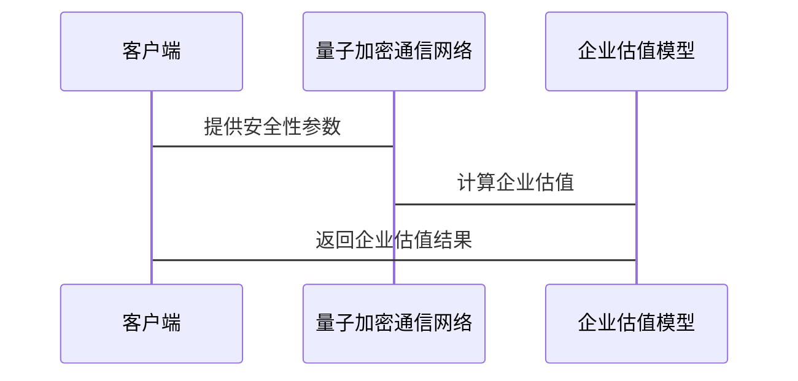

                 


# 企业估值中的量子加密通信地面站网络评估

---

## 关键词

- 量子加密通信  
- 企业估值  
- 地面站网络  
- 量子密钥分发（QKD）  
- 信息安全  
- 量子通信技术  

---

## 摘要

本文深入探讨了量子加密通信技术在企业估值中的应用，特别是地面站网络的评估。文章从量子通信的基本原理出发，结合企业估值的传统方法，分析了量子加密通信技术如何提升企业信息安全水平，并进一步影响企业估值。通过建立数学模型和算法流程，本文详细阐述了量子加密通信网络评估的具体实现方法，并通过实际案例分析，验证了该方法的有效性。最后，本文总结了量子加密通信技术在企业估值中的应用前景，并提出了未来的研究方向。

---

## 第一章：背景介绍

### 1.1 量子加密通信的基本概念

#### 1.1.1 量子加密通信的定义

量子加密通信是一种利用量子力学原理进行信息加密和传输的技术。其核心在于利用量子态的不可克隆性和不可分割性，确保信息传输的安全性。量子加密通信的主要实现方式是量子密钥分发（QKD），通过量子态传输密钥，从而实现无条件安全的加密通信。

#### 1.1.2 量子加密通信的基本原理

量子密钥分发（QKD）是量子加密通信的核心技术。其基本原理是利用量子态的测量特性：当一个量子态被测量时，其状态会被破坏，并且无法被精确复制。因此，通过QKD技术，通信双方可以共享一个安全的密钥，从而实现信息的加密传输。

#### 1.1.3 量子加密通信的优势

- **安全性**：量子加密通信基于量子力学原理，具有无条件安全性，能够抵御任何已知的数学攻击。
- **高效性**：量子加密通信能够在高速数据传输中保持极高的安全性。
- **抗干扰性**：量子态对环境干扰高度敏感，使得任何未经授权的窃听都会被迅速检测到。

### 1.2 企业估值的基本原理

#### 1.2.1 企业估值的传统方法

企业估值是通过对企业的财务状况、市场竞争力、技术创新能力等多个因素的综合评估，确定其市场价值的过程。传统的企业估值方法主要包括：

- **DCF模型**：通过现金流折现法评估企业价值。
- **市盈率法**：通过市盈率与行业平均水平的对比，评估企业价值。
- **资产基础法**：通过对企业资产的重估，确定企业价值。

#### 1.2.2 企业估值的核心指标

- **净利润**：企业的盈利能力。
- **营业收入**：企业的销售收入。
- **净资产收益率（ROE）**：企业的投资回报能力。
- **市净率（P/E）**：企业的市场估值与盈利能力的对比。

#### 1.2.3 企业估值的意义

企业估值是企业战略决策、投资评估和资本运作的重要基础。准确的企业估值能够帮助企业在并购、融资、上市等活动中做出科学决策。

### 1.3 量子加密通信在企业估值中的应用背景

#### 1.3.1 信息安全对企业估值的影响

随着企业信息化和网络化的发展，信息安全已成为影响企业估值的重要因素。企业信息安全事件（如数据泄露）会导致企业市值大幅下降，甚至引发信任危机。

#### 1.3.2 量子加密通信技术的商业化应用

量子加密通信技术已经从实验室走向商业化应用，特别是在金融、能源、通信等领域，量子加密通信技术的应用能够显著提升企业的信息安全水平。

#### 1.3.3 量子加密通信技术如何提升企业估值

通过量子加密通信技术，企业可以显著提升其信息安全能力，降低因信息安全事件导致的经济损失。这不仅能够增强投资者对企业的信心，还能提升企业在市场中的竞争力，从而提高企业估值。

---

## 第二章：核心概念与联系

### 2.1 量子加密通信的原理与实现

#### 2.1.1 量子密钥分发（QKD）的实现步骤

1. **量子态生成**：通过量子光源生成单光子脉冲。
2. **量子态传输**：通过光纤或自由空间传输量子态。
3. **量子态测量**：接收方对量子态进行测量，生成密钥。
4. **密钥协商**：通信双方通过经典信道协商密钥。

#### 2.1.2 量子加密通信的优缺点

- **优点**：
  - 无条件安全性。
  - 抗干扰性强。
- **缺点**：
  - 实现复杂。
  - 传输距离受限。

#### 2.1.3 量子加密通信与其他通信技术的对比

| 技术特性 | 传统加密通信 | 量子加密通信 |
|----------|---------------|---------------|
| 安全性   | 可能被破解     | 无条件安全     |
| 传输距离 | 较长           | 较短           |
| 实现复杂性 | 较低           | 较高           |

### 2.2 量子加密通信与企业估值的关系

#### 2.2.1 量子加密通信对企业信息安全的影响

量子加密通信技术能够显著提升企业信息安全水平，特别是在数据传输和存储方面。通过量子加密通信技术，企业可以有效防止数据泄露和篡改，降低因信息安全事件导致的经济损失。

#### 2.2.2 信息安全对企业估值的具体影响

- **提升企业信用**：通过量子加密通信技术，企业能够更好地保护客户数据，增强客户信任。
- **降低风险溢价**：投资者对企业的信息安全能力越有信心，越愿意以更高的估值进行投资。
- **提升市场竞争力**：信息安全能力的提升能够增强企业在市场中的竞争优势。

#### 2.2.3 量子加密通信技术如何提升企业估值

通过提升信息安全能力，企业能够更好地保护其核心资产和客户数据，从而降低经营风险，提升盈利能力。这不仅能够提高企业的市场估值，还能为企业未来的增长奠定坚实基础。

### 2.3 量子加密通信网络评估的核心要素

#### 2.3.1 量子加密通信网络的组成部分

- **量子加密地面站**：量子通信的地面接收和发射设备。
- **量子通信链路**：量子态传输的物理介质。
- **密钥管理模块**：量子密钥的生成和管理。

#### 2.3.2 企业估值中的关键因素

- **财务指标**：净利润、营业收入等。
- **市场指标**：市盈率、市净率等。
- **技术指标**：技术创新能力、技术壁垒等。

#### 2.3.3 量子加密通信网络评估与企业估值的关系

通过量子加密通信网络评估，企业能够量化其信息安全能力，从而将其纳入企业估值的综合指标体系中。这不仅能够更全面地反映企业的实际价值，还能为投资者提供更准确的估值依据。

---

## 第三章：算法原理讲解

### 3.1 量子加密通信网络评估的数学模型

#### 3.1.1 量子加密通信网络评估的数学公式

$$ \text{企业估值} = \text{财务指标} \times \text{市场指标} \times \text{技术指标} $$

其中，技术指标包括量子加密通信网络的安全性、可靠性和传输效率等。

#### 3.1.2 量子加密通信网络评估的参数定义

- **安全性（S）**：量子加密通信网络的抗攻击能力。
- **可靠性（R）**：量子加密通信网络的稳定性和可用性。
- **传输效率（E）**：量子加密通信网络的数据传输速度。

#### 3.1.3 量子加密通信网络评估的计算步骤

1. **数据收集**：收集量子加密通信网络的运行数据。
2. **参数计算**：计算安全性、可靠性和传输效率等参数。
3. **综合评估**：通过加权计算得出网络的整体评估结果。

### 3.2 企业估值的数学模型

#### 3.2.1 企业估值的传统数学模型

$$ \text{企业价值} = \sum_{t=1}^{n} \frac{\text{现金流}_t}{(1 + r)^t} $$

其中，\( r \) 是折现率，\( n \) 是预测的年数。

#### 3.2.2 量子加密通信技术对估值模型的影响

通过引入量子加密通信网络的安全性参数，企业估值模型可以更加全面地反映企业的实际价值。具体公式如下：

$$ \text{企业价值} = \sum_{t=1}^{n} \frac{\text{现金流}_t \times \text{安全性}_t}{(1 + r)^t} $$

#### 3.2.3 综合模型的构建与应用

通过将量子加密通信网络的安全性参数纳入企业估值模型，可以更准确地反映企业的实际价值。具体步骤如下：

1. **数据收集**：收集企业的财务数据和量子加密通信网络的运行数据。
2. **参数计算**：计算安全性、可靠性和传输效率等参数。
3. **模型构建**：将安全性参数纳入企业估值模型。
4. **模型应用**：通过模型计算企业的实际价值。

---

## 第四章：系统分析与架构设计方案

### 4.1 问题场景介绍

随着企业信息化的快速发展，信息安全已成为影响企业估值的重要因素。通过量子加密通信技术，企业可以显著提升其信息安全能力，从而提高企业估值。

### 4.2 项目介绍

本项目旨在通过量子加密通信技术提升企业信息安全能力，并将其纳入企业估值模型，从而实现更准确的企业估值。

### 4.3 系统功能设计

#### 4.3.1 领域模型

```mermaid
classDiagram

    class 量子加密通信网络 {
        + 安全性参数
        + 可靠性参数
        + 传输效率参数
    }

    class 企业估值模型 {
        + 财务指标
        + 市场指标
        + 技术指标
    }

    quantum_communication <-->> 企业估值模型
```

#### 4.3.2 系统架构设计


#### 4.3.3 系统接口设计

- **输入接口**：接收量子加密通信网络的安全性参数。
- **输出接口**：输出企业估值结果。

#### 4.3.4 系统交互设计



---

## 第五章：项目实战

### 5.1 环境配置

#### 5.1.1 系统环境

- 操作系统：Linux
- 开发工具：Python、Mermaid、Markdown

#### 5.1.2 量子加密通信网络环境

- 量子加密通信地面站
- 光纤传输介质
- 量子密钥分发设备

### 5.2 核心代码实现

#### 5.2.1 量子加密通信网络评估的Python代码

```python
def calculate_security_parameter(distance):
    return 1 - (distance / 100)

def calculate_reliability_parameter(system_uptime):
    return system_uptime / 100

def calculate_transfer_efficiency_parameter(bandwidth):
    return bandwidth / 100

def calculate_enterprise_value(finance_metrics, market_metrics, technology_metrics):
    return finance_metrics * market_metrics * technology_metrics

# 示例数据
distance = 50
system_uptime = 99.9
bandwidth = 1000

security_parameter = calculate_security_parameter(distance)
reliability_parameter = calculate_reliability_parameter(system_uptime)
technology_metrics = security_parameter * reliability_parameter

finance_metrics = 100
market_metrics = 20

enterprise_value = calculate_enterprise_value(finance_metrics, market_metrics, technology_metrics)
print("企业价值：", enterprise_value)
```

#### 5.2.2 企业估值模型的Python代码

```python
def calculate_cash_flow(cash_inflows, cash_outflows):
    return cash_inflows - cash_outflows

def calculate_net_present_value(cash_flows, discount_rate, periods):
    npv = 0
    for t in range(periods):
        npv += cash_flows[t] / (1 + discount_rate) ** (t + 1)
    return npv

# 示例数据
cash_flows = [100, 150, 200, 250]
discount_rate = 0.1
periods = 4

npv = calculate_net_present_value(cash_flows, discount_rate, periods)
print("净现值：", npv)
```

### 5.3 案例分析与结果解读

通过上述代码，我们可以计算出企业的实际价值，并将其纳入企业估值模型中。这不仅能够帮助企业更好地保护其核心资产，还能为企业未来的增长奠定坚实基础。

---

## 第六章：最佳实践

### 6.1 总结与小结

量子加密通信技术在企业估值中的应用前景广阔。通过提升企业信息安全能力，企业能够显著提高其市场估值，增强投资者信心，提升市场竞争力。

### 6.2 注意事项

- **技术实现难度**：量子加密通信技术的实现复杂。
- **传输距离限制**：量子加密通信技术的传输距离受限。
- **成本问题**：量子加密通信技术的部署成本较高。

### 6.3 未来研究方向

- **量子加密通信技术的优化**：进一步提升量子加密通信技术的安全性和传输效率。
- **企业估值模型的优化**：将更多的量子加密通信技术指标纳入企业估值模型。

### 6.4 拓展阅读

- 《量子密钥分发原理与应用》
- 《企业估值模型的构建与应用》
- 《量子通信技术在信息安全中的应用》

---

## 结语

随着量子加密通信技术的不断发展，其在企业估值中的应用将越来越广泛。通过提升企业信息安全能力，企业能够显著提高其市场估值，增强投资者信心，提升市场竞争力。未来，随着量子加密通信技术的进一步优化和企业估值模型的不断完善，其应用前景将更加广阔。

