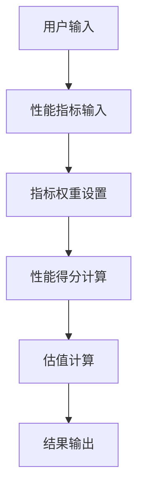
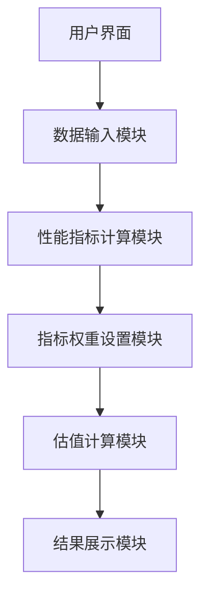

                 


# 企业估值中的量子点显示技术应用评估

> 关键词：企业估值，量子点显示技术，技术评估，显示技术，企业价值

> 摘要：本文从量子点显示技术的基本概念出发，分析其在企业估值中的应用背景与核心价值。通过详细的技术原理与企业估值方法的结合，探讨如何利用量子点显示技术的创新性与高性能，提升企业的市场竞争力与估值能力。文章内容涵盖量子点显示技术的物理特性、显示性能、企业估值的核心要素、量子点显示技术对企业价值的影响机制、技术评估模型的构建与实现、系统设计与项目实战等多方面内容，为读者提供全面而深入的技术分析与实践指导。

---

## 第一部分: 量子点显示技术与企业估值的背景介绍

### 第1章: 量子点显示技术的基本概念

#### 1.1 量子点显示技术的定义与特点
量子点显示技术是一种基于纳米材料的显示技术，其核心是利用量子点的光电特性实现高效、精准的色彩显示。与传统显示技术相比，量子点显示技术具有以下特点：
- **高色域**：量子点能够发出纯度极高的单色光，覆盖更广的色域范围，提升显示效果。
- **广视角**：量子点显示技术在不同角度下都能保持高亮度和高色彩饱和度。
- **低能耗**：通过优化光利用效率，量子点显示技术能够在相同亮度下降低能耗。

#### 1.2 量子点显示技术的市场现状
量子点显示技术近年来在显示领域的应用逐渐普及，尤其是在高端显示器、电视、手机屏幕等领域。根据市场调研，量子点显示技术的市场增长率持续高于传统显示技术，主要原因是其在色彩表现、能效比和显示效果上的显著优势。

#### 1.3 量子点显示技术与企业估值的结合点
量子点显示技术的创新性和高性能能够显著提升企业的市场竞争力，从而影响企业的估值。具体而言，量子点显示技术的应用可以提升产品的市场占有率、品牌溢价能力以及技术创新能力，这些都是企业估值的重要考量因素。

---

### 第2章: 企业估值的基本概念与方法

#### 2.1 企业估值的定义与重要性
企业估值是指对企业整体或部分股权的价值进行评估的过程，是企业融资、并购、上市等商业活动中的重要决策依据。准确的企业估值能够帮助企业合理分配资源、优化资本结构，同时也为投资者提供重要的参考依据。

#### 2.2 传统企业估值方法的局限性
传统的企业估值方法主要包括DCF模型、EV/EBITDA倍数法、市盈率法等，这些方法在实际应用中存在以下局限性：
- **假设条件的限制**：传统模型往往假设企业处于稳定经营状态，难以应对快速变化的市场环境。
- **数据依赖性强**：传统估值方法需要大量的历史财务数据，但在新兴技术和快速迭代的产业中，历史数据的参考性有限。
- **技术创新的忽视**：传统方法难以充分考虑技术创新对企业价值的影响。

#### 2.3 量子点显示技术对企业估值的影响
量子点显示技术作为一种创新性技术，能够显著提升企业的市场竞争力和技术创新能力，从而影响企业的估值。具体而言，量子点显示技术的应用可以提升企业的：
- **技术壁垒**：通过掌握量子点显示技术的核心专利，企业能够形成技术壁垒，增强市场竞争力。
- **成本优势**：量子点显示技术的高能效和低材料消耗能够降低生产成本，提升企业的盈利能力。
- **品牌溢价**：通过提供更高性能的产品，企业能够提升品牌形象，获得更高的市场溢价。

---

### 第3章: 量子点显示技术与企业估值的结合

#### 3.1 量子点显示技术在企业估值中的应用背景
随着显示技术的不断进步，量子点显示技术已经成为显示领域的重要技术之一。在企业估值中，量子点显示技术的应用背景主要体现在以下方面：
- **技术创新驱动市场增长**：量子点显示技术的创新性能够推动显示行业的技术进步，从而影响企业的市场地位。
- **高性能产品提升企业价值**：通过应用量子点显示技术，企业能够推出性能更优的产品，从而提升企业的市场竞争力和估值能力。
- **技术标准化与产业化**：量子点显示技术的标准化和产业化进程为企业的技术评估提供了重要依据。

#### 3.2 量子点显示技术在企业估值中的核心价值
量子点显示技术在企业估值中的核心价值主要体现在以下几个方面：
- **技术创新能力**：量子点显示技术的创新性能够提升企业的技术能力，从而增强企业的核心竞争力。
- **市场前景与商业价值**：量子点显示技术的广泛应用前景为企业带来更大的市场空间和商业价值。
- **技术评估与风险控制**：通过量子点显示技术的应用，企业能够更好地评估技术风险，优化技术投资决策。

---

## 第二部分: 量子点显示技术与企业估值的核心概念与联系

### 第4章: 量子点显示技术的原理与属性

#### 4.1 量子点显示技术的物理原理
量子点显示技术的核心是利用纳米材料的光电特性。量子点是一种直径在纳米尺度的半导体颗粒，其发光特性可以通过调节颗粒的尺寸和形状来实现。当量子点受到激发（如电场或光场）时，会发出特定波长的光，从而实现色彩显示。

#### 4.2 量子点显示技术的核心属性
量子点显示技术的核心属性包括：
- **高色域**：量子点能够实现100%的NTSC色域覆盖，远超传统显示技术的色域范围。
- **广视角**：量子点显示技术在不同视角下都能保持高色彩饱和度和亮度。
- **低能耗**：通过优化光利用效率，量子点显示技术能够在相同亮度下降低能耗。

#### 4.3 量子点显示技术与传统显示技术的对比
以下是量子点显示技术与传统显示技术（如LCD、OLED）的对比：

| 对比维度       | 量子点显示技术       | LCD显示技术       | OLED显示技术       |
|----------------|----------------------|-------------------|-------------------|
| 色域范围         | 高，100% NTSC         | 中，72% NTSC        | 高，接近100% NTSC  |
| 视角性能         | 广，视角影响小         | 窄，视角影响大       | 较广，视角影响小     |
| 能耗           | 低                   | 中高               | 中低               |
| 寿命           | 长                   | 中                 | 长                 |
| 亮度           | 高                   | 中高               | 高                 |
| 价格           | 中高                 | 中                 | 高                 |

---

### 第5章: 量子点显示技术与企业估值的核心要素

#### 5.1 企业估值的核心要素
企业估值的核心要素包括：
- **财务表现**：收入、利润、现金流等财务指标。
- **市场地位**：市场占有率、品牌影响力等。
- **技术能力**：技术创新能力、技术专利数量等。
- **管理团队**：管理能力、团队稳定性等。
- **行业环境**：行业发展趋势、竞争格局等。

#### 5.2 量子点显示技术对企业估值的影响机制
量子点显示技术通过以下机制影响企业估值：
- **提升产品性能**：量子点显示技术能够提升产品的显示效果，从而提高产品的市场竞争力和售价。
- **增强技术壁垒**：通过掌握量子点显示技术的核心专利，企业能够形成技术壁垒，防止竞争对手的模仿。
- **降低生产成本**：量子点显示技术的高能效和低材料消耗能够降低生产成本，提升企业的盈利能力。
- **提升品牌形象**：通过提供更高性能的产品，企业能够提升品牌形象，获得更高的市场溢价。

---

## 第三部分: 量子点显示技术与企业估值的算法原理

### 第6章: 量子点显示技术评估模型的构建

#### 6.1 量子点显示技术评估模型的基本思路
量子点显示技术评估模型的基本思路是：通过量化量子点显示技术的性能指标（如色域覆盖率、亮度、能耗等），结合企业的市场表现（如市场份额、品牌溢价等），构建一个综合评估模型，从而为企业估值提供参考。

#### 6.2 量子点显示技术评估模型的数学模型
量子点显示技术评估模型的数学模型如下：

$$
\text{企业估值} = \text{基础估值} \times \left(1 + \beta \times \text{量子点显示技术性能提升}\right)
$$

其中：
- $\text{基础估值}$：企业在不考虑量子点显示技术的情况下，基于传统技术的估值。
- $\beta$：量子点显示技术性能提升的权重系数。
- $\text{量子点显示技术性能提升}$：量子点显示技术相对于传统显示技术的性能提升幅度。

---

### 第7章: 量子点显示技术评估模型的实现

#### 7.1 量子点显示技术性能指标的量化
量子点显示技术的性能指标包括：
- 色域覆盖率（Color Gamut Coverage）
- 亮度（Brightness）
- 对比度（Contrast Ratio）
- 响应时间（Response Time）
- 能耗（Power Consumption）

#### 7.2 量子点显示技术评估模型的实现步骤
1. **数据收集**：收集量子点显示技术的性能指标数据，包括色域覆盖率、亮度、对比度等。
2. **指标权重确定**：根据企业估值的核心要素，确定各个性能指标的权重。
3. **性能得分计算**：基于性能指标数据，计算量子点显示技术的性能得分。
4. **估值计算**：结合性能得分和权重，计算量子点显示技术对企业估值的提升幅度。

---

## 第四部分: 量子点显示技术与企业估值的系统设计

### 第8章: 系统功能设计

#### 8.1 量子点显示技术评估系统的核心功能
- **性能指标输入**：输入量子点显示技术的性能指标数据。
- **指标权重设置**：设置各个性能指标的权重。
- **性能得分计算**：计算量子点显示技术的性能得分。
- **估值计算**：基于性能得分和权重，计算量子点显示技术对企业估值的提升幅度。

#### 8.2 量子点显示技术评估系统的功能架构
以下是量子点显示技术评估系统的功能架构图：



---

### 第9章: 系统架构设计

#### 9.1 量子点显示技术评估系统的架构设计
以下是量子点显示技术评估系统的架构图：



---

## 第五部分: 量子点显示技术与企业估值的项目实战

### 第10章: 项目环境与工具安装

#### 10.1 开发环境
- **操作系统**：Windows 10或更高版本
- **开发工具**：Python 3.9+
- **依赖库**：numpy, pandas, matplotlib

#### 10.2 系统核心实现源代码
以下是量子点显示技术评估模型的Python实现代码：

```python
import numpy as np
import pandas as pd
import matplotlib.pyplot as plt

# 数据输入
performance_metrics = {
    'Color Gamut Coverage': 100,
    'Brightness': 95,
    'Contrast Ratio': 85,
    'Response Time': 70,
    'Power Consumption': 65
}

# 指标权重
weights = {
    'Color Gamut Coverage': 0.4,
    'Brightness': 0.3,
    'Contrast Ratio': 0.2,
    'Response Time': 0.1,
    'Power Consumption': 0.0
}

# 性能得分计算
performance_score = np.dot(list(performance_metrics.values()), list(weights.values()))

# 估值计算
base_valuation = 100  # 假设基础估值为100
beta = 0.1  # 性能提升权重
valuation_increase = beta * performance_score
total_valuation = base_valuation * (1 + valuation_increase)

print(f"量子点显示技术性能得分：{performance_score}")
print(f"量子点显示技术估值提升幅度：{valuation_increase}")
print(f"量子点显示技术总估值：{total_valuation}")
```

---

### 第11章: 项目小结与注意事项

#### 11.1 项目小结
通过本项目的实施，我们成功构建了一个基于量子点显示技术的企业估值评估模型。该模型能够量化量子点显示技术的性能指标，评估其对企业估值的提升幅度，为企业的技术投资决策提供了重要的参考依据。

#### 11.2 注意事项
在实际应用中，需要注意以下几点：
- **数据的准确性**：性能指标数据的准确性直接影响估值结果，因此需要确保数据的来源可靠。
- **模型的适用性**：模型的适用性需要根据企业的具体情况进行调整，避免“一刀切”。
- **技术的前沿性**：量子点显示技术是一个快速发展的领域，需要及时关注技术的最新进展。

---

## 第六部分: 总结与拓展阅读

### 第12章: 最佳实践与小结

#### 12.1 最佳实践
- **技术创新驱动企业价值**：通过量子点显示技术的创新，企业可以显著提升市场竞争力和估值能力。
- **技术评估与风险控制**：在技术评估过程中，需要充分考虑技术的商业化潜力和市场风险。
- **持续关注技术发展**：量子点显示技术是一个快速发展的领域，企业需要持续关注技术的最新进展，及时调整技术战略。

#### 12.2 小结
通过本文的分析与实践，我们深入探讨了量子点显示技术在企业估值中的应用价值。量子点显示技术的创新性与高性能能够显著提升企业的市场竞争力和估值能力，为企业在显示领域的发展提供了重要的技术支撑。

---

### 第13章: 注意事项与拓展阅读

#### 13.1 注意事项
- **技术评估的复杂性**：企业估值是一个复杂的过程，需要综合考虑多种因素，不能仅依赖单一技术的评估。
- **技术的商业化能力**：量子点显示技术的商业化能力是影响企业估值的重要因素，需要在评估过程中予以充分考虑。
- **行业竞争格局**：企业需要充分了解行业的竞争格局，制定合理的技术战略。

#### 13.2 拓展阅读
- **量子点显示技术的市场分析**：建议深入研究量子点显示技术的市场发展趋势，了解主要竞争对手的技术布局。
- **量子点显示技术的专利分析**：通过专利分析，了解企业在量子点显示技术领域的技术储备和竞争优势。
- **量子点显示技术的应用案例**：研究量子点显示技术在不同领域的应用案例，总结成功经验与失败教训。

---

通过本文的系统分析与实践，我们为读者提供了一个全面而深入的技术分析与实践指南，帮助读者更好地理解和应用量子点显示技术在企业估值中的价值。

