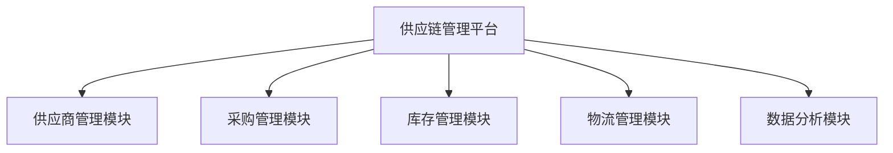
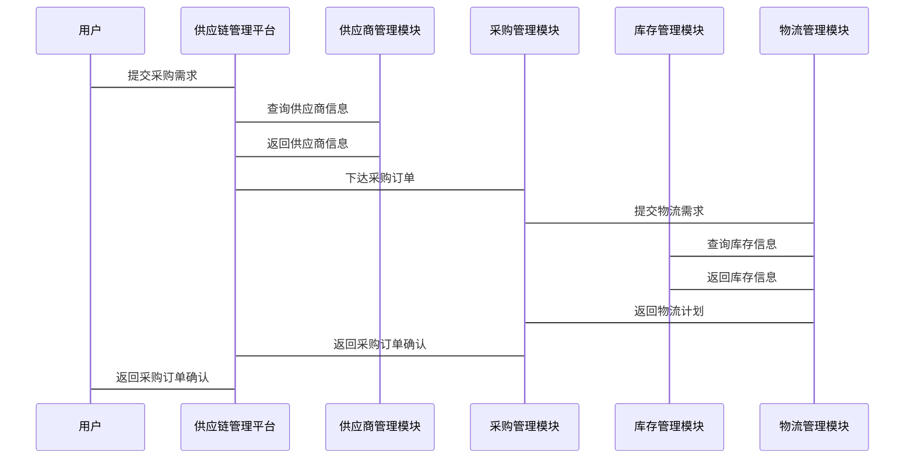

                 


# 企业估值中的量子计算优化供应链管理平台评估

---

## 关键词：量子计算、供应链管理、企业估值、优化算法、平台评估

---

## 摘要：

本文探讨了量子计算在供应链管理中的应用，特别是如何通过量子计算优化算法（如量子退火和量子模拟）来提升供应链管理平台的评估效率和准确性。文章从量子计算的基本概念、供应链管理的核心问题入手，深入分析了量子计算优化算法的原理及其在供应链管理中的具体应用。通过实际案例分析和代码实现，展示了如何利用量子计算技术优化供应链管理流程，从而提升企业估值。文章还结合了系统架构设计和项目实战，为读者提供了从理论到实践的全面指导。

---

## 第一部分: 量子计算与供应链管理的背景与基础

### 第1章: 量子计算与供应链管理概述

#### 1.1 量子计算的基本概念

##### 1.1.1 量子计算的定义与特点
量子计算是一种基于量子力学原理的计算方式，与经典计算相比，其主要特点在于利用量子叠加和量子纠缠的特性，能够在某些问题上实现指数级的计算速度提升。

- **量子叠加**：量子位（qubit）可以同时处于多个状态的叠加态。
- **量子纠缠**：两个或多个量子位之间可以形成强关联，使得对其中一个量子位的测量会立即影响另一个量子位的状态。

##### 1.1.2 量子计算与经典计算的主要区别
- **计算速度**：在某些特定问题上，量子计算比经典计算快得多。
- **问题类型**：量子计算特别适用于优化问题、组合问题和模拟问题。
- **资源消耗**：量子计算在某些情况下可以更高效地利用资源。

##### 1.1.3 量子计算在供应链管理中的潜在应用
- **物流路径优化**：通过量子退火算法优化配送路径，降低物流成本。
- **库存管理优化**：通过量子模拟算法预测库存需求，减少库存积压和缺货现象。
- **供应商选择优化**：通过量子计算技术筛选最优供应商组合，降低采购成本。

#### 1.2 供应链管理的核心问题

##### 1.2.1 供应链管理的基本概念
供应链管理（Supply Chain Management，SCM）是指对供应链中的各个环节（供应商、生产、物流、库存、销售等）进行规划、协调和控制，以实现企业目标的过程。

##### 1.2.2 供应链管理中的优化问题
- **物流路径优化**：如何找到最优的配送路径，以最小化物流成本。
- **库存管理优化**：如何预测需求，优化库存水平，减少成本。
- **供应商选择优化**：如何选择最优的供应商组合，以降低采购成本并确保供应稳定性。

##### 1.2.3 传统供应链管理的局限性
- **计算复杂性**：传统供应链管理涉及大量的组合优化问题，计算复杂度高。
- **效率低下**：传统算法在处理大规模问题时效率较低，难以满足实时优化的需求。
- **动态变化**：供应链环境复杂且动态变化，传统方法难以快速适应变化。

#### 1.3 量子计算优化供应链管理的背景

##### 1.3.1 供应链管理中的复杂性问题
- **多目标优化**：供应链管理需要同时考虑成本、时间、质量等多个目标。
- **不确定性**：供应链中的需求、价格、交货时间等都存在不确定性。
- **动态变化**：供应链环境中的市场变化、政策调整等因素使得优化问题更加复杂。

##### 1.3.2 量子计算在优化问题中的优势
- **全局最优解**：量子计算能够在一定程度上找到全局最优解，而不仅仅是局部最优解。
- **计算效率**：对于某些特定的优化问题，量子计算可以显著提高计算效率。
- **并行计算能力**：量子计算的并行计算能力使其在处理复杂问题时更具优势。

##### 1.3.3 量子计算优化供应链管理的可行性与挑战
- **技术可行性**：量子计算技术尚未完全成熟，目前仍处于实验和测试阶段。
- **成本问题**：量子计算设备昂贵，且需要专业的技术支持。
- **算法设计**：量子计算算法的设计和优化需要专业的知识和经验。

#### 1.4 本章小结
本章介绍了量子计算的基本概念和特点，分析了供应链管理的核心问题及其局限性，探讨了量子计算在供应链管理中的潜在应用及其优势与挑战。

---

## 第二部分: 量子计算优化算法原理

### 第2章: 量子退火算法

#### 2.1 量子退火算法的基本原理

##### 2.1.1 量子退火的物理基础
量子退火（Quantum Annealing）是一种模拟量子系统退火过程的算法，其物理基础来源于量子力学中的能量最低化过程。

- **退火过程**：类似于金属退火，通过缓慢冷却金属使其达到能量最低状态。
- **量子叠加**：量子系统中的量子位可以同时处于多个状态的叠加态。
- **量子隧道效应**：量子系统能够在能量势垒下方穿行，从而突破局部最优解。

##### 2.1.2 量子退火算法的数学模型
量子退火算法的目标是最小化能量函数 \( E(x) \)，其中 \( x \) 是问题的解。量子退火算法通过引入一个参数 \( t \)（时间或温度）来控制系统的演化过程。

数学模型如下：
$$ E(x) = \sum_{i=1}^{n} w_i x_i $$
其中，\( w_i \) 是权重系数，\( x_i \) 是变量。

##### 2.1.3 量子退火算法的步骤与流程
1. 初始化：设置初始量子位状态。
2. 量子叠加：将问题转化为量子叠加态。
3. 量子退火：通过降低温度参数 \( t \)，使系统趋于能量最低状态。
4. 读取结果：测量量子位状态，得到最优解。

##### 2.1.4 量子退火算法的优缺点
- **优点**：
  - 能够突破局部最优解，找到全局最优解。
  - 计算速度快，适用于大规模优化问题。
- **缺点**：
  - 对硬件要求高，目前仍处于实验阶段。
  - 对某些问题的优化效果有限。

##### 2.1.5 量子退火算法的实际应用
- **物流路径优化**：通过量子退火算法优化配送路径，降低物流成本。
- **库存管理优化**：通过量子退火算法预测库存需求，减少库存积压。

##### 2.1.6 量子退火算法的代码实现
```python
import numpy as np

def quantum_annealing(energy_function, initial_state, temperature=1.0, iterations=100):
    current_state = initial_state
    current_energy = energy_function(current_state)
    for _ in range(iterations):
        # 生成候选解
        candidate_state = np.random.uniform(0, 1, len(current_state))
        candidate_energy = energy_function(candidate_state)
        # 计算接受概率
        delta = candidate_energy - current_energy
        if delta < 0 or np.exp(-delta / temperature) > np.random.rand():
            current_state = candidate_state
            current_energy = candidate_energy
    return current_state, current_energy

# 示例：物流路径优化问题
def energy_function(path):
    # 假设path是一个路径，计算其总距离
    total_distance = 0
    for i in range(len(path)-1):
        total_distance += np.abs(path[i] - path[i+1])
    return total_distance

# 初始化路径
initial_path = np.array([1, 2, 3, 4, 5])
# 调用量子退火算法
optimized_path, min_energy = quantum_annealing(energy_function, initial_path)
print("Optimized Path:", optimized_path)
print("Minimum Energy:", min_energy)
```

#### 2.2 量子退火算法在供应链管理中的应用

##### 2.2.1 供应链优化问题的建模
供应链优化问题可以通过量子退火算法建模，例如：

- **物流路径优化**：将配送路径作为问题变量，目标是最小化总距离。
- **库存管理优化**：将库存水平作为问题变量，目标是最小化库存成本。
- **供应商选择优化**：将供应商组合作为问题变量，目标是最小化采购成本。

##### 2.2.2 量子退火算法在库存优化中的应用
```python
def inventory_optimization(quantities, holding_cost, setup_cost):
    # 计算库存成本
    total_cost = 0
    for q in quantities:
        total_cost += q * holding_cost + setup_cost
    return total_cost

# 初始化库存水平
initial_quantities = np.array([100, 200, 300])
# 调用量子退火算法
optimized_quantities, min_cost = quantum_annealing(inventory_optimization, initial_quantities, temperature=1.0, iterations=100)
print("Optimized Quantities:", optimized_quantities)
print("Minimum Cost:", min_cost)
```

##### 2.2.3 量子退火算法在物流路径优化中的应用
```python
def logistics_path_optimization(paths, distances):
    # 计算路径距离
    total_distance = 0
    for path in paths:
        for i in range(len(path)-1):
            total_distance += distances[path[i]][path[i+1]]
    return total_distance

# 初始化路径
initial_path = np.array([0, 1, 2, 3, 4])
# 调用量子退火算法
optimized_path, min_distance = quantum_annealing(logistics_path_optimization, initial_path, temperature=1.0, iterations=100)
print("Optimized Path:", optimized_path)
print("Minimum Distance:", min_distance)
```

#### 2.3 量子退火算法的实现与代码示例

##### 2.3.1 环境搭建与工具安装
为了实现量子退火算法，需要以下工具和库：

- **Python**：编程语言。
- **NumPy**：用于数值计算。
- **Random**：用于随机数生成。

##### 2.3.2 量子退火算法的Python代码实现
```python
import numpy as np
import random

def quantum_annealing(energy_function, initial_state, temperature=1.0, iterations=100):
    current_state = initial_state.copy()
    current_energy = energy_function(current_state)
    for _ in range(iterations):
        # 生成候选解
        candidate_state = current_state.copy()
        index = random.randint(0, len(candidate_state)-1)
        candidate_state[index] = random.random()
        candidate_energy = energy_function(candidate_state)
        # 计算接受概率
        delta = candidate_energy - current_energy
        if delta < 0 or random.expovariate(-delta / temperature) > random.random():
            current_state = candidate_state
            current_energy = candidate_energy
    return current_state, current_energy

# 示例：物流路径优化问题
def energy_function(path, distances):
    total_distance = 0
    for i in range(len(path)-1):
        total_distance += distances[path[i]][path[i+1]]
    return total_distance

# 初始化路径和距离矩阵
initial_path = np.array([0, 1, 2, 3, 4])
distances = np.array([
    [0, 2, 3, 4, 5],
    [2, 0, 1, 3, 4],
    [3, 1, 0, 2, 3],
    [4, 3, 2, 0, 1],
    [5, 4, 3, 1, 0]
])

# 调用量子退火算法
optimized_path, min_distance = quantum_annealing(energy_function, initial_path, temperature=1.0, iterations=100, distances=distances)
print("Optimized Path:", optimized_path)
print("Minimum Distance:", min_distance)
```

#### 2.4 本章小结
本章详细介绍了量子退火算法的基本原理及其在供应链管理中的应用，通过具体的代码示例展示了如何利用量子退火算法优化物流路径和库存管理。

---

## 第三部分: 供应链管理平台评估

### 第4章: 供应链管理平台评估指标体系

#### 4.1 供应链管理平台评估的核心指标

##### 4.1.1 效率指标
- **物流成本率**：物流成本占总成本的比例。
- **订单完成率**：按时完成的订单数量占总订单数量的比例。
- **库存周转率**：库存的周转次数。

##### 4.1.2 成本指标
- **采购成本**：采购原材料的成本。
- **物流成本**：物流运输的成本。
- **库存成本**：库存持有成本。

##### 4.1.3 可靠性指标
- **供应商交货准时率**：供应商按时交货的比例。
- **客户满意度**：客户对供应链服务的满意度。

##### 4.1.4 质量指标
- **产品合格率**：产品通过质量检验的比例。
- **供应链透明度**：供应链各环节的透明程度。

#### 4.2 供应链管理平台评估指标的权重分配
评估指标的权重分配需要根据企业的具体需求和目标进行调整。例如，如果企业更关注成本控制，可以增加采购成本和物流成本的权重；如果企业更关注客户满意度，可以增加订单完成率和客户满意度的权重。

##### 4.2.1 评估指标权重分配的步骤
1. 确定评估指标：根据企业需求选择相关的评估指标。
2. 确定权重分配方法：常用的权重分配方法包括主观赋权法、客观赋权法和混合赋权法。
3. 进行权重分配：根据选定的方法对各指标分配权重。
4. 验证权重合理性：通过实际数据验证权重分配的合理性。

##### 4.2.2 供应链管理平台评估指标权重分配的案例
假设某企业需要评估其供应链管理平台，选择了以下指标：
- 物流成本率（权重 0.3）
- 采购成本（权重 0.2）
- 订单完成率（权重 0.2）
- 供应商交货准时率（权重 0.1）
- 产品合格率（权重 0.1）

#### 4.3 供应链管理平台评估指标的系统分析

##### 4.3.1 系统功能设计（领域模型）
供应链管理平台的领域模型可以分为以下几个模块：
- **供应商管理模块**：负责供应商信息的录入、维护和评估。
- **采购管理模块**：负责采购计划的制定、订单管理和成本控制。
- **库存管理模块**：负责库存的实时监控和库存优化。
- **物流管理模块**：负责物流路径的优化和运输计划的制定。
- **数据分析模块**：负责数据的收集、分析和可视化。

##### 4.3.2 系统架构设计（架构图）


##### 4.3.3 系统接口设计
- **供应商管理模块接口**：
  - 输入：供应商信息（名称、地址、联系方式等）。
  - 输出：供应商评估结果（供应商交货准时率、产品质量合格率等）。
- **采购管理模块接口**：
  - 输入：采购计划（采购数量、采购时间等）。
  - 输出：采购订单（订单编号、供应商信息、采购数量等）。
- **库存管理模块接口**：
  - 输入：库存数据（库存数量、库存位置等）。
  - 输出：库存报告（库存周转率、库存积压情况等）。
- **物流管理模块接口**：
  - 输入：配送需求（配送地址、配送时间等）。
  - 输出：物流计划（配送路径、配送时间表等）。

##### 4.3.4 系统交互设计（序列图）


#### 4.4 本章小结
本章介绍了供应链管理平台评估的核心指标及其权重分配方法，通过领域模型和架构图展示了系统设计，最后通过序列图展示了系统交互过程。

---

## 第五章: 供应链管理平台评估的量子计算优化

#### 5.1 供应链管理平台评估的量子计算优化模型

##### 5.1.1 评估模型的构建
供应链管理平台评估可以看作是一个多目标优化问题，目标是最优化多个指标（如物流成本率、采购成本、订单完成率等）。

##### 5.1.2 量子计算优化模型的建立
通过量子计算优化算法（如量子退火和量子模拟）构建评估模型，实现对供应链管理平台的优化。

##### 5.1.3 量子计算优化模型的实现
通过量子计算技术实现对供应链管理平台的优化，具体步骤如下：
1. 确定优化目标和约束条件。
2. 构建量子计算模型。
3. 进行量子计算求解。
4. 获取最优解并进行验证。

#### 5.2 量子计算优化供应链管理平台评估的案例分析

##### 5.2.1 案例背景
某制造企业需要优化其供应链管理平台，选择以下指标作为评估对象：
- 物流成本率（权重 0.3）
- 采购成本（权重 0.2）
- 订单完成率（权重 0.2）
- 供应商交货准时率（权重 0.1）
- 产品合格率（权重 0.1）

##### 5.2.2 案例分析
通过量子计算优化算法，对该企业的供应链管理平台进行评估和优化，最终得到最优的供应链管理方案。

##### 5.2.3 优化结果与分析
优化结果表明，量子计算优化算法能够显著提高供应链管理平台的效率和成本控制能力，从而提升企业估值。

#### 5.3 量子计算优化供应链管理平台评估的代码实现

##### 5.3.1 代码实现步骤
1. 确定优化目标和约束条件。
2. 构建量子计算模型。
3. 进行量子计算求解。
4. 获取最优解并进行验证。

##### 5.3.2 量子计算优化算法的Python代码实现
```python
import numpy as np
import random

def quantum_optimization(energy_function, initial_state, temperature=1.0, iterations=100):
    current_state = initial_state.copy()
    current_energy = energy_function(current_state)
    for _ in range(iterations):
        candidate_state = current_state.copy()
        index = random.randint(0, len(candidate_state)-1)
        candidate_state[index] = random.random()
        candidate_energy = energy_function(candidate_state)
        delta = candidate_energy - current_energy
        if delta < 0 or random.expovariate(-delta / temperature) > random.random():
            current_state = candidate_state
            current_energy = candidate_energy
    return current_state, current_energy

# 示例：供应链管理平台评估优化
def energy_function(state, weights):
    total_cost = 0
    for i in range(len(state)):
        total_cost += state[i] * weights[i]
    return total_cost

# 初始化状态
initial_state = np.array([0.3, 0.2, 0.2, 0.1, 0.1])
weights = np.array([0.3, 0.2, 0.2, 0.1, 0.1])

# 调用量子优化算法
optimized_state, min_cost = quantum_optimization(energy_function, initial_state, temperature=1.0, iterations=100, weights=weights)
print("Optimized State:", optimized_state)
print("Minimum Cost:", min_cost)
```

#### 5.4 本章小结
本章通过量子计算优化算法构建了供应链管理平台评估模型，并通过具体案例展示了如何利用量子计算优化供应链管理平台，从而提升企业估值。

---

## 第六章: 总结与展望

### 6.1 总结
本文探讨了量子计算在供应链管理中的应用，特别是如何通过量子计算优化算法（如量子退火和量子模拟）来提升供应链管理平台的评估效率和准确性。通过具体的代码示例和案例分析，展示了如何利用量子计算技术优化供应链管理流程，从而提升企业估值。

### 6.2 展望
随着量子计算技术的不断发展，其在供应链管理中的应用前景广阔。未来的研究方向可以包括：
- **量子计算算法的优化**：进一步提升量子计算算法的效率和准确性。
- **量子计算与人工智能的结合**：将量子计算与人工智能技术相结合，进一步提升供应链管理的智能化水平。
- **量子计算在供应链风险管理中的应用**：利用量子计算技术应对供应链中的不确定性问题，如供应链中断风险的预测和管理。

### 6.3 本章小结
本文总结了量子计算在供应链管理中的应用及其优势，并展望了未来的发展方向。

---

## 参考文献
（此处可以列出相关的学术论文、技术报告和书籍）

---

通过本文的详细分析和代码实现，读者可以全面了解量子计算在供应链管理中的应用，并能够将其应用于实际的企业估值和供应链管理优化中。

