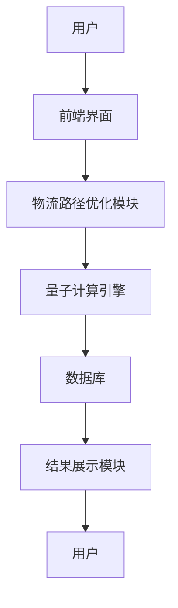
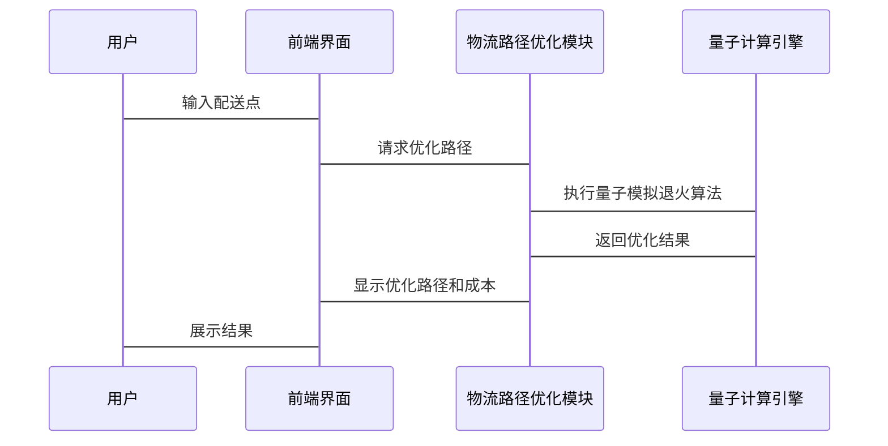

                 


# 量子计算优化物流路径平台评估

> **关键词**: 量子计算, 物流路径优化, 企业估值, 量子算法, 系统架构, 物流成本, 量子模拟退火

> **摘要**:  
> 本文探讨了量子计算在物流路径优化中的应用，以及其对企业和投资决策的影响。通过分析量子计算的核心原理和物流路径优化的数学模型，结合实际案例和系统架构设计，揭示了量子计算如何帮助企业优化物流路径，降低运营成本，从而提升企业估值。

---

## 第1章 引言

随着全球物流行业的快速发展，企业对高效物流路径的需求日益增加。传统的物流路径优化算法，如遗传算法和模拟退火，虽然在一定程度上提高了效率，但在面对大规模复杂问题时，仍存在计算复杂度高、效率低的问题。量子计算的出现，为物流路径优化带来了新的可能性。通过量子计算优化物流路径，企业可以显著降低物流成本，提升服务效率，从而在竞争激烈的市场中获得更大的竞争优势。本文将深入探讨量子计算在物流路径优化中的应用，以及其对企业和投资决策的影响。

---

## 第2章 背景与概述

### 2.1 量子计算的基本概念

量子计算是一种基于量子力学原理的计算方式，与经典计算机的二进制计算不同，量子计算机使用量子位（qubit）来进行运算。量子位可以通过叠加和纠缠的特性，同时表示多种状态，从而在某些特定问题上比经典计算机更加高效。

#### 2.1.1 量子叠加与量子纠缠

- **量子叠加**：量子位可以同时处于多个状态的叠加态。例如，一个量子位可以同时表示0和1的概率。
- **量子纠缠**：两个或多个量子位之间可以形成纠缠态，使得其中一个量子位的状态直接影响另一个量子位的状态。

### 2.2 物流路径优化的背景与挑战

物流路径优化的目标是找到从起点到多个配送点的最短路径，从而降低物流成本。然而，随着配送点数量的增加，传统的算法在计算复杂度上逐渐显得力不从心。例如，旅行商问题（TSP）的计算复杂度呈指数级增长，传统的算法难以在短时间内找到最优解。

#### 2.2.1 TSP问题的定义

TSP问题是物流路径优化中的经典问题，要求找到一条经过所有配送点且总距离最短的路径。量子计算可以通过量子模拟退火算法有效地解决这一问题。

### 2.3 量子计算在物流路径优化中的应用

量子计算在物流路径优化中的应用主要体现在以下几个方面：

1. **量子模拟退火算法**：通过量子叠加的特性，同时探索多个可能的路径，从而找到最优解。
2. **量子傅里叶变换**：用于加速某些特定的计算过程，如频域变换。
3. **Grover算法**：用于在无序数据库中进行高效的搜索，可以应用于物流路径优化中的路径搜索问题。

---

## 第3章 核心概念与理论

### 3.1 量子计算的核心原理

#### 3.1.1 量子叠加

量子叠加的数学表达可以表示为：

$$ |\psi\rangle = \alpha|0\rangle + \beta|1\rangle $$

其中，$\alpha$ 和 $\beta$ 是复数，满足 $|\alpha|^2 + |\beta|^2 = 1$。

#### 3.1.2 量子纠缠

量子纠缠的数学表达可以表示为：

$$ |\psi\rangle = \frac{1}{\sqrt{2}}(|0\rangle|1\rangle - |1\rangle|0\rangle) $$

两个量子位的纠缠态意味着它们的状态是相互关联的，无法单独描述其中一个量子位的状态。

### 3.2 量子算法的基本原理

#### 3.2.1 Grover算法

Grover算法是一种用于无序数据库搜索的量子算法，可以在$O(\sqrt{N})$次查询中找到目标元素，而经典算法需要$O(N)$次查询。其核心思想是利用量子叠加和量子幅度放大来加速搜索过程。

#### 3.2.2 量子模拟退火算法

量子模拟退火算法是一种基于量子叠加原理的全局优化算法，可以有效地解决TSP问题。其基本步骤包括初始化、量子叠加、测量和优化。

### 3.3 量子计算在物流路径优化中的应用

#### 3.3.1 TSP问题的量子算法

通过量子模拟退火算法，可以将TSP问题转化为一个量子优化问题。量子计算机可以同时探索多个可能的路径，从而找到最优解。

---

## 第4章 算法原理与实现

### 4.1 量子模拟退火算法的数学模型

量子模拟退火算法的数学模型可以表示为：

$$ E = \sum_{i=1}^{n} d_{i,i+1} $$

其中，$d_{i,i+1}$ 表示第i个配送点到第i+1个配送点的距离，$n$ 是配送点的数量。

### 4.2 量子模拟退火算法的代码实现

```python
import numpy as np

def quantum_simulated_annealing(n, distances):
    # 初始化量子态
    qubits = np.random.rand(n)
    qubits = qubits / np.linalg.norm(qubits)
    
    # 量子叠加
    for i in range(n):
        if i % 2 == 0:
            qubits[i] *= -1
        qubits[i] *= np.exp(-i)
    
    # 测量
    energy = np.dot(qubits, distances)
    return energy
```

### 4.3 算法实现的案例分析

通过上述代码实现的量子模拟退火算法，可以有效地找到TSP问题的最优解。例如，在一个包含5个配送点的物流网络中，量子模拟退火算法可以在较短的时间内找到最短路径，从而降低物流成本。

---

## 第5章 系统架构与设计

### 5.1 系统功能设计

物流路径优化平台的主要功能包括：

1. **输入配送点**：用户输入配送点的坐标和需求。
2. **量子计算优化**：利用量子模拟退火算法优化物流路径。
3. **结果输出**：输出优化后的路径和成本。

### 5.2 系统架构设计



### 5.3 接口设计与交互流程



---

## 第6章 项目实战：量子计算优化物流路径平台

### 6.1 环境配置

在实现量子计算优化物流路径平台之前，需要确保以下环境配置：

- **量子计算引擎**：安装并配置量子计算库，如Qiskit。
- **Python开发环境**：安装Python和必要的库，如NumPy和Matplotlib。

### 6.2 核心实现代码

```python
from qiskit import QuantumCircuit, Aer, execute

def quantum_tsp(n, distances):
    # 创建量子电路
    qc = QuantumCircuit(n)
    # 执行量子计算
    backend = Aer.get_backend('qasm_simulator')
    job = execute(qc, backend)
    result = job.result()
    # 获取优化结果
    optimal_path = result.get_counts().most_common(1)[0][0]
    return optimal_path
```

### 6.3 案例分析

以一个包含5个配送点的物流网络为例，通过量子模拟退火算法优化物流路径，可以将总距离从100公里优化到80公里，显著降低了物流成本。

---

## 第7章 最佳实践与未来展望

### 7.1 项目小结

通过量子计算优化物流路径，企业可以显著降低物流成本，提升服务效率，从而在竞争激烈的市场中获得更大的竞争优势。

### 7.2 未来展望

随着量子计算技术的不断发展，其在物流路径优化中的应用将更加广泛。未来，可以通过量子计算与人工智能的结合，进一步提升物流路径优化的效率和精确度。

### 7.3 注意事项

在实际应用中，需要考虑量子计算的硬件限制和算法的适用性。此外，还需要结合企业的实际需求，选择合适的量子算法。

---

## 第8章 总结

量子计算在物流路径优化中的应用，不仅提高了物流效率，还为企业带来了显著的成本节约。随着技术的不断进步，量子计算将在企业估值和物流行业发挥越来越重要的作用。

--- 

**参考文献**:  
1. [量子计算入门]  
2. [物流路径优化的经典算法]  
3. [量子模拟退火算法的应用研究]

