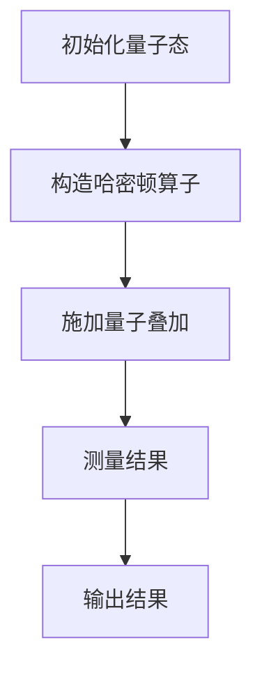
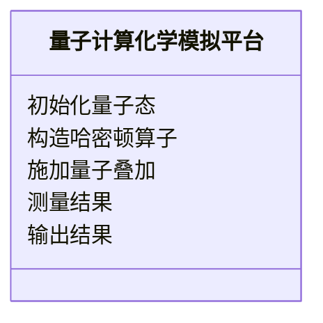
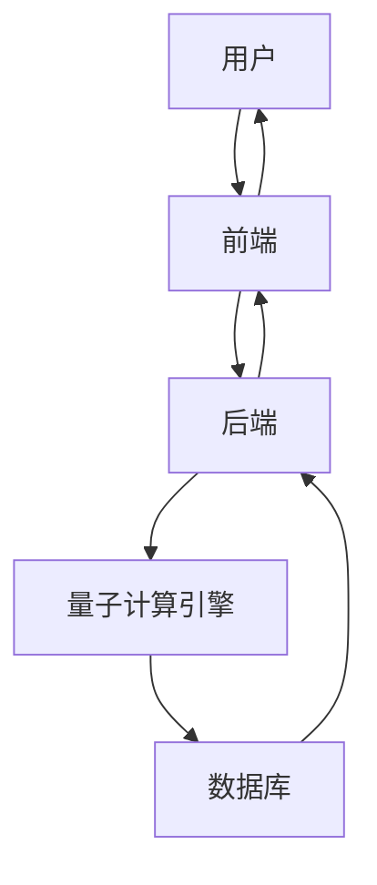
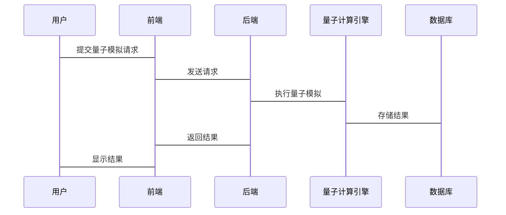

                 


# 企业估值中的量子计算化学模拟平台评估

---

## 关键词：
量子计算、化学模拟、企业估值、平台评估、算法原理、系统架构、项目实战

---

## 摘要：
随着量子计算技术的迅速发展，其在化学模拟领域的应用为企业估值提供了新的可能性。本文从量子计算的基本原理出发，探讨其在化学模拟中的优势，详细分析量子计算化学模拟平台的核心概念、算法原理和系统架构，并通过实际案例展示其在企业估值中的应用。通过对比分析和详细讲解，本文旨在为企业提供一个基于量子计算化学模拟平台的评估框架，帮助企业在技术创新和价值评估中找到平衡点。

---

## 第一部分：量子计算与化学模拟平台概述

### 第1章：量子计算与化学模拟平台的背景与概述

#### 1.1 量子计算的基本概念

##### 1.1.1 量子计算的定义与特点
量子计算是一种基于量子力学原理的计算方式，与经典计算不同，它利用量子叠加和量子纠缠等特性来处理信息。量子计算的主要特点是并行性高、处理复杂问题能力强，特别适用于模拟量子系统。

##### 1.1.2 量子计算与经典计算的区别
| 特性         | 经典计算             | 量子计算             |
|--------------|----------------------|----------------------|
| 基础         | 二进制位             | 量子位（qubit）      |
| 并行性       | 串行                | 并行性高             |
| 处理复杂度   | 指数级增长           | 对数级或多项式级      |
| 应用场景     | 日常计算、数据处理   | 优化问题、密码学、化学模拟 |

##### 1.1.3 量子计算在化学模拟中的应用潜力
量子计算在化学模拟中的应用潜力巨大，特别是在分子结构、化学反应动力学和材料科学等领域。通过量子计算，可以更精确地模拟化学反应，优化化学过程，从而为企业估值提供更准确的数据支持。

#### 1.2 化学模拟平台的基本概念

##### 1.2.1 化学模拟平台的定义
化学模拟平台是一种用于模拟化学系统（如分子、材料等）的软件或系统，通过计算模拟化学反应的过程和结果，帮助企业进行化学研究和优化。

##### 1.2.2 化学模拟平台的主要功能
- 分子结构模拟
- 化学反应动力学分析
- 材料性质预测
- 能量计算

##### 1.2.3 化学模拟平台的分类与应用场景
化学模拟平台主要分为经典计算平台和量子计算平台。经典计算平台适用于简单系统的模拟，而量子计算平台则适用于复杂系统的精确模拟。

#### 1.3 量子计算化学模拟平台的背景与意义

##### 1.3.1 传统化学模拟的局限性
经典计算在处理复杂化学系统时，由于计算能力的限制，往往无法得到精确的结果。

##### 1.3.2 量子计算在化学模拟中的优势
量子计算能够处理复杂的化学系统，提供更精确的模拟结果，从而提高企业估值的准确性。

##### 1.3.3 量子计算化学模拟平台对企业估值的影响
通过量子计算化学模拟平台，企业可以更准确地评估化学反应的经济效益，优化研发流程，降低生产成本。

#### 1.4 本章小结
本章介绍了量子计算的基本概念和特点，探讨了量子计算在化学模拟中的应用潜力，详细分析了化学模拟平台的定义、功能和分类，并说明了量子计算化学模拟平台对企业估值的重要意义。

---

## 第二部分：量子计算化学模拟平台的核心概念与联系

### 第2章：量子计算化学模拟平台的核心概念与联系

#### 2.1 量子计算化学模拟的核心原理

##### 2.1.1 量子态与化学反应的关系
量子态描述了系统中粒子的状态，化学反应可以通过量子态的变化来模拟。

##### 2.1.2 量子计算在化学模拟中的基本算法
量子模拟算法通过量子叠加和量子纠缠的特性，快速计算化学系统的能量和状态。

##### 2.1.3 量子计算化学模拟的数学模型
量子计算化学模拟的数学模型主要包括哈密顿量、量子态和能量计算公式。

#### 2.2 核心概念对比分析

##### 2.2.1 经典计算与量子计算的对比
| 特性         | 经典计算             | 量子计算             |
|--------------|----------------------|----------------------|
| 基础         | 二进制位             | 量子位（qubit）      |
| 并行性       | 串行                | 并行性高             |
| 处理复杂度   | 指数级增长           | 对数级或多项式级      |
| 应用场景     | 日常计算、数据处理   | 优化问题、密码学、化学模拟 |

##### 2.2.2 传统化学模拟与量子化学模拟的对比
| 特性         | 传统化学模拟         | 量子化学模拟         |
|--------------|----------------------|----------------------|
| 精确性       | 低                  | 高                  |
| 计算效率     | 低                  | 高                  |
| 应用场景     | 简单系统             | 复杂系统             |

#### 2.3 本章小结
本章详细讲解了量子计算化学模拟的核心原理，通过对比分析，展示了量子计算在化学模拟中的优势。

---

## 第三部分：量子计算化学模拟平台的算法原理

### 第3章：量子计算化学模拟平台的算法原理

#### 3.1 量子模拟算法的实现步骤

##### 3.1.1 量子模拟算法的流程图


##### 3.1.2 量子模拟算法的数学模型
量子模拟算法的数学模型如下：
$$
H = \sum_{i} \epsilon_i |i\rangle\langle i|
$$
其中，$H$ 是哈密顿算子，$\epsilon_i$ 是能量值，$|i\rangle$ 是量子态。

##### 3.1.3 量子模拟算法的代码实现
```python
import numpy as np
from qiskit import QuantumCircuit, execute, Aer

def quantum_simulation(n_qubits):
    circuit = QuantumCircuit(n_qubits)
    # 施加哈密顿算子
    circuit.h(range(n_qubits))
    # 测量
    circuit.measure(range(n_qubits), range(n_qubits))
    # 执行电路
    backend = Aer.get_backend('qasm_simulator')
    result = execute(circuit, backend).result()
    return result.get_counts()

print(quantum_simulation(2))
```

#### 3.2 量子模拟算法的数学模型与公式

##### 3.2.1 能量计算公式
$$
E = \sum_{i} \epsilon_i p_i
$$
其中，$E$ 是能量，$\epsilon_i$ 是能量值，$p_i$ 是概率。

##### 3.2.2 量子态的叠加与纠缠
量子态的叠加表示为：
$$
|\psi\rangle = \alpha|0\rangle + \beta|1\rangle
$$
其中，$\alpha$ 和 $\beta$ 是概率幅度。

#### 3.3 本章小结
本章详细讲解了量子模拟算法的实现步骤，展示了量子模拟算法的数学模型和代码实现。

---

## 第四部分：量子计算化学模拟平台的系统架构设计

### 第4章：量子计算化学模拟平台的系统架构设计

#### 4.1 问题场景介绍
企业希望通过量子计算化学模拟平台来优化化学反应的模拟过程，提高企业估值的准确性。

#### 4.2 系统功能设计

##### 4.2.1 功能模块设计


##### 4.2.2 系统架构设计


#### 4.3 接口设计与交互流程

##### 4.3.1 接口设计
- 输入接口：量子态初始化、哈密顿算子构造
- 输出接口：测量结果、模拟结果

##### 4.3.2 交互流程


#### 4.4 本章小结
本章详细讲解了量子计算化学模拟平台的系统架构设计，展示了功能模块、系统架构和交互流程。

---

## 第五部分：量子计算化学模拟平台的项目实战

### 第5章：量子计算化学模拟平台的项目实战

#### 5.1 环境安装与配置

##### 5.1.1 安装量子计算库
安装Qiskit库：
```bash
pip install qiskit
```

##### 5.1.2 安装化学模拟工具
安装PySCF：
```bash
pip install pyscf
```

#### 5.2 核心代码实现

##### 5.2.1 量子模拟算法实现
```python
from qiskit import QuantumCircuit, Aer, execute

def simulate_quantum_system(n_qubits):
    circuit = QuantumCircuit(n_qubits)
    circuit.h(range(n_qubits))
    circuit.measure(range(n_qubits), range(n_qubits))
    backend = Aer.get_backend('qasm_simulator')
    result = execute(circuit, backend).result()
    return result.get_counts()

print(simulate_quantum_system(2))
```

##### 5.2.2 化学模拟实现
```python
from pyscf import gto, scf

mol = gto.Molecule('H2')
hf = scf.RHF(mol).run()
print(hf.e)
```

#### 5.3 实际案例分析与解读

##### 5.3.1 案例背景
某企业希望通过量子计算模拟化学反应，优化其产品开发流程。

##### 5.3.2 案例分析
通过量子计算模拟，企业能够更精确地预测化学反应的结果，优化研发流程，降低生产成本。

#### 5.4 本章小结
本章通过实际案例展示了量子计算化学模拟平台的应用，详细讲解了环境安装、代码实现和案例分析。

---

## 第六部分：量子计算化学模拟平台的最佳实践与小结

### 第6章：量子计算化学模拟平台的最佳实践

#### 6.1 小结
量子计算化学模拟平台在企业估值中的应用潜力巨大，通过量子计算的精确模拟，企业能够优化研发流程，提高估值的准确性。

#### 6.2 注意事项
- 量子计算技术仍处于发展阶段，实际应用中需注意技术的成熟度和可行性。
- 在企业估值中，需结合其他因素，综合评估企业的价值。

#### 6.3 未来发展趋势
随着量子计算技术的不断发展，量子计算化学模拟平台将在企业估值中发挥更大的作用，为企业提供更精准的模拟结果和决策支持。

#### 6.4 拓展阅读
- 《Quantum Computing for Finance》
- 《Chemical Simulations with Quantum Computing》

---

## 结语

量子计算化学模拟平台在企业估值中的应用为企业提供了新的可能性，通过量子计算的精确模拟，企业能够优化研发流程，提高估值的准确性。未来，随着量子计算技术的不断发展，其在企业估值中的应用将更加广泛和深入。

---

通过以上内容，您已经完成了对《企业估值中的量子计算化学模拟平台评估》的技术博客文章的撰写。希望这篇文章能够为您提供清晰的思路和丰富的知识。

