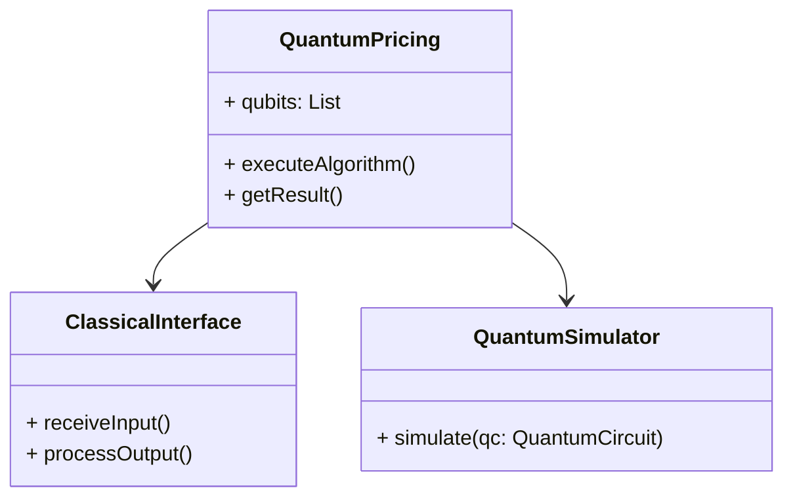
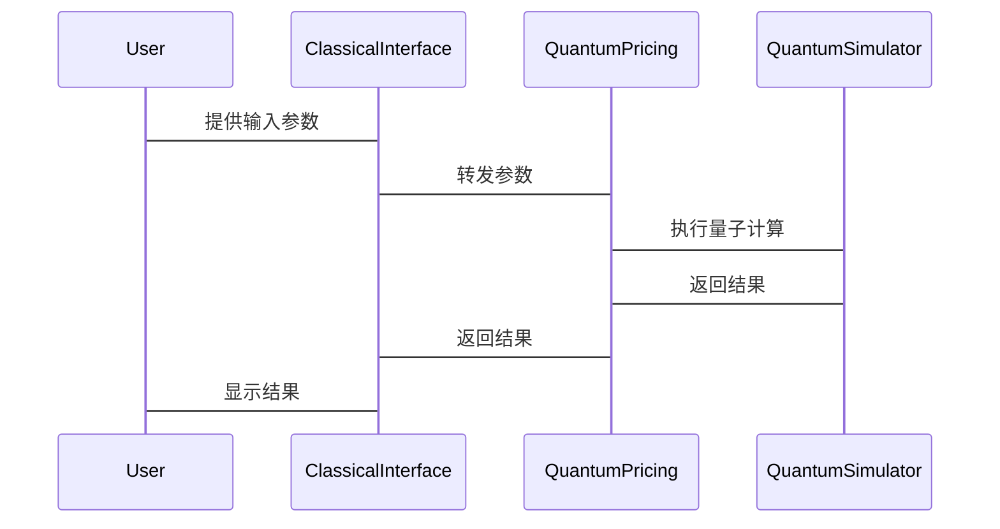

                 


# 《企业估值中的量子计算金融衍生品定价评估》

## 关键词：量子计算，金融衍生品，定价评估，企业估值，算法优化

## 摘要：  
随着量子计算技术的快速发展，其在金融领域的应用潜力逐渐显现。本文深入探讨了量子计算在金融衍生品定价评估中的应用，特别是如何优化企业估值过程。通过分析量子计算的基本原理、金融衍生品定价的核心算法以及量子计算在实际场景中的应用案例，本文旨在为读者提供一个全面的视角，理解量子计算如何改变传统的金融建模和估值方法。

---

## 第1章：量子计算与金融衍生品定价的背景

### 1.1 量子计算的基本概念  
#### 1.1.1 量子位（Qubit）与经典位（Bit）的对比  
- **经典位（Bit）**：二进制系统，只能表示0或1。  
- **量子位（Qubit）**：可以同时处于多个状态的叠加态，具有并行计算能力。  

#### 1.1.2 量子叠加态与量子纠缠态  
- **量子叠加态**：量子位可以同时处于多个状态，例如$|0\rangle$、$|1\rangle$和两者的叠加态$|0\rangle + |1\rangle$。  
- **量子纠缠态**：多个量子位之间形成强关联，一个量子位的状态会直接影响另一个量子位的状态。  

#### 1.1.3 量子计算的优缺点  
| 优点               | 缺点               |  
|--------------------|-------------------|  
| 高并行计算能力       | 需要低温环境运行       |  
| 解决特定问题效率高     | 初始投资成本高       |  

### 1.2 量子计算在金融衍生品定价中的应用背景  
#### 1.2.1 传统金融衍生品定价的局限性  
- 传统方法依赖蒙特卡洛模拟，计算复杂度高。  
- 高维问题（如多资产期权定价）计算效率低。  

#### 1.2.2 量子计算如何解决传统定价问题  
- 利用量子叠加和纠缠特性，同时处理多个可能性。  
- 通过量子傅里叶变换加速概率分布计算。  

#### 1.2.3 企业估值中的量子计算应用场景  
- 优化期权定价模型。  
- 处理复杂的市场波动模型。  
- 提高风险评估的效率。  

---

## 第2章：量子计算的基本原理与数学模型

### 2.1 量子计算的核心概念  
#### 2.1.1 量子门与量子电路  
- **量子门**：如Hadamard门、CNOT门等，用于对量子位进行操作。  
- **量子电路**：由量子门和量子位组成的电路，用于实现量子算法。  

#### 2.1.2 量子叠加与量子测量  
- **叠加态**：量子位可以同时处于多个状态。  
- **测量**：量子测量会破坏叠加态，使其坍缩为一个确定的状态。  

### 2.2 量子计算的数学基础  
#### 2.2.1 量子态的数学表示  
- 量子态用复数向量表示，例如$|\psi\rangle = a|0\rangle + b|1\rangle$，其中$a^2 + b^2 = 1$。  

#### 2.2.2 量子门的矩阵表示  
- Hadamard门的矩阵表示为：  
  $$  
  H = \frac{1}{\sqrt{2}} \begin{bmatrix} 1 & 1 \\ 1 & -1 \end{bmatrix}  
  $$  

---

## 第3章：量子计算在金融衍生品定价中的应用

### 3.1 金融衍生品定价的基本原理  
#### 3.1.1 Black-Scholes模型  
- 期权定价公式：  
  $$  
  C = S_0 \Phi(d_1) - K e^{-rT} \Phi(d_2)  
  $$  
  其中，$d_1 = \frac{\ln(S_0/K) + (r + \sigma^2/2)T}{\sigma \sqrt{T}}$，  
  $d_2 = d_1 - \sigma \sqrt{T}$，  
  $\Phi$为标准正态分布的累积分布函数。  

#### 3.1.2 量子计算在Black-Scholes模型中的优化  
- 利用量子傅里叶变换加速概率分布计算。  

### 3.2 量子计算在金融衍生品定价中的算法实现  
#### 3.2.1 量子傅里叶变换的应用  
- 使用量子傅里叶变换对金融市场的概率分布进行变换，提高计算效率。  

#### 3.2.2 量子算法的实现步骤  
1. 初始化量子位。  
2. 应用量子傅里叶变换。  
3. 测量量子位以获取结果。  

### 3.3 项目实战：量子计算在期权定价中的实现  
#### 3.3.1 环境安装  
- 安装Qiskit库：`pip install qiskit`。  

#### 3.3.2 核心代码实现  
```python
from qiskit import QuantumCircuit, Aer, execute

# 初始化量子电路
qc = QuantumCircuit(1)
qc.h(0)  # Hadamard门

# 执行量子计算
simulator = Aer.get_backend('statevector_simulator')
result = execute(qc, simulator).result()
state = result.get_statevector()

print(state)
```

#### 3.3.3 代码解读与分析  
- 初始化一个量子电路，应用Hadamard门生成叠加态。  
- 使用量子模拟器执行计算，获取结果。  

---

## 第4章：量子计算与金融衍生品定价的数学模型

### 4.1 金融衍生品定价的数学模型  
#### 4.1.1 随机微分方程  
- 常见的随机微分方程：  
  $$  
  dS = \mu S dt + \sigma S dW  
  $$  
  其中，$S$为股票价格，$\mu$为期望回报率，$\sigma$为波动率，$dW$为布朗运动。  

#### 4.1.2 量子计算在随机微分方程中的应用  
- 利用量子算法求解随机微分方程的解。  

### 4.2 量子计算在企业估值中的应用  
#### 4.2.1 量子计算优化企业估值模型  
- 利用量子算法加速对企业价值的计算。  

#### 4.2.2 实际案例分析  
- 使用量子计算优化某企业的期权定价模型，提高估值效率。  

---

## 第5章：系统分析与架构设计方案

### 5.1 问题场景介绍  
- 高维金融衍生品定价问题。  
- 传统方法计算效率低。  

### 5.2 系统功能设计  
#### 5.2.1 领域模型（Mermaid类图）  


### 5.3 系统架构设计  
#### 5.3.1 系统架构图（Mermaid架构图）  


### 5.4 系统接口设计  
- 量子计算模块与经典接口的交互。  

### 5.5 系统交互设计  
#### 5.5.1 交互流程图（Mermaid序列图）  


---

## 第6章：项目实战与最佳实践

### 6.1 环境安装与核心实现  
#### 6.1.1 环境安装  
- 安装Qiskit库：`pip install qiskit`。  

#### 6.1.2 核心代码实现  
```python
from qiskit import QuantumCircuit, execute
from qiskit.circuit import QuantumRegister, ClassicalRegister

# 初始化量子寄存器和经典寄存器
qr = QuantumRegister(1)
cr = ClassicalRegister(1)
qc = QuantumCircuit(qr, cr)

# 应用Hadamard门
qc.h(qr[0])

# 测量量子位
qc.measure(qr[0], cr[0])

# 执行量子计算
simulator = Aer.get_backend('qasm_simulator')
job = execute(qc, simulator)
result = job.result()
print(result.get_counts(qc))
```

### 6.2 实际案例分析  
- 使用量子计算优化某企业的期权定价模型，提高估值效率。  

### 6.3 最佳实践与注意事项  
#### 6.3.1 硬件资源的优化  
- 利用云量子计算平台进行模拟。  

#### 6.3.2 算法选择的优化  
- 根据具体问题选择合适的量子算法。  

#### 6.3.3 未来发展方向  
- 深化量子计算在金融建模中的应用。  

---

## 第7章：总结与展望

### 7.1 本章总结  
- 量子计算在金融衍生品定价中的应用潜力巨大。  
- 量子计算可以显著提高企业估值的效率和准确性。  

### 7.2 未来展望  
- 研究更高效的量子算法。  
- 推动量子计算在金融领域的实际应用。  

---

通过以上结构，文章详细介绍了量子计算在金融衍生品定价中的应用，结合理论分析和实际案例，为读者提供了一个全面的视角。

