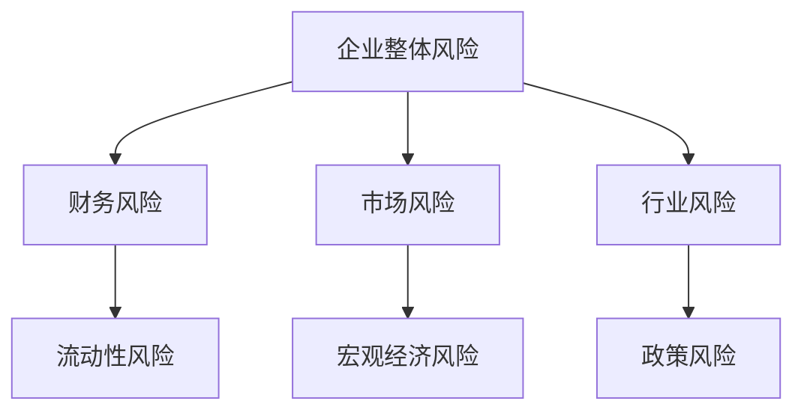

                 


# 企业估值中的风险因素分析

## 关键词：企业估值, 风险因素, 企业价值, 数学模型, 系统架构, 投资分析

## 摘要：  
本文深入探讨了企业估值中的风险因素分析，从基础概念到高级模型，系统性地分析了如何识别、评估和量化风险因素对企业发展和价值的影响。通过数学模型和系统架构的设计，结合实际案例，为投资者和企业管理者提供了科学的风险管理方法和决策支持。

---

# 第一部分: 企业估值中的风险因素概述

## 第1章: 风险因素的定义与分类

### 1.1 风险因素的定义
风险因素是指可能对企业运营、财务状况或市场表现产生负面影响的各种不确定因素。在企业估值中，风险因素的识别和评估是关键步骤，因为它们直接影响企业的未来现金流和整体价值。

### 1.2 风险因素的分类
风险因素可以分为以下几类：
1. **财务风险**：与企业的财务状况直接相关，如负债水平、利润率波动等。
2. **市场风险**：与市场环境的变化相关，如市场需求波动、竞争加剧等。
3. **行业风险**：与行业发展趋势和政策变化相关。
4. **政策风险**：与政府政策变化对企业的影响相关。
5. **运营风险**：与企业内部管理、供应链稳定性等相关的风险。

### 1.3 风险因素对企业估值的影响
风险因素通过影响企业的未来现金流和贴现率来影响企业估值。高风险通常意味着更高的贴现率，从而降低企业的当前价值。

---

## 第2章: 风险因素的识别与评估方法

### 2.1 风险因素的识别方法
1. **定性分析**：通过行业研究、市场分析和管理层访谈等方式识别潜在风险。
2. **定量分析**：利用财务数据和统计模型量化风险因素的影响。

### 2.2 风险因素的评估指标
1. **风险概率**：评估风险发生的可能性，通常以概率值表示（0-1）。
2. **风险影响程度**：评估风险对企业价值的具体影响，可以用财务指标（如净利润下降比例）或相对指标（如标准差）表示。

### 2.3 风险因素的综合评估模型
通过结合风险概率和影响程度，可以构建风险综合评估模型，如下所示：

$$\text{综合风险指数} = \text{风险概率} \times \text{风险影响程度}$$

---

## 第3章: 企业估值中的数学模型与公式

### 3.1 常用企业估值模型
1. **现金流折现模型（DCF）**：通过预测企业未来现金流并按适当的折现率计算其现值。
2. **市盈率模型**：基于企业的市盈率和净利润进行估值。
3. **市净率模型**：基于企业的市净率和净资产进行估值。

### 3.2 风险因素的数学表达
在DCF模型中，风险因素通过调整折现率来反映其影响：

$$\text{折现率} = \text{无风险利率} + \text{风险溢价}$$

### 3.3 风险调整现金流法
当企业面临特定风险时，可以调整未来现金流以反映风险的影响：

$$\text{调整后的现金流} = \text{原现金流} \times (1 - \text{风险影响程度})$$

---

## 第4章: 风险因素的系统分析与架构设计

### 4.1 系统分析
1. **问题场景**：企业面临多种风险因素，需要通过系统化的方法进行识别和评估。
2. **功能需求**：构建一个能够识别、评估和量化风险因素的系统。

### 4.2 系统架构设计


### 4.3 系统功能设计
1. **输入模块**：接收企业财务数据、市场数据等。
2. **处理模块**：识别和评估风险因素。
3. **输出模块**：生成风险报告和估值结果。

---

## 第5章: 项目实战与案例分析

### 5.1 环境安装
1. 安装必要的工具和软件，如Excel、Python等。
2. 准备企业财务数据和市场数据。

### 5.2 核心代码实现
```python
def calculate_risk_adjusted_value(fcf, discount_rate, risk_premium):
    adjusted_discount_rate = discount_rate + risk_premium
    present_value = fcf / (1 + adjusted_discount_rate)
    return present_value

# 示例数据
fcf = 100  # 自由现金流
discount_rate = 0.05  # 无风险利率
risk_premium = 0.02  # 风险溢价
value = calculate_risk_adjusted_value(fcf, discount_rate, risk_premium)
print(f"风险调整后的价值为：{value}")
```

### 5.3 案例分析
以某制造企业为例，通过DCF模型和风险调整方法计算其估值，并对比不同风险假设下的结果。

---

## 第6章: 最佳实践与总结

### 6.1 最佳实践
1. **定期更新风险评估**：随着市场环境变化，及时调整风险因素。
2. **结合定性和定量分析**：全面评估风险因素的影响。

### 6.2 小结
企业估值中的风险因素分析是复杂而重要的任务。通过系统化的方法和数学模型，可以有效识别和量化风险，为决策提供支持。

### 6.3 展望
未来，随着人工智能和大数据技术的发展，风险因素分析将更加智能化和精准化。

---

通过以上分析，我们深入探讨了企业估值中的风险因素分析方法，结合理论和实践，为投资者和企业管理者提供了科学的决策支持。

