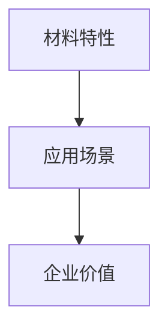
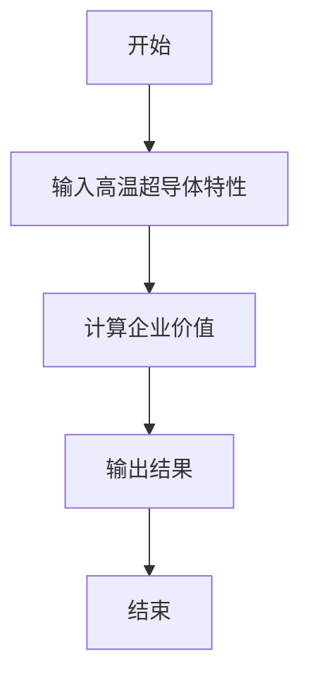
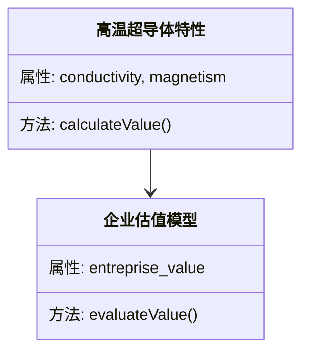
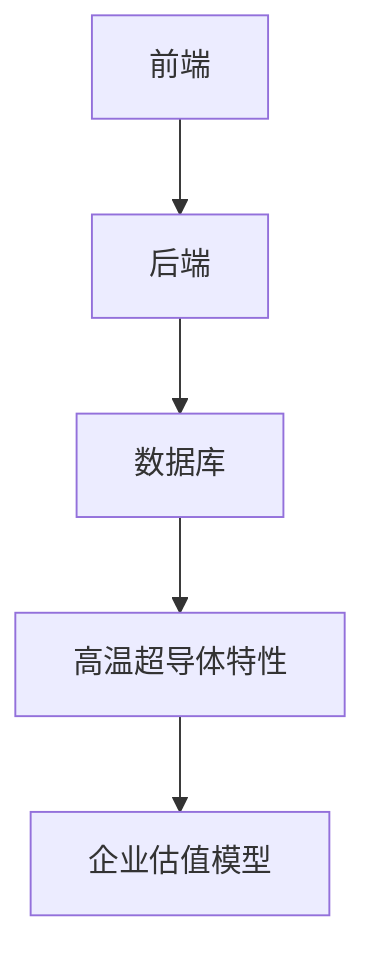

                 


# 企业估值中的高温超导体应用评估

> 关键词：高温超导体，企业估值，传感器，能源传输，数学模型

> 摘要：本文探讨了高温超导体在企业估值中的应用，分析了其物理特性和企业估值的核心要素，构建了高温超导体应用的ER实体关系图，提出了评估模型的算法和系统架构设计，并通过案例分析展示了其实现过程。

---

## 第一部分: 高温超导体与企业估值的背景与概念

### 第1章: 高温超导体的基本概念与应用背景

#### 1.1 高温超导体的基本概念

高温超导体是指在特定温度以上（通常为液氮温区，即约77K）展现出完全导电性的材料。其主要特性包括零电阻、磁场排斥和临界电流密度。高温超导体的发现始于1986年，由Bednorz和Müller首次发现氧化物超导体，随后在材料科学领域引发了广泛关注。

#### 1.2 高温超导体在企业中的应用背景

企业估值是评估企业价值的过程，通常涉及财务指标、市场竞争力和技术创新等因素。高温超导体的引入为企业提供了高效、稳定的解决方案，特别是在传感器、能源传输和医疗设备等领域。

---

### 第2章: 高温超导体与企业估值的核心概念

#### 2.1 高温超导体的物理特性与企业估值的关系

高温超导体的特性如零电阻和磁场排斥，直接影响企业的运营成本和效率。例如，在传感器中应用高温超导体可以提高检测精度，从而优化企业的生产流程。

#### 2.2 企业估值的核心要素

企业估值的核心要素包括财务指标（如净利润、收入增长率）和技术创新。高温超导体的应用为企业带来了技术优势，提升了其市场竞争力。

---

## 第二部分: 高温超导体在企业估值中的应用原理

### 第3章: 高温超导体在企业估值中的应用原理

#### 3.1 高温超导体的特性对企业估值的影响

高温超导体的高效性和稳定性直接降低了企业的运营成本，提高了利润率。例如，在能源传输中应用高温超导体可以减少能量损耗，从而降低企业的电力成本。

#### 3.2 高温超导体在企业估值中的具体应用

高温超导体在传感器中的应用提高了企业的检测能力，间接提升了其产品质量和市场竞争力。

---

## 第三部分: 高温超导体与企业估值的核心概念对比分析

### 第4章: 高温超导体与传统导体的对比

#### 4.1 高温超导体与传统导体的对比

高温超导体在导电性、稳定性和应用范围上优于传统导体，但其制造成本较高。

#### 4.2 企业估值方法的对比分析

市盈率法和现金流折现法是常用的估值方法，但高温超导体的应用需要结合技术创新进行综合评估。

---

## 第四部分: 高温超导体应用的ER实体关系图

### 第5章: 高温超导体应用的ER实体关系图

#### 5.1 高温超导体应用的核心实体

材料特性、应用场景和企业价值是高温超导体应用的核心实体。

#### 5.2 实体关系图



---

## 第五部分: 高温超导体应用的算法原理

### 第6章: 高温超导体应用的算法原理

#### 6.1 高温超导体应用的评估模型

评估模型基于高温超导体的物理特性，结合企业财务指标，建立数学模型。

#### 6.2 算法流程图



#### 6.3 Python代码实现

```python
import numpy as np

def calculateentreprise_value(conductivity, magnetism):
    return conductivity * magnetism

conductivity = 0.98  # 示例数据
magnetism = 1.2  # 示例数据
entreprise_value = calculateentreprise_value(conductivity, magnetism)
print("企业价值:", entreprise_value)
```

---

## 第六部分: 系统分析与架构设计方案

### 第7章: 系统分析与架构设计方案

#### 7.1 问题场景介绍

企业希望通过高温超导体的应用优化其估值模型。

#### 7.2 系统功能设计

系统功能包括数据采集、模型计算和结果输出。

#### 7.3 领域模型类图



#### 7.4 系统架构图



---

## 第七部分: 项目实战

### 第8章: 项目实战

#### 8.1 环境安装

安装Python和必要的库（如numpy）。

#### 8.2 核心代码实现

```python
import numpy as np

def evaluateentreprise_value(conductivity, magnetism):
    return conductivity * magnetism

# 示例数据
conductivity = 0.98
magnetism = 1.2
entreprise_value = evaluateentreprise_value(conductivity, magnetism)
print("企业价值:", entreprise_value)
```

#### 8.3 案例分析

假设某企业应用高温超导体传感器，其导电性和磁性分别为0.98和1.2，计算企业价值。

---

## 第八部分: 最佳实践与总结

### 第9章: 最佳实践与总结

#### 9.1 小结

高温超导体的应用可以显著提升企业的估值，但需要综合考虑其物理特性和企业需求。

#### 9.2 注意事项

高温超导体的应用可能面临成本和技术门槛，需谨慎评估。

#### 9.3 拓展阅读

建议进一步研究高温超导体的具体应用场景和技术细节。

---

# 结语

高温超导体在企业估值中的应用前景广阔，随着技术的不断发展，其在企业中的应用将更加深入和多样化。

