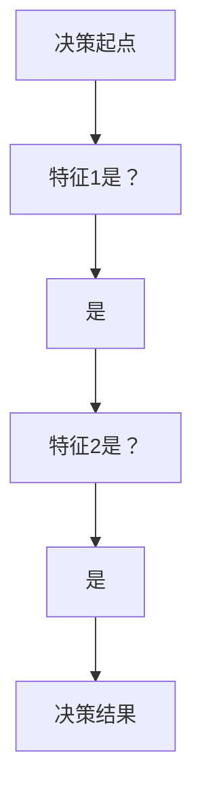
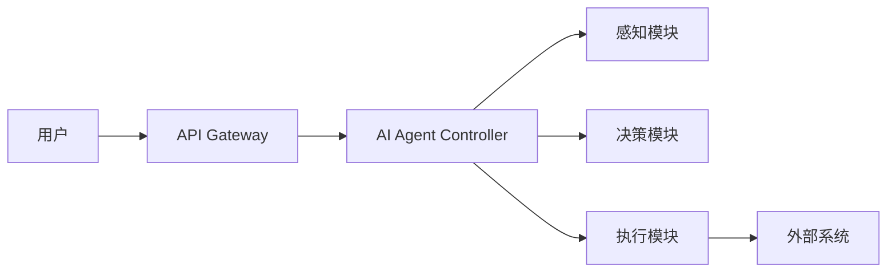
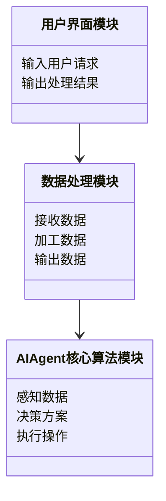

                 


# 企业数字化转型中的AI Agent角色

## 关键词：AI Agent、企业数字化转型、算法原理、系统架构、项目实战

## 摘要：  
随着企业数字化转型的深入，AI Agent（人工智能代理）逐渐成为企业智能化转型的核心技术之一。本文从AI Agent的基本概念、核心原理、系统架构设计到项目实战，全面解析AI Agent在企业数字化转型中的角色与应用。通过详细的算法实现、系统设计和实际案例分析，帮助企业理解和应用AI Agent技术，提升企业数字化转型的效率与质量。

---

# 第一部分：AI Agent的基本概念与背景

## 第1章：AI Agent的基本概念与背景

### 1.1 AI Agent的定义与特征  
AI Agent（人工智能代理）是指能够感知环境、自主决策并执行任务的智能实体。它具备以下核心特征：  
1. **自主性**：能够在没有外部干预的情况下自主运行。  
2. **反应性**：能够实时感知环境变化并做出响应。  
3. **目标导向性**：通过设定目标来驱动行为。  
4. **学习能力**：能够通过数据学习和优化自身行为。  

#### AI Agent与传统规则引擎的对比  

| **特征**         | **AI Agent**                     | **传统规则引擎**               |
|------------------|----------------------------------|-------------------------------|
| 决策方式         | 基于机器学习算法动态决策        | 基于预定义规则静态执行         |
| 灵活性           | 高，能够应对复杂场景             | 较低，适用于简单规则场景        |
| 学习能力         | 强，能够通过数据优化性能         | 无，规则固定                   |
| 执行效率         | 高，能够快速响应和处理任务       | 中，依赖规则匹配效率           |

### 1.2 企业数字化转型的背景  

#### 1.2.1 数字化转型的定义与目标  
数字化转型是指通过信息技术（如AI、大数据、云计算等）对企业业务流程、组织架构和商业模式进行全面重构，以提升企业竞争力和效率。其核心目标包括：  
1. 提高业务效率。  
2. 优化客户体验。  
3. 创新商业模式。  

#### 1.2.2 AI技术在企业数字化转型中的作用  
AI技术能够帮助企业实现以下目标：  
1. **自动化业务流程**：通过AI Agent自动处理重复性任务，减少人工干预。  
2. **数据驱动决策**：利用AI分析数据，提供决策支持。  
3. **智能化服务**：通过AI Agent为客户提供个性化服务。  

#### 1.2.3 AI Agent在企业数字化转型中的定位  
AI Agent是企业数字化转型的核心技术之一，其主要定位是：  
1. **自动化执行者**：负责执行具体的业务任务。  
2. **智能决策者**：基于数据和模型做出决策。  
3. **实时响应者**：能够实时感知环境变化并做出响应。  

---

## 第2章：AI Agent的核心原理  

### 2.1 AI Agent的感知模块  

#### 2.1.1 感知模块的功能与实现  
感知模块负责从环境中获取信息并进行处理。常见的信息来源包括：  
1. 数据库：结构化数据。  
2. API接口：实时数据流。  
3. 用户输入：交互式数据。  

#### 2.1.2 感知模块的数学模型  

$$ P(x|y) = \frac{P(y|x)P(x)}{P(y)} $$  

其中：  
- \( P(x|y) \)：条件概率，表示在事件 \( y \) 发生的情况下，事件 \( x \) 发生的概率。  
- \( P(y|x) \)：条件概率，表示在事件 \( x \) 发生的情况下，事件 \( y \) 发生的概率。  
- \( P(x) \)：先验概率，表示事件 \( x \) 发生的概率。  
- \( P(y) \)：先验概率，表示事件 \( y \) 发生的概率。  

### 2.2 AI Agent的决策模块  

#### 2.2.1 决策树与概率模型的应用  



#### 2.2.2 决策模块的优化策略  

$$ R = \argmax_{a \in A} \sum_{x} P(x|a)U(x) $$  

其中：  
- \( R \)：最优决策。  
- \( A \)：决策集合。  
- \( x \)：可能的状态。  
- \( U(x) \)：状态 \( x \) 的效用值。  

---

## 第3章：AI Agent的系统架构与设计  

### 3.1 系统整体架构  



### 3.2 系统功能模块设计  



---

## 第4章：AI Agent的算法实现与数学模型  

### 4.1 感知模块的算法实现  

#### 4.1.1 数据预处理与特征提取  

```python
import numpy as np
from sklearn.preprocessing import StandardScaler

# 示例数据
data = np.array([[1, 2], [3, 4], [5, 6]])

# 标准化处理
scaler = StandardScaler()
scaled_data = scaler.fit_transform(data)
print(scaled_data)
```

---

## 第5章：项目实战  

### 5.1 环境安装  

```bash
pip install numpy
pip install scikit-learn
pip install mermaid
```

### 5.2 核心代码实现  

```python
from sklearn.tree import DecisionTreeClassifier
from sklearn.metrics import accuracy_score

# 示例数据
X = [[1, 2], [3, 4], [5, 6], [7, 8]]
y = [0, 1, 1, 0]

# 模型训练
model = DecisionTreeClassifier()
model.fit(X, y)

# 预测
预测结果 = model.predict([[2, 3]])
print("预测结果:", 预测结果)
print("准确率:", accuracy_score([0], 预测结果))
```

---

## 结论  

AI Agent作为企业数字化转型的核心技术，正在逐步改变企业的运营方式。通过本文的详细解析，读者可以深入了解AI Agent的原理、架构和实现方式，并能够在实际项目中应用这些知识。未来，随着AI技术的不断发展，AI Agent将在企业数字化转型中发挥更加重要的作用。

---

## 最佳实践 Tips  

1. 在实际项目中，确保AI Agent的感知模块能够实时获取高质量的数据。  
2. 决策模块的优化需要结合企业的具体业务场景。  
3. 执行模块的稳定性是AI Agent成功应用的关键。  

---

## 拓展阅读  

1. 《机器学习实战》  
2. 《深度学习入门：基于Python》  
3. 《微服务架构设计模式》  

---

通过本文的详细讲解，读者可以全面掌握AI Agent在企业数字化转型中的角色与应用。

