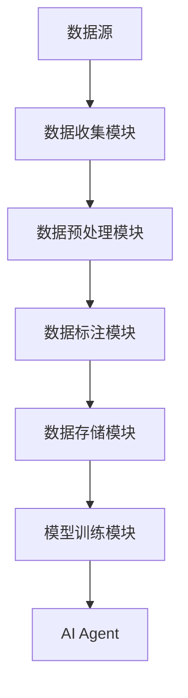
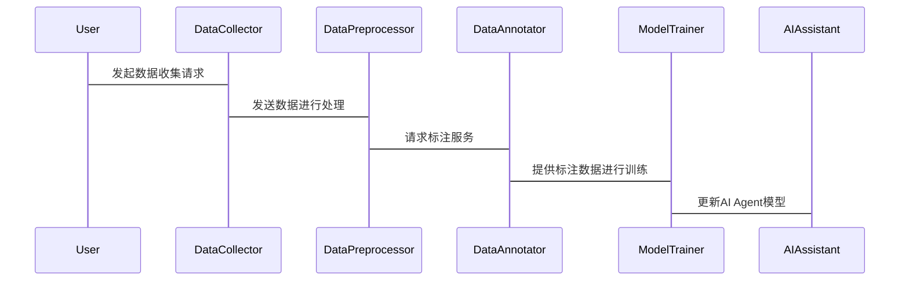

                 


# 企业数据管理：AI Agent训练数据的收集与处理

---

## 关键词：  
企业数据管理、AI Agent、数据收集、数据预处理、数据标注、数据安全、数据合规

---

## 摘要：  
随着人工智能技术的快速发展，AI Agent（智能体）在企业中的应用日益广泛。AI Agent的性能高度依赖于训练数据的质量和多样性。本文详细探讨了企业数据管理在AI Agent训练中的关键作用，从数据收集、预处理、标注到数据安全与合规性，结合实际案例分析，为企业构建高效的数据管理流程提供指导。文章还深入介绍了AI Agent的训练流程，包括特征工程、模型调优和评估，以及系统架构设计，为企业技术团队提供实用的参考。

---

# 目录

---

## 第一章: 企业数据管理的背景与挑战

### 1.1 数据管理的核心概念

#### 1.1.1 数据的定义与分类
- **结构化数据**：表格数据，如数据库中的记录。
- **非结构化数据**：文本、图像、音频等。
- **半结构化数据**：如JSON、XML格式的数据。

#### 1.1.2 数据管理的目标与原则
- **目标**：确保数据的完整性、一致性和可用性。
- **原则**：数据所有权明确，访问权限控制，数据存储优化。

### 1.2 问题背景与解决方法

#### 1.2.1 企业数据管理的挑战
- 数据孤岛问题：不同部门间数据无法有效共享。
- 数据质量：数据不完整、不一致影响分析结果。
- 数据安全：数据泄露风险增加。

#### 1.2.2 AI Agent与数据管理的结合
- AI Agent依赖高质量数据进行决策和执行任务。
- 数据管理确保AI Agent的可靠性和高效性。

## 第二章: 数据收集的方法与技术

### 2.1 数据收集的常见方法

#### 2.1.1 数据源的分类与特点
- **网络爬虫**：从网页获取公开数据，需遵守爬虫协议。
- **API调用**：通过接口获取结构化数据，如社交媒体API。
- **数据库查询**：从企业内部数据库提取结构化数据。

#### 2.1.2 数据收集的技术手段
- **网络爬虫技术**：使用Python的Scrapy框架，代码示例：
  ```python
  import scrapy

  class MySpider(scrapy.Spider):
      name = 'example'
      def start_requests(self):
          urls = ['https://example.com']
          for url in urls:
              yield scrapy.Request(url=url, callback=self.parse)

      def parse(self, response):
          title = response.xpath('//title/text()').extract_first()
          yield {'title': title}
  ```

- **API调用**：使用Python的requests库：
  ```python
  import requests

  response = requests.get('https://api.example.com/data')
  data = response.json()
  ```

### 2.2 数据预处理与清洗

#### 2.2.1 数据清洗的基本步骤
- **去重**：去除重复记录，如使用Pandas的`drop_duplicates()`方法。
- **去噪**：识别并删除异常值，如使用Z-score方法。

#### 2.2.2 数据增强与转换
- **数据扩展**：通过数据增强技术增加数据多样性，如文本数据的同义词替换。
- **数据标准化**：将数据转换为统一格式，如日期格式统一。

## 第三章: 数据标注与质量控制

### 3.1 数据标注的方法与工具

#### 3.1.1 数据标注的基本流程
- **标注标准制定**：定义标签体系，如情感分析中的正面、负面、中性。
- **标注工具选择**：使用Label Studio或VGG Annotation Studio进行标注。

#### 3.1.2 数据标注的质量控制
- **标注结果验证**：通过交叉验证确保标注一致性。
- **标注团队管理**：定期培训和评估标注员的工作质量。

### 3.2 数据质量控制策略

#### 3.2.1 数据清洗与验证
- **数据清洗流程**：使用Pandas进行数据清洗，如处理缺失值。
- **数据验证**：通过随机抽样检查数据准确性。

## 第四章: 数据安全与合规性

### 4.1 数据隐私保护

#### 4.1.1 数据脱敏技术
- **数据脱敏方法**：如替换敏感信息为通用标识符。
- **案例分析**：医疗数据脱敏，保护患者隐私。

#### 4.1.2 数据加密存储
- **加密方法**：使用AES加密算法对敏感数据进行加密存储。

### 4.2 数据合规性管理

#### 4.2.1 合规性要求
- **GDPR法规**：确保数据处理符合欧盟《通用数据保护条例》。
- **数据保留政策**：制定数据保留期限，避免数据过载。

## 第五章: AI Agent的训练流程

### 5.1 特征工程

#### 5.1.1 特征提取方法
- **文本特征提取**：使用TF-IDF提取关键词。
- **图像特征提取**：使用CNN提取图像特征。

### 5.2 模型训练与调优

#### 5.2.1 模型训练过程
- **训练方法**：使用监督学习算法，如随机森林或神经网络。
- **超参数调优**：通过网格搜索优化模型参数。

#### 5.2.2 模型评估
- **评估指标**：准确率、召回率、F1分数。
- **交叉验证**：使用K折交叉验证评估模型泛化能力。

## 第六章: 系统架构与设计

### 6.1 系统架构设计

#### 6.1.1 系统架构图


#### 6.1.2 接口设计
- **数据接口**：定义RESTful API，如`/api/v1/data/upload`用于上传数据。
- **模型接口**：提供预测接口，如`/api/v1/predict`。

### 6.2 交互流程

#### 6.2.1 交互流程图


## 第七章: 项目实战

### 7.1 环境配置与安装

#### 7.1.1 环境配置
- **工具安装**：安装Python、Jupyter Notebook、相关库如pandas、numpy。
- **虚拟环境**：使用venv或Anaconda管理环境。

### 7.2 核心代码实现

#### 7.2.1 数据收集代码
```python
import requests
import json

url = 'https://api.example.com/data'
params = {'query': 'AI Agent'}

response = requests.get(url, params=params)
data = response.json()
```

#### 7.2.2 数据预处理代码
```python
import pandas as pd

df = pd.read_csv('data.csv')
# 去除重复值
df.drop_duplicates(inplace=True)
# 填充缺失值
df['age'].fillna(df['age'].mean(), inplace=True)
```

### 7.3 案例分析与结果解读

#### 7.3.1 案例分析
- **案例背景**：某电商企业收集用户行为数据，训练推荐系统。
- **数据收集**：收集用户点击流数据。
- **数据处理**：清洗数据，提取用户行为特征。
- **模型训练**：训练协同过滤推荐模型。
- **结果分析**：评估推荐准确率和召回率。

## 第八章: 总结与展望

### 8.1 小结

#### 8.1.1 核心要点回顾
- 数据管理在AI Agent训练中的重要性。
- 数据收集、预处理、标注和安全的关键步骤。

#### 8.1.2 注意事项
- 数据隐私保护的重要性。
- 数据质量和模型性能的正相关关系。

### 8.2 未来展望

#### 8.2.1 技术趋势
- 自动化数据标注工具的发展。
- 数据安全技术的创新，如联邦学习。

#### 8.2.2 拓展阅读
- 推荐书籍：《Data Science for Business》。
- 关注领域：AI模型的可解释性与数据伦理。

---

## 总结

本文系统地探讨了企业数据管理在AI Agent训练中的关键步骤，从数据收集到处理，再到模型训练，结合实际案例分析，为企业提供了一套完整的数据管理解决方案。通过详细的技术讲解和代码示例，帮助读者掌握数据管理的核心技能，提升AI Agent的性能和可靠性。未来，随着技术的发展，企业数据管理将更加智能化和自动化，为AI Agent的应用开辟更广阔的空间。

