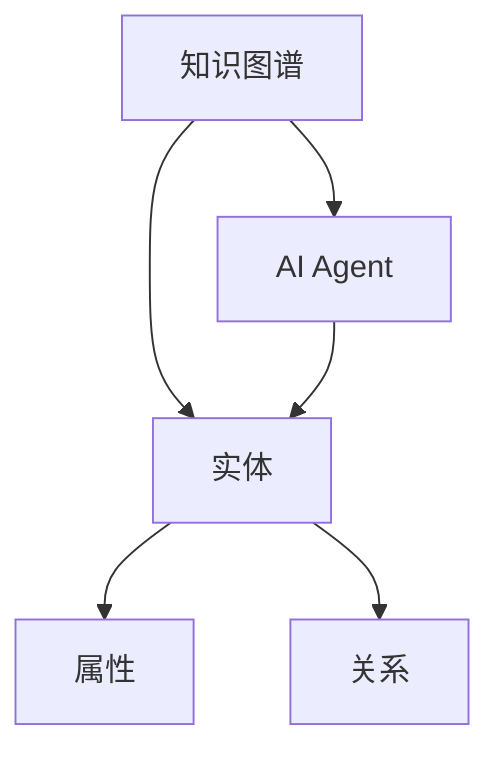
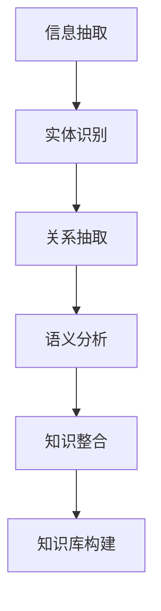
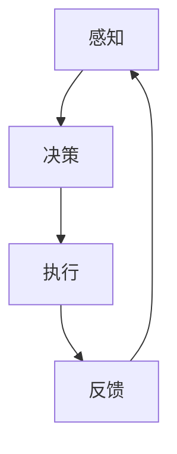
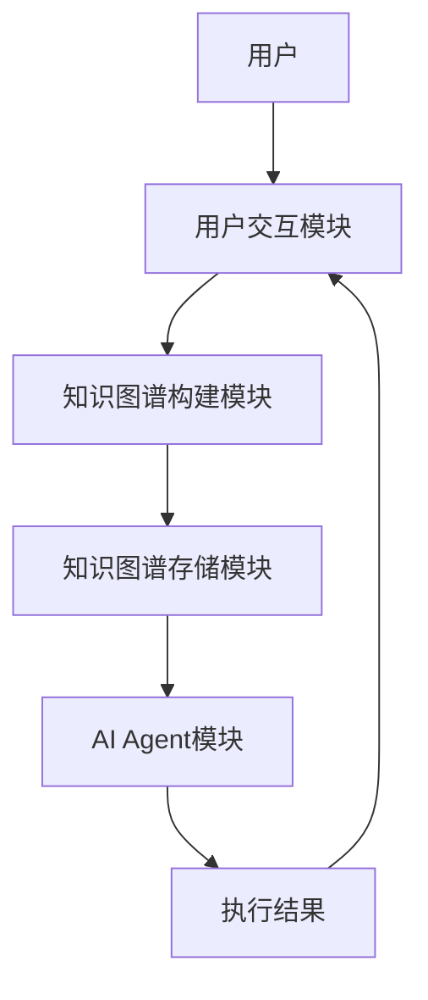

                 


# 《企业知识图谱与AI Agent的深度融合应用》

> 关键词：知识图谱、AI Agent、企业应用、深度融合、智能系统

> 摘要：本文深入探讨了企业知识图谱与AI Agent的深度融合应用，从背景、概念、算法到系统架构和项目实战，系统性地分析了两者的结合对企业智能化转型的推动作用。通过具体案例分析，展示了如何构建知识图谱并实现AI Agent的交互设计，同时提供了数学模型和代码实现，为企业技术实践提供了详实的参考。

---

# 第一部分: 企业知识图谱与AI Agent的背景与基础

## 第1章: 企业知识图谱与AI Agent概述

### 1.1 企业知识图谱的定义与特点

#### 1.1.1 知识图谱的定义
知识图谱是一种以图结构形式表示知识的语义网络，由节点（实体）和边（关系）组成，能够描述现实世界中的概念及其关系。

#### 1.1.2 企业知识图谱的核心特点
- **结构化**：数据以实体和关系的形式组织，便于计算机理解和推理。
- **语义化**：通过语义信息建立实体之间的关联，支持复杂的语义查询。
- **动态性**：能够实时更新，适应企业数据的变化。
- **可扩展性**：支持大规模数据的存储和处理。

#### 1.1.3 企业知识图谱与传统数据库的区别
- 数据形式：传统数据库以行和列的形式存储结构化数据，而知识图谱以图结构存储语义化数据。
- 查询方式：传统数据库基于简单查询，而知识图谱支持复杂的语义查询。
- 应用场景：传统数据库适用于简单的数据检索，而知识图谱适用于复杂的知识推理。

### 1.2 AI Agent的定义与特点

#### 1.2.1 AI Agent的定义
AI Agent是一种能够感知环境、自主决策并执行任务的智能实体，能够在没有人工干预的情况下完成特定目标。

#### 1.2.2 AI Agent的核心特点
- **自主性**：无需外部干预，能够独立决策。
- **反应性**：能够实时感知环境并做出响应。
- **学习能力**：通过数据和经验不断优化自身行为。
- **社交能力**：能够与其他系统或人类进行交互。

#### 1.2.3 AI Agent与传统软件的区别
- 行为模式：传统软件被动执行任务，而AI Agent主动感知和决策。
- 知识库依赖：传统软件依赖预定义规则，而AI Agent依赖知识库和学习模型。

### 1.3 企业知识图谱与AI Agent的联系

#### 1.3.1 知识图谱为AI Agent提供知识基础
- 知识图谱为AI Agent提供结构化的知识，支持其进行语义理解。
- 知识图谱中的实体和关系为AI Agent提供推理和决策的依据。

#### 1.3.2 AI Agent为知识图谱提供动态更新能力
- AI Agent可以通过数据采集和学习，不断更新知识图谱中的实体和关系。
- AI Agent可以自动识别新知识并将其整合到知识图谱中。

#### 1.3.3 两者的结合对企业价值的影响
- 提高企业知识管理的智能化水平。
- 提升企业决策的精准性和效率。
- 优化企业业务流程，提高整体竞争力。

## 第2章: 企业知识图谱与AI Agent的应用背景

### 2.1 企业知识管理的现状与挑战

#### 2.1.1 传统知识管理的局限性
- 数据孤岛问题：各部门之间的数据分散，难以共享和利用。
- 知识更新不及时：知识库更新依赖人工操作，效率低且容易过时。
- 知识利用效率低：传统的知识管理难以支持复杂的语义查询和推理。

#### 2.1.2 数据孤岛问题
- 数据分散在不同的系统中，缺乏统一的管理和利用。
- 数据格式和标准不统一，难以进行有效整合。
- 部门之间的信息壁垒导致知识无法有效流动。

#### 2.1.3 知识更新的及时性与准确性
- 知识库的更新依赖人工操作，效率低且容易出错。
- 数据来源多样，难以保证知识的准确性和一致性。
- 知识更新缺乏自动化和智能化手段，难以应对快速变化的业务需求。

### 2.2 AI Agent在企业中的应用现状

#### 2.2.1 AI Agent在企业中的典型应用场景
- **智能客服**：通过自然语言处理技术，提供智能问答服务。
- **智能推荐**：基于用户行为和偏好，推荐相关产品或服务。
- **智能监控**：实时监控系统运行状态，发现异常并自动处理。

#### 2.2.2 当前AI Agent技术的瓶颈
- 数据依赖性：AI Agent的性能依赖于数据质量和数量。
- 知识获取难度：AI Agent需要依赖外部知识库，知识获取和更新效率低。
- 技术复杂性：AI Agent的开发和部署需要较高的技术门槛。

#### 2.2.3 知识图谱对AI Agent的潜在价值
- 知识图谱为AI Agent提供丰富的知识库，支持其进行语义理解和推理。
- 知识图谱的动态更新能力为AI Agent提供实时的知识支持。
- 知识图谱的结构化特点为AI Agent的决策提供可靠的基础。

### 2.3 企业知识图谱与AI Agent的融合背景

#### 2.3.1 企业智能化转型的需求
- 随着市场竞争的加剧，企业需要更加智能化的解决方案。
- 企业希望通过技术手段提高效率、降低成本、提升用户体验。

#### 2.3.2 技术发展的推动
- 人工智能技术的快速发展为企业的智能化转型提供了技术支持。
- 知识图谱和AI Agent的结合为企业提供了新的技术手段。

#### 2.3.3 企业对知识管理的需求
- 企业需要更加高效的知识管理方式，以应对复杂的业务需求。
- 知识图谱和AI Agent的结合能够满足企业对知识管理的智能化需求。

## 第3章: 企业知识图谱与AI Agent的融合价值

### 3.1 提升企业知识管理的智能化水平

#### 3.1.1 知识图谱构建的自动化与智能化
- 通过自然语言处理技术，自动提取文本中的实体和关系。
- 通过机器学习算法，自动识别和构建知识图谱。

#### 3.1.2 AI Agent的知识推理能力
- AI Agent能够基于知识图谱进行推理，提供更智能的问答和决策支持。
- AI Agent能够通过知识图谱中的关系进行路径规划，支持复杂的语义查询。

#### 3.1.3 知识图谱与AI Agent的协同效应
- 知识图谱为AI Agent提供知识基础，AI Agent为知识图谱提供动态更新能力。
- 两者的协同工作能够提高企业知识管理的效率和准确性。

### 3.2 提高企业决策的精准性

#### 3.2.1 知识图谱在决策支持中的作用
- 知识图谱能够提供全面的业务信息，支持决策者进行分析和判断。
- 知识图谱中的实体和关系能够帮助决策者识别潜在的业务机会和风险。

#### 3.2.2 AI Agent在复杂决策中的应用
- AI Agent能够基于知识图谱进行复杂决策，例如供应链优化、市场分析等。
- AI Agent能够通过知识图谱中的数据进行预测和模拟，提供决策支持。

#### 3.2.3 两者的结合对企业决策的影响
- 提高决策的准确性和效率。
- 降低决策风险，优化资源配置。
- 提高企业的整体竞争力。

### 3.3 优化企业业务流程

#### 3.3.1 知识图谱在业务流程中的应用
- 知识图谱可以用于优化业务流程，例如流程自动化、流程监控等。
- 知识图谱可以提供业务流程中的知识支持，例如任务分配、决策支持等。

#### 3.3.2 AI Agent在流程自动化中的作用
- AI Agent可以自动化执行业务流程中的任务，例如订单处理、客户支持等。
- AI Agent可以通过知识图谱进行任务推理，优化流程执行效率。

#### 3.3.3 两者的结合对业务流程的影响
- 提高业务流程的执行效率。
- 降低业务流程的复杂性，简化操作。
- 提高业务流程的灵活性，适应快速变化的市场需求。

---

## 第二部分: 企业知识图谱与AI Agent的核心概念与联系

### 第4章: 企业知识图谱与AI Agent的核心概念

#### 4.1 知识图谱的核心概念
- **实体**：知识图谱中的基本单元，表示现实世界中的具体事物。
- **关系**：实体之间的关联，表示实体之间的联系。
- **属性**：实体的特征或属性，例如“书的作者”、“产品的价格”等。

#### 4.2 AI Agent的核心概念
- **感知能力**：AI Agent能够感知环境中的信息，例如通过传感器获取数据。
- **决策能力**：AI Agent能够基于感知的信息做出决策，例如通过算法选择最优行动。
- **执行能力**：AI Agent能够执行决策结果，例如通过执行器完成任务。

### 第5章: 企业知识图谱与AI Agent的联系

#### 5.1 知识图谱与AI Agent的对比

| 属性       | 知识图谱                         | AI Agent                       |
|------------|--------------------------------|---------------------------------|
| 核心目标    | 表示和管理知识                   | 感知、决策和执行               |
| 数据形式    | 图结构，实体和关系               | 结构化数据和非结构化数据       |
| 应用场景    | 知识管理、语义搜索               | 智能问答、推荐、监控           |
| 依赖性      | 依赖知识的准确性和完整性         | 依赖感知能力和决策能力         |

#### 5.2 知识图谱与AI Agent的实体关系图



---

## 第三部分: 企业知识图谱与AI Agent的算法原理

### 第6章: 知识图谱构建算法

#### 6.1 知识图谱构建流程



#### 6.2 实体识别算法
- **基于规则的实体识别**：通过预定义的规则和模式匹配文本中的实体。
- **基于统计的实体识别**：利用机器学习算法，通过统计特征进行实体识别。
- **基于深度学习的实体识别**：使用神经网络模型，例如BERT，进行实体识别。

#### 6.3 关系抽取算法
- **基于规则的关系抽取**：通过预定义的规则和模式匹配文本中的关系。
- **基于统计的关系抽取**：利用机器学习算法，通过统计特征进行关系抽取。
- **基于深度学习的关系抽取**：使用神经网络模型，例如BERT，进行关系抽取。

### 第7章: AI Agent的决策算法

#### 7.1 AI Agent的决策流程



#### 7.2 基于知识图谱的决策算法
- **基于规则的决策**：通过预定义的规则和知识图谱中的关系进行决策。
- **基于推理的决策**：通过逻辑推理或图遍历算法，基于知识图谱中的实体和关系进行决策。
- **基于学习的决策**：使用机器学习模型，基于知识图谱中的数据进行决策。

---

## 第四部分: 企业知识图谱与AI Agent的系统架构

### 第8章: 系统架构设计

#### 8.1 系统功能设计

```mermaid
classDiagram
    class 知识图谱构建模块 {
        + 实体识别
        + 关系抽取
        + 语义分析
    }
    class AI Agent模块 {
        + 感知
        + 决策
        + 执行
    }
    class 知识图谱存储模块 {
        + 实体存储
        + 关系存储
        + 属性存储
    }
    class 用户交互模块 {
        + 输入
        + 输出
    }
    knowledge_graph -> knowledge_graph_storage
    ai_agent -> knowledge_graph_storage
    ai_agent -> user_interaction
    knowledge_graph -> ai_agent
```

#### 8.2 系统架构设计



---

## 第五部分: 企业知识图谱与AI Agent的项目实战

### 第9章: 项目实战

#### 9.1 项目背景与目标

#### 9.2 环境安装与配置
- **安装依赖**：
  ```bash
  pip install numpy
  pip install networkx
  pip install matplotlib
  ```

#### 9.3 知识图谱构建实现

```python
import networkx as nx
from networkx import bipartite

# 创建知识图谱
G = nx.Graph()
G.add_nodes_from(["A", "B", "C"])
G.add_edges_from([("A", "B"), ("B", "C")])
```

#### 9.4 AI Agent实现

```python
class AI-Agent:
    def __init__(self, knowledge_base):
        self.knowledge_base = knowledge_base

    def perceive(self, input):
        pass

    def decide(self, input):
        pass

    def execute(self, decision):
        pass
```

---

## 第六部分: 企业知识图谱与AI Agent的最佳实践

### 第10章: 最佳实践

#### 10.1 知识图谱构建的注意事项
- 确保数据的准确性和完整性。
- 选择合适的知识图谱构建算法，根据具体需求进行优化。

#### 10.2 AI Agent开发的注意事项
- 确保AI Agent的感知和决策能力能够满足实际需求。
- 定期更新知识图谱，保持知识的准确性和及时性。

#### 10.3 系统架构设计的注意事项
- 确保系统架构的可扩展性和可维护性。
- 定期监控系统运行状态，及时发现和解决问题。

### 第11章: 小结

#### 11.1 企业知识图谱与AI Agent的融合对企业智能化转型的推动作用
- 提高知识管理的智能化水平。
- 提高企业决策的精准性和效率。
- 优化企业业务流程，提高整体竞争力。

#### 11.2 未来发展趋势
- 知识图谱与AI Agent的深度融合将成为企业智能化转型的重要方向。
- 随着技术的发展，知识图谱和AI Agent的结合将更加智能化和自动化。

---

## 参考文献

- [1] 知识图谱相关文献
- [2] AI Agent相关文献
- [3] 企业知识管理相关文献
- [4] 企业智能化转型相关文献

