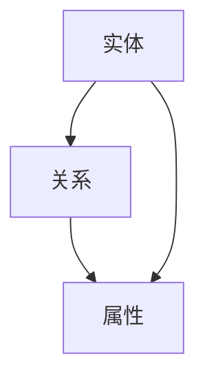
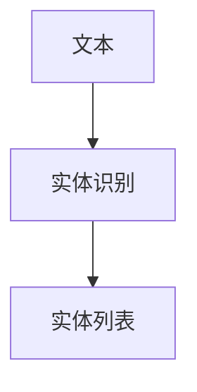
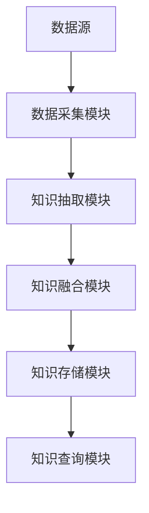

                 


# 企业知识图谱构建：增强AI Agent的领域理解

## 关键词：企业知识图谱、AI Agent、领域理解、知识抽取、图数据库、知识图谱构建、深度学习

## 摘要：  
企业知识图谱是一种结构化的知识表示方法，能够帮助AI Agent更好地理解企业内部和外部的复杂关系。本文详细探讨了企业知识图谱的构建方法、关键技术、系统架构设计以及实际应用场景。通过结合深度学习和自然语言处理技术，本文展示了如何利用知识图谱增强AI Agent的领域理解能力，从而提升企业的智能化水平和决策效率。

---

## 第一部分: 企业知识图谱构建基础

### 第1章: 知识图谱概述

#### 1.1 知识图谱的定义与核心概念
##### 1.1.1 知识图谱的定义
知识图谱是一种以图结构形式表示知识的语义网络，由实体（节点）和关系（边）组成，能够描述真实世界中的概念及其关系。

##### 1.1.2 知识图谱的核心要素
| 核心要素 | 描述 |
|----------|------|
| 实体      | 知识图谱中的基本单元，代表具体事物或概念。 |
| 关系      | 描述实体之间的关联，可以是二元关系或多元关系。 |
| 属性      | 描述实体的特征或性质。 |

##### 1.1.3 知识图谱的构建目标
构建知识图谱的目标是将分散的知识点进行结构化整合，便于计算机理解和应用。



#### 1.2 企业知识图谱的重要性
##### 1.2.1 知识图谱在企业中的应用场景
- 企业内部知识管理
- 智能搜索与推荐
- 智能问答系统
- 数据集成与分析

##### 1.2.2 知识图谱对企业AI Agent的赋能作用
知识图谱为AI Agent提供了丰富的语义信息，使其能够更好地理解上下文和用户需求。

##### 1.2.3 知识图谱的商业价值
- 提高企业效率
- 改善客户体验
- 支持数据驱动的决策

#### 1.3 知识图谱与AI Agent的关系
##### 1.3.1 知识图谱如何增强AI Agent的理解能力
通过知识图谱，AI Agent能够理解实体之间的关系，从而更好地完成任务。

##### 1.3.2 知识图谱在AI Agent决策中的作用
知识图谱为AI Agent提供了决策所需的背景知识和推理能力。

##### 1.3.3 知识图谱与AI Agent的协同进化
随着AI Agent的学习和进化，知识图谱也在不断扩展和优化。

#### 1.4 本章小结

---

### 第2章: 知识图谱的构建方法

#### 2.1 知识图谱构建的流程
##### 2.1.1 数据采集与预处理
数据来源包括结构化数据（数据库）、非结构化数据（文本、文档）和半结构化数据（网页、表格）。

##### 2.1.2 知识抽取与融合
知识抽取包括实体识别、关系抽取和属性抽取。知识融合是将多源数据整合到一个统一的知识图谱中。

##### 2.1.3 知识表示与存储
知识表示可以采用RDF（资源描述框架）或图数据库（如Neo4j）。

#### 2.2 知识抽取技术
##### 2.2.1 实体识别
实体识别是通过自然语言处理技术从文本中提取实体的过程。



##### 2.2.2 关系抽取
关系抽取是识别文本中实体之间的关系。

##### 2.2.3 概念抽取
概念抽取是从文本中提取抽象概念或主题。

#### 2.3 知识融合与冲突处理
##### 2.3.1 多源数据的融合方法
- 基于规则的融合
- 基于本体的融合
- 基于机器学习的融合

##### 2.3.2 知识冲突的检测与解决
知识冲突检测可以通过本体匹配技术实现。

#### 2.4 本章小结

---

### 第3章: 知识图谱的构建工具与技术

#### 3.1 知识图谱构建的常用工具
##### 3.1.1 RDF与RDFS
RDF（资源描述框架）是一种用于表示资源及其属性的通用数据模型。

##### 3.1.2 SPARQL查询语言
SPARQL是一种用于查询和操作RDF数据的查询语言。

##### 3.1.3 图数据库（如Neo4j）
图数据库适用于存储和查询图结构化的知识图谱。

#### 3.2 知识图谱建模语言
##### 3.2.1 基于RDF的建模
RDF通过三元组（subject, predicate, object）表示知识。

##### 3.2.2 基于概念图的建模
概念图是一种可视化知识表示的方法。

##### 3.2.3 基于规则的建模
规则建模通过定义逻辑规则来构建知识图谱。

#### 3.3 知识图谱构建的自动化技术
##### 3.3.1 自然语言处理在知识抽取中的应用
NLP技术（如分词、句法分析）用于从文本中提取知识。

##### 3.3.2 知识图谱的自动扩展与完善
通过机器学习模型自动发现新知识。

##### 3.3.3 基于机器学习的构建优化
机器学习算法可以用于知识抽取和关系挖掘。

#### 3.4 本章小结

---

### 第4章: 知识图谱的算法原理

#### 4.1 实体识别算法
##### 4.1.1 基于规则的实体识别
通过预定义的规则匹配文本中的实体。

##### 4.1.2 基于统计的实体识别
使用统计模型（如HMM）进行实体识别。

##### 4.1.3 基于深度学习的实体识别
使用RNN或BERT模型进行实体识别。

#### 4.2 关系抽取算法
##### 4.2.1 基于规则的关系抽取
通过模板匹配文本中的关系。

##### 4.2.2 基于模板的关系抽取
使用预定义的模板匹配关系。

##### 4.2.3 基于深度学习的关系抽取
使用注意力机制或图神经网络进行关系抽取。

#### 4.3 知识图谱嵌入技术
##### 4.3.1 Word2Vec在知识图谱中的应用
将实体和关系映射到低维向量空间。

##### 4.3.2 Node2Vec与Path Embedding
Node2Vec是一种用于图嵌入的技术。

##### 4.3.3 图神经网络（Graph Neural Networks）
GNN是一种用于处理图结构数据的深度学习模型。

#### 4.4 本章小结

---

## 第二部分: 系统架构设计与项目实战

### 第5章: 系统架构设计

#### 5.1 项目背景
本项目旨在构建一个企业知识图谱，用于支持AI Agent的领域理解。

#### 5.2 系统功能设计
##### 5.2.1 系统功能模块
- 数据采集模块
- 知识抽取模块
- 知识融合模块
- 知识存储模块
- 知识查询模块

#### 5.3 系统架构设计
##### 5.3.1 系统架构图


#### 5.4 接口设计
##### 5.4.1 API接口
- 数据采集接口
- 知识查询接口

#### 5.5 本章小结

---

### 第6章: 项目实战

#### 6.1 环境安装
- 安装Python
- 安装必要的库（如numpy、pandas、networkx）

#### 6.2 核心实现
##### 6.2.1 数据采集
```python
import requests
from bs4 import BeautifulSoup

def extract_text(url):
    response = requests.get(url)
    soup = BeautifulSoup(response.text, 'html.parser')
    text = soup.get_text()
    return text
```

##### 6.2.2 实体识别
```python
from spacy import load

nlp = load('en_core_web_sm')
doc = nlp(text)
entities = [ent.text for ent in doc.ents]
```

##### 6.2.3 关系抽取
```python
from networkx import DiGraph

graph = DiGraph()
graph.add_nodes_from(entities)
for relation in relations:
    graph.add_edge(relation.subject, relation.object)
```

#### 6.3 本章小结

---

## 第三部分: 高级应用与未来趋势

### 第7章: 高级应用与未来趋势

#### 7.1 知识图谱的高级应用
##### 7.1.1 金融领域的知识图谱
- 风险评估
- 投资决策

##### 7.1.2 医疗领域的知识图谱
- 疾病诊断
- 药物研发

#### 7.2 知识图谱与AI Agent的未来发展趋势
##### 7.2.1 知识图谱的动态更新
##### 7.2.2 多模态知识图谱
##### 7.2.3 知识图谱与区块链的结合

#### 7.3 最佳实践与注意事项
##### 7.3.1 数据质量的重要性
##### 7.3.2 知识图谱的可扩展性
##### 7.3.3 安全与隐私保护

#### 7.4 本章小结

---

## 总结
企业知识图谱的构建是实现AI Agent领域理解的关键技术。通过本文的详细讲解，读者可以系统地了解知识图谱的构建方法、关键技术以及实际应用。未来，随着技术的不断发展，知识图谱将在更多领域发挥重要作用。

