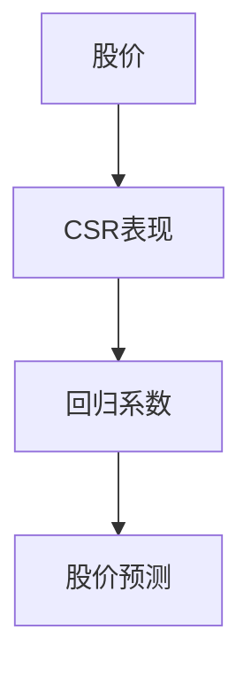
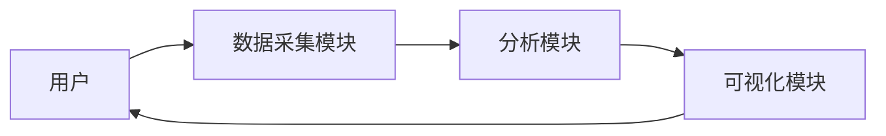

                 


# 企业社会责任（CSR）对长期股价的影响

## 关键词
企业社会责任（Corporate Social Responsibility, CSR），长期股价，投资者行为，企业声誉，可持续发展

## 摘要
企业社会责任（CSR）是指企业在追求经济利益的同时，关注社会和环境的影响，履行其对股东、员工、客户、供应商、社区以及环境的责任。本文将探讨企业社会责任如何影响长期股价，分析其对投资者行为、企业声誉和风险管理的潜在影响，构建数学模型，提供实证分析和系统设计，并通过案例分析验证理论。

---

## 第一部分: 企业社会责任（CSR）的背景与概念

### 第1章: 企业社会责任（CSR）的定义与核心要素

#### 1.1 企业社会责任的定义
- **起源与发展**：从20世纪30年代的“利益相关者理论”到现代的可持续发展理念，企业社会责任逐步演变为涵盖经济、社会和环境的综合概念。
- **核心概念**：企业不仅为股东创造价值，还需考虑员工福利、环境保护、社会公益等。
- **边界与外延**：企业社会责任涉及公司治理、道德规范、环境影响等多方面。

#### 1.2 企业社会责任的核心要素
| 属性 | 定义 | 影响 |
|------|------|------|
| 经济责任 | 合规经营、合理回报 | 提高投资者信任度 |
| 社会责任 | 关爱员工、回馈社会 | 增强企业声誉 |
| 环境责任 | 节能减排、绿色生产 | 降低环境风险 |
| 治理责任 | 透明治理、合规管理 | 提升治理效率 |

### 第2章: 企业社会责任与长期股价的关系

#### 2.1 企业社会责任对股价的积极影响
- **提升企业形象与声誉**：良好的CSR表现能增强品牌价值，吸引更多投资者。
- **增强投资者信心**：长期来看，CSR表现良好的企业更具稳定性。
- **促进长期价值创造**：通过可持续发展，企业能实现更高的长期收益。

#### 2.2 企业社会责任对股价的潜在挑战
- **短期成本增加**：实施CSR可能需要额外投资，影响短期利润。
- **利益相关者冲突**：不同利益相关者的需求可能不一致，影响企业决策。
- **信息不对称与透明度问题**：投资者难以全面了解企业的CSR表现。

### 第3章: 企业社会责任对长期股价的理论模型

#### 3.1 理论基础
- **股东价值最大化与利益相关者理论**：强调企业应平衡股东和其他利益相关者的利益。
- **企业社会责任与可持续发展理论**：企业通过履行社会责任，实现可持续发展，提升长期价值。
- **资本市场效率与信息传递理论**：CSR信息影响投资者决策，进而影响股价。

#### 3.2 数学模型与公式
##### 回归模型
$$ \text{股价} = \beta_0 + \beta_1 \times \text{CSR表现} + \epsilon $$

##### 路径分析
$$ \text{股价} = \beta_0 + \beta_1 \times \text{CSR治理} + \beta_2 \times \text{CSR声誉} + \epsilon $$

#### 3.3 算法原理
##### 回归分析流程图


---

## 第二部分: 企业社会责任对股价影响的系统分析

### 第4章: 基于 CSR 的股价分析系统设计

#### 4.1 问题场景介绍
企业希望通过分析CSR表现对股价的影响，制定有效的战略决策。

#### 4.2 系统功能设计
- **数据采集模块**：收集企业CSR表现和股价数据。
- **分析模块**：构建回归模型，分析CSR对股价的影响。
- **可视化模块**：生成图表展示分析结果。

#### 4.3 系统架构设计


#### 4.4 系统接口设计
- **输入接口**：接收企业CSR数据和股价数据。
- **输出接口**：返回分析结果和可视化图表。

#### 4.5 系统交互流程图


---

## 第三部分: 项目实战与案例分析

### 第5章: 基于 CSR 的股价分析项目实现

#### 5.1 环境安装
- **Python 3.8+**
- **Pandas、Scikit-learn、Matplotlib**

#### 5.2 核心代码实现
```python
import pandas as pd
import numpy as np
from sklearn.linear_model import LinearRegression
import matplotlib.pyplot as plt

# 数据加载
data = pd.read_csv('csr_stock.csv')

# 模型训练
model = LinearRegression()
model.fit(data[['csr_score']], data['stock_price'])

# 模型结果
print('回归系数:', model.coef_[0])
print('截距:', model.intercept_)

# 可视化
plt.scatter(data['csr_score'], data['stock_price'], color='blue')
plt.plot(data['csr_score'], model.predict(data[['csr_score]]), color='red')
plt.xlabel('CSR得分')
plt.ylabel('股价')
plt.title('CSR对股价的影响')
plt.show()
```

#### 5.3 案例分析
以苹果公司为例，分析其CSR表现如何影响股价。数据包括苹果的CSR得分和股价数据，通过回归分析得出结论。

---

## 第四部分: 总结与展望

### 第6章: 总结与未来展望

#### 6.1 总结
- 企业社会责任对长期股价有显著影响，良好的CSR表现能提升企业形象和投资者信心。
- 数学模型和系统设计为分析提供了有效工具，帮助企业在制定战略时考虑社会责任因素。

#### 6.2 未来展望
- 进一步研究不同行业CSR对股价的影响差异。
- 探索动态模型，考虑时间因素对股价的影响。
- 提升数据透明度，优化分析工具。

#### 6.3 最佳实践 tips
- 企业应定期评估其CSR表现，并将其与财务表现相结合。
- 投资者应关注企业的可持续发展指标，做出更明智的投资决策。

---

## 关键词
企业社会责任（CSR），长期股价，投资者行为，企业声誉，可持续发展

---

通过以上分析，我们全面探讨了企业社会责任（CSR）对长期股价的影响，从理论到实践，为读者提供了清晰的思路和方法。

