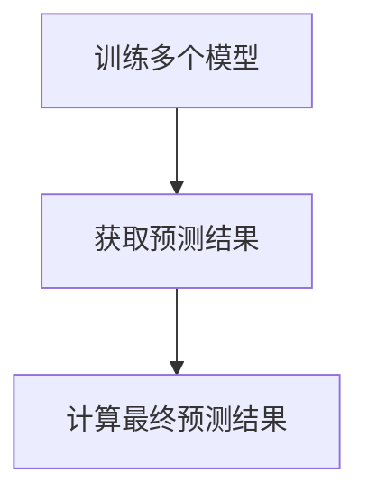
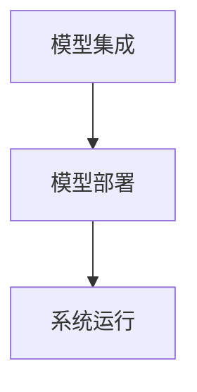
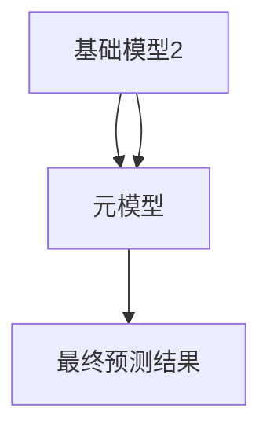
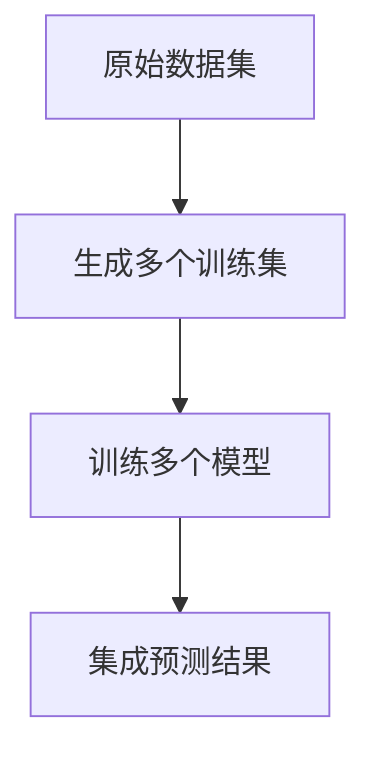
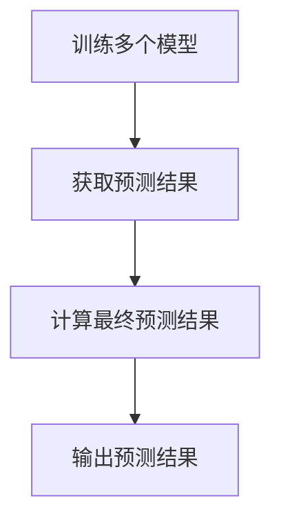
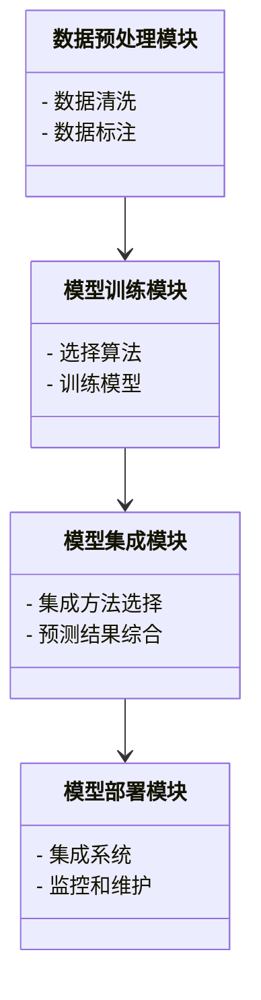
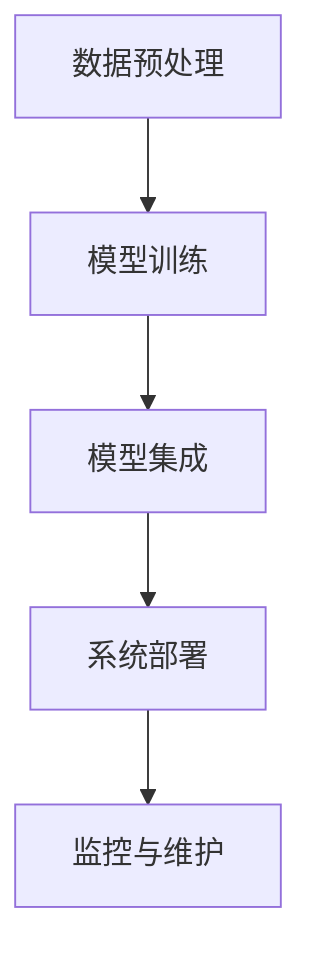
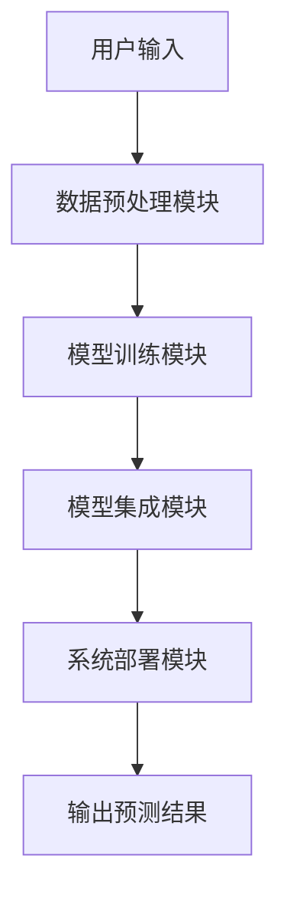

                 


# 企业系统中AI模型的集成与部署

## 关键词：
企业系统、AI模型、集成、部署、机器学习、深度学习、系统架构

## 摘要：
本文详细探讨了在企业系统中集成与部署AI模型的关键步骤和挑战。从背景介绍到核心概念，从算法原理到系统架构设计，再到项目实战和最佳实践，全面解析了AI模型在企业系统中的应用。文章通过实例分析和详细的技术解读，帮助读者理解如何高效地将AI模型集成到现有系统中，并确保其稳定运行和持续优化。

---

# 第1章: 企业系统与AI模型概述

## 1.1 企业系统的发展历程

### 1.1.1 从传统系统到智能系统的演进
企业系统经历了从简单的数据处理到智能化应用的演变。传统系统主要依赖规则引擎和人工决策，而现代企业系统通过集成AI模型实现了智能化转型。

### 1.1.2 企业系统的核心特征
- **模块化**：系统划分为多个功能模块，如数据处理、业务逻辑、用户界面等。
- **高可用性**：系统需要7×24小时稳定运行，支持高并发访问。
- **可扩展性**：系统能够根据需求快速扩展功能或性能。

### 1.1.3 AI技术对企业系统的影响
AI技术的引入显著提升了企业的决策效率和业务处理能力。例如，通过AI模型实现智能推荐、 fraud detection（欺诈检测）和自动化客服等。

## 1.2 AI模型的基本概念

### 1.2.1 机器学习与深度学习的定义
- **机器学习**：通过数据训练模型，使其能够从数据中学习并做出预测。
- **深度学习**：一种基于人工神经网络的机器学习方法，能够处理复杂的非线性数据。

### 1.2.2 AI模型的分类与特点
- **监督学习模型**：如线性回归、支持向量机（SVM）和随机森林。
- **无监督学习模型**：如聚类分析（K-means）和主题模型（LDA）。
- **强化学习模型**：通过试错机制优化决策策略。

### 1.2.3 AI模型在企业中的应用场景
- **客户服务**：智能客服系统通过NLP技术实现自然语言理解。
- **风险管理**：利用AI模型进行 fraud detection（欺诈检测）和 credit scoring（信用评分）。
- **供应链优化**：通过预测模型优化库存管理和物流路径。

## 1.3 企业系统中AI模型集成的背景

### 1.3.1 企业智能化转型的需求
企业需要通过智能化转型提升竞争力，降低成本，并优化客户体验。

### 1.3.2 AI模型在企业系统中的价值
- **提升决策效率**：通过AI模型实现数据驱动的决策。
- **提高业务效率**：自动化处理重复性任务，减少人工干预。
- **增强客户体验**：通过个性化推荐和智能客服提升客户满意度。

### 1.3.3 当前集成与部署的主要挑战
- **技术复杂性**：AI模型的训练和部署需要专业的技术和工具。
- **数据隐私**：企业数据的隐私保护和合规性要求。
- **系统兼容性**：AI模型需要与现有系统无缝集成。

## 1.4 本章小结
本章介绍了企业系统的发展历程、AI模型的基本概念以及AI模型在企业系统中的应用价值和挑战。接下来的章节将详细探讨AI模型集成与部署的核心概念和实现方法。

---

# 第2章: AI模型集成与部署的核心概念

## 2.1 AI模型集成的定义与分类

### 2.1.1 模型集成的定义
模型集成是指将多个AI模型结合起来，利用它们的预测结果进行综合决策。

### 2.1.2 常见的模型集成方法
- **简单平均法**：将多个模型的预测结果取平均值。
- **加权平均法**：根据模型的性能给不同模型分配不同的权重。
- **投票法**：用于分类任务，多个模型投票决定最终结果。

### 2.1.3 模型集成的优缺点对比

| 方法        | 优点                              | 缺点                              |
|-------------|-----------------------------------|-----------------------------------|
| 简单平均法  | 实现简单，能够平衡不同模型的预测   | 可能无法捕捉到模型间的相互作用   |
| 加权平均法  | 能够根据模型性能进行优化           | 需要确定权重分配策略             |
| 投票法      | 适用于分类任务，结果直观           | 对异常值不敏感，可能降低准确性   |

### 2.1.4 模型集成的流程图


## 2.2 AI模型部署的定义与流程

### 2.2.1 模型部署的定义
模型部署是指将训练好的AI模型集成到实际业务系统中，使其能够实时提供预测服务。

### 2.2.2 模型部署的主要流程
1. **模型训练**：收集和标注数据，选择合适的算法进行模型训练。
2. **模型评估**：通过测试数据评估模型的性能和准确性。
3. **模型优化**：根据评估结果调整模型参数或选择更优的算法。
4. **模型部署**：将优化后的模型集成到企业系统中，并确保其稳定运行。

### 2.2.3 模型部署的关键成功因素
- **模型性能**：模型在实际应用中的准确性和响应速度。
- **系统兼容性**：模型能够与现有系统无缝集成。
- **数据隐私**：确保数据在传输和存储过程中的安全性。

## 2.3 企业系统中AI模型集成与部署的关系

### 2.3.1 集成与部署的协同关系
集成和部署是AI模型应用的两个关键阶段，集成阶段决定了模型的性能，部署阶段决定了模型的可用性。

### 2.3.2 集成与部署的相互影响
- **集成影响部署**：模型集成的质量直接影响部署后的性能。
- **部署影响集成**：部署环境和需求可能影响模型集成的方法。

### 2.3.3 集成与部署的边界与外延
- **边界**：模型集成和部署的界限在于模型是否准备好用于实际业务。
- **外延**：模型部署后的监控和维护也是集成与部署的重要部分。

### 2.3.4 集成与部署的关系图


## 2.4 本章小结
本章详细讲解了AI模型集成与部署的核心概念，包括集成方法的分类、部署流程的关键步骤以及集成与部署的关系。接下来的章节将从算法原理和系统架构的角度深入探讨AI模型的集成与部署。

---

# 第3章: AI模型集成与部署的算法原理

## 3.1 基础集成方法

### 3.1.1 简单平均法
简单平均法是一种将多个模型的预测结果取平均值的方法。其数学表达式为：
$$ y_{\text{pred}} = \frac{1}{n} \sum_{i=1}^{n} y_{\text{pred}_i} $$
其中，$n$是模型的数量，$y_{\text{pred}_i}$是第$i$个模型的预测结果。

### 3.1.2 加权平均法
加权平均法是根据每个模型的性能给不同的权重，计算公式为：
$$ y_{\text{pred}} = \sum_{i=1}^{n} w_i y_{\text{pred}_i} $$
其中，$w_i$是第$i$个模型的权重，满足$\sum_{i=1}^{n} w_i = 1$。

### 3.1.3 投票法
投票法用于分类任务，多个模型投票决定最终结果。例如，在二分类任务中，如果超过半数模型预测为正类，则最终结果为正类。

## 3.2 高级集成方法

### 3.2.1 Stacking
Stacking是一种元学习方法，通过训练元模型来整合多个基础模型的预测结果。其流程图如下：


### 3.2.2 Bagging
Bagging是一种通过数据增强生成多个训练集，并训练多个模型，最后通过投票或平均法进行集成的方法。其流程图如下：


### 3.2.3 Boosting
Boosting是一种通过迭代优化模型权重，逐步提升模型性能的方法。常见的Boosting算法有Adaboost和XGBoost。

## 3.3 模型集成的数学模型

### 3.3.1 线性回归模型
线性回归模型用于预测连续型变量，其数学表达式为：
$$ y = \beta_0 + \beta_1 x_1 + \beta_2 x_2 + \ldots + \beta_n x_n + \epsilon $$
其中，$\beta_i$是回归系数，$\epsilon$是误差项。

### 3.3.2 随机森林模型
随机森林是一种基于决策树的集成方法，通过随机采样数据和随机选择特征来生成多个决策树，最终通过投票法或平均法进行预测。

### 3.3.3 XGBoost模型
XGBoost是一种基于树的Boosting算法，通过正则化和剪枝技术优化模型性能。

## 3.4 模型集成的流程图


---

# 第4章: 系统分析与架构设计

## 4.1 系统分析

### 4.1.1 问题场景介绍
假设我们正在开发一个智能客服系统，需要集成一个NLP模型来实现意图识别和语义理解。

### 4.1.2 系统功能设计
- **数据预处理模块**：清洗和标注数据，确保数据质量。
- **模型训练模块**：选择合适的算法，训练意图识别模型。
- **模型集成模块**：将多个模型的预测结果进行综合决策。
- **模型部署模块**：将优化后的模型集成到智能客服系统中。

### 4.1.3 领域模型设计


### 4.1.4 系统架构设计


## 4.2 系统接口设计

### 4.2.1 输入接口设计
- **数据输入**：接收原始数据，包括文本、图像等。
- **参数配置**：配置模型的超参数，如学习率、树深度等。

### 4.2.2 输出接口设计
- **预测结果**：输出模型的预测结果，如分类标签或回归值。
- **日志输出**：输出模型训练和部署过程中的日志信息。

## 4.3 系统交互设计

### 4.3.1 系统交互流程图


### 4.3.2 系统交互步骤
1. 用户输入数据，触发数据预处理模块。
2. 数据预处理模块清洗和标注数据，传递给模型训练模块。
3. 模型训练模块选择算法，训练模型并传递给模型集成模块。
4. 模型集成模块综合多个模型的预测结果，传递给系统部署模块。
5. 系统部署模块将预测结果返回给用户。

## 4.4 本章小结
本章从系统分析和架构设计的角度，详细探讨了AI模型集成与部署的实现过程。接下来的章节将通过一个具体的项目案例，展示AI模型集成与部署的实际应用。

---

# 第5章: 项目实战

## 5.1 项目环境安装

### 5.1.1 安装Python
```bash
# 安装Python
sudo apt-get install python3 python3-pip
```

### 5.1.2 安装依赖库
```bash
# 安装机器学习库
pip install numpy pandas scikit-learn xgboost
```

## 5.2 系统核心实现源代码

### 5.2.1 数据预处理代码
```python
import pandas as pd

def preprocess_data(data):
    # 清洗数据
    data = data.dropna()
    # 标注数据
    data['label'] = data['label'].astype(int)
    return data
```

### 5.2.2 模型训练代码
```python
from sklearn.ensemble import RandomForestClassifier
from xgboost import XGBClassifier

def train_model(X, y):
    # 训练随机森林模型
    rf_model = RandomForestClassifier(n_estimators=100, random_state=42)
    rf_model.fit(X, y)
    
    # 训练XGBoost模型
    xgb_model = XGBClassifier(n_estimators=100, learning_rate=0.1, random_state=42)
    xgb_model.fit(X, y)
    
    return rf_model, xgb_model
```

### 5.2.3 模型集成代码
```python
def ensemble_models(models, X):
    # 获取多个模型的预测结果
    predictions = []
    for model in models:
        pred = model.predict(X)
        predictions.append(pred)
    # 计算最终预测结果
    final_pred = []
    for i in range(len(X)):
        final_pred.append(int(sum(predictions[i]) / len(predictions)))
    return final_pred
```

### 5.2.4 模型部署代码
```python
from flask import Flask, request, jsonify

app = Flask(__name__)

@app.route('/predict', methods=['POST'])
def predict():
    data = request.json
    X = pd.DataFrame(data)
    model = load_model()
    result = model.predict(X)
    return jsonify({'result': result.tolist()})

if __name__ == '__main__':
    app.run(debug=True)
```

## 5.3 代码解读与分析

### 5.3.1 数据预处理模块
数据预处理模块负责清洗和标注数据，确保数据的质量和一致性。

### 5.3.2 模型训练模块
模型训练模块使用随机森林和XGBoost两种算法训练模型，分别适用于不同的数据类型和任务。

### 5.3.3 模型集成模块
模型集成模块通过投票法或平均法综合多个模型的预测结果，提升模型的准确性和稳定性。

### 5.3.4 模型部署模块
模型部署模块将AI模型集成到Web服务中，通过Flask框架提供API接口，实现实时预测。

## 5.4 实际案例分析与详细讲解

### 5.4.1 案例背景
我们以一个智能客服系统为例，集成一个意图识别模型，实现对客户咨询的自动分类。

### 5.4.2 案例实现
1. **数据预处理**：清洗和标注客户咨询数据，提取关键词和标签。
2. **模型训练**：使用随机森林和XGBoost训练意图识别模型。
3. **模型集成**：通过投票法综合多个模型的预测结果。
4. **模型部署**：将模型集成到智能客服系统中，提供实时预测服务。

### 5.4.3 案例分析
通过实际案例分析，验证模型集成与部署的效果，优化模型性能和系统稳定性。

## 5.5 项目小结
本章通过一个实际项目案例，详细展示了AI模型集成与部署的实现过程。从环境安装到代码实现，从系统设计到实际应用，全面解析了AI模型在企业系统中的应用。

---

# 第6章: 最佳实践与总结

## 6.1 最佳实践

### 6.1.1 数据准备
- 确保数据质量，进行充分的数据清洗和标注。
- 采用数据增强技术，提升模型的泛化能力。

### 6.1.2 模型选择
- 根据任务需求选择合适的算法，如分类任务选择随机森林或XGBoost。
- 通过交叉验证评估模型性能，选择最优模型。

### 6.1.3 模型集成
- 根据模型性能和任务需求选择合适的集成方法，如简单平均法或Stacking。
- 通过超参数调优优化集成效果。

### 6.1.4 模型部署
- 确保模型部署环境与训练环境一致，避免环境依赖问题。
- 通过容器化技术（如Docker）部署模型，提升系统的可移植性和可扩展性。

### 6.1.5 模型监控
- 实时监控模型的预测结果和系统性能，及时发现和解决问题。
- 定期重新训练模型，确保模型的准确性和适应性。

## 6.2 小结
本章总结了AI模型集成与部署的最佳实践，从数据准备到模型部署，全面指导读者如何高效地将AI模型集成到企业系统中。

## 6.3 注意事项

### 6.3.1 数据隐私
在模型训练和部署过程中，必须严格遵守数据隐私保护法规，确保数据的安全性和合规性。

### 6.3.2 系统兼容性
模型部署时需要考虑系统兼容性问题，确保模型能够与现有系统无缝集成。

### 6.3.3 模型更新
定期重新训练和更新模型，确保模型的准确性和适应性，应对数据分布的变化。

## 6.4 拓展阅读
- 《Hands-On Machine Learning with Scikit-Learn, Keras, and TensorFlow》
- 《Deep Learning》
- 《Python机器学习：基于Scikit-Learn和TensorFlow实战》

## 6.5 本章小结
本章总结了AI模型集成与部署的最佳实践，并展望了未来的发展方向。通过遵循这些实践，读者可以高效地将AI模型集成到企业系统中，实现智能化转型。

---

# 结语
通过本文的详细讲解，读者可以全面了解AI模型在企业系统中的集成与部署过程，从理论到实践，从算法到系统设计，为企业的智能化转型提供有力支持。

