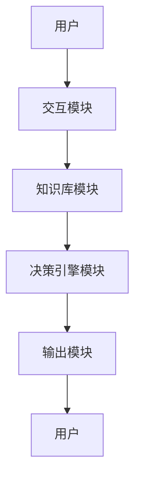

                 


# 企业级 AI Agent 开发：LLM 在商业场景中的落地

> 关键词：企业级 AI Agent，大语言模型，LLM，商业场景，人工智能，系统架构

> 摘要：本文深入探讨了企业级 AI Agent 的开发及其在商业场景中的应用。通过分析 LLM 的核心原理和系统架构，结合实际项目案例，详细讲解了如何在商业环境中落地 AI Agent。文章内容涵盖背景介绍、核心概念、算法原理、系统设计、项目实战以及最佳实践，为读者提供了全面的技术指导。

---

## 第一部分：企业级 AI Agent 与 LLM 概述

### 第1章：企业级 AI Agent 的定义与特点

#### 1.1 什么是企业级 AI Agent
企业级 AI Agent 是一种智能体，能够通过自然语言处理（NLP）技术与用户进行交互，并基于大语言模型（LLM）提供决策支持和自动化服务。它具备自主性、反应性、目标导向性和社交能力的特点。

#### 1.2 企业级 AI Agent 的核心要素
- **自主性**：无需人工干预，能够独立执行任务。
- **反应性**：实时感知环境变化并做出响应。
- **目标导向性**：通过优化目标函数实现特定任务。
- **社交能力**：能够与人类或其他系统进行有效沟通。

#### 1.3 LLM 在企业级 AI Agent 中的作用
- **知识表示**：LLM 作为知识库，帮助 AI Agent 理解上下文。
- **自然语言处理**：通过 NLP 技术实现人与 AI Agent 的自然对话。
- **决策支持**：基于 LLM 的推理能力，提供决策建议。

### 第2章：大语言模型（LLM）的核心原理

#### 2.1 LLM 的基本原理
大语言模型通过预训练和微调技术，学习海量文本数据，从而具备理解和生成自然语言的能力。其核心在于Transformer模型的自注意力机制，能够捕捉文本中的长距离依赖关系。

#### 2.2 Transformer 模型的数学表达
- **自注意力机制**：
  $$\text{Attention}(Q, K, V) = \text{softmax}\left(\frac{QK^T}{\sqrt{d_k}}\right)V$$
  其中，\(Q\)、\(K\)、\(V\) 分别是查询、键和值向量，\(d_k\) 是键的维度。

- **位置编码**：
  $$\text{pos}(i, d) = \sin\left(\frac{i}{10000^{d/\text{dim}}}\right)$$
  用于引入位置信息，增强模型对序列的理解能力。

#### 2.3 LLM 的训练与优化
- **预训练**：使用大规模通用数据进行无监督学习，目标是最小化生成概率的损失。
- **微调**：针对特定任务对模型进行有监督微调，提升任务相关性。

### 第3章：企业级 AI Agent 的系统设计

#### 3.1 系统架构
- **模块划分**：
  - **自然语言处理模块**：负责与用户的交互。
  - **知识库模块**：存储和检索相关信息。
  - **决策引擎模块**：基于输入生成响应。

- **系统架构图**：
  ```mermaid
  graph TD
    A[自然语言处理模块] --> B[知识库模块]
    B --> C[决策引擎模块]
    C --> D[输出模块]
  ```

#### 3.2 LLM 在系统中的角色
- **知识库接口**：通过 LLM 实现信息检索和上下文理解。
- **对话中枢**：作为用户与系统交互的核心，负责协调各模块。
- **决策支持**：利用 LLM 的推理能力辅助决策。

### 第4章：企业级 AI Agent 的应用场景

#### 4.1 商业场景中的 AI Agent
- **客户服务与支持**：通过智能客服系统解决用户问题。
- **业务流程自动化**：自动化处理订单、合同审核等流程。
- **决策支持**：基于数据和市场趋势提供决策建议。

#### 4.2 LLM 在商业场景中的应用
- **智能客服系统**：通过 LLM 提供24/7的客户支持，提高响应速度和准确性。
- **销售预测与分析**：利用 LLM 分析市场数据，预测销售趋势。
- **风险管理**：识别潜在风险，提供风险评估报告。

---

## 第二部分：企业级 AI Agent 的系统架构与实现

### 第5章：系统架构设计

#### 5.1 系统功能设计
- **用户需求分析**：通过用户调研确定系统功能。
- **功能模块设计**：包括交互模块、知识库模块、决策引擎模块等。
- **用户体验设计**：优化界面和交互流程，提升用户体验。

#### 5.2 系统架构图


### 第6章：系统实现

#### 6.1 环境安装
- **安装 Python 和依赖库**：
  ```bash
  pip install numpy pandas torch transformers
  ```

#### 6.2 核心代码实现
```python
class AI-Agent:
    def __init__(self, model):
        self.model = model
        self.knowledge_base = knowledge_base

    def process_input(self, input_text):
        # 使用 LLM 进行解析
        response = self.model.generate(input_text)
        return response

    def update_knowledge(self, new_info):
        self.knowledge_base.update(new_info)
```

#### 6.3 实际案例分析
- **智能客服系统实现**：
  ```python
  def handle_customer_query(query):
      response = process_input(query)
      return response
  ```

---

## 第三部分：企业级 AI Agent 的最佳实践

### 第7章：最佳实践与注意事项

#### 7.1 LLM 的优化技巧
- **模型选择**：根据任务需求选择合适的模型。
- **参数调整**：通过调参优化模型性能。
- **数据预处理**：确保数据质量和多样性。

#### 7.2 项目小结
通过本文的讲解，读者可以全面了解企业级 AI Agent 的开发过程，包括从理论到实践的各个环节。掌握这些知识，能够帮助企业在商业场景中有效落地 AI Agent 技术。

#### 7.3 拓展阅读
建议读者深入学习大语言模型的内部机制和系统架构设计，以提升对 AI Agent 开发的理解和应用能力。

---

通过以上步骤，文章系统地介绍了企业级 AI Agent 的开发和 LLM 在商业场景中的应用，提供了从理论到实践的全面指导。

