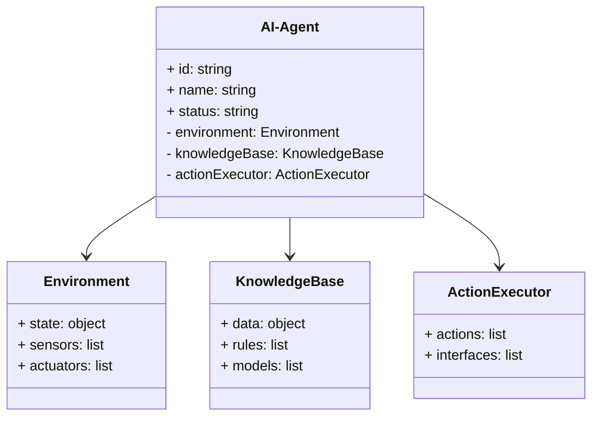
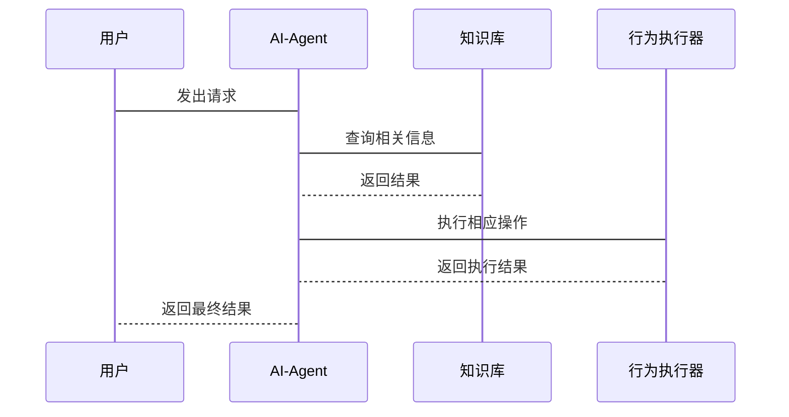
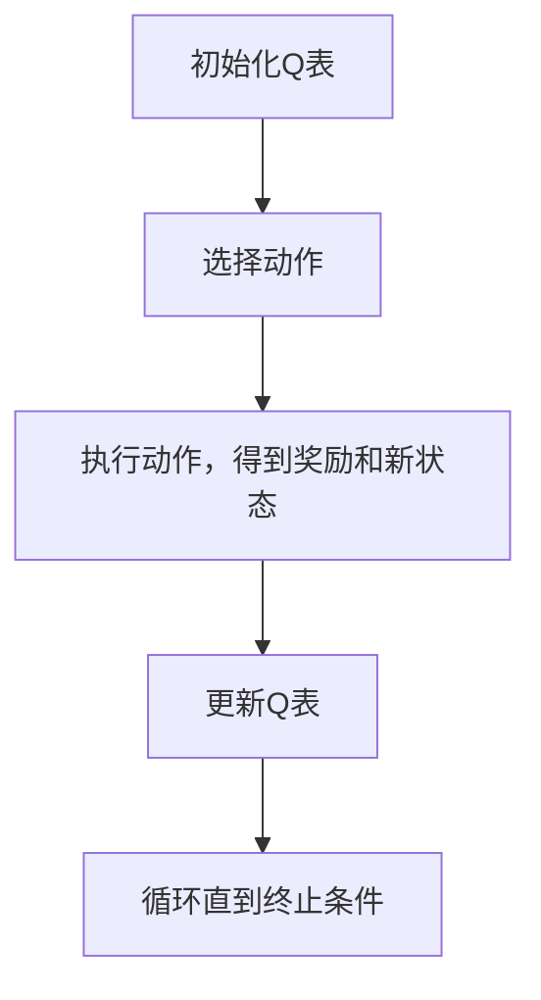
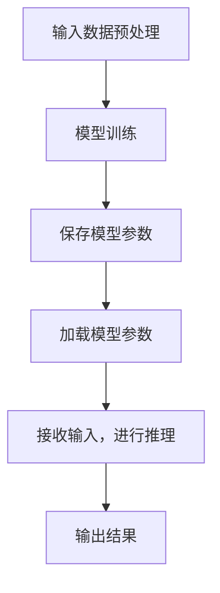

                 


# 企业级AI Agent的可扩展架构设计

## 关键词：企业级AI Agent，可扩展架构，模块化设计，分布式系统，强化学习，大模型，系统架构

## 摘要：  
企业级AI Agent的可扩展架构设计是实现智能化企业系统的核心。本文将从AI Agent的基本概念出发，分析其在企业环境中的应用背景与挑战，深入探讨可扩展架构设计的关键要素与实现方法。通过强化学习算法与大模型的应用，结合实际项目案例，详细阐述企业级AI Agent的系统分析、架构设计与实战实现，为读者提供全面的技术指导。

---

# 第一部分: 企业级AI Agent的背景与概念

## 第1章: 企业级AI Agent的背景与概念

### 1.1 AI Agent的基本概念

#### 1.1.1 AI Agent的定义与分类
- **AI Agent定义**：AI Agent（人工智能代理）是一种能够感知环境、自主决策并执行任务的智能实体。
- **分类**：
  - **简单反射型Agent**：基于当前输入直接执行预定义操作。
  - **基于模型的反射型Agent**：维护环境模型，能够根据模型进行决策。
  - **目标驱动型Agent**：基于目标规划，自主选择最优行动方案。
  - **实用驱动型Agent**：通过效用函数优化决策。

#### 1.1.2 企业级AI Agent的特征
- **高可用性**：在复杂企业环境中稳定运行。
- **可扩展性**：支持业务规模的动态扩展。
- **智能性**：具备自主学习和推理能力。
- **安全性**：确保数据隐私与系统安全。

#### 1.1.3 企业级AI Agent的应用场景
- **客户支持**：智能客服系统。
- **流程自动化**：企业内部流程自动化。
- **决策支持**：基于数据的智能决策。
- **风险管理**：实时监控与风险预警。

### 1.2 企业级AI Agent的背景与现状

#### 1.2.1 企业智能化转型的背景
- **数字化转型**：企业从传统业务模式向数字化、智能化转型。
- **AI技术进步**：深度学习、强化学习等技术的快速发展。
- **业务需求**：企业对高效、智能的自动化解决方案需求增加。

#### 1.2.2 AI Agent在企业中的应用现状
- **广泛应用于客户服务**：智能客服机器人。
- **流程自动化**：RPA（机器人流程自动化）的应用。
- **智能监控**：实时监控系统运行状态。

#### 1.2.3 当前存在的问题与挑战
- **技术挑战**：复杂环境下的决策能力不足。
- **性能瓶颈**：大规模数据处理的计算能力限制。
- **安全性问题**：数据隐私与系统安全风险。
- **人机协作**：人机交互体验优化需求。

### 1.3 本章小结
本章介绍了AI Agent的基本概念、分类及企业级AI Agent的特征与应用场景，分析了当前企业级AI Agent的背景与现状，指出了当前技术与应用中的问题与挑战。

---

# 第二部分: 企业级AI Agent的可扩展架构设计

## 第2章: 可扩展架构设计的核心概念

### 2.1 可扩展架构的定义与特点

#### 2.1.1 可扩展架构的定义
- **定义**：可扩展架构是一种能够通过增加资源或优化结构，支持系统性能和功能扩展的架构模式。
- **特点**：
  - **模块化**：系统功能划分清晰，便于扩展。
  - **分布性**：功能模块分布部署，提升系统的可用性和扩展性。
  - **灵活性**：支持快速响应业务需求的变化。
  - **高效性**：通过并行处理提升系统性能。

#### 2.1.2 可扩展架构的核心特点
- **横向扩展**：通过增加节点提升处理能力。
- **纵向扩展**：通过提升单节点性能优化系统。
- **模块化设计**：功能模块独立，便于维护和扩展。

#### 2.1.3 可扩展架构与传统架构的区别
| 特性          | 可扩展架构                   | 传统架构                   |
|---------------|------------------------------|-----------------------------|
| 扩展性         | 支持横向和纵向扩展             | 主要支持纵向扩展             |
| 模块化         | 强调模块化设计                 | 模块化程度较低               |
| 可用性         | 高可用性，支持故障转移         | 可用性较低，依赖单点组件     |
| 性能           | 通过分布式处理提升性能         | 依赖单节点性能提升            |

### 2.2 可扩展架构设计的关键要素

#### 2.2.1 模块化设计
- **模块化设计原则**：将系统功能划分为独立的模块，每个模块负责特定功能。
- **模块间通信**：通过接口定义模块间的交互，确保模块间松耦合。
- **模块扩展性**：新增功能时，只需添加新的模块，不影响现有系统。

#### 2.2.2 分布式架构
- **分布式系统优势**：
  - **高可用性**：单点故障风险降低。
  - **可扩展性**：通过增加节点提升系统能力。
  - **负载均衡**：均匀分配任务，提升系统性能。
- **分布式架构模式**：
  - **微服务架构**：每个服务独立部署，支持独立扩展。
  - **分布式计算**：任务分发到多个节点执行，提升计算能力。

#### 2.2.3 异构系统集成
- **异构系统特点**：
  - **多样化技术栈**：支持不同技术平台的集成。
  - **统一接口规范**：通过API实现不同系统的交互。
  - **数据一致性**：确保跨系统数据的一致性与完整性。

### 2.3 本章小结
本章详细探讨了可扩展架构的定义与特点，分析了模块化设计、分布式架构和异构系统集成等关键要素，为后续章节的系统设计奠定了基础。

---

## 第3章: 企业级AI Agent的系统分析与架构设计

### 3.1 系统分析

#### 3.1.1 问题场景介绍
- **问题背景**：企业需要构建一个可扩展的AI Agent系统，支持复杂的业务场景。
- **项目目标**：设计一个高效、可扩展的AI Agent架构，支持多业务场景的扩展。

#### 3.1.2 项目介绍
- **项目目标**：实现企业级AI Agent的可扩展架构设计。
- **项目范围**：覆盖客户服务、流程自动化、决策支持等业务场景。
- **项目需求**：
  - 高可用性：确保系统稳定运行。
  - 可扩展性：支持业务规模的动态扩展。
  - 智能性：具备自主学习和推理能力。

#### 3.1.3 领域模型设计（Mermaid类图）


### 3.2 系统架构设计

#### 3.2.1 系统架构设计（Mermaid架构图）
```mermaid
context diagram
    title 企业级AI Agent架构
    actor 用户
    actor 系统管理员
    actor 业务系统
    component AI-Agent {
        component 内部模块 {
            component 知识库
            component 行为执行器
            component 感知器
        }
    }
    AI-Agent --> 用户
    AI-Agent --> 系统管理员
    AI-Agent --> 业务系统
```

#### 3.2.2 系统接口设计
- **API接口规范**：
  - **RESTful API**：采用标准的HTTP方法（GET、POST、PUT、DELETE）。
  - **JSON格式**：统一数据格式，便于解析与交互。
  - **认证机制**：通过JWT实现身份验证，确保API安全。

#### 3.2.3 系统交互设计（Mermaid序列图）


### 3.3 本章小结
本章通过系统分析与架构设计，明确了企业级AI Agent的系统结构与功能模块之间的关系，为后续的实现提供了清晰的指导。

---

## 第4章: 企业级AI Agent的算法原理与实现

### 4.1 强化学习算法原理

#### 4.1.1 强化学习的基本概念
- **定义**：强化学习是一种通过试错机制，学习最优策略以最大化累计奖励的算法。
- **核心要素**：
  - **状态（State）**：环境当前的观测。
  - **动作（Action）**：代理采取的行动。
  - **奖励（Reward）**：对动作的反馈，指导学习方向。
  - **策略（Policy）**：决定采取哪个动作的规则。
  - **值函数（Value Function）**：预测状态或状态-动作对的期望奖励。

#### 4.1.2 Q-learning算法（Mermaid流程图）


#### 4.1.3 算法实现的Python代码示例
```python
import numpy as np

# 初始化Q表
Q = np.zeros((state_space_size, action_space_size))

# Q-learning算法
for episode in range(num_episodes):
    state = initial_state
    while not terminal:
        # 选择动作
        if np.random.random() < epsilon:
            action = np.random.randint(0, action_space_size)
        else:
            action = np.argmax(Q[state])
        
        # 执行动作，得到新状态和奖励
        next_state, reward = step(state, action)
        
        # 更新Q表
        Q[state][action] += learning_rate * (reward + gamma * np.max(Q[next_state]) - Q[state][action])
        
        state = next_state
```

### 4.2 大模型在AI Agent中的应用

#### 4.2.1 大模型的输入输出机制
- **输入机制**：通过自然语言处理技术，将用户输入转化为模型可理解的格式。
- **输出机制**：模型生成自然语言文本或结构化数据，供代理执行。

#### 4.2.2 大模型的训练与推理流程（Mermaid流程图）


#### 4.2.3 大模型的数学模型与公式
- **模型训练目标**：最小化预测值与真实值的误差。
  $$ \text{损失函数} = \frac{1}{N}\sum_{i=1}^{N}(y_i - \hat{y}_i)^2 $$
- **模型推理过程**：基于概率分布预测输出。
  $$ P(y|x) = \text{softmax}(Wx + b) $$

### 4.3 本章小结
本章详细探讨了强化学习和大模型在AI Agent中的应用，通过Python代码和数学公式，阐述了算法原理与实现方法。

---

## 第5章: 企业级AI Agent的系统实现与实战

### 5.1 环境安装与配置

#### 5.1.1 开发环境的选择
- **开发工具**：推荐使用PyCharm或VS Code。
- **操作系统**：建议使用Linux或macOS，支持多平台部署。

#### 5.1.2 依赖库的安装
- **Python库**：
  - `numpy`：数值计算库。
  - `scikit-learn`：机器学习库。
  - `tensorflow`或`pytorch`：深度学习框架。
  - `flask`：Web框架，用于API接口开发。

#### 5.1.3 环境配置的注意事项
- **虚拟环境管理**：使用`virtualenv`或`venv`管理依赖。
- **版本控制**：确保所有库版本兼容。

### 5.2 系统核心功能实现

#### 5.2.1 Agent的初始化与启动
```python
class AI-Agent:
    def __init__(self):
        self.knowledge_base = KnowledgeBase()
        self.action_executor = ActionExecutor()
        self.environment = Environment()
    
    def start(self):
        # 初始化环境、知识库和行为执行器
        self.knowledge_base.initialize()
        self.environment.initialize()
        # 启动代理
        while True:
            # 感知环境，获取状态
            state = self.environment.get_state()
            # 调用决策算法，获取动作
            action = self.decision_making(state)
            # 执行动作，更新环境状态
            self.environment.execute_action(action)
```

#### 5.2.2 Agent的交互逻辑实现
```python
def decision_making(self, state):
    # 获取可用动作
    available_actions = self.environment.get_available_actions(state)
    # 调用强化学习算法选择动作
    action = self.reinforcement_learning.choose_action(state, available_actions)
    return action
```

#### 5.2.3 Agent的异常处理与恢复
```python
try:
    # 执行动作
    self.environment.execute_action(action)
except Exception as e:
    # 记录错误日志
    self.logger.error(f"Error occurred: {str(e)}")
    # 回滚到上一状态
    self.environment.rollback_state()
    # 重新选择动作
    action = self.reinforcement_learning.choose_action(state, available_actions)
```

### 5.3 项目实战案例分析

#### 5.3.1 案例背景介绍
- **项目目标**：实现一个智能客服AI Agent，支持多轮对话和问题解决。
- **项目范围**：覆盖客户咨询、问题反馈、信息查询等场景。
- **技术选型**：使用强化学习算法优化对话流程，结合大模型进行自然语言处理。

#### 5.3.2 案例实现过程
1. **需求分析**：明确系统功能需求，设计系统架构。
2. **环境搭建**：安装必要的开发工具和依赖库。
3. **功能开发**：实现AI Agent的核心功能模块。
4. **测试与优化**：通过测试用例验证系统功能，优化算法性能。
5. **部署与上线**：将系统部署到生产环境，进行监控与维护。

#### 5.3.3 案例分析与总结
- **案例分析**：通过实际案例分析，验证系统的可扩展性和智能化能力。
- **经验总结**：总结项目实施过程中的经验与教训，优化系统设计。

### 5.4 本章小结
本章通过环境安装、核心功能实现和项目实战案例分析，详细展示了企业级AI Agent的系统实现过程，为读者提供了实际操作的指导。

---

# 第三部分: 最佳实践与总结

## 第6章: 最佳实践与总结

### 6.1 最佳实践 tips
- **模块化设计**：采用模块化设计，便于功能扩展与维护。
- **分布式架构**：通过分布式系统提升系统的可用性和扩展性。
- **异构系统集成**：通过统一接口实现不同系统的集成与协作。
- **算法优化**：根据实际需求选择合适的算法，并进行优化与调优。
- **系统监控**：建立完善的监控体系，及时发现并解决问题。

### 6.2 小结
企业级AI Agent的可扩展架构设计是一项复杂的系统工程，需要从系统分析、架构设计、算法实现等多个方面进行全面考虑。通过模块化设计、分布式架构和异构系统集成，可以有效提升系统的可扩展性和智能化能力。

### 6.3 注意事项
- **性能优化**：关注系统性能，确保在高负载下稳定运行。
- **安全性保障**：加强数据安全和系统安全防护。
- **用户体验**：注重人机交互设计，提升用户体验。
- **持续优化**：根据实际运行情况，持续优化系统设计。

### 6.4 拓展阅读
- **推荐书籍**：
  - 《设计模式：可扩展系统》
  - 《分布式系统：原理与实现》
  - 《强化学习：原理与应用》
- **推荐博客**：
  - 人工智能领域技术博客
  - 分布式系统技术博客
  - 强化学习与大模型应用博客

---

# 结语

企业级AI Agent的可扩展架构设计是一个复杂而重要的课题。通过本文的系统分析与详细讲解，读者可以全面了解企业级AI Agent的背景、核心概念、系统架构与算法实现。希望本文能够为读者在企业级AI Agent的设计与实践中提供有价值的参考与指导。

--- 

**感谢您的阅读！**

