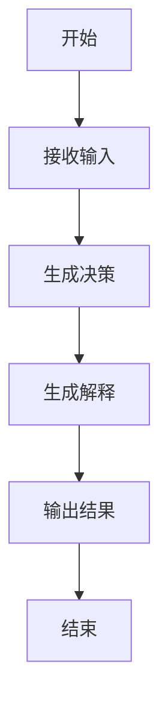

                 


# 企业级AI Agent的可解释性设计：增强决策透明度

> 关键词：企业级AI Agent，可解释性，决策透明度，算法原理，系统架构

> 摘要：本文深入探讨企业级AI Agent的可解释性设计，分析其在决策过程中的重要性，通过详细讲解算法原理、系统架构和项目实战，提供增强决策透明度的方法和最佳实践。

---

## 第一部分：企业级AI Agent的背景与概念

### 第1章：企业级AI Agent的背景与概念

#### 1.1 问题背景与挑战

- **AI Agent在企业决策中的作用**
  - AI Agent通过数据处理和模型推理，辅助企业做出高效决策。
  - 例如，在供应链管理中，AI Agent可以根据库存数据和市场趋势预测最佳采购时间。

- **可解释性问题的提出**
  - 企业决策的透明度直接影响信任和合规性。
  - 如果AI Agent的决策过程不透明，可能导致用户不信任或无法验证决策的正确性。

- **企业级AI Agent的定义与边界**
  - 定义：企业级AI Agent是具备高度自动化和智能化，能够处理复杂业务逻辑的代理系统。
  - 边界：通常不涉及企业的核心机密数据，专注于辅助决策而非替代人类判断。

#### 1.2 可解释性与决策透明度

- **可解释性的重要性**
  - 帮助用户理解AI决策过程，增强信任。
  - 例如，在金融领域，可解释性是合规性的必要条件。

- **决策透明度的维度**
  - 决策过程的透明：用户了解AI如何得出结论。
  - 决策结果的透明：用户能够验证AI的输出是否合理。

- **企业级AI Agent的可解释性需求**
  - 需要支持多层级的解释，从高阶目标到具体执行步骤。
  - 解释格式应多样化，包括文本、图表等形式。

#### 1.3 核心概念与联系

- **可解释性原理**
  - 解释性模型通过简化或模拟AI的推理过程，向用户展示决策依据。
  - 例如，使用决策树模型，用户可以直观看到每个决策节点的条件和权重。

- **透明度与可解释性的对比**
  - 透明度关注过程的公开性，而可解释性关注过程的可理解性。
  - 透明度是可解释性的基础，而可解释性是透明度的深化。

- **ER实体关系图架构**
  ```mermaid
  er
    actor: 用户
    agent: AI Agent
    decision: 决策
    rule: 规则
    explanation: 解释
    actor --> agent: 请求决策
    agent --> decision: 生成决策
    decision --> rule: 基于规则
    decision --> explanation: 生成解释
    rule --> explanation: 解释规则
  ```

- **本章小结**
  - 强调了可解释性在企业级AI Agent中的核心地位。
  - 通过ER图展示了各实体之间的关系，为后续章节奠定了基础。

---

## 第二部分：企业级AI Agent的算法原理

### 第2章：企业级AI Agent的算法原理

#### 2.1 可解释性模型的数学基础

- **概率论基础**
  - 用于处理不确定性，例如在贝叶斯网络中，概率推理是核心。
  - 示例：计算某事件发生的概率，基于先验知识和观测数据。

- **逻辑推理基础**
  - 用于处理确定性逻辑，例如在专家系统中，使用规则推理。
  - 示例：如果A成立，则B必然成立，AI Agent根据规则库生成结论。

- **解释性模型的数学表达**
  - 例如，线性回归模型：$y = \beta_0 + \beta_1x + \epsilon$，其中系数$\beta_1$表示x对y的影响程度。

#### 2.2 解释性算法的流程图



- **流程解读**
  - AI Agent接收用户请求，经过内部处理生成决策，随后生成解释性内容，最终输出结果。

#### 2.3 算法实现与代码

- **环境安装**
  - 安装Python和相关库：`pip install numpy scikit-learn`

- **核心代码实现**
  ```python
  import numpy as np
  from sklearn.tree import DecisionTreeRegressor

  # 示例数据
  X = np.array([[1], [2], [3], [4]])
  y = np.array([1, 2, 3, 4])

  # 训练模型
  model = DecisionTreeRegressor()
  model.fit(X, y)

  # 预测
  prediction = model.predict(np.array([[5]]))
  print(prediction)
  ```

- **代码解读**
  - 使用决策树模型，展示其可解释性。用户可以通过查看树结构，理解每个决策节点的条件。

- **本章小结**
  - 介绍了概率论和逻辑推理的基本原理。
  - 通过代码示例展示了算法的实现和解释过程。

---

## 第三部分：企业级AI Agent的系统分析与架构设计

### 第3章：企业级AI Agent的系统分析与架构设计

#### 3.1 系统分析

- **问题场景介绍**
  - 某企业使用AI Agent进行供应链优化，需要解释预测结果以优化库存管理。

- **项目介绍**
  - 项目目标：提高决策透明度，增强用户信任。
  - 项目范围：优化库存预测和订单处理流程。

#### 3.2 系统功能设计

- **领域模型**
  ```mermaid
  classDiagram
    class 用户 {
        用户ID
        请求
        决策结果
        解释
    }
    class AI Agent {
        接收请求
        生成决策
        生成解释
    }
    用户 --> AI Agent: 请求决策
    AI Agent --> 用户: 返回决策和解释
  ```

- **功能模块**
  - 用户模块：接收输入请求。
  - AI Agent模块：处理请求，生成决策和解释。
  - 解释模块：将决策过程转化为用户可理解的形式。

#### 3.3 系统架构设计

- **系统架构图**
  ```mermaid
  architecture
    frontend: 用户界面
    backend: AI Agent逻辑
    database: 数据存储
    frontend --> backend: 请求决策
    backend --> database: 查询规则
    backend --> frontend: 返回结果
  ```

- **关键组件**
  - 前端：展示用户界面，接收请求。
  - 后端：处理AI逻辑，生成决策和解释。
  - 数据库：存储规则和历史数据。

- **本章小结**
  - 介绍了系统分析的基本方法。
  - 通过类图和架构图展示了系统的设计和功能模块。

---

## 第四部分：项目实战

### 第4章：企业级AI Agent的项目实战

#### 4.1 环境安装

- **安装Python和相关库**
  ```bash
  pip install numpy scikit-learn matplotlib
  ```

#### 4.2 核心代码实现

- **预测模型**
  ```python
  import numpy as np
  from sklearn.tree import DecisionTreeRegressor
  from sklearn.metrics import r2_score

  # 示例数据
  X = np.array([[1], [2], [3], [4]])
  y = np.array([1, 2, 3, 4])

  # 训练模型
  model = DecisionTreeRegressor()
  model.fit(X, y)

  # 预测
  prediction = model.predict(np.array([[5]]))
  print("预测值:", prediction)
  print("R²:", r2_score([5], prediction))
  ```

- **解释生成**
  - 使用SHAP（SHapley Additive exPlanations）库生成解释。
  ```python
  import shap
  explainer = shap.TreeExplainer(model)
  shap_values = explainer.shap_values(X)
  shap.summary_plot(shap_values, X, plot_type="bar")
  ```

#### 4.3 案例分析

- **案例背景**
  - 某企业使用AI Agent预测销售量，辅助库存管理。

- **数据准备**
  - 数据集包含历史销售数据、市场趋势等。

- **模型训练与验证**
  - 训练决策树模型，验证其解释能力和预测准确性。

- **结果分析**
  - 模型预测销售量为100，解释显示主要受市场需求增加影响。

#### 4.4 项目小结

- **项目总结**
  - 成功实现了AI Agent的可解释性设计，提高了决策透明度。
  - 通过SHAP库生成的解释，用户能够理解模型的决策依据。

---

## 第五部分：总结与展望

### 第5章：总结与展望

#### 5.1 最佳实践 tips

- **保持模型简单**
  - 简单的模型通常更容易解释，例如线性回归优于深度神经网络。

- **选择合适的解释工具**
  - 使用SHAP、LIME等工具生成可解释的特征重要性分析。

- **用户教育**
  - 提供培训和文档，帮助用户理解AI Agent的解释输出。

#### 5.2 小结

- 本文系统地探讨了企业级AI Agent的可解释性设计，从理论到实践，提供了全面的解决方案。
- 强调了可解释性在增强决策透明度中的关键作用。

#### 5.3 注意事项

- **数据隐私**
  - 在处理敏感数据时，需确保数据的隐私和安全。
- **模型维护**
  - 定期更新模型，确保其适应业务变化和数据漂移。

#### 5.4 拓展阅读

- **推荐书籍**
  - 《可解释的人工智能：模型、工具和技术》
  - 《机器学习实战》
- **推荐论文**
  - "A survey on explanation methods for machine learning models"
  - "Interpretable machine learning: A review of advances in trees, rules, and model-agnostic methods"

---

通过以上结构，我们可以清晰地看到，企业级AI Agent的可解释性设计是一个多维度的系统工程，需要从算法原理、系统架构到实际应用进行全面考虑。希望这篇文章能够为相关领域的读者提供有价值的参考和指导。

